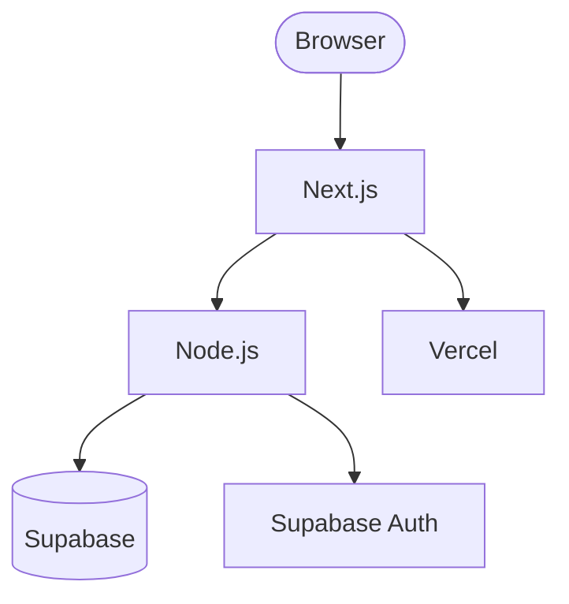
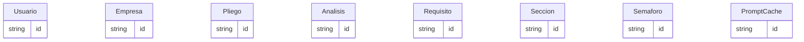

# Architecture — a-saas-platform

## Stack

```mermaid
graph TD
  Browser([Browser]) --> FE
  FE["Next.js"] --> API
  API["Node.js"] --> DB
  DB[("Supabase")]
  API --> Auth["Supabase Auth"]
  FE --> Hosting["Vercel"]
```

## Data Model

```mermaid
erDiagram
  Usuario {
    string id
  }
  Empresa {
    string id
  }
  Pliego {
    string id
  }
  Analisis {
    string id
  }
  Requisito {
    string id
  }
  Seccion {
    string id
  }
  Semaforo {
    string id
  }
  PromptCache {
    string id
  }
```

## Key Decisions

- File structure: feature-based
- Error handling: Result pattern
- Auth model: Supabase Auth / RBAC
