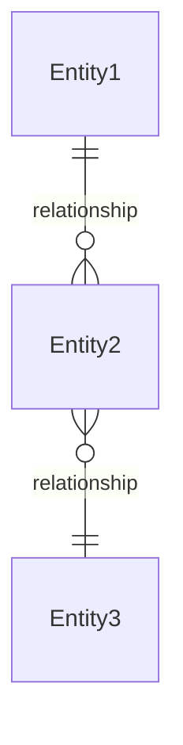
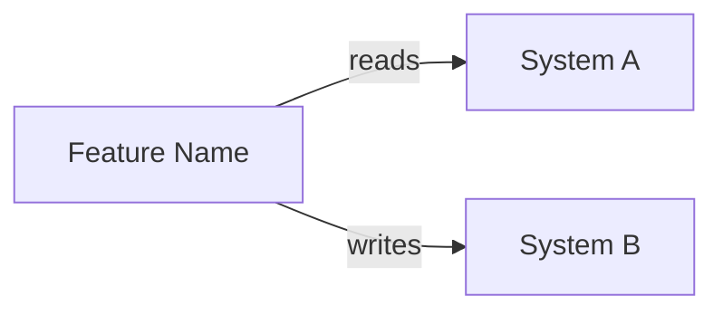

# {Feature Name} — Software Design Document

## Intention

{2-3 sentences describing what the feature does, who uses it, and the business outcome. Focus on the "what" and "why", not the "how".}

{Example: The Planner creates or edits the theoretical hours plan for their team within a flexible period (weekly, biweekly, or monthly). It details expected hours per resource, project, and concept, distinguishing between billable and non-billable.}

## Use Cases

Detailed scenarios in [use-cases.md](./use-cases.md).

| Use Case | Description | User Stories |
|----------|-------------|-------------|
| [UC-01 — {Title}](./use-cases.md#uc-01--use-case-title-us-01) | {e.g., "Planner creates or edits a capacity plan for a selected period"} | US-01 |
| [UC-02 — {Title}](./use-cases.md#uc-02--use-case-title-us-02-us-03) | {e.g., "Planner publishes a plan, generating an immutable versioned snapshot"} | US-02, US-03 |

---

## Requirements

Functional and non-functional requirements derived from user stories and use cases. Each requirement references the user stories it satisfies and the business rules it enforces.

### Functional Requirements

| ID | Requirement | User Stories | Business Rules |
|----|-------------|-------------|----------------|
| REQ-001 | {What the system must do — e.g., "Display a planning grid with rows per resource and columns per week within the selected period"} | US-01 | — |
| REQ-002 | {e.g., "Preload approved leaves and holidays from HR system, automatically reducing available capacity"} | US-01 | RN-002 |
| REQ-003 | {e.g., "Validate in real time that total allocation per resource does not exceed available capacity"} | US-01, US-02 | RN-003, RN-004 |

### Non-Functional Requirements

| ID | Category | Requirement |
|----|----------|-------------|
| NFR-01 | Performance | {e.g., "Grid must render 50+ rows with real-time validation under 200ms"} |
| NFR-02 | Security | {e.g., "Only users with Planner role can create or edit plans"} |
| NFR-03 | Availability | {e.g., "Feature must be available during business hours with 99.5% uptime"} |

---

## Business Rules

Constraints that govern system behavior. Referenced by requirements and verified by test cases.

| Rule | Description |
|------|-------------|
| RN-001 | {e.g., "The plan distinguishes: Planned Capacity (total), Billable Capacity, Non-Billable Capacity (Bench, Training, Events)"} |
| RN-002 | {e.g., "Approved leaves from HR system automatically reduce available capacity"} |
| RN-003 | {e.g., "Priority rule: non-billable is assigned first; billable fills the rest"} |

---

## Test Cases

Test cases mapped to requirements and business rules. Each test case verifies one or more acceptance criteria using Given/When/Then format.

### TC-001 — {Test title} (REQ-001)

**Given** {precondition — e.g., "a Planner with an active team of 10 resources"}
**When** {action — e.g., "the Planner selects a biweekly period and opens the planning grid"}
**Then** {expected result — e.g., "the grid displays 10 rows (one per resource) with columns for each week in the period"}

### TC-002 — {Test title} (REQ-002, RN-002)

**Given** {precondition}
**When** {action}
**Then** {expected result}

### TC-003 — {Test title} (REQ-003, RN-003)

**Given** {precondition}
**When** {action}
**Then** {expected result}

---

## UX/UI

{Figma links, wireframes, screenshots, or design references.}

{If not available yet, state: "Design references pending — screenshots of production environment will be used as guide."}

---

## Architecture

Technical architecture constraints, data model, API contracts, and service integrations that shape the implementation.

### Architecture Decision Records

| ADR | Title | Impact on this feature |
|-----|-------|----------------------|
| {ADR-NNN} | {Decision title} | {How this ADR constrains or shapes the feature} |

### Tradeoffs

| Tradeoff | We chose | Over | Rationale |
|----------|----------|------|-----------|
| {e.g., "Consistency vs. Latency"} | {What was prioritized} | {What was sacrificed} | {Why} |

### Performance Goals & Metrics

| Metric | Target | Measurement |
|--------|--------|-------------|
| {e.g., "Page load time"} | {e.g., "< 2s on 3G"} | {How it's measured} |
| {e.g., "API response time (p95)"} | {e.g., "< 300ms"} | {e.g., "Load test with k6 at 100 concurrent users"} |

### Data Model

{Key entities, relationships, and constraints relevant to this feature.}

| Entity | Key Fields | Notes |
|--------|-----------|-------|
| {Entity1} | {field1, field2, ...} | {Constraints or notes} |

### API / Data Contracts

| Endpoint / Contract | Method | Description |
|---------------------|--------|-------------|
| `/api/v1/resource` | GET / POST | {What this endpoint does} |
| `/api/v1/resource/:id` | GET / PUT / DELETE | {What this endpoint does} |

{If not defined yet, state: "API contracts to be defined during planning phase."}

### Service Integrations

| System | Direction | Data |
|--------|-----------|------|
| {System Name} | Reading | {What data is consumed} |
| {System Name} | Writing | {What data is sent} |

