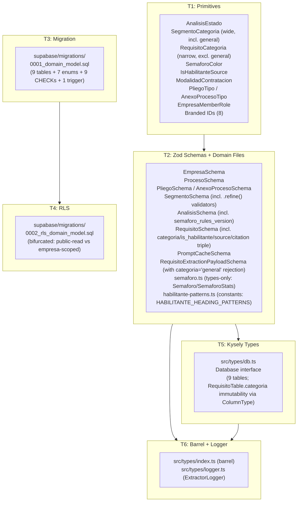
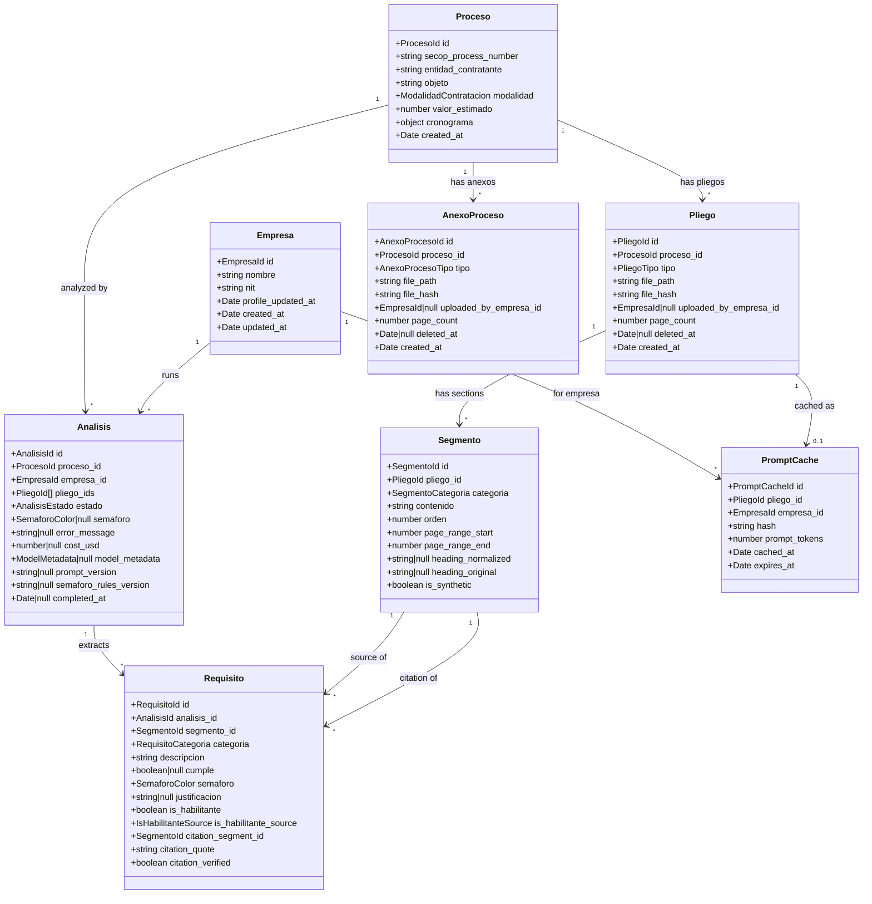
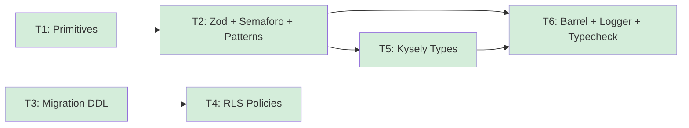

# domain-model — Feature Overview

## Spec Reference

[Spec](../spec/spec.md)

## Problem + Solution

- No shared type definitions exist; every downstream feature would invent its own `Proceso`, `Pliego`, `AnexoProceso`, or `Requisito` interface, causing silent schema drift.
- Solution: One Zod-first definition per entity generates TypeScript types, validates runtime data, and maps 1:1 to Postgres columns. Eight Zod entity schemas plus one LLM-output payload schema plus pure-type Semaforo definitions plus habilitante pattern constants share one canonical home under `src/types/`.
- `Proceso`, `Pliego`, `AnexoProceso`, and `Segmento` are public-read by any authenticated user; `Analisis`, `Requisito`, and `PromptCache` are empresa-scoped — an empresa's eligibility verdict is competitive intelligence and must never be visible to another empresa (RN-008, REQ-007/REQ-011).
- `Pliego` is restricted to documents with requisitos habilitantes (`pliego_condiciones`/`pliego_definitivo`); `AnexoProceso` is the sibling entity for non-pliego documents (`anexo_tecnico`/`estudio_previo`/`resolucion`/`otro`). v1 ingests Pliego only; AnexoProceso is schema-defined for v1.1+ (RN-012, ADR-008).
- `requisito.categoria` is the **narrow** `RequisitoCategoria` (excludes `general`, distinct from `SegmentoCategoria`) and is **immutable post-INSERT** — recategorization goes through orchestrator-level cache invalidation + re-extraction, not row-level UPDATE (RN-016, RN-017).
- Kysely consumes the same column names via a hand-authored `Database` interface, making queries type-safe without introspection tooling. RLS policies in Supabase enforce the public/private split at the DB layer.

## Architecture Diagram

## Data Model

The `Pliego`/`AnexoProceso` split (sibling entities under `Proceso`) is mandated by RN-012 / ADR-008. Their identical shape is a deliberate cost — the discriminator-overload problem is resolved by separating the entities themselves, not by a `tipo` discriminator on a unified table. v1 ingests Pliego only; AnexoProceso is schema-defined so v2 can add complementary-document analysis without a destructive migration.

## Task Index

| Task | File | Description | Dependencies |
|------|------|-------------|--------------|
| T1 | [01-plan-01-primitives.md](./01-plan-01-primitives.md) | Branded IDs, enum literals (incl. narrow `RequisitoCategoria` and `IsHabilitanteSource`), ADR stubs (001/002/003/008) | None |
| T2 | [01-plan-02-zod-schemas.md](./01-plan-02-zod-schemas.md) | Zod schemas + inferred TS types for 8 entities + `RequisitoExtractionPayloadSchema` + new `semaforo.ts` (types-only) + new `habilitante-patterns.ts` (runtime constants) | T1 |
| T3 | [01-plan-03-postgres-migration.md](./01-plan-03-postgres-migration.md) | Supabase DDL — 9 tables, 7 enums, 9 CHECK constraints (incl. narrow categoria, is_habilitante_source vocabulary), 1 trigger, all indexes | None |
| T4 | [01-plan-04-rls-policies.md](./01-plan-04-rls-policies.md) | Bifurcated RLS — public-read for Proceso/Pliego/AnexoProceso/Segmento; empresa-scoped for Analisis/Requisito/PromptCache; hard-delete restrictive policies on Pliego and AnexoProceso | T3 |
| T5 | [01-plan-05-kysely-types.md](./01-plan-05-kysely-types.md) | Kysely `Database` interface — row, insert, and update types for 9 tables. `ModelMetadata` is canonical here. `RequisitoTable.categoria: ColumnType<R, R, never>` enforces RN-016 immutability at compile time. | T2 |
| T6 | [01-plan-06-barrel-exports.md](./01-plan-06-barrel-exports.md) | Barrel `src/types/index.ts` (re-exports schemas, types, Semaforo types, habilitante constants, ExtractorLogger) + `src/types/logger.ts` + typecheck gate | T2, T5 |

## Dependency Graph

T1 and T3 can run in parallel. T4 must follow T3. T5 must follow T2. T6 is the final gate.
