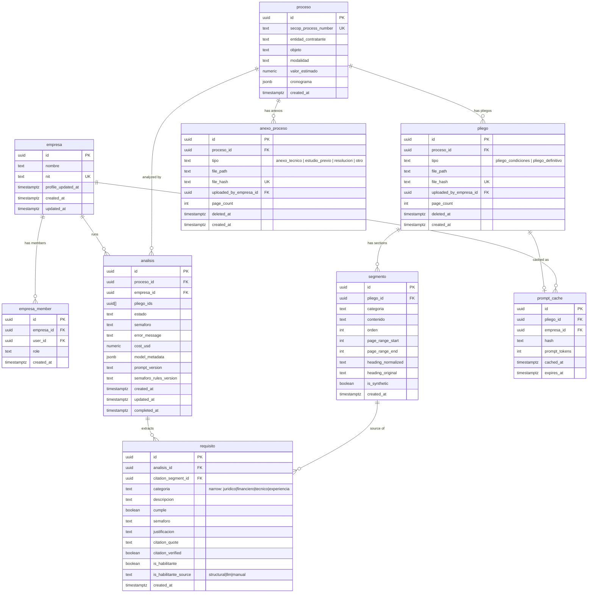

# domain-model/postgres — Software Design Document

## Intention

This spec was split from the monolithic [domain-model spec](../../spec/spec.md) (revision 5, 2026-04-27). It owns the Supabase Postgres layer of the domain model: the single versioned SQL migration that creates all 9 tables with FK constraints, unique indexes, check constraints, and Postgres enums; the bifurcated RLS policies enforcing tenant isolation; and the `set_empresa_profile_updated_at()` trigger. The TypeScript contracts for the same entities live in the sibling [primitives spec](../../primitives/spec/spec.md).

## Use Cases

Detailed scenarios in [../../spec/use-cases.md](../../spec/use-cases.md).

| Use Case | Description | User Stories |
|----------|-------------|-------------|
| [UC-02 — Run database migration](../../spec/use-cases.md#uc-02--run-database-migration-us-03) | DB admin applies the versioned migration to create all tables with correct constraints | US-03 |
| [UC-03 — Enforce tenant isolation on empresa-private tables](../../spec/use-cases.md#uc-03--enforce-tenant-isolation-on-empresa-private-tables-us-04) | RLS enforces empresa-private tables are invisible across empresa boundaries; public tables remain readable by all authenticated users | US-04 |

---

## Requirements

### Functional Requirements

| ID | Requirement | User Stories | Business Rules |
|----|-------------|-------------|----------------|
| REQ-006 | Generate one Supabase migration creating all 9 tables (`empresa`, `empresa_member`, `proceso`, `pliego`, `anexo_proceso`, `segmento`, `analisis`, `requisito`, `prompt_cache`), FK constraints, unique indexes, and check constraints. `pliego_tipo` Postgres enum: `pliego_condiciones`/`pliego_definitivo`; `anexo_proceso_tipo` enum: `anexo_tecnico`/`estudio_previo`/`resolucion`/`otro`. `segmento` includes `page_range_start INT NOT NULL`, `page_range_end INT NOT NULL`, `heading_normalized TEXT NULL`, `heading_original TEXT NULL`, `is_synthetic BOOLEAN NOT NULL DEFAULT false`, plus three CHECK constraints (page-range bounds; heading both-or-neither; synthetic ⇔ null heading). `segmento.pliego_id` FK (not `documento_id`). | US-03 | RN-003, RN-004, RN-010, RN-011, RN-012 |
| REQ-007 | Apply bifurcated RLS policies: `proceso`/`pliego`/`anexo_proceso`/`segmento` grant SELECT to any `authenticated` user; `analisis`/`requisito`/`prompt_cache` are scoped by the user's empresa membership via `empresa_member` join. | US-04 | RN-005, RN-006, RN-008 |
| REQ-011 | `proceso`, `pliego`, and `anexo_proceso` are publicly readable by any `authenticated` Supabase user, regardless of empresa membership | US-04 | RN-008 |
| REQ-013 | `requisito` table carries three citation columns: `citation_segment_id UUID NOT NULL REFERENCES segmento(id)`, `citation_quote TEXT NOT NULL CHECK (length(citation_quote) <= 200)`, `citation_verified BOOLEAN NOT NULL DEFAULT false`. | US-01, US-03 | RN-002, RN-013 |
| REQ-014 | `analisis` table carries three telemetry columns: `cost_usd NUMERIC(10,6) NULL`, `model_metadata JSONB NULL`, `prompt_version TEXT NULL`. All three nullable so analyses created before extraction completes do not require placeholder values. | US-01 | RN-001 |
| REQ-015 | `empresa` table carries `profile_updated_at TIMESTAMPTZ NOT NULL DEFAULT now()`. A Postgres trigger `set_empresa_profile_updated_at()` fires `BEFORE UPDATE` on `empresa` and sets `profile_updated_at = now()` whenever any business column changes (excluding `profile_updated_at` itself, to avoid recursion). | US-01 | RN-014 |
| REQ-018 | `requisito` table carries `categoria TEXT NOT NULL` with `CHECK (categoria IN ('juridico','financiero','tecnico','experiencia'))` — the narrow `RequisitoCategoria` set (does NOT include `general`). Denormalized from `segmento.categoria` for query convenience. | US-01, US-03 | RN-002, RN-016, RN-017 |
| REQ-019 | `requisito` table carries `is_habilitante BOOLEAN NOT NULL` and `is_habilitante_source TEXT NOT NULL` with `CHECK (is_habilitante_source IN ('structural','llm','manual'))`. | US-01, US-03 | RN-018 |
| REQ-020 | `analisis` table carries `semaforo_rules_version TEXT NULL`. Populated by the orchestrator at aggregation time with the value of `SEMAFORO_RULES_VERSION`. Nullable so analyses created before aggregation runs do not require placeholder values. | US-01 | RN-001 |

### Non-Functional Requirements

| ID | Category | Requirement |
|----|----------|-------------|
| NFR-02 | Security | RLS policies must block cross-tenant reads for `analisis` and `requisito`; no row from empresa A visible to a user of empresa B |
| NFR-03 | Consistency | Postgres column names must exactly match Zod schema field names (snake_case throughout — see [primitives spec](../../primitives/spec/spec.md)) |

---

## Business Rules

| Rule | Description |
|------|-------------|
| RN-003 | `pliego.file_hash` and `anexo_proceso.file_hash` are SHA-256 of the raw file bytes. Each table has its own UNIQUE constraint — independent dedup spaces. Cross-table case (same bytes as both pliego and anexo) is permitted. |
| RN-004 | `pliego` and `anexo_proceso` use soft-delete via `deleted_at timestamptz`. Hard deletes are prohibited; procurement records require legal hold. `proceso` does NOT have `deleted_at`. |
| RN-005 | Every empresa-scoped RLS policy joins through `empresa_member` (`empresa_id`, `user_id`) to bind rows to authenticated users. |
| RN-006 | Multi-tenant isolation is enforced at the database layer, not the application layer, for empresa-private tables (`analisis`, `requisito`, `prompt_cache`). No service-role bypass is permitted for tenant-scoped reads. |
| RN-008 | `proceso`, `pliego`, `anexo_proceso`, and `segmento` are public procurement records. `SELECT` is granted to any `authenticated` user with no empresa-membership check. `INSERT`/`UPDATE` are also gated only on `authenticated` (not empresa-membership) in v1. |
| RN-010 | **Heading triple-equivalence** on `segmento`: `is_synthetic = true` ⇔ `heading_normalized IS NULL` ⇔ `heading_original IS NULL`. Two CHECK constraints: `segmento_heading_both_or_neither` and `segmento_synthetic_iff_null_heading`. Consumers MUST branch on `is_synthetic`, not on heading nullability. See also [primitives spec RN-010](../../primitives/spec/spec.md). |
| RN-011 | **`segmento.page_range_*` semantics**: both are 1-indexed, both `>= 1`, `page_range_start <= page_range_end`. Enforced via CHECK constraint `segmento_page_range_valid`. See also [primitives spec RN-011](../../primitives/spec/spec.md). |
| RN-012 | **Pliego semantic tightness**: `pliego_tipo` Postgres enum is restricted to `pliego_condiciones`/`pliego_definitivo`. Non-pliego documents live in the `anexo_proceso` table with its own `anexo_proceso_tipo` enum. |
| RN-013 | **Citation contract on `requisito`**: FK `citation_segment_id REFERENCES segmento(id)`, `citation_quote` capped at 200 chars via CHECK constraint `requisito_citation_quote_length`. Quote verification is a downstream consumer's responsibility. |
| RN-014 | **Trigger-owned `empresa.profile_updated_at`**: auto-maintained by `set_empresa_profile_updated_at()` (BEFORE UPDATE trigger). The trigger excludes `profile_updated_at` from its dirty-check to avoid recursion. Acts as a cache-invalidation signal for downstream extraction caches. |
| RN-016 | **`requisito.categoria` immutability** (DB perspective): the column is populated at INSERT via the extraction pipeline; no UPDATE path exists. The Kysely shape (`ColumnType<RequisitoCategoria, RequisitoCategoria, never>`) enforces this at compile time — see [primitives spec RN-016](../../primitives/spec/spec.md). |
| RN-017 | **Narrow `requisito.categoria`**: CHECK constraint `requisito_categoria_narrow` restricts the column to `('juridico','financiero','tecnico','experiencia')`. `general` is rejected at the DB layer, mirroring the Zod validation in [primitives spec](../../primitives/spec/spec.md). |
| RN-018 | **Tiered `is_habilitante` classification source**: `requisito.is_habilitante_source` CHECK constraint `requisito_is_habilitante_source_valid` restricts to `('structural','llm','manual')`. The classifier itself lives in `requisitos-extraction`; `domain-model` only defines the column shape and constraint. |

---

## Test Cases

### TC-004 — Pliego file_hash uniqueness constraint; independent dedup space (REQ-006, RN-003)

**Given** the migration SQL is applied to a Supabase test instance
**When** two rows are inserted into `pliego` with the same `file_hash`
**Then** Postgres rejects the second insert with a unique constraint violation

**When** an insert is attempted into `anexo_proceso` with that same `file_hash`
**Then** the insert succeeds — independent dedup space

### TC-006 — RLS blocks cross-tenant Analisis SELECT (REQ-007, RN-005, RN-006)

**Given** empresa A and empresa B each have one análisis for the same proceso
**When** a user of empresa A executes `SELECT * FROM analisis` via authenticated Supabase client
**Then** only empresa A's análisis is returned; empresa B's row is invisible

### TC-008 — Proceso is publicly readable across empresas (REQ-011, RN-008)

**Given** a proceso row exists
**And** user A (member of empresa A only) and user B (member of empresa B only) are both authenticated
**When** each executes `SELECT * FROM proceso WHERE id = '<proceso_id>'`
**Then** both queries return the same proceso row

### TC-009 — Analisis from empresa A is invisible to empresa B user (REQ-007, RN-006)

**Given** empresa A has one análisis and empresa B has one análisis for the same proceso
**When** a user of empresa B executes `SELECT * FROM analisis WHERE proceso_id = '<proceso_id>'`
**Then** only empresa B's análisis is returned; empresa A's row is invisible

### TC-011 — Postgres rejects rows violating the both-or-neither heading constraint (REQ-006, RN-010)

**Given** the migration has been applied
**When** a `segmento` row is inserted with `heading_normalized = 'capacidad juridica'` AND `heading_original IS NULL`
**Then** Postgres rejects the insert with a CHECK constraint violation on `segmento_heading_both_or_neither`

### TC-012 — Postgres rejects rows violating the is_synthetic ⇔ null-heading constraint (REQ-006, RN-010)

**Given** the migration has been applied
**When** a `segmento` row is inserted with `is_synthetic = true` AND both heading columns non-null
**Then** Postgres rejects with a CHECK violation on `segmento_synthetic_iff_null_heading`

**When** a `segmento` row is inserted with `is_synthetic = false` AND both heading columns NULL
**Then** Postgres also rejects

### TC-013 — Postgres rejects invalid `page_range_*` (REQ-006, RN-011)

**Given** the migration has been applied
**When** a `segmento` row is inserted with `page_range_start = 5, page_range_end = 3`
**Then** Postgres rejects with a CHECK violation on `segmento_page_range_valid`

**When** a `segmento` row is inserted with `page_range_start = 0`
**Then** Postgres also rejects

### TC-017 — AnexoProceso is publicly readable across empresas (REQ-011, RN-008)

**Given** an `anexo_proceso` row exists
**And** user A and user B (different empresas) are authenticated
**When** each executes `SELECT * FROM anexo_proceso WHERE id = '<anexo_id>'`
**Then** both queries return the same row

### TC-018 — AnexoProceso file_hash is UNIQUE within its table (REQ-006, RN-003)

**Given** the migration is applied and an `anexo_proceso` row exists with a given `file_hash`
**When** a second insert is attempted into `anexo_proceso` with the same `file_hash`
**Then** Postgres rejects with a unique constraint violation

**When** an insert is attempted into `pliego` with that same `file_hash`
**Then** the insert succeeds

### TC-021 — analisis telemetry columns are nullable (REQ-014)

**Given** the migration is applied
**When** an `analisis` row is inserted with `cost_usd = NULL`, `model_metadata = NULL`, `prompt_version = NULL`
**Then** the insert succeeds

### TC-022 — Trigger auto-bumps empresa.profile_updated_at on UPDATE (REQ-015, RN-014)

**Given** the migration is applied and an `empresa` row exists with `profile_updated_at = T0`
**When** `UPDATE empresa SET nombre = 'New Name' WHERE id = ...` executes at time T1 > T0
**Then** the row's `profile_updated_at` is now `>= T1`

**When** a no-op `UPDATE empresa SET profile_updated_at = profile_updated_at WHERE id = ...` executes
**Then** the trigger does not bump — `profile_updated_at` remains the prior value

### TC-023 — Postgres CHECK rejects citation_quote > 200 chars (REQ-013, RN-013)

**Given** the migration is applied
**When** a `requisito` row is inserted with `citation_quote = repeat('a', 201)`
**Then** Postgres rejects with a CHECK violation on `requisito_citation_quote_length`

### TC-029 — Postgres CHECK rejects invalid `is_habilitante_source` and `categoria` on requisito (REQ-018, REQ-019)

**Given** the migration is applied
**When** a `requisito` row is inserted with `is_habilitante_source = 'auto'`
**Then** Postgres rejects with a CHECK violation on `requisito_is_habilitante_source_valid`

**When** a `requisito` row is inserted with `categoria = 'general'`
**Then** Postgres rejects with a CHECK violation on `requisito_categoria_narrow`

---

## UX/UI

No UI. This is a developer-facing foundation feature.

---

## Architecture

### Architecture Decision Records

| ADR | Title | Impact on this feature |
|-----|-------|----------------------|
| ADR-003 | Supabase RLS for tenant isolation | Empresa-scoped policies reference `auth.uid()` and join `empresa_member`; public tables use `authenticated` role check only |
| ADR-008 | Pliego/AnexoProceso split — narrow Pliego semantics | `pliego_tipo` enum stays narrow; `anexo_proceso_tipo` covers everything else. Two separate tables instead of one discriminator-overloaded table. |

### Tradeoffs

| Tradeoff | We chose | Over | Rationale |
|----------|----------|------|-----------|
| Tenant isolation layer | Postgres RLS (bifurcated) | Application middleware | RLS survives direct DB access, admin queries, and future service additions without code changes |
| Soft-delete | `deleted_at` on pliego and anexo_proceso | Status enum or proceso soft-delete | Preserves exact deletion time for legal audit; proceso is a public procurement record — deletion is not a valid operation |
| File-hash dedup space | Independent UNIQUE per table | Cross-table CHECK trigger or shared storage table | Cross-table content collision is essentially impossible in practice; independent UNIQUE keeps the schema simple |
| `empresa.profile_updated_at` ownership | Postgres trigger | Application-managed timestamp | Trigger is bulletproof — every UPDATE path bumps it, including direct SQL, admin tools, and future services |

### Performance Goals & Metrics

| Metric | Target | Measurement |
|--------|--------|-------------|
| Migration apply time | < 5s on empty DB | `supabase db push` timing in dev |

### Data Model

| Entity | Key Fields | Notes |
|--------|-----------|-------|
| `empresa` | `id`, `nit` (UK), `profile_updated_at` | `profile_updated_at` auto-maintained by trigger; cache-invalidation signal for downstream extraction caches (RN-014). |
| `empresa_member` | `empresa_id`, `user_id` | Junction table for empresa-scoped RLS; role: `owner \| member` |
| `proceso` | `secop_process_number` (UK) | Public record; no `deleted_at`; readable by all authenticated users |
| `pliego` | `file_hash` (UK), `tipo` (narrow enum), `deleted_at` | `tipo` ∈ {`pliego_condiciones`, `pliego_definitivo`}. Global unique `file_hash` within table. Soft-delete only. |
| `anexo_proceso` | `file_hash` (UK), `tipo` (anexo enum), `deleted_at` | `tipo` ∈ {`anexo_tecnico`, `estudio_previo`, `resolucion`, `otro`}. Independent UNIQUE `file_hash`. v1 schema-defined but not ingested. |
| `segmento` | `pliego_id`, `categoria`, `page_range_*`, `heading_*`, `is_synthetic` | Three CHECK constraints enforce triple-equivalence (RN-010) and page-range bounds (RN-011). |
| `analisis` | `proceso_id`, `empresa_id`, `pliego_ids[]`, `estado`, telemetry triple, `semaforo_rules_version` | Empresa-private; RLS scoped by `empresa_member`. `pliego_ids` length=1 in v1. |
| `requisito` | `categoria` (narrow, CHECK), `cumple` (nullable), `is_habilitante`, `is_habilitante_source` (CHECK), citation triple | FK `citation_segment_id REFERENCES segmento(id)`. Two CHECK constraints: `requisito_categoria_narrow`, `requisito_is_habilitante_source_valid`. |
| `prompt_cache` | `(pliego_id, empresa_id)` UK | Composite unique key. Empresa-private RLS. |

### API / Data Contracts

No HTTP endpoints. Migration file: `supabase/migrations/20260425000000_domain_model.sql`.

### Service Integrations

| System | Direction | Data |
|--------|-----------|------|
| Supabase Postgres | Write | DDL migration + bifurcated RLS policies + trigger |
| [domain-model/primitives](../../primitives/spec/spec.md) | Parallel sibling — column names must match exactly | Postgres column names mirror Zod field names (NFR-03) |

---

## Revision Log

| Date | Change | Reason |
|------|--------|--------|
| 2026-04-30 | Split from [domain-model spec rev 5](../../spec/spec.md). Extracted REQ-006, REQ-007, REQ-011, REQ-013–REQ-015, REQ-018–REQ-020 (DB layer); corresponding TCs (TC-004, TC-006, TC-008–TC-009, TC-011–TC-013, TC-017–TC-023, TC-029) and BRs (RN-003–RN-008, RN-010–RN-014, RN-016–RN-018). Full ER diagram retained in this spec. | Monolithic spec exceeded 500 lines across 5 revisions; split into primitives / postgres / extraction-contracts to match implementation task boundaries. |
