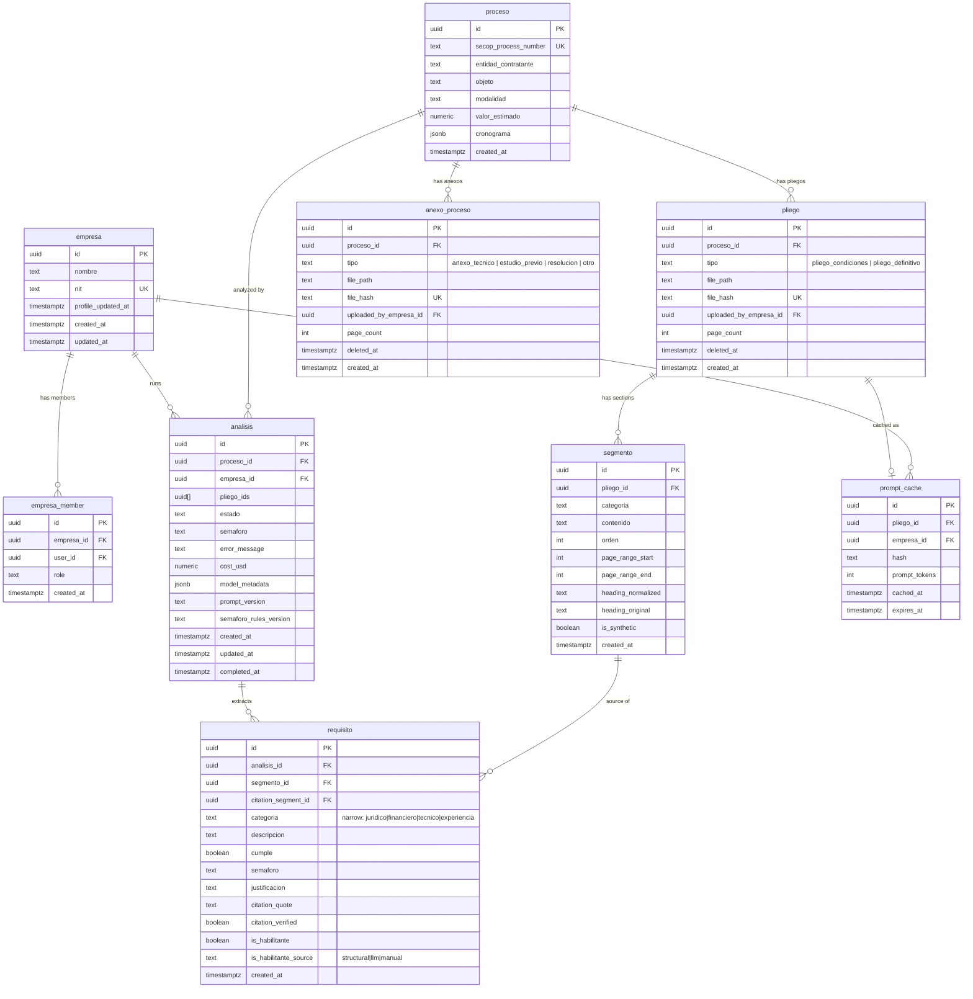
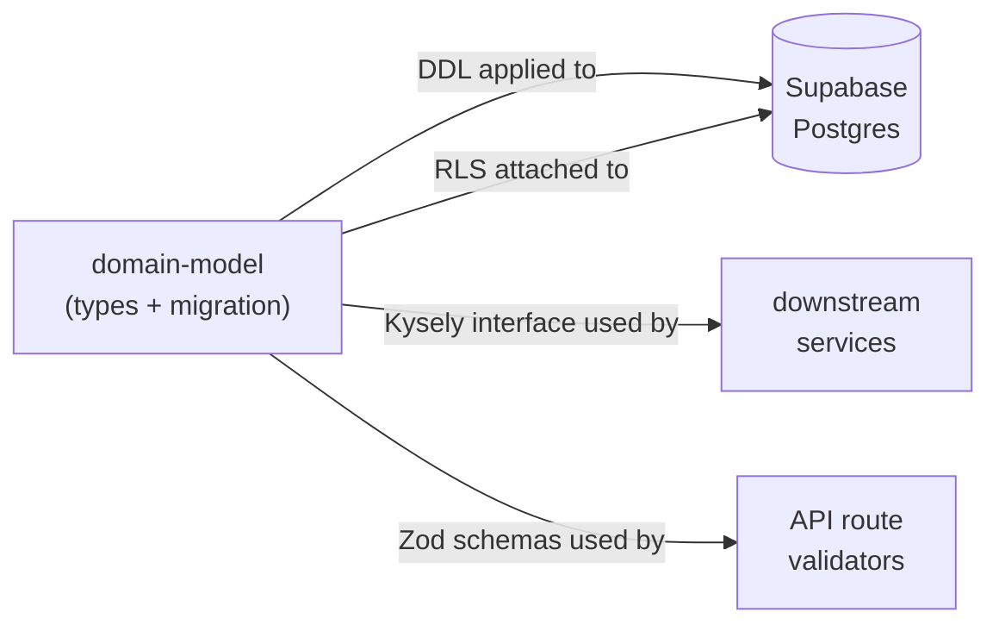

# domain-model — Software Design Document

## Intention

The domain-model feature establishes the single source of truth for every COLTRATOS entity as Zod schemas, TypeScript types, Postgres tables, and RLS policies derived from one definition. Crucially, `Proceso`, `Pliego`, and `AnexoProceso` are public procurement records — not owned by any empresa. `Pliego` is restricted to documents that contain requisitos habilitantes (`pliego_condiciones`, `pliego_definitivo`); `AnexoProceso` covers complementary documents (anexos técnicos, estudios previos, resoluciones, otros). Empresas run `Análisis` against a `Proceso` to determine bid eligibility; the `Análisis` and its `Requisitos` are empresa-private competitive intelligence. This public/private split enables multiple empresas to independently analyze the same proceso without data conflicts, while guaranteeing that one empresa's eligibility verdict is never visible to another.

## Use Cases

Detailed scenarios in [use-cases.md](./use-cases.md).

| Use Case | Description | User Stories |
|----------|-------------|-------------|
| [UC-01 — Define & validate domain entities](./use-cases.md#uc-01--define--validate-domain-entities-us-01-us-02) | Engineer imports Zod schemas to validate runtime data for any domain entity | US-01, US-02 |
| [UC-02 — Run database migration](./use-cases.md#uc-02--run-database-migration-us-03) | DB admin applies the versioned migration to create all tables with correct constraints | US-03 |
| [UC-03 — Enforce tenant isolation on empresa-private tables](./use-cases.md#uc-03--enforce-tenant-isolation-on-empresa-private-tables-us-04) | RLS enforces that empresa-private tables (`Analisis`, `Requisito`, `PromptCache`) are invisible across empresa boundaries; public tables (`Proceso`, `Pliego`, `AnexoProceso`, `Segmento`) remain readable by all authenticated users | US-04 |
| [UC-04 — Query with type safety](./use-cases.md#uc-04--query-with-type-safety-us-05) | Engineer uses the Kysely Database interface to write fully typed queries without casting | US-05 |

---

## Requirements

### Functional Requirements

| ID | Requirement | User Stories | Business Rules |
|----|-------------|-------------|----------------|
| REQ-001 | Define string-branded ID types (`ProcesoId`, `PliegoId`, `AnexoProcesoId`, `EmpresaId`, `SegmentoId`, `AnalisisId`, `RequisitoId`, `PromptCacheId`) and enum literals: `AnalisisEstado`, `SegmentoCategoria` (`juridico \| financiero \| tecnico \| experiencia \| general`), `SemaforoColor`, `ModalidadContratacion`, `PliegoTipo` (`pliego_condiciones \| pliego_definitivo` only), `AnexoProcesoTipo` (`anexo_tecnico \| estudio_previo \| resolucion \| otro`), `EmpresaMemberRole` | US-01, US-02 | RN-001, RN-007, RN-012 |
| REQ-002 | Define Zod schemas for all 8 core entities: `Empresa`, `Proceso`, `Pliego`, `AnexoProceso`, `Segmento`, `Analisis`, `Requisito`, `PromptCache`. `SegmentoSchema` includes `page_range_start` and `page_range_end` (both `int >= 1`), `heading_normalized: z.string().nullable()`, `heading_original: z.string().nullable()`, `is_synthetic: z.boolean()`. `PliegoSchema` and `AnexoProcesoSchema` share the same shape (proceso_id FK, tipo, file_path, file_hash, uploaded_by_empresa_id, page_count, deleted_at, created_at) but are distinct entities with distinct enums and tables | US-01, US-02 | RN-002, RN-003, RN-010, RN-011, RN-012 |
| REQ-003 | `Requisito.cumple` must accept `true`, `false`, and `null` (null = sin información) | US-01 | RN-002 |
| REQ-004 | `Analisis.estado` must be constrained to the state machine enum: `pending \| extracting \| analyzing \| completed \| failed` | US-01 | RN-001 |
| REQ-005 | `Proceso.secop_process_number` must be globally unique. `Pliego.file_hash` (SHA-256) must be globally unique within the `pliego` table. `AnexoProceso.file_hash` (SHA-256) must be globally unique within the `anexo_proceso` table — independent dedup space. Both `Pliego.deleted_at` and `AnexoProceso.deleted_at` enable soft-delete; `Proceso` has no `deleted_at` column. | US-01, US-03 | RN-003, RN-004 |
| REQ-006 | Generate one Supabase migration creating all 9 tables (`empresa`, `empresa_member`, `proceso`, `pliego`, `anexo_proceso`, `segmento`, `analisis`, `requisito`, `prompt_cache`), FK constraints, unique indexes, and check constraints. `pliego_tipo` Postgres enum is restricted to `pliego_condiciones`/`pliego_definitivo`; `anexo_proceso_tipo` enum is `anexo_tecnico`/`estudio_previo`/`resolucion`/`otro`. `segmento` includes columns `page_range_start INT NOT NULL`, `page_range_end INT NOT NULL`, `heading_normalized TEXT NULL`, `heading_original TEXT NULL`, `is_synthetic BOOLEAN NOT NULL DEFAULT false`, plus three CHECK constraints (page-range bounds; heading both-or-neither; synthetic ⇔ null heading). `segmento.pliego_id` FK replaces `segmento.documento_id`. | US-03 | RN-003, RN-004, RN-010, RN-011, RN-012 |
| REQ-007 | Apply bifurcated RLS policies: `Proceso`/`Pliego`/`AnexoProceso`/`Segmento` grant SELECT to any `authenticated` user; `Analisis`/`Requisito`/`PromptCache` are scoped by the user's empresa membership | US-04 | RN-005, RN-006, RN-008 |
| REQ-008 | Define a Kysely `Database` interface mapping each of the 9 table names to its row and insert types. `SegmentoTable` includes `pliego_id: PliegoId`, `page_range_start: number`, `page_range_end: number`, `heading_normalized: string \| null`, `heading_original: string \| null`, `is_synthetic: ColumnType<boolean, boolean \| undefined, boolean>`. `PliegoTable` and `AnexoProcesoTable` are sibling row shapes with distinct `tipo` types. | US-05 | RN-010, RN-011, RN-012 |
| REQ-009 | Export all domain types, Zod schemas, and the Kysely interface from `src/types/index.ts`. The barrel exports `Pliego*` and `AnexoProceso*`; the legacy `Documento*` exports do not exist. | US-01, US-05 | — |
| REQ-010 | `Analisis.pliego_ids` is `uuid[]`. v1 always contains exactly one element (the analyzed `Pliego`). The column exists from day one so v2 multi-pliego analyses (e.g. analyzing `pliego_condiciones` + `pliego_definitivo` together when both exist for a proceso) need no schema migration. | US-01 | RN-009 |
| REQ-011 | `Proceso`, `Pliego`, and `AnexoProceso` are publicly readable by any `authenticated` Supabase user, regardless of empresa membership | US-04 | RN-008 |
| REQ-012 | `SegmentoSchema` includes three Zod `.refine()` validators that mirror the database CHECK constraints: (a) `page_range_start <= page_range_end`; (b) heading both-or-neither nullability; (c) `is_synthetic === true ⇔ heading_normalized === null`. Defense in depth — invalid combos are rejected at parse time before any DB roundtrip | US-01, US-03 | RN-010, RN-011 |
| REQ-013 | `requisito` table and `RequisitoSchema` carry three citation columns: `citation_segment_id UUID NOT NULL REFERENCES segmento(id)`, `citation_quote TEXT NOT NULL CHECK (length(citation_quote) <= 200)`, `citation_verified BOOLEAN NOT NULL DEFAULT false`. The Zod schema validates `citation_quote.length <= 200` at parse time | US-01, US-03 | RN-002, RN-013 |
| REQ-018 | `requisito` table and `RequisitoSchema` carry `categoria` typed as `RequisitoCategoria` — the **narrow** enum `juridico \| financiero \| tecnico \| experiencia` (does NOT include `general`, unlike `SegmentoCategoria`). Postgres column: `categoria TEXT NOT NULL` with `CHECK (categoria IN ('juridico','financiero','tecnico','experiencia'))`. The column is denormalized from `segmento.categoria` for query convenience and to keep `aggregateSemaforo` (in `lib/semaforo/`) a pure function over `Requisito[]` alone with no segmento join | US-01, US-03 | RN-002, RN-016, RN-017 |
| REQ-019 | `requisito` table and `RequisitoSchema` carry two habilitante-classification columns: `is_habilitante BOOLEAN NOT NULL` (consumed by the knockout rule in semaforo-aggregation RN-003) and `is_habilitante_source TEXT NOT NULL` with `CHECK (is_habilitante_source IN ('structural','llm','manual'))`. Records which tier of the upstream classifier produced the boolean (per [semaforo-aggregation RN-014](../../semaforo-aggregation/spec/spec.md)) | US-01, US-03 | RN-018 |
| REQ-020 | `analisis` table and `AnalisisSchema` carry `semaforo_rules_version TEXT NULL`. Populated by the orchestrator with the value of `SEMAFORO_RULES_VERSION` (exported from `lib/semaforo/thresholds.ts`) at aggregation time so historical análisis can be re-explained against the rules that produced them. Nullable so analyses created before aggregation runs do not require placeholder values | US-01 | RN-001 |
| REQ-021 | Define new domain types at `src/types/domain/semaforo.ts` (re-exported via the `@/types` barrel): `Semaforo = { overall: SemaforoColor; byCategoria: Record<RequisitoCategoria, SemaforoColor>; blockers: Requisito[]; stats: SemaforoStats }`; `SemaforoStats = { total: number; cumple: number; noCumple: number; sinInfo: number; cumplePct: number }`; `RequisitoCategoria = 'juridico' \| 'financiero' \| 'tecnico' \| 'experiencia'` (narrow union, distinct from `SegmentoCategoria`); `IsHabilitanteSource = 'structural' \| 'llm' \| 'manual'`. These are pure type definitions; no Zod schema and no runtime code | US-01, US-05 | RN-017 |
| REQ-022 | Define runtime constants at `src/types/domain/habilitante-patterns.ts` (re-exported via the `@/types` barrel): `HABILITANTE_HEADING_PATTERNS: readonly RegExp[]` — initial v1 list of NFD-normalized lowercase regex patterns matching habilitante section headings (`/\brequisitos\s+habilitantes\b/`, `/\bcapacidad\s+juridica\b/`, `/\bcapacidad\s+financiera\b/`, `/\bcapacidad\s+tecnica\b/`, `/\bexperiencia\s+(minima\|acreditada\|requerida)\b/`); `HABILITANTE_PATTERNS_VERSION: 'v1.0.0' as const`. Patterns are authored against the normalized form produced by [pdf-ingestion REQ-005](../../pdf-ingestion/spec/spec.md). Bumping the version invalidates any caching that depends on classifications produced by these patterns | US-05 | RN-018 |
| REQ-014 | `analisis` table and `AnalisisSchema` carry three telemetry columns: `cost_usd NUMERIC(10,6) NULL`, `model_metadata JSONB NULL`, `prompt_version TEXT NULL`. All three are nullable so analyses created before extraction completes do not require placeholder values | US-01 | RN-001 |
| REQ-015 | `empresa` table and `EmpresaSchema` carry `profile_updated_at TIMESTAMPTZ NOT NULL DEFAULT now()`. A Postgres trigger `set_empresa_profile_updated_at()` fires `BEFORE UPDATE` on `empresa` and sets `profile_updated_at = now()` whenever any business column changes (excluding `profile_updated_at` itself, to avoid recursion). The Kysely shape types `profile_updated_at: ColumnType<Date, never, never>` so application code is forbidden from inserting or updating it | US-01 | RN-014 |
| REQ-016 | Define `RequisitoExtractionPayload` and `RequisitoExtractionPayloadSchema` (Zod) at `src/types/domain/extraction-payload.ts`. This is the **LLM output contract** — distinct from `RequisitoSchema` (the persisted-row contract). Carries: `categoria` (`SegmentoCategoria` — wide, includes `general`), `descripcion`, `cumple` (nullable), `semaforo`, `justificacion` (nullable), `citation_segment_id`, `citation_quote` (≤200 chars), `is_habilitante: z.boolean()`, `is_habilitante_source: z.enum(['structural','llm','manual'])`. Does NOT carry `id`, `created_at`, `analisis_id`, or `citation_verified` — those are populated post-extraction by the orchestrator. **Narrowing rule**: a payload with `categoria === 'general'` is a Zod validation failure raised by the extractor as `ExtractorSchemaValidationError` — `general` segments are excluded upstream by [pdf-ingestion RN-012](../../pdf-ingestion/spec/spec.md) and any leak is a contract violation; the narrowing from wide `SegmentoCategoria` to narrow `RequisitoCategoria` (REQ-018) happens at this validation step before the orchestrator persists | US-01, US-05 | RN-015, RN-017 |
| REQ-017 | Define `ExtractorLogger` structural interface at `src/types/logger.ts`: three methods `info`, `warn`, `error`, each `(event: string, payload: Record<string, unknown>) => void`. Pure type, no runtime code. Exported via the `@/types` barrel | US-05 | — |

### Non-Functional Requirements

| ID | Category | Requirement |
|----|----------|-------------|
| NFR-01 | Performance | `npm run typecheck` completes under 10s in strict mode across the full repo |
| NFR-02 | Security | RLS policies must block cross-tenant reads for `Analisis` and `Requisito`; no row from empresa A visible to a user of empresa B |
| NFR-03 | Consistency | Zod schema field names must exactly match Postgres column names (snake_case throughout) |
| NFR-04 | Maintainability | No entity defined in more than one place; TypeScript types are always inferred from Zod via `z.infer<>` |

---

## Business Rules

| Rule | Description |
|------|-------------|
| RN-001 | `Analisis.estado` follows a forward-only state machine: `pending → extracting → analyzing → completed \| failed`. The schema enforces the enum; transition logic lives in the service layer. |
| RN-002 | `Requisito.cumple` is tri-state: `true` (meets), `false` (does not meet), `null` (sin información — evaluator could not determine). |
| RN-003 | `Pliego.file_hash` and `AnexoProceso.file_hash` are SHA-256 of the raw file bytes. Each table has its own UNIQUE constraint on `file_hash` — within-table dedup, **independent dedup spaces between Pliego and AnexoProceso**. If two empresas upload the same pliego file, only one `pliego` row exists; if two empresas upload the same anexo file, only one `anexo_proceso` row exists. The cross-table case (same bytes uploaded as both a pliego and an anexo) is permitted and produces two rows — this is essentially impossible in practice and not worth a cross-table CHECK trigger. |
| RN-004 | `Pliego` and `AnexoProceso` use soft-delete via `deleted_at timestamptz`. Hard deletes are prohibited; procurement records require legal hold. `Proceso` does NOT have a `deleted_at` column — public procurement processes cannot be soft-deleted. |
| RN-005 | Every empresa-scoped RLS policy joins through `empresa_member` (`empresa_id`, `user_id`) to bind rows to authenticated users. |
| RN-006 | Multi-tenant isolation is enforced at the database layer, not the application layer, for empresa-private tables (`Analisis`, `Requisito`, `PromptCache`). No service-role bypass is permitted for tenant-scoped reads. |
| RN-007 | `Segmento.categoria` is constrained to: `juridico \| financiero \| tecnico \| experiencia \| general`. The first four are Colombian SECOP II pliego categories; `general` is the fallback for content that does not belong to any recognized category (front-matter, no-header pliegos, content between recognized headers). |
| RN-008 | `Proceso`, `Pliego`, `AnexoProceso`, and `Segmento` are public procurement records. `SELECT` is granted to any `authenticated` Supabase user with no empresa-membership check. `INSERT`/`UPDATE` are also gated only on `authenticated` (not empresa-membership) in v1. |
| RN-009 | `Analisis.pliego_ids` is `uuid[]`. v1 cardinality is always 1 (the analyzed `Pliego`). The domain model places no length constraint — v2 may pass multiple pliegos without a schema migration. |
| RN-010 | **Heading triple-equivalence** on `Segmento`: `is_synthetic === true` ⇔ `heading_normalized IS NULL` ⇔ `heading_original IS NULL`. Two CHECK constraints enforce this at the DB layer (both-or-neither heading; synthetic ⇔ null heading). `is_synthetic` is the **source of truth** for downstream branching (intent); heading nullability describes **data shape**. Consumers MUST branch on `is_synthetic`, not on heading nullability. NULL columns describe the data; the boolean describes the intent. They correlate but they are distinct concerns. This is the same principle established in [pdf-ingestion RN-011](../pdf-ingestion/spec/spec.md). |
| RN-011 | **`segmento.page_range_*` semantics**: `page_range_start` and `page_range_end` are 1-indexed (matching `pdf-parse`'s page index), both `>= 1`, with `page_range_start <= page_range_end`. A single-page segment has `page_range_start = page_range_end`. The domain-model only enforces the invariant via a CHECK constraint and Zod `.refine()`; the page numbers themselves are produced by the consumer (currently `pdf-ingestion`). |
| RN-012 | **Pliego semantic tightness**: `Pliego` is restricted to documents that contain requisitos habilitantes — a procurement-domain term meaning "documents whose content the empresa is evaluated against for bid eligibility." The `pliego_tipo` enum is intentionally narrow (`pliego_condiciones`, `pliego_definitivo`); future variants (e.g. `pliego_modificado` after an adenda) extend this enum. **Non-pliego documents** of a proceso (anexo técnico, estudio previo, resolución, otro) live in the sibling `AnexoProceso` entity — same shape, distinct table, distinct enum, identical RLS. v1 ingests only `Pliego`; `AnexoProceso` is schema-defined so v2 can add complementary-document analysis without a destructive migration. **Consumers MUST query `pliego` for requisito-bearing documents and `anexo_proceso` for everything else** — there is no unified document table. |
| RN-013 | **Citation contract on `requisito`**: every `requisito` row MUST cite a single `segmento` (FK enforced via `citation_segment_id`). The `citation_quote` length cap (200 chars) is enforced at the DB layer via CHECK constraint and at the application layer via `RequisitoSchema`. Quote *verification* (NFD-normalized substring match) is a downstream consumer's responsibility (see [requisitos-extraction RN-012](../../requisitos-extraction/spec/spec.md)); the schema only stores the verdict in `citation_verified`. |
| RN-014 | **Trigger-owned `empresa.profile_updated_at`**: the column is auto-maintained by `set_empresa_profile_updated_at()` (a `BEFORE UPDATE` trigger). Application code MUST NOT set the column directly — the Kysely `ColumnType<Date, never, never>` shape forbids this at compile time. The column acts as the cache-invalidation signal for downstream extraction caches (per [requisitos-extraction RN-009](../../requisitos-extraction/spec/spec.md)) — when an empresa edits its profile, the cached prompt prefix changes automatically and the LLM cache invalidates without explicit invalidation calls. The trigger excludes `profile_updated_at` from its own dirty-check to avoid recursion. |
| RN-015 | **LLM-output contract distinct from persisted-row contract**: `RequisitoExtractionPayloadSchema` is the shape an LLM extractor returns; `RequisitoSchema` is the shape a `requisito` row carries in the database. They overlap on user-facing fields (`descripcion`, `cumple`, `semaforo`, `justificacion`, citation pair, `categoria`, `is_habilitante`, `is_habilitante_source`) but the payload schema omits orchestrator-populated fields (`id`, `analisis_id`, `created_at`, `citation_verified`). The orchestrator is the only place where the two schemas meet: it parses LLM output via the payload schema, augments with the orchestrator-only fields, and persists via the row schema. Conflating the two would force the LLM to emit fields it cannot know (a real `id`) or skip fields the DB requires. |
| RN-016 | **`requisito.categoria` immutability**: the column is set at INSERT and is **never UPDATEd** by application code. Recategorization is implemented as orchestrator-level cache invalidation followed by DELETE + re-INSERT through the extraction pipeline, not as an UPDATE on the existing row. Enforced at compile time via the Kysely shape `categoria: ColumnType<RequisitoCategoria, RequisitoCategoria, never>` (writable on insert, never on update — sibling to RN-014's `profile_updated_at` rule). Procurement-domain rationale: a requisito's category is a property of the source segmento that produced it; categorization changes mean the segmento itself was re-categorized, which means the LLM extraction must re-run. v2 features that need recategorization (e.g., manual override) MUST go through re-extraction, not direct UPDATE. |
| RN-017 | **Narrow `RequisitoCategoria` vs wide `SegmentoCategoria`**: `SegmentoCategoria` (defined in primitives, REQ-001) is `juridico \| financiero \| tecnico \| experiencia \| general` — wide because pdf-ingestion's categorizer falls back to `general` for content that does not match any header family (RN-007). `RequisitoCategoria` (defined in `src/types/domain/semaforo.ts`, REQ-021) is `juridico \| financiero \| tecnico \| experiencia` — narrow because requisitos are extracted ONLY from segments with a recognized procurement category. Per [pdf-ingestion RN-012](../../pdf-ingestion/spec/spec.md), `general` segments are excluded from extraction; any LLM payload with `categoria === 'general'` is a Zod validation failure (REQ-016). The narrow/wide split keeps the domain types semantically tight: queries against `requisito.categoria` never have to handle `general`, and `aggregateSemaforo`'s `byCategoria: Record<RequisitoCategoria, SemaforoColor>` has exactly four keys. |
| RN-018 | **Tiered `is_habilitante` classification source contract**: `requisito.is_habilitante_source` records which tier produced `requisito.is_habilitante` per the cross-spec contract owned by [semaforo-aggregation RN-014](../../semaforo-aggregation/spec/spec.md): `'structural'` (the source segmento's `heading_normalized` matched a pattern in `HABILITANTE_HEADING_PATTERNS` — REQ-022, deterministic), `'llm'` (no structural pattern matched; the LLM extractor classified based on requisito text and context), or `'manual'` (a v1.1+ user override; v1 extractors never emit this value). The `domain-model` schema defines the column shape and CHECK constraint; the **classifier itself** lives in `requisitos-extraction`, and the **consumer** (`aggregateSemaforo`) reads `is_habilitante` only — `is_habilitante_source` is passthrough metadata for analytics + FE confidence rendering. |

---

## Test Cases

### TC-001 — AnalisisEstado enum rejects unknown value (REQ-004, RN-001)

**Given** a Zod `AnalisisSchema` with an `estado` field
**When** `AnalisisSchema.parse({ ..., estado: "cancelled" })` is called
**Then** Zod throws a `ZodError` with an invalid enum value message

### TC-002 — Requisito.cumple accepts null, true, false (REQ-003, RN-002)

**Given** a valid `RequisitoSchema`
**When** parsed with `cumple: null`, `cumple: true`, and `cumple: false` separately
**Then** all three parse successfully without errors

### TC-003 — Pliego/AnexoProceso soft-delete field is nullable; Proceso has no deleted_at (REQ-005, RN-004)

**Given** a `PliegoSchema` (and parallel test for `AnexoProcesoSchema`)
**When** parsed with `deleted_at: null` and with `deleted_at` absent
**Then** both parse successfully; `deleted_at` resolves to `null`

**Given** a `ProcesoSchema`
**When** inspecting its shape
**Then** it has no `deleted_at` key

### TC-004 — Pliego file_hash uniqueness constraint present in migration (REQ-005, REQ-006, RN-003)

**Given** the migration SQL is applied to a Supabase test instance
**When** two rows are inserted into `pliego` with the same `file_hash`
**Then** Postgres rejects the second insert with a unique constraint violation. A parallel insert into `anexo_proceso` with that same `file_hash` is **accepted** — independent dedup spaces (RN-003).

### TC-005 — Kysely Database interface compiles without errors (REQ-008, NFR-01)

**Given** `src/types/db.ts` exports a `Database` interface referencing all 8 table types
**When** `npm run typecheck` runs in strict mode
**Then** zero TypeScript errors are emitted

### TC-006 — RLS blocks cross-tenant Analisis SELECT (REQ-007, RN-005, RN-006)

**Given** empresa A and empresa B each have one análisis for the same proceso
**When** a user of empresa A executes `SELECT * FROM analisis` via authenticated Supabase client
**Then** only empresa A's análisis is returned; empresa B's row is invisible

### TC-007 — Barrel exports all types importable (REQ-009, NFR-04)

**Given** `src/types/index.ts` is the sole import path
**When** a consumer does `import { ProcesoSchema, type Proceso, PliegoSchema, type Pliego, AnexoProcesoSchema, type AnexoProceso, type Database } from '@/types'`
**Then** all named exports resolve without TypeScript errors. Conversely, `import { DocumentoSchema } from '@/types'` produces a TypeScript error (legacy export removed).

### TC-008 — Proceso is publicly readable across empresas (REQ-011, RN-008)

**Given** a proceso row exists (inserted by any empresa or directly)
**And** user A (member of empresa A only) and user B (member of empresa B only) are both authenticated
**When** each executes `SELECT * FROM proceso WHERE id = '<proceso_id>'`
**Then** both queries return the same proceso row

### TC-009 — Analisis from empresa A is invisible to empresa B user (REQ-007, RN-006)

**Given** empresa A has one análisis and empresa B has one análisis for the same proceso
**When** a user of empresa B executes `SELECT * FROM analisis WHERE proceso_id = '<proceso_id>'`
**Then** only empresa B's análisis is returned; empresa A's row is invisible

### TC-010 — SegmentoSchema accepts the `general` categoría (REQ-001, REQ-002, RN-007)

**Given** a valid `SegmentoSchema` base object
**When** parsed with `categoria: 'general'`, `is_synthetic: true`, `heading_normalized: null`, `heading_original: null`, valid `page_range_*`
**Then** parse succeeds and `categoria` is `'general'`

### TC-011 — Postgres rejects rows violating the both-or-neither heading constraint (REQ-006, RN-010)

**Given** the migration has been applied
**When** a `segmento` row is inserted with `heading_normalized = 'capacidad juridica'` AND `heading_original IS NULL` (or vice-versa)
**Then** Postgres rejects the insert with a CHECK constraint violation

### TC-012 — Postgres rejects rows violating the is_synthetic ⇔ null-heading constraint (REQ-006, RN-010)

**Given** the migration has been applied
**When** a `segmento` row is inserted with `is_synthetic = true` AND `heading_normalized = 'capacidad juridica'` (with both heading columns non-null)
**Then** Postgres rejects the insert with a CHECK constraint violation

**When** a `segmento` row is inserted with `is_synthetic = false` AND both heading columns NULL
**Then** Postgres also rejects the insert with a CHECK constraint violation

### TC-013 — Postgres rejects invalid `page_range_*` (REQ-006, RN-011)

**Given** the migration has been applied
**When** a `segmento` row is inserted with `page_range_start = 5, page_range_end = 3`
**Then** Postgres rejects with a CHECK constraint violation

**When** a `segmento` row is inserted with `page_range_start = 0`
**Then** Postgres also rejects with a CHECK constraint violation

### TC-014 — Zod `.refine()` rejects invalid heading/synthetic combos at parse time (REQ-012, RN-010)

**Given** a `SegmentoSchema` value with `is_synthetic: true`, `heading_normalized: 'capacidad juridica'`, `heading_original: 'CAPACIDAD JURÍDICA'`
**When** `SegmentoSchema.parse(value)` is called
**Then** a `ZodError` is thrown — the schema rejects the invalid combo without requiring a DB roundtrip

**Given** a value with `is_synthetic: false`, both heading columns `null`
**When** parsed
**Then** also a `ZodError`

### TC-015 — `pliego_tipo` enum is restricted to pliego-only values (REQ-001, REQ-006, RN-012)

**Given** a `PliegoSchema` and the Postgres `pliego_tipo` enum
**When** `PliegoSchema.parse({ ..., tipo: 'anexo_tecnico' })` is called
**Then** a `ZodError` is thrown — `anexo_tecnico` is NOT a valid `pliego_tipo`

**When** an insert into `pliego` is attempted with `tipo = 'anexo_tecnico'`
**Then** Postgres rejects the insert (invalid enum value)

**When** the same data is inserted into `anexo_proceso` with `tipo = 'anexo_tecnico'`
**Then** the insert succeeds — `anexo_tecnico` is valid in `anexo_proceso_tipo`

### TC-016 — `anexo_proceso_tipo` enum has exactly 4 values (REQ-001, REQ-006, RN-012)

**Given** the migration is applied
**When** `SELECT enum_range(NULL::anexo_proceso_tipo)` is queried
**Then** the result contains exactly `{anexo_tecnico, estudio_previo, resolucion, otro}` and rejects `pliego_condiciones`/`pliego_definitivo`

### TC-017 — AnexoProceso is publicly readable across empresas (REQ-011, RN-008)

**Given** an `anexo_proceso` row exists
**And** user A (member of empresa A only) and user B (member of empresa B only) are both authenticated
**When** each executes `SELECT * FROM anexo_proceso WHERE id = '<anexo_id>'`
**Then** both queries return the same row — public-read parity with `Pliego` and `Proceso`

### TC-018 — AnexoProceso file_hash is UNIQUE within its own table (REQ-005, RN-003)

**Given** the migration is applied
**And** an `anexo_proceso` row exists with `file_hash = 'a'.repeat(64)`
**When** a second insert is attempted into `anexo_proceso` with the same `file_hash`
**Then** Postgres rejects the second insert with a unique constraint violation

**When** an insert is attempted into `pliego` with that same `file_hash`
**Then** the insert succeeds — independent dedup space (RN-003)

### TC-019 — RequisitoSchema with citation fields parses (REQ-013, RN-013)

**Given** a `RequisitoSchema` value with `citation_segment_id` (uuid), `citation_quote: 'CAPACIDAD JURÍDICA'`, `citation_verified: false`
**When** parsed
**Then** parse succeeds; the inferred `Requisito` type carries the three citation fields

### TC-020 — Zod rejects citation_quote longer than 200 chars (REQ-013, RN-013)

**Given** a `RequisitoSchema` value with `citation_quote: 'a'.repeat(201)`
**When** parsed
**Then** a `ZodError` is thrown — defense in depth ahead of the DB CHECK constraint

### TC-021 — AnalisisSchema accepts nullable telemetry fields (REQ-014)

**Given** an `AnalisisSchema` value
**When** parsed with `cost_usd: null`, `model_metadata: null`, `prompt_version: null` (or all three absent)
**Then** parse succeeds; all three resolve to `null`

**When** parsed with `cost_usd: 0.034521`, `model_metadata: { implementation_id: 'anthropic', model_name: 'claude-sonnet-4-6', prompt_version: 'v1.0.0' }`, `prompt_version: 'v1.0.0'`
**Then** parse also succeeds

### TC-022 — EmpresaSchema parses with profile_updated_at (REQ-015, RN-014)

**Given** an `EmpresaSchema` value with `profile_updated_at: new Date()`
**When** parsed
**Then** parse succeeds; the inferred `Empresa` type carries `profile_updated_at: Date`

**Given** the Kysely `EmpresaTable.profile_updated_at` typed as `ColumnType<Date, never, never>`
**When** application code attempts `db.insertInto('empresa').values({ ..., profile_updated_at: new Date() })` OR `db.updateTable('empresa').set({ profile_updated_at: new Date() })`
**Then** TypeScript compilation fails — only the trigger may set this column

### TC-023 — Postgres CHECK rejects citation_quote > 200 chars (REQ-013, RN-013)

**Given** the migration is applied
**When** a `requisito` row is inserted with `citation_quote = repeat('a', 201)`
**Then** Postgres rejects with a CHECK constraint violation on `requisito_citation_quote_length`

### TC-024 — Trigger auto-bumps empresa.profile_updated_at on UPDATE (REQ-015, RN-014)

**Given** the migration is applied and an `empresa` row exists with `profile_updated_at = T0`
**When** the row is updated via `UPDATE empresa SET nombre = 'New Name' WHERE id = ...` at time `T1 > T0`, without explicitly touching `profile_updated_at`
**Then** the row's `profile_updated_at` is now `>= T1`

**When** the row is updated via a no-op `UPDATE empresa SET profile_updated_at = profile_updated_at WHERE id = ...`
**Then** the trigger does not bump (the dirty-check sees no change to a watched column) — `profile_updated_at` remains the prior value

### TC-025 — RequisitoExtractionPayloadSchema is distinct from RequisitoSchema (REQ-016, RN-015)

**Given** a JSON payload `{ categoria: 'juridico', descripcion: 'Acreditar capacidad...', cumple: true, semaforo: 'verde', justificacion: 'Empresa cuenta con...', citation_segment_id: '<uuid>', citation_quote: 'CAPACIDAD JURÍDICA', is_habilitante: true, is_habilitante_source: 'structural' }` (note: NO `id`, `analisis_id`, `created_at`, or `citation_verified`)
**When** `RequisitoExtractionPayloadSchema.parse(payload)` is called
**Then** parse succeeds

**When** `RequisitoSchema.parse(payload)` is called against the same payload
**Then** a `ZodError` is thrown for missing `id`, `analisis_id`, `created_at`, `citation_verified`

### TC-026 — RequisitoSchema rejects `categoria: 'general'` (REQ-018, RN-017)

**Given** a valid `RequisitoSchema` value
**When** parsed with `categoria: 'general'`
**Then** a `ZodError` is thrown — `general` is not in the narrow `RequisitoCategoria` enum

**When** parsed with each of `'juridico'`, `'financiero'`, `'tecnico'`, `'experiencia'`
**Then** all four parse successfully

### TC-027 — RequisitoExtractionPayloadSchema rejects `categoria: 'general'` (REQ-016, RN-017)

**Given** an LLM payload with `categoria: 'general'` and otherwise-valid fields
**When** `RequisitoExtractionPayloadSchema.parse(payload)` is called
**Then** a `ZodError` is thrown — narrowing rule from REQ-016: `general` segments are excluded upstream and any payload carrying `general` is a Zod validation failure that the extractor surfaces as `ExtractorSchemaValidationError`

### TC-028 — RequisitoSchema accepts `is_habilitante` + `is_habilitante_source` (REQ-019, RN-018)

**Given** a `RequisitoSchema` value with `is_habilitante: true`, `is_habilitante_source: 'structural'`
**When** parsed
**Then** parse succeeds

**When** parsed with each of `'structural'`, `'llm'`, `'manual'` for `is_habilitante_source`
**Then** all three parse successfully

**When** parsed with `is_habilitante_source: 'auto'` (unknown value)
**Then** a `ZodError` is thrown

### TC-029 — Postgres CHECK rejects invalid `is_habilitante_source` and `categoria` on requisito (REQ-018, REQ-019)

**Given** the migration is applied
**When** a `requisito` row is inserted with `is_habilitante_source = 'auto'`
**Then** Postgres rejects with a CHECK constraint violation on `requisito_is_habilitante_source_valid`

**When** a `requisito` row is inserted with `categoria = 'general'`
**Then** Postgres rejects with a CHECK constraint violation on `requisito_categoria_narrow`

### TC-030 — Kysely `RequisitoTable.categoria` is `ColumnType<RequisitoCategoria, RequisitoCategoria, never>` (REQ-018, RN-016)

**Given** the Kysely `RequisitoTable` interface
**When** application code attempts `db.updateTable('requisito').set({ categoria: 'tecnico' })`
**Then** TypeScript compilation fails — the update side of `categoria` is `never`, enforcing immutability at compile time

**When** application code attempts `db.insertInto('requisito').values({ ..., categoria: 'juridico' })`
**Then** TypeScript compiles — INSERT writes are permitted; only UPDATE writes are blocked

### TC-031 — `Semaforo`/`RequisitoCategoria`/`HABILITANTE_HEADING_PATTERNS` resolve from `@/types` (REQ-021, REQ-022)

**Given** the barrel `src/types/index.ts`
**When** a consumer does `import { type Semaforo, type SemaforoStats, type RequisitoCategoria, type IsHabilitanteSource, HABILITANTE_HEADING_PATTERNS, HABILITANTE_PATTERNS_VERSION } from '@/types'`
**Then** all named exports resolve without TypeScript errors

**When** the consumer inspects `HABILITANTE_HEADING_PATTERNS`
**Then** it is a `readonly RegExp[]` of length ≥ 5 (initial v1 list); `HABILITANTE_PATTERNS_VERSION` is the literal `'v1.0.0'`

---

## UX/UI

No UI in this spec. This is a developer-facing foundation feature. All contracts are consumed by downstream specs.

---

## Architecture

### Architecture Decision Records

| ADR | Title | Impact on this feature |
|-----|-------|----------------------|
| ADR-001 | Kysely as query builder | All DB row/insert types must conform to Kysely's `Selectable<T>` / `Insertable<T>` pattern |
| ADR-002 | Zod as runtime validator | TypeScript types are always `z.infer<typeof Schema>` — no manual type duplication |
| ADR-003 | Supabase RLS for tenant isolation | Empresa-scoped policies reference `auth.uid()` and join `empresa_member`; public tables use `authenticated` role check only |
| ADR-008 | Pliego/AnexoProceso split — narrow Pliego semantics | The prior (revision 1) edit replaced "Pliego" with "Documento + Proceso" to fix the empresa-ownership conflation. But "Documento" introduced a *different* conflation: a single entity with a discriminator (`documento_tipo`) covering both pliegos (containing requisitos habilitantes) and complementary documents (anexos, estudios, resoluciones). With the rename Documento → Pliego planned for revision 3, leaving everything under one entity would recreate the discriminator-overload problem. Decision: split into two sibling entities under Proceso. `Pliego` is restricted to `pliego_condiciones`/`pliego_definitivo`; `AnexoProceso` owns the rest. v1 ingests `Pliego` only; `AnexoProceso` is schema-defined but not in the upload pipeline. Consequences: (+) entity names match user vocabulary precisely; (+) `pliego_tipo` enum stays narrow and queries don't need branching on type; (+) future v1.1+ adenda variants extend `pliego_tipo` without disturbing `AnexoProceso`. (−) Doubles the document-entity count; consumers must know which table to query. Mitigation: RN-012 makes the split explicit and `is_synthetic`-style intent flags are not needed because the table itself encodes the kind. ADR file authored in T1. |

> **Note:** ADRs ADR-001 through ADR-003 are implicit from the discovery session. They should be written to `.nybo/foundation/adrs/` as part of T1.

### Tradeoffs

| Tradeoff | We chose | Over | Rationale |
|----------|----------|------|-----------|
| Single source of truth | Zod-first (infer TS types) | Type-first (generate Zod) | Zod validates at runtime; TS types are a compile-time view of the same definition |
| DB type generation | Hand-authored Kysely interface | Introspection-generated types | Greenfield project has no existing DB; manual authoring is faster and more explicit |
| Tenant isolation layer | Postgres RLS (bifurcated) | Application middleware | RLS survives direct DB access, admin queries, and future service additions without code changes |
| Soft-delete | `deleted_at` on Pliego and AnexoProceso | Status enum or Proceso soft-delete | Preserves exact deletion time for legal audit; Proceso is a public record — deletion is not a valid operation |
| Proceso/Pliego/AnexoProceso split | Three distinct entities under Proceso | Single `documento` wrapper or single `pliego` wrapper | Single-entity wrapper recreates the conflation problem. `Pliego` stays semantically tight (documents with requisitos habilitantes); `AnexoProceso` covers everything else; both inherit identical RLS and shape so the cost is just two tables instead of one. |
| Pliego enum tightness | `pliego_tipo` ∈ {`pliego_condiciones`, `pliego_definitivo`} only | Wide enum covering anexos, estudios, resoluciones | Narrow enum prevents `WHERE tipo = 'anexo_tecnico'` queries against `pliego` from ever returning data — the type system + DB enum jointly enforce that "if you queried `pliego`, you got a pliego." |
| File-hash dedup space | Independent UNIQUE per table (`pliego.file_hash`, `anexo_proceso.file_hash`) | Cross-table CHECK trigger or shared `documento_storage` table | Cross-table content collision (same bytes uploaded as both pliego and anexo) is essentially impossible in practice. Independent UNIQUE keeps the schema simple and avoids re-introducing a unified-document layer that the entity split is specifically trying to escape. |
| pliego_ids as array | `uuid[]` on Analisis | Single FK | v1 uses length=1 always; v2 multi-pliego analyses (analyzing `pliego_condiciones` + `pliego_definitivo` together) need no migration to the Analisis table |
| Synthetic-segment marker | Explicit `is_synthetic` boolean on Segmento | Inferring synthesis from NULL heading columns | NULL describes data shape ("this row has no heading data"); the boolean describes intent ("this row was generated as a fallback"). Consumers branch on intent (e.g., `requisitos-extraction` skips `is_synthetic = true`), so coupling intent to nullability would make storage shape changes break consumers. Two CHECK constraints keep the two in sync without conflating them. |
| Requisito categoria immutability | Kysely `ColumnType<RequisitoCategoria, RequisitoCategoria, never>` (writable on insert, never on update) | Mutable column with optional Postgres trigger guarding against UPDATE | A requisito's `categoria` is a property of the source segmento. Recategorization means the segmento itself was re-categorized, which means the LLM extraction must re-run — a row-level UPDATE is never the correct operation. Compile-time `never` on the update column makes the discipline structural; engineers cannot accidentally write incorrect `UPDATE requisito SET categoria = ...` queries. The pattern mirrors RN-014's trigger-owned `empresa.profile_updated_at` (column is structurally read-only at the type layer). |
| Narrow `RequisitoCategoria` vs wide `SegmentoCategoria` | Two distinct enum types | One shared `SegmentoCategoria` with `general` allowed everywhere | `general` is a legitimate fallback for un-categorizable segments (RN-007) but `general` is **never** a legitimate category for a requisito — extraction is gated upstream (pdf-ingestion RN-012). Reusing the wide enum on `Requisito.categoria` would force every consumer (`aggregateSemaforo`, FE bucket views, analytics dashboards) to either branch on `general` or assert it cannot occur — duplicating the narrowing decision N times. The narrow type encodes the upstream filter once, in the type system. |
| Habilitante pattern list as a domain constant | Versioned `readonly RegExp[]` exported from `@/types` (`HABILITANTE_HEADING_PATTERNS` + `HABILITANTE_PATTERNS_VERSION`) | Inline regex array in the requisitos-extraction implementation | The pattern list is the structural side of the tiered classifier (RN-018) and the gate criterion in semaforo-aggregation REQ-014 (≥80% structural). Both specs need to reference the same list; promoting it to `@/types` keeps a single source of truth. The version constant makes the cache-invalidation contract explicit: bumping it invalidates any caching that depends on classifications produced by these patterns. |
| Heading dual-form persistence | Both `heading_normalized` and `heading_original` columns on Segmento | Single normalized form | Normalized form supports analytics + re-categorization; original form preserves the Colombian convention (uppercase + accents) for UI fidelity. Cost: two columns + a both-or-neither CHECK; benefit: zero data loss across the normalization step. |
| `empresa.profile_updated_at` ownership | Postgres trigger | Application-managed timestamp | Cache-invalidation correctness depends on the column always reflecting the actual last-edit time. A trigger is bulletproof — every UPDATE path bumps it, including direct SQL, admin tools, and future services. App-managed would require every writer to remember; one missed call silently leaves a stale prompt cache and corrupts downstream extraction. The Kysely `ColumnType<Date, never, never>` enforces the discipline at compile time so engineers cannot accidentally write to it. |
| Two schemas for Requisito (LLM-output vs persisted-row) | `RequisitoExtractionPayloadSchema` + `RequisitoSchema` | One schema with optional fields | Optional fields would let invalid combos through both layers (e.g., a persisted row with no `id`). Two schemas makes the orchestrator's role explicit: it parses LLM output via the payload schema, augments, and persists via the row schema. The compiler catches misuse. |

### Performance Goals & Metrics

| Metric | Target | Measurement |
|--------|--------|-------------|
| `npm run typecheck` duration | < 10s strict mode | `time npm run typecheck` in CI |
| Migration apply time | < 5s on empty DB | `supabase db push` timing in dev |
| Zod parse latency (entity) | < 1ms per entity | vitest benchmark, 1000 iterations |

### Data Model

| Entity | Key Fields | Notes |
|--------|-----------|-------|
| `empresa` | `id`, `nit` (UK), `profile_updated_at` | `nit` is the Colombian tax ID; globally unique. `profile_updated_at` auto-maintained by `set_empresa_profile_updated_at()` trigger; downstream extraction caches use it as an invalidation signal (RN-014). |
| `empresa_member` | `empresa_id`, `user_id` | Junction table for empresa-scoped RLS; role: `owner \| member` |
| `proceso` | `secop_process_number` (UK) | Public record; no `deleted_at`; readable by all authenticated users |
| `pliego` | `file_hash` (UK), `tipo` (narrow enum), `deleted_at` | Restricted to documents with requisitos habilitantes (RN-012). Global unique on `file_hash` within `pliego`; soft-delete only; `uploaded_by_empresa_id` is informational. `tipo` ∈ {`pliego_condiciones`, `pliego_definitivo`}. |
| `anexo_proceso` | `file_hash` (UK), `tipo` (anexo enum), `deleted_at` | Sibling of `pliego` for non-pliego documents (anexos, estudios, resoluciones). Same shape, identical RLS. Independent UNIQUE on `file_hash` (within-table dedup). v1 schema-defined but not ingested by the upload pipeline. `tipo` ∈ {`anexo_tecnico`, `estudio_previo`, `resolucion`, `otro`}. |
| `segmento` | `pliego_id`, `categoria`, `orden`, `page_range_*`, `heading_*`, `is_synthetic` | Sections extracted from a pliego; public-read. `categoria` includes `general` fallback (RN-007). Page-range columns are 1-indexed inclusive (RN-011). Heading dual-form persistence + `is_synthetic` boolean enforces the triple-equivalence invariant via two CHECK constraints (RN-010). FK is `pliego_id`, not `documento_id`. |
| `analisis` | `proceso_id`, `empresa_id`, `pliego_ids[]`, `cost_usd`, `model_metadata`, `prompt_version`, `semaforo_rules_version` | Estado state machine; empresa-private; `pliego_ids` always length=1 in v1. Telemetry triple (`cost_usd`/`model_metadata`/`prompt_version`) populated by the orchestrator after extraction completes — all three nullable so a row can exist before extraction (REQ-014). `semaforo_rules_version` populated by the orchestrator after aggregation completes with the value of `SEMAFORO_RULES_VERSION` so historical análisis remain explainable against the rules that produced them (REQ-020). |
| `requisito` | `categoria` (narrow), `cumple` (nullable bool), `is_habilitante`, `is_habilitante_source`, `citation_segment_id`, `citation_quote`, `citation_verified` | null = sin información; empresa-private via analisis. `categoria` is denormalized from `segmento.categoria` and narrowed to `RequisitoCategoria` (excludes `general`) per REQ-018; immutable post-INSERT per RN-016. `is_habilitante` triggers the knockout rule in semaforo-aggregation (RN-018); `is_habilitante_source` records which tier produced it (`structural`/`llm`/`manual`). Citation triple is mandatory (FK + length-bounded TEXT + boolean) per RN-013; verification is a downstream consumer's responsibility. |
| `prompt_cache` | `(pliego_id, empresa_id)` UK | Cache key is SHA-256 of pliego content + prompt version, scoped per empresa |

### API / Data Contracts

No HTTP endpoints in this spec. All contracts are TypeScript/Zod types consumed by service layers.

### Service Integrations

| System | Direction | Data |
|--------|-----------|------|
| Supabase Postgres | Write | DDL migration + bifurcated RLS policies |
| Downstream services | Read | Kysely `Database` interface |
| API route validators | Read | Zod schemas for request/response validation |

---

## Revision Log

| Date | Change | Reason |
|------|--------|--------|
| 2026-04-25 | Replaced `Pliego` with `Proceso` + `Documento`; bifurcated RLS; updated `Analisis` FKs and `documento_ids[]`; updated idempotency cache key | `Pliego` incorrectly modelled public procurement documents as empresa-owned. Multiple empresas can analyze the same proceso independently. |
| 2026-04-26 | Applied 8 segmento changes for the [pdf-ingestion](../pdf-ingestion/spec/spec.md) T0 prerequisite: extended `SegmentoCategoria` with `general`; added `page_range_start`/`page_range_end`/`heading_normalized`/`heading_original`/`is_synthetic` columns to `segmento`; added 3 CHECK constraints (page-range bounds; heading both-or-neither; synthetic ⇔ null heading); added Zod `.refine()` validators mirroring all three. | pdf-ingestion (now-approved spec) requires these shapes; locking column shape and the explicit `is_synthetic` intent flag at the schema layer prevents downstream consumers from inferring extraction-eligibility from heading nullability and avoids a destructive migration when the second consumer (requisitos-extraction) ships. |
| 2026-04-26 | Renamed `Documento` → `Pliego` (entity, table, FKs, schema, type, enum); restricted `pliego_tipo` to `pliego_condiciones`/`pliego_definitivo`; added sibling `AnexoProceso` entity with same shape but distinct table and `anexo_proceso_tipo` enum (`anexo_tecnico`/`estudio_previo`/`resolucion`/`otro`); renamed `analisis.documento_ids` → `pliego_ids`; renamed `segmento.documento_id` → `pliego_id` and `prompt_cache.documento_id` → `pliego_id`; added ADR-008 (Pliego/AnexoProceso split); migration table count 8 → 9. AnexoProceso is schema-defined in v1 but not ingested by the upload pipeline. | "Documento" introduced a different conflation than the one revision 1 fixed: a single entity with a discriminator (`documento_tipo`) covering both pliegos (with requisitos habilitantes) and complementary documents. Real users say "pliego" — forcing them through "Documento" was an unnecessary translation. Splitting into Pliego (semantically tight) and AnexoProceso (everything else) keeps query intent explicit and prevents future v1.1+ adenda variants from re-overloading a single discriminator. |
| 2026-04-27 | Applied [requisitos-extraction](../../requisitos-extraction/spec/spec.md) T0 prerequisite (12 items): added 3 citation columns to `requisito` (REQ-013); 3 telemetry columns to `analisis` (REQ-014); `profile_updated_at` to `empresa` with auto-bumping trigger (REQ-015); defined `RequisitoExtractionPayloadSchema` distinct from `RequisitoSchema` (REQ-016); defined `ExtractorLogger` structural interface (REQ-017). Added RN-013 (citation contract), RN-014 (trigger ownership of `profile_updated_at`), RN-015 (LLM-output vs persisted-row schema split). Added 7 test cases (TC-019–TC-025). Tradeoffs gain rows for trigger-managed timestamp and dual-schema split. ER diagram and entity table updated. | The provider-agnostic `RequisitosExtractor` interface (lib/extraction/types.ts) requires citation fields on requisitos for hallucination resistance, telemetry fields on analisis for unit-economics tracking, and a cache-invalidation signal on empresa for the Anthropic prompt-cache layer. Locking the schema additions before requisitos-extraction T1 begins avoids a destructive migration mid-feature and lets the two specs ship in series cleanly. The trigger-owned `profile_updated_at` is the cheapest correct cache-invalidation primitive — every empresa edit invalidates the cached prompt prefix automatically, with no application-side discipline required. |
| 2026-04-27 | Applied [semaforo-aggregation](../../semaforo-aggregation/spec/spec.md) T0 prerequisite (9 items) + introduced `requisito.categoria` immutability invariant + fixed UC-03 RLS contradiction. Schema additions: 3 new columns on `requisito` (`categoria` narrow `RequisitoCategoria`, `is_habilitante`, `is_habilitante_source` enum) per REQ-018/REQ-019; `semaforo_rules_version` on `analisis` per REQ-020; new `Semaforo`/`SemaforoStats`/`RequisitoCategoria`/`IsHabilitanteSource` types at `src/types/domain/semaforo.ts` per REQ-021; `HABILITANTE_HEADING_PATTERNS` + `HABILITANTE_PATTERNS_VERSION` constants at `src/types/domain/habilitante-patterns.ts` per REQ-022. Added RN-016 (categoria immutability via Kysely `ColumnType<R, R, never>`), RN-017 (narrow `RequisitoCategoria` vs wide `SegmentoCategoria`), RN-018 (tiered classification source contract). Updated REQ-016 to extend `RequisitoExtractionPayloadSchema` with `is_habilitante`/`is_habilitante_source` and document the `categoria === 'general'` Zod-rejection rule. Added 6 test cases (TC-026–TC-031). Tradeoffs gain rows for categoria immutability, narrow-vs-wide categoria, and the habilitante pattern list. UC-03 rewritten against `analisis` (empresa-scoped) instead of the contradictory `pliego` (public-readable per RN-008). Stale `claude-extraction` references in REQ-016 commentary, Tradeoffs row, and the 2026-04-26 changelog row renamed to `requisitos-extraction`. ER diagram and entity table updated. Migration table count unchanged at 9. | The semaforo-aggregation spec (approved 2026-04-27) lists 9 schema-layer additions as a hard T0 prerequisite. Locking the column shape and the narrow `RequisitoCategoria` enum at the schema layer prevents the semaforo-aggregation function from having to handle `general`-categoria requisitos at runtime (the upstream filter contract is now structural, not behavioral). The `categoria` immutability invariant (RN-016) is added in the same edit because it is conceptually inseparable from REQ-018: a denormalized column whose source row was re-categorized requires re-extraction, not row-level UPDATE; encoding this at the type layer (`ColumnType<R, R, never>`) prevents an entire class of orchestration bugs at compile time. The UC-03 fix is overdue housekeeping — the use-case described `pliego` as empresa-scoped, contradicting REQ-011 / RN-008 in the same spec; rev 5 brings UC-03 in line with the bifurcated-RLS contract that has been canonical since rev 1. |
