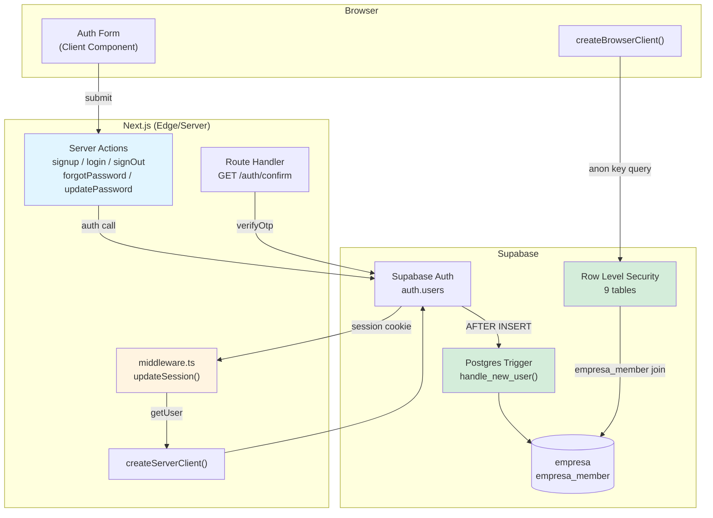
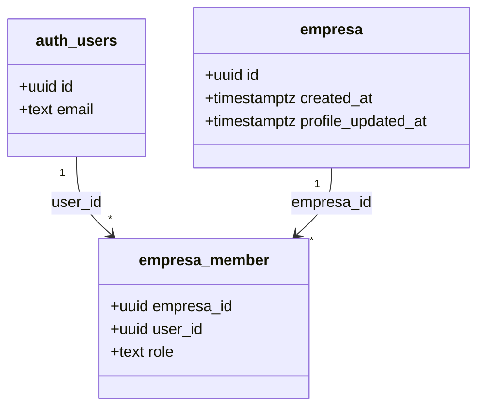
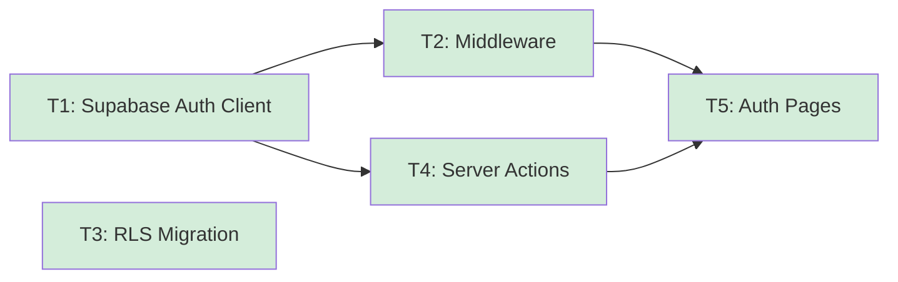

# auth-and-tenancy — Overview

## Spec Reference

[Spec](../spec/spec.md)

## Problem + Solution

- No auth perimeter: every route is currently public and any DB query leaks across empresa boundaries.
- Solution: ship Supabase Auth session management, Next.js middleware route protection, concrete RLS policies on all 9 domain-model tables, and an atomic empresa-provisioning trigger.
- Architecture: `@supabase/ssr` cookie utilities + Next.js edge middleware + a single SQL migration that enables RLS and defines all policies.
- Output: authenticated users land in a session scoped exclusively to their empresa's data; all downstream features inherit isolation for free.

## Architecture Diagram

## Data Model

No new tables. This feature adds RLS policies and a trigger on top of the `empresa` and `empresa_member` tables defined in domain-model.

## Task Index

| Task | File | Description | Dependencies |
|------|------|-------------|--------------|
| T1 | [01-plan-01-supabase-auth-client.md](./01-plan-01-supabase-auth-client.md) | Supabase client utilities (server + browser) | None |
| T2 | [01-plan-02-middleware.md](./01-plan-02-middleware.md) | Next.js middleware: session refresh + route guard | T1 |
| T3 | [01-plan-03-rls-migration.md](./01-plan-03-rls-migration.md) | Supabase migration: RLS + empresa provisioning trigger | None |
| T4 | [01-plan-04-server-actions.md](./01-plan-04-server-actions.md) | Auth server actions (signup, login, signOut, password) | T1 |
| T5 | [01-plan-05-auth-pages.md](./01-plan-05-auth-pages.md) | Auth UI pages + route group layout | T2, T4 |

## Dependency Graph

