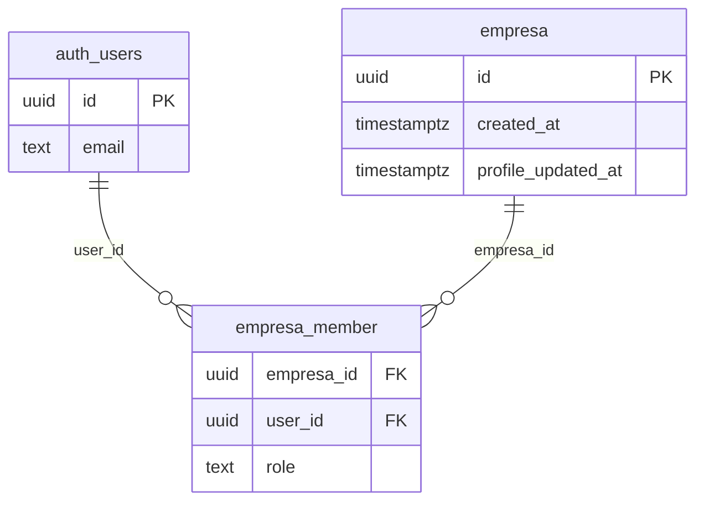
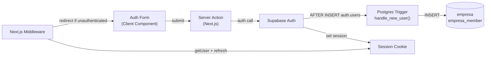

# auth-and-tenancy — Software Design Document

## Intention

`auth-and-tenancy` delivers the authentication perimeter and multi-tenant data isolation layer that every other COLTRATOS feature depends on. A pilot registers with email + password, verifies their email, and gets a session tied to an `empresa` row — from that point every query the app issues is automatically scoped to that empresa's data via Supabase RLS. No session means no data, and no empresa membership means no private rows.

This feature is the security foundation of the MVP: it owns the concrete `CREATE POLICY` SQL that fulfills [domain-model ADR-003](../../domain-model/spec/spec.md#adr-003), the Postgres trigger that atomically provisions `empresa` + `empresa_member` on signup, and the Next.js middleware that enforces the session boundary on every request.

> **Domain note:** The codebase uses `empresa` (not `companies`) and `empresa_member` (not `users`) per the contratacion-publica domain convention. These are the table names referenced throughout this spec.

## Use Cases

Detailed scenarios in [use-cases.md](./use-cases.md).

| Use Case | Description | User Stories |
|----------|-------------|-------------|
| [UC-01 — Signup](./use-cases.md#uc-01--signup-us-01) | New empresa user registers; empresa and empresa_member rows auto-created via trigger | US-01 |
| [UC-02 — Login](./use-cases.md#uc-02--login-us-02) | Returning user authenticates and gets a session cookie | US-02 |
| [UC-03 — Email verification](./use-cases.md#uc-03--email-verification-us-03) | User clicks verification link; session is established | US-03 |
| [UC-04 — Password reset](./use-cases.md#uc-04--password-reset-us-04) | User requests a reset email, sets new password via link | US-04 |
| [UC-05 — Protected route guard](./use-cases.md#uc-05--protected-route-guard-us-05) | Unauthenticated access to any dashboard route redirects to /login | US-05 |
| [UC-06 — Tenant data isolation](./use-cases.md#uc-06--tenant-data-isolation-us-06) | A query by empresa A cannot return rows belonging to empresa B | US-06 |

---

## Requirements

### Functional Requirements

| ID | Requirement | User Stories | Business Rules |
|----|-------------|-------------|----------------|
| REQ-001 | `src/lib/supabase/server.ts` exports `createServerClient()` — a factory that creates a Supabase client with cookie-based session storage using `@supabase/ssr`. Called inside Server Components, Route Handlers, and Server Actions only. | US-01–US-06 | RN-001 |
| REQ-002 | `src/lib/supabase/client.ts` exports `createBrowserClient()` — a singleton Supabase browser client for Client Components. Reads `NEXT_PUBLIC_SUPABASE_URL` and `NEXT_PUBLIC_SUPABASE_ANON_KEY`. | US-02, US-03 | RN-001 |
| REQ-003 | `src/lib/supabase/middleware.ts` exports `updateSession(request)` that calls `supabase.auth.getUser()` and writes refreshed cookies to the response. Only place session tokens are refreshed in the request lifecycle. | US-05 | RN-002 |
| REQ-004 | `src/middleware.ts` calls `updateSession()` on every request. If the path matches a protected route and `getUser()` returns null, redirect to `/login?redirectTo=<path>`. If the path matches an auth route and a session exists, redirect to `/dashboard`. Protected routes: `/dashboard/**`, `/analisis/**`, `/empresa/**`. Auth routes: `/login`, `/signup`, `/forgot-password`. | US-05 | RN-002, RN-003 |
| REQ-005 | A Supabase migration enables RLS on all 9 domain-model tables and creates bifurcated policies: (a) empresa-private tables (`analisis`, `requisito`, `prompt_cache`): SELECT/INSERT/UPDATE/DELETE require `auth.uid()` to appear in `empresa_member.user_id` for the row's `empresa_id`; (b) public tables (`proceso`, `pliego`, `anexo_proceso`, `segmento`): SELECT/INSERT/UPDATE granted to `authenticated` role with no empresa gate; (c) `empresa`: SELECT to `authenticated`, INSERT restricted to trigger execution context only. | US-06 | RN-004, RN-005, RN-006 |
| REQ-006 | The same migration creates Postgres function `handle_new_user()` and trigger `on_auth_user_created` AFTER INSERT ON `auth.users`. The function inserts one `public.empresa` row (`id = gen_random_uuid()`, `created_at = now()`) and one `public.empresa_member` row (`empresa_id` = new id, `user_id = NEW.id`, `role = 'owner'`). This is the sole creation path for `empresa` rows in v1. | US-01 | RN-007 |
| REQ-007 | Server Action `signup(email, password)` calls `supabase.auth.signUp({ email, password, options: { emailRedirectTo: '/auth/confirm' } })`. On success, renders a "check your email" message. On error, returns the Supabase error string. Never calls empresa-creation code — REQ-006 trigger handles it. | US-01 | RN-007, RN-008 |
| REQ-008 | Server Action `login(email, password)` calls `supabase.auth.signInWithPassword(...)`. On success, redirects to `/dashboard` (or `redirectTo` query param). On auth error, returns the error message to the form. | US-02 | RN-008 |
| REQ-009 | Route handler `GET /auth/confirm` handles the `?token_hash=&type=` callback from Supabase email links. Calls `supabase.auth.verifyOtp(...)`, then redirects to `/dashboard` on success or `/login?error=...` on failure. Handles both `type=email` (signup verification) and `type=recovery` (password reset). | US-03, US-04 | RN-009 |
| REQ-010 | Server Action `forgotPassword(email)` calls `supabase.auth.resetPasswordForEmail(email, { redirectTo: '/auth/confirm?type=recovery' })`. Always returns the same "check your email" message regardless of whether the email exists. | US-04 | RN-010 |
| REQ-011 | Server Action `updatePassword(password)` calls `supabase.auth.updateUser({ password })` within a recovery session. On success, redirects to `/dashboard`. | US-04 | RN-009 |
| REQ-012 | Server Action `signOut()` calls `supabase.auth.signOut()` then redirects to `/login`. | US-02 | RN-008 |
| REQ-013 | Auth UI pages under the `(auth)` route group: `signup/page.tsx`, `login/page.tsx`, `forgot-password/page.tsx`, `reset-password/page.tsx`. Each is a Client Component with controlled form, inline error display, and loading state. The `(auth)/layout.tsx` renders a full-viewport centered card with no sidebar or topbar. | US-01–US-04 | RN-011 |
| REQ-014 | `.env.example` documents `NEXT_PUBLIC_SUPABASE_URL`, `NEXT_PUBLIC_SUPABASE_ANON_KEY`, `SUPABASE_SERVICE_ROLE_KEY`. All three must be present at build time. | US-01–US-06 | RN-001 |

### Non-Functional Requirements

| ID | Category | Requirement |
|----|----------|-------------|
| NFR-01 | Security | Sessions are cookie-based, refreshed via middleware on every request. The anon key is the only credential exposed to browser. `SUPABASE_SERVICE_ROLE_KEY` must never appear in any client-side import path. |
| NFR-02 | Security | RLS policies are tested via integration tests against the local Supabase stack (`supabase start`) — not mocked. |
| NFR-03 | Performance | Middleware session refresh adds ≤10ms overhead on a warm runtime. |
| NFR-04 | Correctness | Zero cross-tenant data leaks: no query by empresa A must ever return a row belonging to empresa B. Verified in TC-007, TC-008. |
| NFR-05 | UX | Auth forms display errors inline (no toast/alert pop-ups). Submit button is disabled with a loading indicator during async operations. |

---

## Business Rules

| Rule | Description |
|------|-------------|
| RN-001 | `NEXT_PUBLIC_SUPABASE_URL` and `NEXT_PUBLIC_SUPABASE_ANON_KEY` are the only env vars allowed in browser-side Supabase clients. `SUPABASE_SERVICE_ROLE_KEY` MUST NOT appear in any client-side import. |
| RN-002 | Middleware runs on every request except `_next/static`, `_next/image`, and `favicon.ico`. Session refresh runs before route protection. |
| RN-003 | Protected routes in v1: `/dashboard/**`, `/analisis/**`, `/empresa/**`. Unauthenticated users hitting protected routes redirect to `/login?redirectTo=<path>` so they return after login. |
| RN-004 | RLS is enforced at the database layer. The anon-key client enforces RLS automatically. Service-role client bypasses RLS and MUST only be used in Server Actions and Route Handlers — never in Client Components. |
| RN-005 | Empresa-private RLS policies (`analisis`, `requisito`, `prompt_cache`) predicate: `EXISTS (SELECT 1 FROM empresa_member em WHERE em.empresa_id = <table>.empresa_id AND em.user_id = auth.uid())`. |
| RN-006 | Public-table (`proceso`, `pliego`, `anexo_proceso`, `segmento`) INSERT/UPDATE grant access to any `authenticated` user — no empresa membership check — matching domain-model RN-008. |
| RN-007 | `handle_new_user` trigger is the only code path that creates an `empresa` row. Application code MUST NOT call `INSERT INTO empresa` directly. |
| RN-008 | Auth errors surfaced to the UI use Supabase's error messages verbatim. No custom error-code mapping in v1. |
| RN-009 | `/auth/confirm` handles two OTP types: `email` (signup verification) and `recovery` (password reset link). The `type` param is passed by Supabase in the redirect URL. |
| RN-010 | `forgotPassword` MUST return the same success message regardless of whether the email exists — email enumeration is a security vulnerability. |
| RN-011 | The `(auth)` route group MUST NOT render the app shell (sidebar, topbar). Standalone centered layout only. |

---

## Test Cases

### TC-001 — Signup trigger creates empresa + empresa_member (REQ-006, RN-007)

**Given** the local Supabase stack is running and `handle_new_user` trigger is installed
**When** `supabase.auth.signUp({ email, password })` is called
**Then** one `empresa` row and one `empresa_member` row with `role = 'owner'` and `user_id = auth.uid()` exist in the database

### TC-002 — Login with valid credentials establishes session (REQ-008)

**Given** a verified user with email/password credentials exists
**When** `login(email, password)` server action is called
**Then** response sets a valid Supabase session cookie and redirects to `/dashboard`

### TC-003 — Login with invalid credentials returns inline error (REQ-008, RN-008)

**Given** a user submits an incorrect password
**When** the login form is submitted
**Then** an inline error message is displayed; no redirect occurs; no session cookie is set

### TC-004 — Email verification callback establishes session (REQ-009, RN-009)

**Given** a user has signed up and received a verification email
**When** the user visits `/auth/confirm?token_hash=<token>&type=email`
**Then** the session is established and the user is redirected to `/dashboard`

### TC-005 — Middleware redirects unauthenticated user from protected route (REQ-004, RN-003)

**Given** no session cookie is present
**When** a GET request is made to `/dashboard`
**Then** the response is a 307 redirect to `/login?redirectTo=/dashboard`

### TC-006 — Middleware redirects authenticated user away from auth pages (REQ-004, RN-003)

**Given** a valid session cookie is present
**When** a GET request is made to `/login`
**Then** the response is a 307 redirect to `/dashboard`

### TC-007 — Cross-tenant SELECT blocked on analisis (REQ-005, NFR-04, RN-005)

**Given** empresa A and empresa B each have one `analisis` row
**And** a Supabase client is authenticated as a user of empresa A (anon key)
**When** `SELECT * FROM analisis` is executed
**Then** only empresa A's row is returned; empresa B's row is absent

### TC-008 — Cross-tenant SELECT blocked on requisito (REQ-005, NFR-04, RN-005)

**Given** empresa A and empresa B each have `requisito` rows linked to their analyses
**And** a Supabase client is authenticated as a user of empresa A (anon key)
**When** `SELECT * FROM requisito` is executed
**Then** only empresa A's rows are returned; empresa B's rows are absent

### TC-009 — Public table readable by any authenticated user (REQ-005, RN-006)

**Given** a `proceso` row was inserted by empresa A
**And** a Supabase client is authenticated as a user of empresa B
**When** `SELECT * FROM proceso WHERE id = '<proceso_id>'` is executed
**Then** the row is returned (public table, no empresa gate)

### TC-010 — forgotPassword returns success for unknown email (REQ-010, RN-010)

**Given** a non-existent email address
**When** `forgotPassword('notfound@example.com')` is called
**Then** the response is the same "check your email" message as for a known email

### TC-011 — signOut clears session and redirects (REQ-012)

**Given** an authenticated user
**When** `signOut()` server action is called
**Then** session cookies are cleared and the response redirects to `/login`

---

## UX/UI

Design references pending — auth pages follow the Coltratos design system tokens (Geist font, neutral palette, brand accent). The `(auth)` layout is a full-viewport centered card, no sidebar, no topbar. Form fields use `<Button>` and design system primitives from `src/components/ui/`.

---

## Architecture

### Architecture Decision Records

| ADR | Title | Impact on this feature |
|-----|-------|----------------------|
| ADR-013 | Next.js 16 + App Router | Auth uses Server Actions (signup, login, signOut) and a Route Handler (`/auth/confirm`). No Pages Router auth patterns. |
| ADR-003 | Supabase RLS for tenant isolation | This spec ships the concrete SQL that fulfills ADR-003. RLS policies join through `empresa_member` using `auth.uid()`. |

### Tradeoffs

| Tradeoff | We chose | Over | Rationale |
|----------|----------|------|-----------|
| Empresa auto-creation | Postgres trigger on `auth.users` | App-layer creation in signup action | Atomic — no orphaned auth user if the application code fails after signup succeeds |
| Route protection | Edge middleware with `getUser()` | Per-layout server-side redirects | Single enforcement point; one file to audit; consistent across all route additions |
| RLS enforcement | Database layer (Supabase RLS) | Application-layer WHERE clauses | Impossible to bypass even if a developer forgets a WHERE clause; matches ADR-003 |
| Session storage | Cookie-based (`@supabase/ssr`) | localStorage | Required for SSR — localStorage is unavailable on the server; cookies flow with every HTTP request |

### Performance Goals & Metrics

| Metric | Target | Measurement |
|--------|--------|-------------|
| Middleware session refresh overhead | ≤10ms per request | Next.js instrumentation timing |
| Signup-to-empresa creation | ≤500ms (form submit → empresa row exists) | Integration test timing |
| Login round-trip | ≤1s p95 (form submit → dashboard redirect) | Manual timing on local stack |

### Data Model

`empresa` and `empresa_member` table schemas are owned by [domain-model](../../domain-model/spec/spec.md). This spec adds RLS policies on top of those tables and the user-sync trigger.

| Entity | Key Fields | Notes |
|--------|-----------|-------|
| `auth.users` | `id`, `email` | Supabase Auth managed. Trigger watches AFTER INSERT |
| `empresa` | `id`, `created_at`, `profile_updated_at` | Auto-created by trigger. Schema owned by domain-model |
| `empresa_member` | `empresa_id`, `user_id`, `role` | RLS anchor. `auth.uid() = user_id` is the isolation predicate |

### API / Data Contracts

| Endpoint / Action | Method | Description |
|-------------------|--------|-------------|
| Server Action `signup(email, password)` | POST | Creates Supabase Auth user; trigger creates empresa |
| Server Action `login(email, password)` | POST | Sets session cookie; returns redirect or error |
| Server Action `signOut()` | POST | Clears session; redirects to /login |
| Server Action `forgotPassword(email)` | POST | Sends reset email; always returns success |
| Server Action `updatePassword(password)` | POST | Updates password for recovery session |
| Route Handler `GET /auth/confirm` | GET | Handles Supabase email + recovery OTP callbacks |

### Service Integrations

| System | Direction | Data |
|--------|-----------|------|
| Supabase Auth | Calling | signUp, signInWithPassword, signOut, verifyOtp, resetPasswordForEmail, updateUser |
| Supabase DB (trigger) | Writing | empresa + empresa_member rows on auth.users INSERT |

