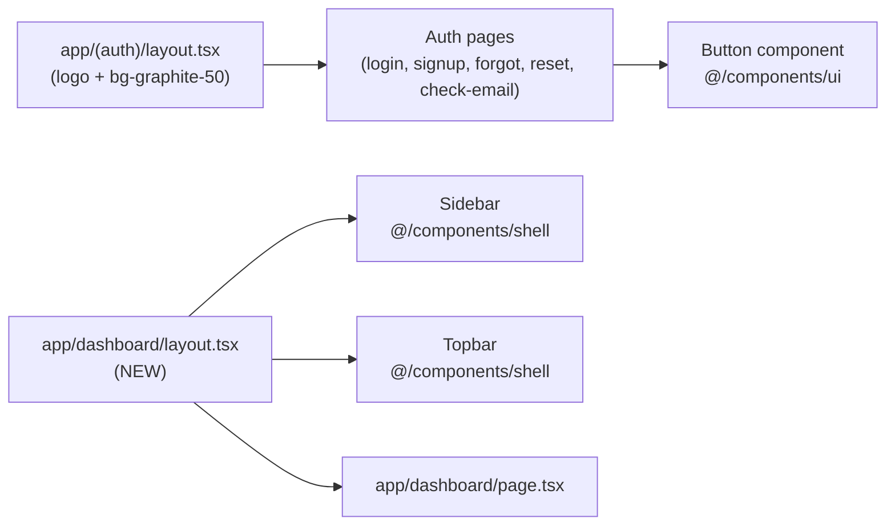
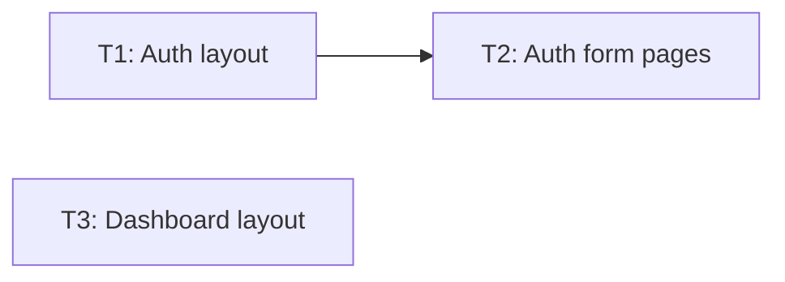

# auth-theme — Feature Plan Overview

Spec: [spec.md](../spec/spec.md)

## Problem
Auth pages use Tailwind built-in `neutral-*` classes (not design system tokens) and raw `<button>` elements. The dashboard has no shell layout. First impression for pilots is inconsistent with the COLTRATOS design system.

## Solution
- Replace `neutral-*` → `graphite-*` in all touched files
- Replace raw submit buttons with `<Button variant="primary">`
- Replace text logo with `coltratos-lockup.svg`
- Fix `WithAuthError` Storybook story (Suspense timing)
- Add `app/dashboard/layout.tsx` wiring Sidebar + Topbar

## Architecture Diagram

## Task Index

| # | File | Description | Depends on |
|---|------|-------------|-----------|
| T1 | [01-plan-01-auth-layout.md](./01-plan-01-auth-layout.md) | Auth layout: logo SVG + bg-graphite-50 | — |
| T2 | [01-plan-02-auth-form-pages.md](./01-plan-02-auth-form-pages.md) | Auth form pages: Button + graphite tokens + story fix | T1 |
| T3 | [01-plan-03-dashboard-layout.md](./01-plan-03-dashboard-layout.md) | Dashboard layout: Sidebar + Topbar wiring | — |

## Dependency Graph

