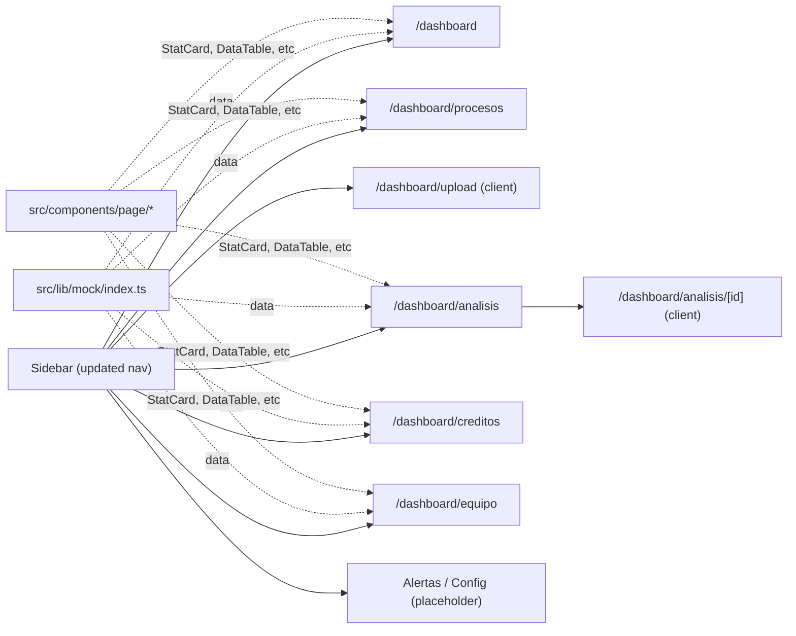
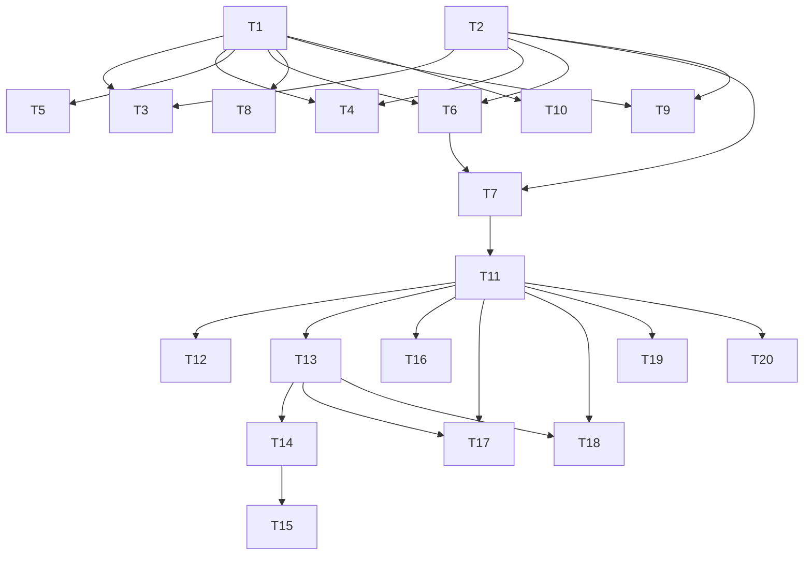

# Overview: coltratos-app-ui

**Spec:** [spec.md](../spec/spec.md)

## Problem + Solution

- The app shell and design system exist, but no authenticated pages are implemented.
- The Claude Design prototype (Coltratos App.html) defines 8 screens with precise layouts, tokens, and interactions.
- This feature implements all 8 screens as Next.js App Router pages under `app/dashboard/`, wired to the existing shell.
- Mock data in `src/lib/mock/` provides realistic content without requiring DB integration.

## Architecture Diagram

## Task Index

### Shipped (T1–T10) — mock-data UI

| # | File | Description | Depends on |
|---|------|-------------|-----------|
| T1 | [01-plan-01-nav-shell.md](./01-plan-01-nav-shell.md) | Update Sidebar: add Procesos, wire pathname routing, collapse support | — |
| T2 | [01-plan-02-shared-primitives.md](./01-plan-02-shared-primitives.md) | `StatCard`, `SemPill`, `DataTable`, `Toolbar`, `PageHeader`, `Pagination` | — |
| T3 | [01-plan-03-dashboard.md](./01-plan-03-dashboard.md) | Dashboard page stat cards + recent análisis table | T1, T2 |
| T4 | [01-plan-04-procesos.md](./01-plan-04-procesos.md) | Procesos page filter bar + table | T1, T2 |
| T5 | [01-plan-05-upload-flow.md](./01-plan-05-upload-flow.md) | Upload page (2-step + progress client page) | T1 |
| T6 | [01-plan-06-mis-analisis.md](./01-plan-06-mis-analisis.md) | Mis Análisis page stat cards + table + pagination | T1, T2 |
| T7 | [01-plan-07-result-detail.md](./01-plan-07-result-detail.md) | Resultado page hero + tabs + accordion (mock) | T2, T6 |
| T8 | [01-plan-08-creditos.md](./01-plan-08-creditos.md) | Créditos page balance + packages + invoice table | T1 |
| T9 | [01-plan-09-equipo.md](./01-plan-09-equipo.md) | Equipo page member table + roles sidebar | T1, T2 |
| T10 | [01-plan-10-placeholder-pages.md](./01-plan-10-placeholder-pages.md) | Alertas + Configuración placeholder pages | T1 |

### Revision 2026-05-06 (T11–T20) — Resultado del análisis real-data wiring

| # | File | Description | Depends on |
|---|------|-------------|-----------|
| T11 | [01-plan-11-result-real-data-loader.md](./01-plan-11-result-real-data-loader.md) | RLS-scoped Kysely loader for `analyses + verdicts + requisitos + pliego_uploads` | T7 |
| T12 | [01-plan-12-proceso-header.md](./01-plan-12-proceso-header.md) | Proceso metadata header strip + SECOP II link + unverified badge | T11 |
| T13 | [01-plan-13-verdict-banner.md](./01-plan-13-verdict-banner.md) | Verdict banner refinement (canonical SemPill, deterministic narrative) | T11 |
| T14 | [01-plan-14-requisito-row-expand.md](./01-plan-14-requisito-row-expand.md) | Requisito row + expand panel + citation block | T11, T13 |
| T15 | [01-plan-15-pdf-viewer.md](./01-plan-15-pdf-viewer.md) | `PdfViewer` DS primitive + signed-URL helper + text-search highlight | T14 |
| T16 | [01-plan-16-rerun-action.md](./01-plan-16-rerun-action.md) | Re-run server action (insert new `analyses` row) + RerunButton | T11 |
| T17 | [01-plan-17-partial-extraction-warning.md](./01-plan-17-partial-extraction-warning.md) | Partial-extraction warning banner + flagged-pages drawer | T11, T13 |
| T18 | [01-plan-18-relevance-feedback.md](./01-plan-18-relevance-feedback.md) | `analysis_feedback` migration + RLS + thumbs control | T11, T13 |
| T19 | [01-plan-19-export-trigger.md](./01-plan-19-export-trigger.md) | Export button (delegates to `report-export`) | T11 |
| T20 | [01-plan-20-loading-states.md](./01-plan-20-loading-states.md) | Real-progress loader for `extraction_status ∈ {pending, extracting}` | T11 |

## Dependency Graph

