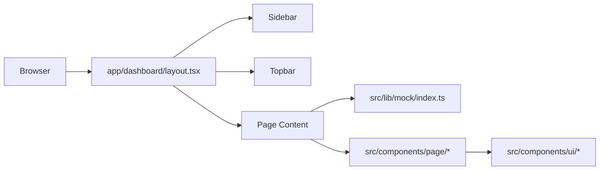
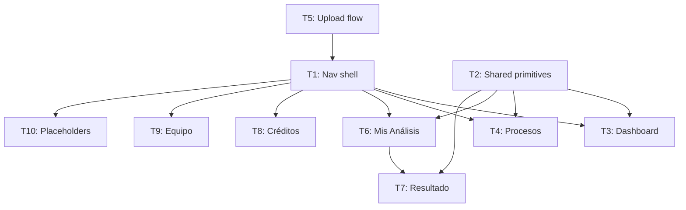

# Spec: coltratos-app-ui

_Design source: Claude Design handoff bundle (Coltratos App.html). 2026-05-01._

## Intention

Implement all authenticated app screens for the Coltratos MVP: Dashboard, Procesos, Upload flow, Análisis en progreso, Mis Análisis, Resultado del análisis, Créditos, and Equipo. Pages live under `app/dashboard/`, use the existing Sidebar + Topbar shell, and consume mock data from `src/lib/mock/`. Real API integration is out of scope — this spec delivers the pixel-accurate UI layer. Target users: Colombian SMBs and procurement consultants tracking eligibility for government contracts.

## Use Cases

See [use-cases.md](./use-cases.md).

## Functional Requirements

**Dashboard (REQ-001–002)**
- REQ-001 · 4 stat cards: Análisis realizados, Tasa elegibilidad, Créditos restantes, Tiempo ahorrado — each with circular tinted icon, value, hint, and delta row.
- REQ-002 · Recent análisis table (last 5): Proceso, Entidad, Fecha, Estado, Resultado (SemPill). Row click → result detail.

**Procesos (REQ-003–005)**
- REQ-003 · 4 stat cards: total, elegibles, con observaciones, no elegibles counts.
- REQ-004 · Filter bar: search + Semáforo / Modalidad / Cierre dropdowns + Limpiar.
- REQ-005 · Table columns: Semáforo, Proceso (name + ID mono), Entidad, Modalidad, Pliegos badge, Presupuesto, Cierre, Upload-icon action + chevron.

**Upload flow (REQ-006–008)**
- REQ-006 · Single client page with 4 internal steps: `linkProcess → uploadFile → progress → done`.
- REQ-007 · Step 1 — Vincular a proceso: segmented control with 3 modes: (a) select from list with preview card, (b) paste SECOP II URL/ID with Verificar button, (c) create new inline form.
- REQ-008 · Step 2 — PDF dropzone + file preview row. "Iniciar análisis" disabled unless both process and file are set.
- REQ-009 · Progress step: 4-step stepper (Extracción → Análisis → Evaluación → Validación), progress ring SVG, check-rows (done/active/pending), processing details sidebar card.

**Mis Análisis (REQ-010–011)**
- REQ-010 · 5 stat cards: Total análisis, Elegibles, Con observaciones, No elegibles, Tiempo promedio.
- REQ-011 · Filter toolbar: search + Estado / Semáforo / Entidad / Rango fechas dropdowns. Table: ID Análisis, Proceso/Objeto (mono), Entidad, Fecha, Semáforo, Resultado%, Requisitos (dot indicators), Acciones. Pagination.

**Resultado del análisis (REQ-012–014)**
- REQ-012 · Hero card: semáforo circle icon (72px), state title, description, % pill, requisito summary table, recommendation panel.
- REQ-013 · Tabs: Resumen / Jurídico / Financiero / Técnico / Experiencia. Each tab shows accordion rows per requisito: expand to reveal "¿Por qué?" reasoning.
- REQ-014 · Sidebar cards: Información del proceso, Archivos, Proceso de análisis.

**Créditos (REQ-015–016)**
- REQ-015 · Navy gradient credit balance card (big number), usage summary card, 6-month usage bar chart.
- REQ-016 · Credit package selector (radio options), invoice table (Factura / Fecha / Descripción / Monto / Estado / Acciones).

**Equipo (REQ-017–018)**
- REQ-017 · 4 stat cards. Member table: avatar+name+email, Rol (tinted pill), Estado, Último acceso, action buttons. Pagination.
- REQ-018 · Sidebar: roles & permissions explanation, recent activity feed with tinted circle icons.

**Shell & navigation (REQ-019–021)**
- REQ-019 · Sidebar nav items in order: Dashboard, Procesos, Subir pliego, Mis análisis, Alertas _(Principal)_ · Créditos, Equipo, Configuración _(Cuenta)_. Active item by current pathname.
- REQ-020 · Sidebar collapse to 76px icon-only mode. Labels, user info, and credits card hidden when collapsed.
- REQ-021 · Alertas and Configuración: placeholder pages ("Módulo en fase 2").

## Non-Functional Requirements

- NFR-01 · Server Components by default (ADR-013). `'use client'` only for Upload/Progress (step state) and collapsible sidebar.
- NFR-02 · No new external dependencies. Lucide icons via existing `Icon` component. Tailwind v4 tokens (ADR-017, ADR-018).
- NFR-03 · Mock data in `src/lib/mock/index.ts`. Components import from there; no fetch calls.
- NFR-04 · All user-visible text in Spanish. Domain identifiers follow contratacion-publica.md conventions.
- NFR-05 · Files ≤ 500 lines. Split into sub-components if needed.

## Business Rules

- RN-001 · Spanish domain terms verbatim: `proceso`, `pliego`, `semáforo`, `entidad`, `requisito_habilitante`.
- RN-002 · Semáforo → Chip: `eligible` = green "Elegible", `conditional` = amber "Con observaciones", `not-eligible` = red "No elegible".
- RN-003 · Monetary values: COP with dots (`$2.450.000.000 COP`). Dates: `DD Mes YYYY`. Process IDs: monospace font.
- RN-004 · "Iniciar análisis" button requires both a linked proceso and an uploaded file.
- RN-005 · Progress step is a prototype flow — no real polling. "Ver resultado (demo)" button advances state.

## Architecture

### Relevant ADRs
- ADR-013: Next.js 16 App Router — Server Components default, `app/` dir only.
- ADR-016: Geist self-hosted — already loaded in `app/layout.tsx`.
- ADR-017: Tailwind v4 theme tokens — use `navy-900`, `blue-600`, `green-50`, etc.
- ADR-018: Inline `Icon` component — `<Icon name="..." />` from `@/components/ui`.

### Data Model
No new DB tables. All pages consume `src/lib/mock/index.ts` (TypeScript constants).

### Page → Route mapping

| Screen | Route | RSC/Client |
|--------|-------|-----------|
| Dashboard | `app/dashboard/page.tsx` | RSC |
| Procesos | `app/dashboard/procesos/page.tsx` | RSC |
| Upload | `app/dashboard/upload/page.tsx` | Client |
| Mis Análisis | `app/dashboard/analisis/page.tsx` | RSC |
| Resultado | `app/dashboard/analisis/[id]/page.tsx` | Client (tabs) |
| Créditos | `app/dashboard/creditos/page.tsx` | RSC |
| Equipo | `app/dashboard/equipo/page.tsx` | RSC |
| Alertas | `app/dashboard/alertas/page.tsx` | RSC |
| Config | `app/dashboard/config/page.tsx` | RSC |

### Architecture Diagram

### Task dependency order

