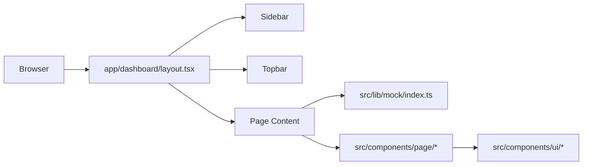
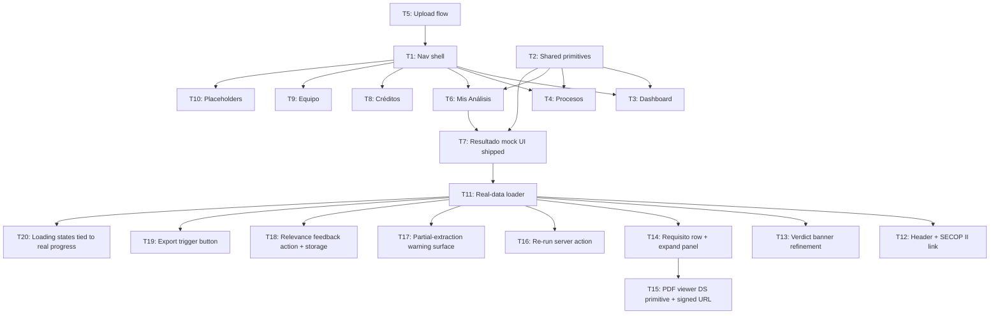

# Spec: coltratos-app-ui

_Design source: Claude Design handoff bundle (Coltratos App.html). 2026-05-01._
_Revised 2026-05-06: real-data wiring + citations + PDF viewer + re-run + relevance feedback for Resultado del análisis._

## Intention

Implement all authenticated app screens for the Coltratos MVP: Dashboard, Procesos, Upload flow, Análisis en progreso, Mis Análisis, Resultado del análisis, Créditos, and Equipo. Pages live under `app/dashboard/`, use the existing Sidebar + Topbar shell.

**T1–T10 (shipped):** screens wired to mock data from `src/lib/mock/` for the pixel-accurate UI layer.

**T11+ (this revision):** the **Resultado del análisis** screen graduates from mock to real data: it reads `analyses + requisitos + verdicts + pliego_uploads + procesos` (RLS-scoped), renders the verdict with citations the user can drill into via an in-app PDF viewer, exposes a re-run action that creates a new `analyses` row against the same `pliego_upload`, surfaces partial-extraction warnings prominently, ties loading states to real extraction stages, captures relevance feedback (thumbs up/down + optional comment), and delegates report export to the `report-export` feature. Other screens remain mock-backed in this revision.

Target users: Colombian SMBs and procurement consultants tracking eligibility for government contracts. Pilots see the verdict clearly, drill into any requisito to see the source quote in the original PDF, and trust the output because every claim is cited.

## Use Cases

See [use-cases.md](./use-cases.md).

## Functional Requirements

**Dashboard (REQ-001–002)**
- REQ-001 · 4 stat cards: Análisis realizados, Tasa elegibilidad, Créditos restantes, Tiempo ahorrado — each with circular tinted icon, value, hint, and delta row.
- REQ-002 · Recent análisis table (last 5): Proceso, Entidad, Fecha, Estado, Resultado (SemPill). Row click → result detail.

**Procesos (REQ-003–005)**
- REQ-003 · 4 stat cards: total, elegibles, con observaciones, no elegibles counts.
- REQ-004 · Filter bar: search + Semáforo / Modalidad / Cierre dropdowns + Limpiar.
- REQ-005 · Table columns: Semáforo, Proceso (name + ID mono), Entidad, Modalidad, Pliegos badge, Presupuesto, Cierre, Upload-icon action + chevron.

**Upload flow (REQ-006–008)**
- REQ-006 · Single client page with 4 internal steps: `linkProcess → uploadFile → progress → done`.
- REQ-007 · Step 1 — Vincular a proceso: segmented control with 3 modes: (a) select from list with preview card, (b) paste SECOP II URL/ID with Verificar button, (c) create new inline form.
- REQ-008 · Step 2 — PDF dropzone + file preview row. "Iniciar análisis" disabled unless both process and file are set.
- REQ-009 · Progress step: 4-step stepper (Extracción → Análisis → Evaluación → Validación), progress ring SVG, check-rows (done/active/pending), processing details sidebar card.

**Mis Análisis (REQ-010–011)**
- REQ-010 · 5 stat cards: Total análisis, Elegibles, Con observaciones, No elegibles, Tiempo promedio.
- REQ-011 · Filter toolbar: search + Estado / Semáforo / Entidad / Rango fechas dropdowns. Table: ID Análisis, Proceso/Objeto (mono), Entidad, Fecha, Semáforo, Resultado%, Requisitos (dot indicators), Acciones. Pagination.

**Resultado del análisis (REQ-012–014, REQ-022–029)**

- REQ-012 · **Hero verdict banner** (real data). Reads from `analyses.overall_verdict` + aggregated `verdicts`. Renders: semáforo circle icon (72px, color by overall verdict), state title (`Cumple` / `Cumple con observaciones` / `No cumple`), one-sentence narrative, requisito summary counts (`verde / amarillo / rojo / total`), recommendation panel. **MUST NOT** display any verdict element until extraction status is `completed` or `partial` — while `pending`/`extracting`, the page renders the loading state from REQ-028 instead.
- REQ-013 · **Tabs by requisito tipo** (real data). Tabs: Resumen / Jurídico / Técnico / Financiero (Financiero includes experiencia per `contratacion-publica.md`). Tab content: accordion rows grouped by `requisito.tipo`. Row collapsed: requisito text (truncated), `SemPill` (verde/amarillo/rojo), confidence indicator, expand chevron. Row expanded: full requisito text, verdict reason, **source-quote citation block** (REQ-022), and "Abrir página en PDF" button.
- REQ-014 · **Process metadata header + sidebar** (real data). Header strip above hero: `entidad`, `objeto` (truncated to 2 lines with hover-expand), `modalidad`, `valor estimado`, `fecha de cierre`, plus "Ver en SECOP II" external link to the original Proceso. Source: `analyses.proceso_metadata_snapshot` (JSONB) — **MUST NOT** re-fetch from datos.gov.co. Sidebar cards remain: Información del proceso (snapshot fields), Archivos (signed URL to pliego PDF), Proceso de análisis (timestamps + cost summary).
- REQ-022 · **Source-quote citations.** Every requisito row displays its `quote_fuente` and `pagina_fuente`, rendered as a quotation block with a left-border accent and a "Abrir página en PDF" affordance. The citation block uses the design system's quote primitive (extending if needed). Clicking the affordance opens REQ-023.
- REQ-023 · **In-app PDF viewer.** A modal (mobile) / side panel (desktop ≥ lg) that loads the pliego PDF via a Supabase signed URL, navigates to `pagina_fuente`, and visually distinguishes `quote_fuente` (highlight strategy: see S6 Flag F-2). Component lives in the design system as a new primitive (`PdfViewer`) — **MUST** be added to the design system rather than inlined here.
- REQ-024 · **Re-run action.** "Volver a analizar" button next to the export button. Clicking it triggers a server action that **MUST** insert a new `analyses` row with the same `pliego_upload_id`, the user's current `company_profile` snapshot, and `proceso_lookup_status` carried over from the existing `procesos` row (or refreshed if the cache is stale per integrations.md). **MUST NOT** mutate the existing `analyses` row. UX behavior — see S6 Flag F-3.
- REQ-025 · **Export action.** "Exportar PDF" button delegates to the `report-export` feature (out of this spec's scope to implement). This spec wires the trigger and disabled/enabled states only; the actual export pipeline is owned by `report-export`.
- REQ-026 · **Relevance feedback.** A thumbs-up / thumbs-down control plus an optional one-line comment, displayed inline with the hero verdict. Submitted via a server action that writes to the `analysis_feedback` table (one row per `(analysis_id, user_id)`; updates allowed). Feedback is **MUST**-stored against the analysis, not the proceso, and is part of the discovery relevance metric.
- REQ-027 · **Partial-extraction warnings.** When `analyses.extraction_status = 'partial'` or any pages are flagged as un-extractable (`pages_flagged > 0`), a prominent banner appears at the top of the page (above the hero) — **MUST NOT** be hidden in the footer or sidebar. Banner copy lists how many pages were unreadable and includes a "Ver detalles" affordance opening a list of flagged pages.
- REQ-028 · **Loading states tied to real progress.** While `extraction_status` is `pending` or `extracting`, the result page renders a step-tied loader (Extracción → Análisis → Evaluación → Validación) reading actual stage signals from `analyses.extraction_stage` — not a generic spinner. The same primitives as the existing Upload progress step (T5) are reused.
- REQ-029 · **Verdict immutability.** **MUST NOT** allow editing the verdict from the UI. To change a verdict, the user updates their company profile and clicks REQ-024 (re-run); a new `analyses` row is produced.

**Créditos (REQ-015–016)**
- REQ-015 · Navy gradient credit balance card (big number), usage summary card, 6-month usage bar chart.
- REQ-016 · Credit package selector (radio options), invoice table (Factura / Fecha / Descripción / Monto / Estado / Acciones).

**Equipo (REQ-017–018)**
- REQ-017 · 4 stat cards. Member table: avatar+name+email, Rol (tinted pill), Estado, Último acceso, action buttons. Pagination.
- REQ-018 · Sidebar: roles & permissions explanation, recent activity feed with tinted circle icons.

**Shell & navigation (REQ-019–021)**
- REQ-019 · Sidebar nav items in order: Dashboard, Procesos, Subir pliego, Mis análisis, Alertas _(Principal)_ · Créditos, Equipo, Configuración _(Cuenta)_. Active item by current pathname.
- REQ-020 · Sidebar collapse to 76px icon-only mode. Labels, user info, and credits card hidden when collapsed.
- REQ-021 · Alertas and Configuración: placeholder pages ("Módulo en fase 2").

## Non-Functional Requirements

- NFR-01 · Server Components by default (ADR-013). `'use client'` only for: Upload/Progress (step state), collapsible sidebar, ResultTabs (tab + accordion state), PdfViewer (REQ-023, viewport + page navigation), feedback control (REQ-026).
- NFR-02 · No new external dependencies for the shipped scope. Real-data revision **MAY** introduce one PDF rendering library (pdf.js or react-pdf — see S6 Flag F-1) inside the design system's new `PdfViewer` primitive; this is the only allowed addition and **MUST** be approved before implementation.
- NFR-03 · Mock data in `src/lib/mock/index.ts` is retained for screens not yet wired to real data. The Resultado del análisis page (T11+) reads from Supabase via RLS-scoped Kysely; no mock fallback in production.
- NFR-04 · All user-visible text in Spanish. Domain identifiers follow contratacion-publica.md conventions: `proceso`, `pliego`, `requisito_habilitante`, `semáforo`, `entidad`, `proceso_lookup_status`, `verdicts.verde / amarillo / rojo`. **MUST NOT** translate to English.
- NFR-05 · Files ≤ 500 lines. Split into sub-components if needed.
- NFR-06 · Mobile-responsive, desktop-optimized layout. PDF viewer (REQ-023) renders as a full-screen modal on `< lg` and as a side panel on `≥ lg`.
- NFR-07 · All Resultado del análisis queries enforce RLS on `analyses.company_id`, `pliego_uploads.uploaded_by_company_id`, and `verdicts → analyses → company_id`. The signed URL for the pliego PDF is minted server-side only after the same RLS check passes; **MUST NOT** expose the storage path to the client.

## Business Rules

- RN-001 · Spanish domain terms verbatim: `proceso`, `pliego`, `semáforo`, `entidad`, `requisito_habilitante`.
- RN-002 · Semáforo → SemPill (UI) maps to verdict values from data: `verde` → green "Cumple", `amarillo` → amber "Con observaciones", `rojo` → red "No cumple". Legacy mock labels (`eligible / conditional / not-eligible`) are deprecated for the Resultado page; the SemPill component **MUST** accept either the canonical (`verde / amarillo / rojo`) or the legacy form during the transition, and the canonical form **MUST** be used for all new wiring.
- RN-003 · Monetary values: COP with dots (`$2.450.000.000 COP`). Dates: `DD Mes YYYY`. Process IDs: monospace font.
- RN-004 · "Iniciar análisis" button requires both a linked proceso and an uploaded file.
- RN-005 · Upload progress step is a prototype flow — no real polling. "Ver resultado (demo)" button advances state. (The Resultado del análisis loading state in REQ-028 is a separate, real-data flow.)
- RN-006 · Verdicts are **immutable**. The UI **MUST NOT** expose any control that mutates `analyses.overall_verdict`, `verdicts.value`, or `verdicts.reason`. To change a verdict the user re-runs (REQ-024).
- RN-007 · Re-run **MUST** produce a new `analyses` row with `pliego_upload_id` carried over and `proceso_id` carried over. The original analysis row stays untouched and remains visible in `/dashboard/analisis` history.
- RN-008 · Citations are **mandatory** on every requisito row that has a verdict — if `quote_fuente` or `pagina_fuente` is missing on a row, the row is marked `requiere verificación` (amarillo) regardless of the underlying extraction.
- RN-009 · `proceso_lookup_status = unverified` **MUST** be displayed prominently on the header strip (REQ-014) with copy explaining the manual-fallback origin; this is not a degraded mode, it is a first-class state.
- RN-010 · Partial-extraction warnings (REQ-027) are **MUST**-displayed above the verdict, not in the footer, and persist until the user dismisses them or re-runs the analysis.

## Architecture

### Relevant ADRs
- ADR-013: Next.js 16 App Router — Server Components default, `app/` dir only.
- ADR-016: Geist self-hosted — already loaded in `app/layout.tsx`.
- ADR-017: Tailwind v4 theme tokens — use `navy-900`, `blue-600`, `green-50`, etc.
- ADR-018: Inline `Icon` component — `<Icon name="..." />` from `@/components/ui`.

### Data Model

T1–T10 introduced no DB tables — they consume `src/lib/mock/index.ts`.

T11+ (this revision) reads from existing tables and introduces one new table:

**Read** (RLS-scoped via `auth.company_id()`):
- `analyses` — primary record. Fields read: `id`, `proceso_id`, `pliego_upload_id`, `company_id`, `overall_verdict`, `proceso_metadata_snapshot` (JSONB), `proceso_lookup_status`, `extraction_status`, `extraction_stage`, `pages_flagged`, `created_at`, `cost_usd`, `latency_ms`, `tokens_*`.
- `verdicts` — one row per requisito-on-analysis. Fields read: `analysis_id`, `requisito_id`, `value` (`verde | amarillo | rojo`), `reason`, `confidence`.
- `requisitos` — one row per requisito extracted from the pliego. Fields read: `id`, `pliego_upload_id`, `tipo` (`juridico | tecnico | financiero`), `texto`, `quote_fuente`, `pagina_fuente`.
- `pliego_uploads` — Fields read: `id`, `file_storage_key`, `file_sha256`, `uploaded_at`. Used to mint signed URL for the PDF viewer.
- `procesos` — Fields read: `numero_proceso`, `objeto_a_contratar` (only as a fallback if `proceso_metadata_snapshot` is empty — should never happen in practice).

**Write** (server actions, RLS-scoped):
- `analyses` — `INSERT` on re-run (REQ-024, RN-007). **Never `UPDATE`**.
- `analysis_feedback` — new table for relevance feedback (REQ-026):
  ```
  analysis_feedback (
    analysis_id   uuid not null references analyses(id) on delete cascade,
    user_id       uuid not null references auth.users(id),
    rating        text not null check (rating in ('up','down')),
    comment       text,
    created_at    timestamptz not null default now(),
    updated_at    timestamptz not null default now(),
    primary key (analysis_id, user_id)
  )
  ```
  RLS: `using (analysis_id in (select id from analyses where company_id = auth.company_id()))`. Migration owned by this spec; **MUST** be added under `supabase/migrations/` with the standard timestamped filename.

**Storage:**
- Signed URL for `pliego_uploads.file_storage_key` is minted server-side (15-min TTL) only after RLS-scoped lookup confirms the analysis belongs to the user's company. Path format `companies/<company_id>/pliegos/<sha256>.pdf` per integrations.md.

**Reproducibility (per database.md):**
- `analyses.proceso_metadata_snapshot` is the source of truth for the metadata header (REQ-014). The page **MUST NOT** call datos.gov.co at render time.

### Page → Route mapping

| Screen | Route | RSC/Client |
|--------|-------|-----------|
| Dashboard | `app/dashboard/page.tsx` | RSC |
| Procesos | `app/dashboard/procesos/page.tsx` | RSC |
| Upload | `app/dashboard/upload/page.tsx` | Client |
| Mis Análisis | `app/dashboard/analisis/page.tsx` | RSC |
| Resultado | `app/dashboard/analisis/[id]/page.tsx` | RSC (data fetch) + nested Client (tabs, viewer, feedback) |
| Créditos | `app/dashboard/creditos/page.tsx` | RSC |
| Equipo | `app/dashboard/equipo/page.tsx` | RSC |
| Alertas | `app/dashboard/alertas/page.tsx` | RSC |
| Config | `app/dashboard/config/page.tsx` | RSC |

### Architecture Diagram



### Task dependency order



## Dependencies

This revision adds dependencies on already-specced features and on the design system:

| Dependency | Provides | Status |
|------------|----------|--------|
| `requisitos-extraction` | `requisitos` rows with `tipo`, `texto`, `quote_fuente`, `pagina_fuente` | Specced |
| `semaforo-aggregation` | `verdicts` rows + `analyses.overall_verdict` | Specced |
| `pliego-upload` | `pliego_uploads.file_storage_key` + signed-URL helper conventions | Specced |
| `domain-model-mvp` | `analyses`, `verdicts`, `requisitos`, `pliego_uploads`, `procesos` table shapes (incl. `extraction_status`, `extraction_stage`, `pages_flagged`, `cost_usd`) | Specced (rev 3 in flight) |
| `proceso-discovery` (a.k.a. `procesos-listing`) | Referrer for breadcrumb/back link | Specced |
| `report-export` | Export-PDF pipeline triggered by REQ-025 | **Not yet specced — this spec wires the trigger only** |
| Design System | `Card`, `Chip`, `SemPill`, `Button`, `Tabs`, `Accordion`, `Drawer`, plus the new `PdfViewer`, `Quote`, `WarningBanner`, `FeedbackThumbs` primitives this revision contributes | In place; **MUST extend rather than inline** |

## S6 — Open Decisions (Flags)

The following decisions are deferred and **MUST** be resolved in `/nybo-verify` before implementation. Per `scope-deferral-verify-gate` convention, flipping a flag now is cheaper than re-bootstrapping later.

| Flag | Decision | Options | Recommendation | Owner |
|------|----------|---------|----------------|-------|
| F-1 | PDF viewer library | (a) `pdf.js` direct, (b) `react-pdf` wrapper, (c) custom canvas renderer | (b) `react-pdf` — well-typed wrapper around pdf.js, smallest integration cost; only library introduced under NFR-02 | Eng |
| F-2 | Highlight strategy for `quote_fuente` | (a) text-search over rendered text layer, (b) coordinate-based bounding boxes from extraction, (c) hybrid (text-search with coord fallback) | (a) text-search — simpler; accept that ~5–10% of highlights will fail when extracted text differs from rendered text; surface a "Cita no encontrada" fallback chip rather than silently miss | Eng |
| F-3 | Re-run UX | (a) in-place loader replaces hero until new analysis completes, (b) navigation to a fresh `/dashboard/analisis/[new-id]` with a toast linking back to the prior verdict | (b) navigation — preserves the original verdict on the prior URL (RN-007 audit), avoids ambiguous loading states, fits the "history of verdicts" mental model | Product |

## Revision Log

| Date | Mode | Summary |
|------|------|---------|
| 2026-05-01 | create | Initial spec — 8 mock-data screens (T1–T10) |
| 2026-05-06 | edit | Resultado del análisis: real-data wiring + citations + PDF viewer + re-run + partial-extraction warnings + relevance feedback + export trigger + loading states tied to real progress (REQ-022–029, RN-006–010, NFR-06–07, T11–T20) |
