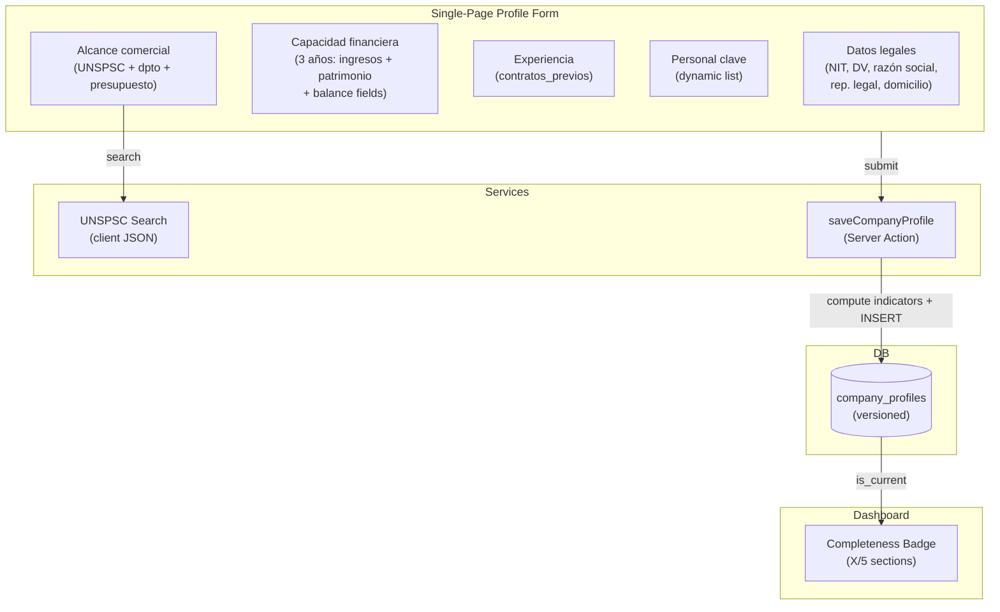
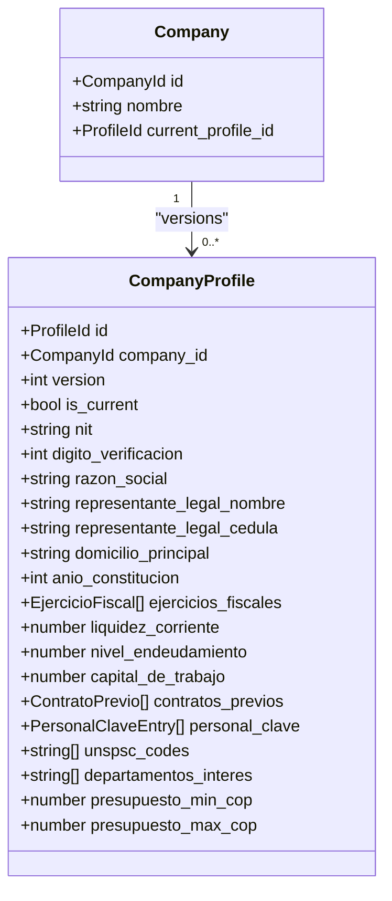
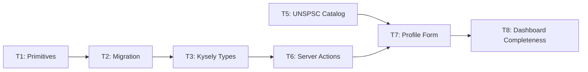

# Company Profiling Onboarding — Overview

## Spec Reference

[Spec](../spec/spec.md)

## Problem + Solution

- **Problem:** COLTRATOS has no empresa capability data; matching cannot score procesos or derive discovery filters
- **Solution:** Single-page profile form (5 sections); completable in <15 min with RUP in hand; every save = immutable versioned snapshot
- **Dual purpose:** Profile feeds (a) semáforo matching during analysis and (b) discovery filter derivation (UNSPSC/geographic/budget)
- **Key constraints:** No wizard state persistence; completeness warning only (analysis never blocked); single user per company in MVP

## Architecture Diagram

## Data Model

## Task Index

| Task | File | Description | Dependencies |
|------|------|-------------|--------------|
| T1 | [01-plan-01-primitives.md](./01-plan-01-primitives.md) | Zod schemas + domain types for all 5 form sections | None |
| T2 | [01-plan-02-migration.md](./01-plan-02-migration.md) | Migration: versioned company_profiles table + RLS + GIN indexes | T1 |
| T3 | [01-plan-03-kysely-types.md](./01-plan-03-kysely-types.md) | Kysely interface for company_profiles | T2 |
| T5 | [01-plan-05-unspsc-catalog.md](./01-plan-05-unspsc-catalog.md) | UNSPSC catalog JSON + client-side search util | None |
| T6 | [01-plan-06-server-actions.md](./01-plan-06-server-actions.md) | saveCompanyProfile (versioned INSERT + indicator computation) + getCompanyProfile | T3 |
| T7 | [01-plan-07-profile-form.md](./01-plan-07-profile-form.md) | Single-page profile form UI (5 sections, dynamic lists, UNSPSC multi-select) | T5, T6 |
| T8 | [01-plan-08-dashboard-completeness.md](./01-plan-08-dashboard-completeness.md) | Dashboard completeness badge; wire form into /onboarding and /config/perfil routes | T7 |

## Dependency Graph

