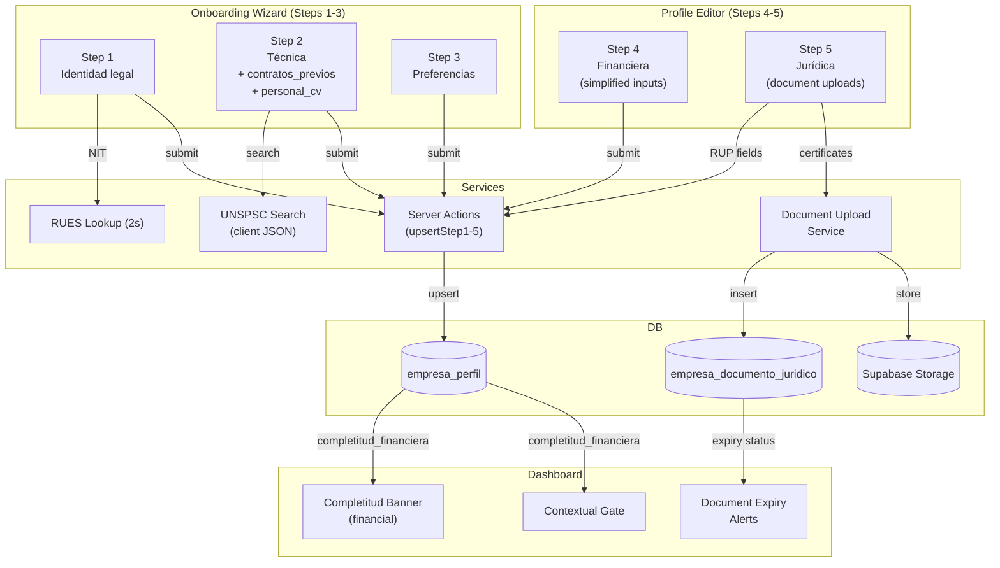
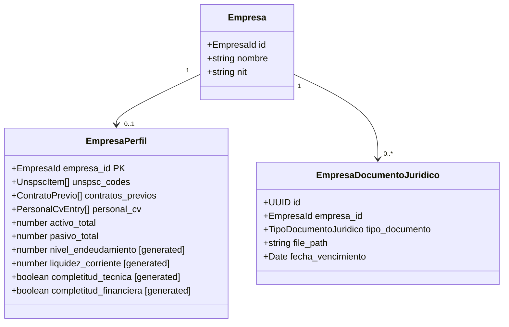
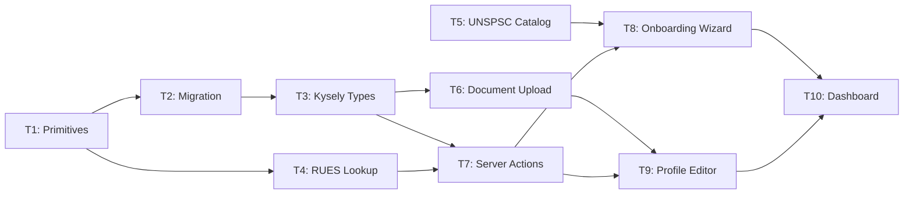

# Company Profiling Onboarding — Overview

## Spec Reference

[Spec](../spec/spec.md)

## Problem + Solution

- **Problem:** COLTRATOS has no empresa capability data; matching cannot score procesos beyond keyword presence
- **Solution:** 5-step onboarding: steps 1-3 mandatory (Layer 1 — UNSPSC + geography), steps 4-5 optional (Layer 2 — financial thresholds + semantic objeto matching)
- **Score:** Técnica 50% + Financiera 40% + Semantic 10%. Jurídica = certificate expiry alert track only (not scored)
- **Key changes vs v0:** documento uploads (not declarations) for Jurídica; simplified financial inputs; objeto contractual + CV overlap model for Técnica

## Architecture Diagram

## Data Model

## Task Index

| Task | File | Description | Dependencies |
|------|------|-------------|--------------|
| T1 | [01-plan-01-primitives.md](./01-plan-01-primitives.md) | Zod schemas + types: ContratoPrevio, PersonalCvEntry, TipoDocumentoJuridico, calcularExperienciaEfectiva | None |
| T2 | [01-plan-02-migration.md](./01-plan-02-migration.md) | Migration: empresa_perfil (simplified financial) + empresa_documento_juridico + RLS | T1 |
| T3 | [01-plan-03-kysely-types.md](./01-plan-03-kysely-types.md) | Kysely interfaces for both tables | T2 |
| T4 | [01-plan-04-rues-lookup.md](./01-plan-04-rues-lookup.md) | RUES lookup service + API route | T1 |
| T5 | [01-plan-05-unspsc-catalog.md](./01-plan-05-unspsc-catalog.md) | UNSPSC catalog JSON + search util | None |
| T6 | [01-plan-06-document-upload.md](./01-plan-06-document-upload.md) | Document upload service: storage + expiry tracking | T3 |
| T7 | [01-plan-07-server-actions.md](./01-plan-07-server-actions.md) | Server actions upsertStep1-5 (no antecedentes) | T3, T4 |
| T8 | [01-plan-08-onboarding-wizard.md](./01-plan-08-onboarding-wizard.md) | Wizard UI: steps 1-3, contratos_previos, CV overlap advisory | T5, T7 |
| T9 | [01-plan-09-profile-editor.md](./01-plan-09-profile-editor.md) | Profile editor: step4 simplified financiera, step5 document upload cards | T6, T7 |
| T10 | [01-plan-10-dashboard-integration.md](./01-plan-10-dashboard-integration.md) | Dashboard: CompletitudBanner + DocumentExpiryAlerts + ContextualGate | T8, T9 |

## Dependency Graph

