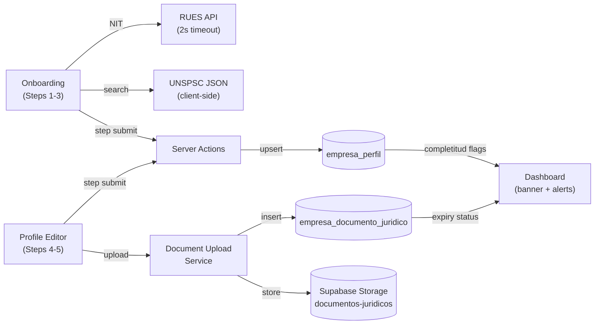

# Company Profiling Onboarding — Software Design Document

## Intention

Captures the multidimensional profile of a Colombian empresa during onboarding, enabling the COLTRATOS matching engine to score SECOP II `procesos` across two scoring dimensions (Técnica + Financiera) and a documentation health track (Jurídica). Steps 1-3 are mandatory (Layer 1 — UNSPSC + geography + cuantía matching); steps 4-5 are optional and unlock Layer 2 — financial indicator thresholds and semantic objeto matching. Jurídica does not affect the match score; instead it drives a certificate expiry alert system that warns the empresa when legal documents need renewal.

**Score formula (Layer 2):**
```
Score = Técnica (50%) + Financiera (40%) + Semantic similarity — objeto (10%)
```
A proceso is notified when both Técnica AND Financiera pass their thresholds. Jurídica = documentation health alert track only.

## Use Cases

Detailed scenarios in [use-cases.md](./use-cases.md).

| Use Case | Description | User Stories |
|----------|-------------|-------------|
| [UC-01 — Onboarding obligatorio](./use-cases.md#uc-01) | Empresa completes steps 1-3 to activate Layer 1 matching | US-01, US-02 |
| [UC-02 — RUES auto-fill](./use-cases.md#uc-02) | NIT lookup pre-populates empresa data from RUES | US-03 |
| [UC-03 — Dimensión financiera](./use-cases.md#uc-03) | Empresa enters financial indicators to unlock Layer 2 | US-04 |
| [UC-04 — Dimensión jurídica](./use-cases.md#uc-04) | Empresa uploads legal certificates; system tracks expiry | US-05 |
| [UC-05 — Alerta de vencimiento](./use-cases.md#uc-05) | Dashboard warns when a certificate expires within 7 days | US-08 |
| [UC-06 — Edición posterior](./use-cases.md#uc-06) | User edits profile; matching scores update on next query | US-06 |
| [UC-07 — Contextual gate](./use-cases.md#uc-07) | Opening a pliego that needs financial data prompts completion | US-07 |

---

## Requirements

### Functional Requirements

| ID | Requirement | User Stories | Business Rules |
|----|-------------|-------------|----------------|
| REQ-001 | System creates `empresa_perfil` row on step-3 completion | US-01 | RN-001 |
| REQ-002 | Steps 1-3 mandatory; user cannot reach dashboard without completing them | US-01 | RN-002 |
| REQ-003 | Steps 4-5 optional; user reaches dashboard after step 3 and completes later | US-01 | RN-003 |
| REQ-004 | NIT input triggers RUES lookup (≤2s timeout); pre-fills fields on success; non-blocking on failure | US-03 | RN-007 |
| REQ-005 | UNSPSC autocomplete over static catalog; min 1 code; soft-warn above 15 | US-02 | RN-004 |
| REQ-006 | Experience monetary values stored in SMMLV | US-02 | RN-005 |
| REQ-007 | Financial inputs: `activo_total`, `pasivo_total`, `activo_corriente`, `pasivo_corriente`, `ebit`, `gastos_financieros` (for calculated indicators) + `ingresos_operacionales`, `utilidad_neta`, `margen_neto`, `margen_ebitda`, `roe`, `roa` (manual entries from RUP or empresa records) | US-04 | RN-008 |
| REQ-008 | Calculated financial indicators (`nivel_endeudamiento`, `liquidez_corriente`, `razon_cobertura_int`) persisted as generated stored columns | US-04 | RN-009 |
| REQ-009 | Jurídica dimension = document uploads with expiry tracking; 5 certificate types; each with `fecha_emision`, `fecha_vencimiento`, file storage reference | US-05 | RN-010 |
| REQ-010 | Dashboard shows document expiry alert when any certificate expires within 7 days or is already expired | US-08 | RN-011 |
| REQ-011 | Certificate storage path: `empresas/<empresa_id>/documentos-juridicos/<tipo>/<file_hash>.pdf`; Supabase storage bucket `documentos-juridicos` | US-05 | RN-012 |
| REQ-012 | `contratos_previos` JSONB captures prior executed contracts with `objeto`, `entidad`, `valor_smmlv`, `fecha_inicio`, `fecha_fin`, `unspsc_codes`; used for objeto matching and experience thresholds | US-02 | RN-013 |
| REQ-013 | `personal_cv` JSONB captures personnel experience entries with date ranges; overlap elimination applied before computing total experience months | US-02 | RN-014 |
| REQ-014 | UNSPSC codes entered trigger advisory warning (non-blocking) if they don't overlap with `rup_clasificaciones_unspsc` | US-02 | RN-015 |
| REQ-015 | `completitud_tecnica`, `completitud_financiera` are generated boolean columns; drive UI state | US-01, US-04 | RN-006 |
| REQ-016 | Dashboard shows completitud banner when `completitud_financiera = false` | US-07 | RN-003 |
| REQ-017 | Contextual gate modal fires when user opens pliego analysis requiring financial thresholds and `completitud_financiera = false` | US-07 | RN-016 |
| REQ-018 | Profile edit page (`/dashboard/config/perfil`) allows updating all fields post-onboarding | US-06 | — |
| REQ-019 | Preference validation: `presupuesto_min_cop ≤ presupuesto_max_cop`; `cobertura_nacional = false → departamentos_interes` non-empty; `modalidades_interes` non-empty | US-01 | RN-017 |
| REQ-020 | RLS on `empresa_perfil` and `empresa_documento_juridico` restrict rows to owning empresa members | US-01, US-04, US-05 | RN-001 |

### Non-Functional Requirements

| ID | Category | Requirement |
|----|----------|-------------|
| NFR-01 | Performance | UNSPSC autocomplete <100ms (client-side JSON search) |
| NFR-02 | Performance | RUES lookup ≤2s; onboarding never blocks on it |
| NFR-03 | Performance | Wizard step transitions ≤200ms (no server round-trips between steps) |
| NFR-04 | Security | RLS on both `empresa_perfil` and `empresa_documento_juridico` (ADR-003) |
| NFR-05 | Security | Supabase storage policy on `documentos-juridicos` bucket; per-tenant path prefix enforced |
| NFR-06 | Correctness | NIT DV validated before RUES lookup and before insert |
| NFR-07 | Correctness | Generated financial columns use NULL-guarded division |
| NFR-08 | Maintainability | UNSPSC catalog as static JSON — not in DB |
| NFR-09 | Correctness | CV overlap elimination must be deterministic; given same date ranges always produces same result |

---

## Business Rules

| Rule | Description |
|------|-------------|
| RN-001 | `empresa_perfil` and `empresa_documento_juridico` are tenant-scoped; RLS restricts to `empresa_member.empresa_id` of JWT subject |
| RN-002 | Mandatory fields: `nit`, `razon_social`, `tipo_societario`, `unspsc_codes` (min 1), `anios_experiencia`, `experiencia_general_smmlv`, `cobertura_nacional`/`departamentos_interes`, `modalidades_interes` |
| RN-003 | Steps 4-5 MUST be optional; blocking matching on them is a product anti-goal |
| RN-004 | UNSPSC codes stored at level selected; matching engine handles hierarchy traversal |
| RN-005 | Experience monetary values stored in SMMLV |
| RN-006 | `completitud_tecnica = jsonb_array_length(unspsc_codes) > 0 AND experiencia_general_smmlv IS NOT NULL AND anios_experiencia IS NOT NULL`; `completitud_financiera = activo_total IS NOT NULL AND pasivo_total IS NOT NULL AND activo_corriente IS NOT NULL AND pasivo_corriente IS NOT NULL` |
| RN-007 | RUES API failure must NOT block onboarding |
| RN-008 | Financial dimension uses simplified input model: 6 raw inputs for calculations + 6 manual indicators. No full balance sheet capture. |
| RN-009 | Calculated indicators (`nivel_endeudamiento`, `liquidez_corriente`, `razon_cobertura_int`) MUST be materialized as generated stored columns for O(1) matching access |
| RN-010 | Legal certificates require upload of actual document file (PDF). 5 types: `certificado_policia`, `certificado_contraloria`, `rmnc`, `redam`, `camara_comercio`. Maximum validity: 30 days from `fecha_emision`. |
| RN-011 | Expiry alert fires when `fecha_vencimiento <= now() + 7 days`; fires immediately when already past expiry. Jurídica does NOT affect match score — alert track only. |
| RN-012 | Storage path: `empresas/<empresa_id>/documentos-juridicos/<tipo>/<file_hash>.pdf`. SHA-256 hash must match uploaded file content. |
| RN-013 | `contratos_previos` entries: `objeto` is required for semantic matching; `valor_smmlv`, `fecha_inicio`, `fecha_fin` required for experience threshold matching |
| RN-014 | CV overlap elimination: if two entries for the same person share overlapping date ranges, only non-overlapping months are counted. Algorithm: sort by `fecha_inicio`, merge overlapping intervals, sum durations. |
| RN-015 | UNSPSC vs RUP advisory: if `unspsc_codes` contain codes not covered by `rup_clasificaciones_unspsc`, show advisory "Código X no está en tu RUP — verifica antes de presentarte". Non-blocking. |
| RN-016 | Contextual gate: if pliego requires financial thresholds and `completitud_financiera = false`, show modal before analysis starts |
| RN-017 | `presupuesto_min_cop ≤ presupuesto_max_cop`; `cobertura_nacional = false → departamentos_interes.length ≥ 1`; `modalidades_interes.length ≥ 1` |

---

## Test Cases

### TC-001 — Mandatory steps enforced (REQ-002)
**Given** authenticated user with no `empresa_perfil`  
**When** they navigate to `/dashboard`  
**Then** redirected to `/onboarding`

### TC-002 — Step 3 creates empresa_perfil (REQ-001)
**Given** user completes steps 1-3 with valid data  
**When** wizard submits step 3  
**Then** one `empresa_perfil` row with `completitud_tecnica = true`

### TC-003 — RUES lookup success pre-fills (REQ-004)
**Given** RUES API returns data for a valid NIT  
**When** user enters NIT and lookup completes  
**Then** `razon_social`, `tipo_societario`, `representante_legal_nombre` pre-filled; user can edit

### TC-004 — RUES timeout non-blocking (REQ-004, RN-007)
**Given** RUES API does not respond within 2s  
**When** user enters NIT  
**Then** form proceeds to manual input; no blocking error

### TC-005 — NIT DV rejects invalid (NFR-06)
**Given** NIT with incorrect DV  
**When** field loses focus  
**Then** inline error; cannot advance

### TC-006 — Financial calculated indicators materialized (REQ-008, RN-009)
**Given** `empresa_perfil` with `activo_corriente = 200`, `pasivo_corriente = 100`  
**When** row inserted  
**Then** `liquidez_corriente = 2.0` stored; `nivel_endeudamiento` computed

### TC-007 — Division-by-zero guard (NFR-07)
**Given** `pasivo_corriente = 0`  
**When** row inserted  
**Then** `liquidez_corriente = NULL`

### TC-008 — Document upload stores with expiry (REQ-009, RN-010)
**Given** user uploads `certificado_policia.pdf` with `fecha_emision = 2026-05-01`  
**When** upload action executes  
**Then** `fecha_vencimiento = 2026-05-31`; file stored at correct path; row in `empresa_documento_juridico`

### TC-009 — Expired certificate triggers alert (REQ-010, RN-011)
**Given** `empresa_documento_juridico` row with `fecha_vencimiento = 2026-04-20` (past)  
**When** dashboard renders  
**Then** expiry alert shown for that certificate type

### TC-010 — 7-day warning fires (REQ-010, RN-011)
**Given** `fecha_vencimiento = now() + 5 days`  
**When** dashboard renders  
**Then** expiry warning shown ("Vence en 5 días")

### TC-011 — CV overlap eliminated (REQ-013, RN-014)
**Given** two CV entries for same person: Jan–Jun and Apr–Sep (3 months overlap)  
**When** `calcularExperienciaEfectiva` called  
**Then** total = 9 months (not 12)

### TC-012 — contratos_previos objeto feeds semantic match (REQ-012)
**Given** empresa has `contratos_previos` with `objeto = "Desarrollo de software para entidad pública"`  
**When** matching against proceso with `objeto = "Sistema de información para gestión pública"`  
**Then** semantic similarity score > 0.6 (example threshold)

### TC-013 — UNSPSC advisory on RUP mismatch (REQ-014, RN-015)
**Given** empresa selects UNSPSC `72131500` (Construcción) but `rup_clasificaciones_unspsc` only contains IT codes  
**When** step 2 renders selected codes  
**Then** advisory shown "Código 72131500 no está en tu RUP"; form not blocked

### TC-014 — Presupuesto validation (REQ-019, RN-017)
**Given** `presupuesto_min_cop = 500`, `presupuesto_max_cop = 100`  
**When** step 3 submitted  
**Then** Zod error: min must be ≤ max

### TC-015 — completitud_financiera = true after step 4 (REQ-015)
**Given** user submits step 4 with `activo_total`, `pasivo_total`, `activo_corriente`, `pasivo_corriente` set  
**When** row upserted  
**Then** `completitud_financiera = true`

### TC-016 — RLS cross-tenant isolation (NFR-04, RN-001)
**Given** empresa B member authenticated  
**When** queries `empresa_perfil` or `empresa_documento_juridico`  
**Then** only empresa B's rows returned

### TC-017 — Contextual gate fires before analysis (REQ-017, RN-016)
**Given** `completitud_financiera = false`; pliego requires financial thresholds  
**When** user initiates analysis  
**Then** gate modal fires; analysis does not start

### TC-018 — Habilitaciones sectoriales conditional (RN-015)
**Given** UNSPSC primary code `72131500` (Construcción)  
**When** step 5 renders  
**Then** COPNIA/RETIE fields shown

---

## UX/UI

Design references pending. Wizard steps 1-3: linear, no reload. Steps 4-5 at `/dashboard/config/perfil`. Dashboard: completitud banner (financial) + document expiry alert cards (juridical). Contextual gate: centered modal before analysis.

---

## Architecture

### Architecture Decision Records

| ADR | Title | Impact |
|-----|-------|--------|
| ADR-001 | Kysely | `empresa_perfil` + `empresa_documento_juridico` types hand-authored |
| ADR-002 | Zod | Step-level schemas at all server action boundaries |
| ADR-003 | Supabase RLS | Both new tables empresa-private; policies in migration |

### Tradeoffs

| Tradeoff | We chose | Over | Rationale |
|----------|----------|------|-----------|
| Simplified financial inputs vs full balance sheet | Simplified (6 raw + 6 manual) | Full balance sheet | Matches what pliegos actually require; less friction for non-accountants |
| Document uploads vs boolean declarations | Uploads with expiry | Self-declaration booleans | Pliegos require actual certificates; declarations have no legal weight |
| Jurídica as alert vs scoring dimension | Alert track | Score weight | Jurídica is pass/fail documentation hygiene, not a comparative quality signal |
| Client-side UNSPSC search | Static JSON | API endpoint | <100ms; no per-keystroke round-trip |
| Materialized financial indicators | Generated stored columns | Computed at query | O(1) matching; no runtime division |

### Performance Goals & Metrics

| Metric | Target | Measurement |
|--------|--------|-------------|
| UNSPSC autocomplete | <100ms | Browser DevTools |
| RUES lookup or timeout | ≤2s | AbortController |
| Document upload | <3s p95 | Supabase storage logs |
| Wizard step transition | ≤200ms | React state update |

### Data Model

```mermaid
erDiagram
    empresa ||--o| empresa_perfil : "extends"
    empresa ||--o{ empresa_documento_juridico : "has"
    empresa_perfil {
        uuid empresa_id PK_FK
        text tipo_societario
        text representante_legal_nombre
        text representante_legal_documento
        text email_corporativo
        text telefono
        jsonb unspsc_codes
        jsonb contratos_previos
        jsonb personal_cv
        numeric experiencia_general_smmlv
        numeric experiencia_especifica_smmlv
        int anios_experiencia
        int numero_contratos_ejecutados
        bool acepta_consorcios
        int numero_empleados
        text[] departamentos_presencia
        bool cobertura_nacional
        text[] departamentos_interes
        text[] modalidades_interes
        numeric presupuesto_min_cop
        numeric presupuesto_max_cop
        text[] entidades_favoritas
        text[] entidades_excluidas
        text[] rup_clasificaciones_unspsc
        numeric rup_capacidad_organizacional_co
        numeric rup_capacidad_residual_kc
        numeric rup_capacidad_financiera_kf
        numeric activo_total
        numeric pasivo_total
        numeric activo_corriente
        numeric pasivo_corriente
        numeric ebit
        numeric gastos_financieros
        numeric ingresos_operacionales
        numeric utilidad_neta
        numeric margen_neto
        numeric margen_ebitda
        numeric roe
        numeric roa
        numeric nivel_endeudamiento_generated
        numeric liquidez_corriente_generated
        numeric razon_cobertura_int_generated
        bool completitud_tecnica_generated
        bool completitud_financiera_generated
        jsonb certificaciones
        jsonb habilitaciones_sectoriales
    }
    empresa_documento_juridico {
        uuid id PK
        uuid empresa_id FK
        text tipo_documento
        text file_path
        text file_hash
        date fecha_emision
        date fecha_vencimiento
        timestamptz uploaded_at
        uuid uploaded_by_user_id FK
    }
    empresa {
        uuid id PK
        text nombre
        text nit
        timestamptz profile_updated_at
    }
```

### API / Data Contracts

| Endpoint / Action | Description |
|-------------------|-------------|
| `POST /api/empresa/rues-lookup` | `{ nit }` → RUES data or `{ found: false }` in ≤2s |
| `GET /api/unspsc/search?q=` | Client-side fallback; returns max 20 results |
| `POST /api/empresa/documentos-juridicos` | Multipart upload: tipo + file → store + create row |
| `upsertEmpresaPerfilStep1-5` | Server actions; Zod-validated per step |
| `getDocumentosJuridicos` | Returns all documents for empresa with expiry status |

### Service Integrations

| System | Direction | Data |
|--------|-----------|------|
| RUES API | Reading | razon_social, tipo_societario, representante_legal_nombre |
| Supabase DB | Writing | empresa_perfil upsert per step; empresa_documento_juridico insert |
| Supabase Storage (`documentos-juridicos`) | Writing | Legal certificate PDFs |
| UNSPSC JSON (static) | Reading | Code + description lookup |



---

## Revision log

| Date | Change | Reason |
|------|--------|--------|
| 2026-05-01 | Rev 1: objeto contractual matching, CV overlap, document uploads (not declarations), financial simplified model, Jurídica removed from score | Spec compared against real product description; 5 structural mismatches found |
