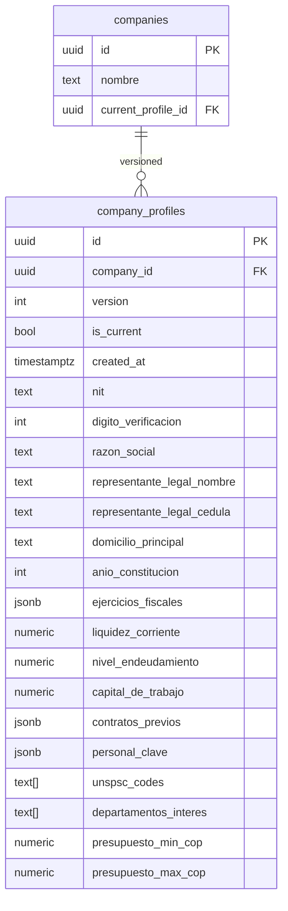
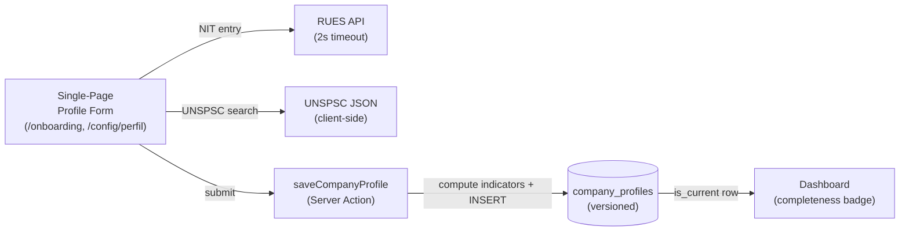

# Company Profiling Onboarding — Software Design Document

## Intention

Enables a Colombian empresa to build their RUP-derived capability profile via a single-page form, completable in under 15 minutes with RUP document in hand. The profile is the single source of truth for two downstream consumers: (a) the semáforo matching engine during pliego analysis and (b) the proceso discovery filter engine for UNSPSC/geographic/budget scoping. Every save creates an immutable versioned snapshot; analyses always reference the snapshot active at run time, ensuring verdicts remain reproducible after profile edits.

## Use Cases

Detailed scenarios in [use-cases.md](./use-cases.md).

| Use Case | Description | User Stories |
|----------|-------------|-------------|
| [UC-01 — Primer guardado](./use-cases.md#uc-01) | User completes and saves profile for the first time | US-01 |
| [UC-02 — RUES auto-fill](./use-cases.md#uc-02) | NIT entry triggers RUES pre-fill of legal fields | US-02 |
| [UC-03 — Edición posterior](./use-cases.md#uc-03) | User edits profile; new version created; existing analyses unaffected | US-03 |
| [UC-04 — Completeness warning](./use-cases.md#uc-04) | Dashboard shows completeness ratio; analysis never blocked | US-04 |

---

## Requirements

### Functional Requirements

| ID | Requirement | Business Rules |
|----|-------------|----------------|
| REQ-001 | Single-page form with 5 sections: Datos legales, Capacidad financiera, Experiencia, Personal clave, Alcance comercial | RN-001 |
| REQ-002 | NIT DV validated server-side before any row is written | RN-002 |
| REQ-003 | RUES lookup triggered on NIT entry; pre-fills legal fields on success; non-blocking on failure or timeout | RN-003 |
| REQ-004 | Capacidad financiera captures ingresos_operacionales + patrimonio + activo_corriente + pasivo_corriente + activo_total + pasivo_total for each of the last 3 fiscal years | RN-004 |
| REQ-005 | Derived financial indicators (liquidez_corriente, nivel_endeudamiento, capital_de_trabajo) computed server-side from most recent fiscal year; NULL if any required input absent | RN-005 |
| REQ-006 | Experiencia section: dynamic list; each entry has entidad_contratante, objeto, valor_cop, fecha_inicio, fecha_fin, unspsc_code (optional) | RN-006 |
| REQ-007 | Personal clave section: dynamic list; each entry has nombre, cedula, profesion, titulo, anios_experiencia, certificaciones | RN-007 |
| REQ-008 | Alcance comercial: unspsc_codes (multi-select from canonical catalog), departamentos_interes, presupuesto_min_cop/presupuesto_max_cop — all stored structurally and GIN-indexed for discovery filter queries | RN-008 |
| REQ-009 | Every form save inserts a new immutable company_profiles row; no in-place mutation of existing rows | RN-009 |
| REQ-010 | Existing analyses reference their profile_snapshot_id; unaffected by new profile versions | RN-010 |
| REQ-011 | Dashboard shows completeness badge "X de 5 secciones completas"; analysis is never blocked | RN-011 |
| REQ-012 | All labels, validation messages, and UI copy in Spanish | RN-012 |
| REQ-013 | All monetary fields stored as NUMERIC(20,2); no float types | RN-013 |
| REQ-014 | presupuesto_min_cop ≤ presupuesto_max_cop enforced client-side (Zod .refine()) and server-side (DB CHECK constraint) | RN-014 |
| REQ-015 | RLS on company_profiles restricts rows to owning company members | RN-015 |
| REQ-016 | Date ranges in contratos_previos and personal_clave validated server-side: fecha_fin ≥ fecha_inicio | RN-016 |

### Non-Functional Requirements

| ID | Category | Requirement |
|----|----------|-------------|
| NFR-01 | Performance | UNSPSC autocomplete <100ms (client-side JSON search) |
| NFR-02 | Performance | RUES lookup ≤2s; non-blocking via AbortController |
| NFR-03 | Performance | Form submit ≤3s p95 |
| NFR-04 | Security | RLS on company_profiles enforces per-company row isolation |
| NFR-05 | Correctness | NIT DV validated using Colombian modulo-11 algorithm |
| NFR-06 | Correctness | All monetary amounts NUMERIC(20,2) — no float |
| NFR-07 | Correctness | Financial indicators NULL-guarded (division by zero → NULL) |
| NFR-08 | Maintainability | UNSPSC catalog as static JSON — not DB table |
| NFR-09 | UX | Profile completable <15 minutes with RUP in hand (measured during pilot onboarding) |
| NFR-10 | Scope | Single user per company in MVP — no multi-user support |

---

## Business Rules

| Rule | Description |
|------|-------------|
| RN-001 | Form sections: (1) Datos legales, (2) Capacidad financiera, (3) Experiencia, (4) Personal clave, (5) Alcance comercial |
| RN-002 | NIT DV validated using Colombian modulo-11 checksum; invalid DV → server 422, no row written |
| RN-003 | RUES failure MUST NOT block form submission |
| RN-004 | ejercicios_fiscales JSONB: `[{ejercicio: int, ingresos_operacionales: numeric, patrimonio: numeric, activo_corriente: numeric, pasivo_corriente: numeric, activo_total: numeric, pasivo_total: numeric}]`; 1–3 entries ordered by ejercicio desc |
| RN-005 | Derived indicators from most recent year: `liquidez_corriente = activo_corriente / pasivo_corriente`; `nivel_endeudamiento = pasivo_total / activo_total`; `capital_de_trabajo = activo_corriente - pasivo_corriente`. NULL if divisor = 0 or input absent. Computed in server action before INSERT |
| RN-006 | contratos_previos JSONB: `[{entidad_contratante: text, objeto: text, valor_cop: numeric, fecha_inicio: date, fecha_fin: date, unspsc_code?: text}]` |
| RN-007 | personal_clave JSONB: `[{nombre: text, cedula: text, profesion: text, titulo: text, anios_experiencia: int, certificaciones: string[]}]` |
| RN-008 | unspsc_codes and departamentos_interes stored as text[]; GIN-indexed for discovery filter queries (`@>` operator) |
| RN-009 | saveProfile = INSERT with version = MAX(version) + 1 for company; previous is_current row set to false in same transaction |
| RN-010 | analyses.profile_snapshot_id references company_profiles.id at run time; never updated post-analysis |
| RN-011 | Completeness = count of non-null sections (each section = at least one non-null required field in that section) / 5; displayed as pill badge in dashboard header |
| RN-012 | All UI strings and validation error messages must be in Spanish |
| RN-013 | presupuesto_min_cop, presupuesto_max_cop declared NUMERIC(20,2) in DB; valor_cop in contratos_previos JSONB entries validated as number with max 2 decimal places |
| RN-014 | Zod .refine(): presupuesto_min_cop ≤ presupuesto_max_cop; DB CHECK constraint as guard |
| RN-015 | RLS policy: company_profiles row visible only when auth.uid() maps to a member of company_id |
| RN-016 | fecha_fin ≥ fecha_inicio for all date-range entries; server returns 422 on violation |

---

## Test Cases

### TC-001 — Primer guardado crea snapshot (REQ-009, RN-009)
**Given** authenticated user with no existing company_profiles row  
**When** form submitted with valid data  
**Then** one row in company_profiles with version = 1, is_current = true

### TC-002 — Segunda edición crea nueva versión (REQ-009, RN-009)
**Given** user with existing company_profiles version 1 (is_current = true)  
**When** form re-submitted  
**Then** new row with version = 2, is_current = true; previous row is_current = false

### TC-003 — NIT DV inválido rechazado (REQ-002, NFR-05, RN-002)
**Given** NIT with incorrect DV  
**When** form submitted  
**Then** server returns 422; zero rows inserted

### TC-004 — RUES timeout no bloquea (REQ-003, RN-003)
**Given** RUES API times out at 2s  
**When** NIT entered  
**Then** form remains editable; "No encontramos tu empresa en RUES. Completa manualmente." shown; no blocking

### TC-005 — Datos financieros 3 años guardados (REQ-004, RN-004)
**Given** user enters ingresos_operacionales + patrimonio + balance fields for 2022, 2023, 2024  
**When** form submitted  
**Then** ejercicios_fiscales JSONB has 3 entries with correct values

### TC-006 — Indicadores derivados computados (REQ-005, NFR-07, RN-005)
**Given** most recent year has activo_corriente = 800, pasivo_corriente = 400  
**When** row inserted  
**Then** liquidez_corriente = 2.0; nivel_endeudamiento and capital_de_trabajo also computed

### TC-007 — Indicador derivado NULL-guard (REQ-005, NFR-07)
**Given** most recent year has pasivo_corriente = 0  
**When** row inserted  
**Then** liquidez_corriente = NULL; no division error

### TC-008 — UNSPSC queryable con GIN (REQ-008, RN-008)
**Given** company_profiles row with unspsc_codes = ARRAY['72131500']  
**When** discovery query: `unspsc_codes @> '{72131500}'`  
**Then** index scan used; correct row returned

### TC-009 — Completeness warning no bloquea análisis (REQ-011, RN-011)
**Given** is_current profile where ejercicios_fiscales IS NULL  
**When** user initiates analysis  
**Then** analysis starts; completeness badge shows partial count; no gate modal

### TC-010 — Rango presupuesto inválido rechazado (REQ-014, RN-014)
**Given** presupuesto_min_cop = 5000000, presupuesto_max_cop = 1000000  
**When** form submitted  
**Then** Zod error: "El presupuesto mínimo no puede ser mayor al máximo"

### TC-011 — RLS aislamiento cross-company (REQ-015, RN-015)
**Given** company B user authenticated  
**When** queries company_profiles  
**Then** only company B rows visible; company A rows absent

### TC-012 — Análisis existente no afectado por nueva versión (REQ-010, RN-010)
**Given** analysis A1 created with profile snapshot V1  
**When** user saves new profile creating V2  
**Then** A1.profile_snapshot_id still references V1; A1 verdict unchanged

### TC-013 — Fecha rango inválido rechazado (REQ-016, RN-016)
**Given** contrato_previo with fecha_inicio = "2024-06-01", fecha_fin = "2024-01-01"  
**When** form submitted  
**Then** server returns 422: "La fecha de fin no puede ser anterior a la fecha de inicio"

---

## UX/UI

Single-page form at `/onboarding` (first save) and `/dashboard/config/perfil` (subsequent edits). Five sections rendered as vertical accordion or sequential sections. Design System components only — no custom UI. All labels in Spanish. Completeness badge in dashboard header (pill showing X/5 completas). Dynamic list sections (Experiencia, Personal clave) use add/remove row controls.

---

## Architecture

### Architecture Decision Records

| ADR | Title | Impact |
|-----|-------|--------|
| ADR-001 | Kysely | company_profiles types hand-authored from migration schema |
| ADR-002 | Zod | Full form schema validated at server action boundary |
| ADR-003 | Supabase RLS | company_profiles restricted to owning empresa members |

### Tradeoffs

| Tradeoff | We chose | Over | Rationale |
|----------|----------|------|-----------|
| Single-page form vs multi-step wizard | Single form | Wizard with persistent step state | No page-reload state complexity; user sees full scope; holistic validation; pilots can skip sections and return |
| Immutable versioned rows vs in-place upsert | Immutable rows | In-place update | Analyses must remain reproducible; profile edit must not silently change historical verdicts |
| Financial: per-year JSONB vs flat columns | JSONB per year | Flat columns | N years is variable; flat schema would require ALTER TABLE per year; JSONB flexible and queryable |
| Completeness badge vs blocking gate | Warning badge | Blocking analysis | MVP anti-goal to block analysis on incomplete profile; badge provides soft pressure |
| text[] for alcance comercial | text[] with GIN | JSONB | Structural filter queries (`@>`) more natural and performant on text[] with GIN |
| Derived indicators at save time | Computed before INSERT | Generated stored columns | Generated columns cannot read inside JSONB; compute in server action, store as flat numerics |

### Performance Goals & Metrics

| Metric | Target | Measurement |
|--------|--------|-------------|
| UNSPSC autocomplete | <100ms | Browser DevTools |
| RUES lookup or timeout | ≤2s | AbortController |
| Form submit (full profile) | ≤3s p95 | Server action timing log |
| Profile load (edit mode) | ≤500ms | LCP |

### Data Model

### API / Data Contracts

| Endpoint / Action | Description |
|-------------------|-------------|
| `POST /api/empresa/rues-lookup` | `{ nit }` → RUES data or `{ found: false }` in ≤2s |
| `saveCompanyProfile` | Server action; Zod-validated full form schema; computes derived indicators; INSERTs new version |
| `getCompanyProfile` | Server action; returns is_current row for authenticated company |

### Service Integrations

| System | Direction | Data |
|--------|-----------|------|
| RUES API | Reading | razon_social, representante_legal_nombre from NIT |
| Supabase DB | Writing | company_profiles INSERT (versioned snapshot) |
| UNSPSC JSON (static) | Reading | Code + description lookup (client-side) |

---

## Revision log

| Date | Change | Reason |
|------|--------|--------|
| 2026-05-01 | Rev 1: documento uploads for Jurídica; simplified financial inputs; objeto+CV model; Jurídica removed from score | Align with product description |
| 2026-05-04 | Rev 2: Single-page form (no wizard); 3-year financial JSONB + balance fields; profile versioning (immutable snapshots); Datos legales section; removed document uploads; completeness warning (not blocking gate); single user per company | MVP scope alignment: 15-min completion target, versioned verdicts, discovery filter derivation |
