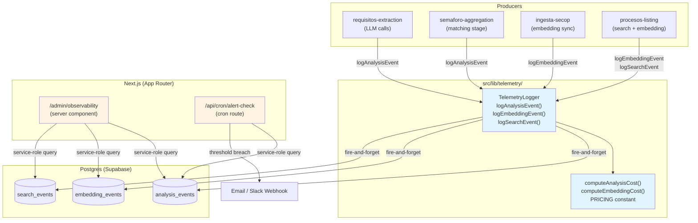
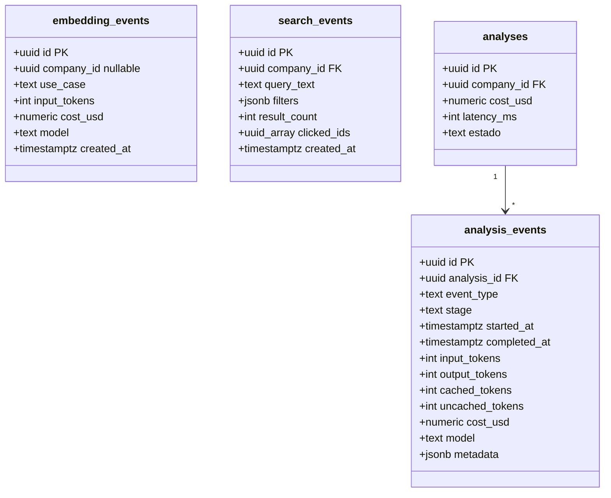
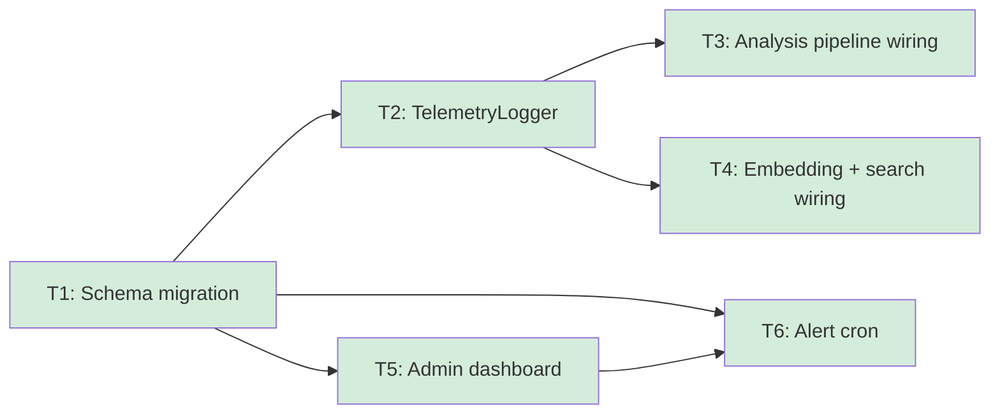

# cost-observability — Feature Overview

## Spec Reference

[Spec](../spec/spec.md)

## Problem + Solution

- No structured telemetry exists; the $0.04/analysis cost ceiling and the four discovery success metrics are unverifiable during the pilot period.
- Solution: append-only Postgres telemetry tables (`analysis_events`, `embedding_events`, `search_events`) + a `TelemetryLogger` module wired into every pipeline and service + an internal admin dashboard at `/admin/observability` + a daily alert cron.
- Key technical approach: fire-and-forget Supabase inserts from a shared `TelemetryLogger`; service-role-gated Next.js admin route for dashboard reads; Supabase/Vercel cron for alerts.
- Output: three new telemetry tables (via `domain-model-mvp` rev 2 migration), one TypeScript module, one admin dashboard page, one alert cron route, and wiring in four existing services.

## Architecture Diagram

## Data Model

Three new append-only tables added via `domain-model-mvp` rev 2 migration. No new entities on
the user-facing domain model — these tables are internal telemetry only.

## Task Index

| Task | File | Description | Dependencies |
|------|------|-------------|--------------|
| T1 | [01-plan-01-schema-migration.md](./01-plan-01-schema-migration.md) | domain-model-mvp rev 2: add telemetry tables + RLS | None (schema foundation) |
| T2 | [01-plan-02-telemetry-logger.md](./01-plan-02-telemetry-logger.md) | `TelemetryLogger` module with pricing + fire-and-forget helpers | T1 |
| T3 | [01-plan-03-analysis-pipeline-wiring.md](./01-plan-03-analysis-pipeline-wiring.md) | Wire `logAnalysisEvent` into requisitos-extraction and semaforo-aggregation | T2 |
| T4 | [01-plan-04-embedding-search-wiring.md](./01-plan-04-embedding-search-wiring.md) | Wire `logEmbeddingEvent` + `logSearchEvent` into ingesta-secop and procesos-listing | T2 |
| T5 | [01-plan-05-admin-dashboard.md](./01-plan-05-admin-dashboard.md) | `/admin/observability` Next.js admin route with four metric sections | T1 |
| T6 | [01-plan-06-alert-cron.md](./01-plan-06-alert-cron.md) | Daily alert cron route checking cost and latency thresholds | T1, T5 |

## Dependency Graph

