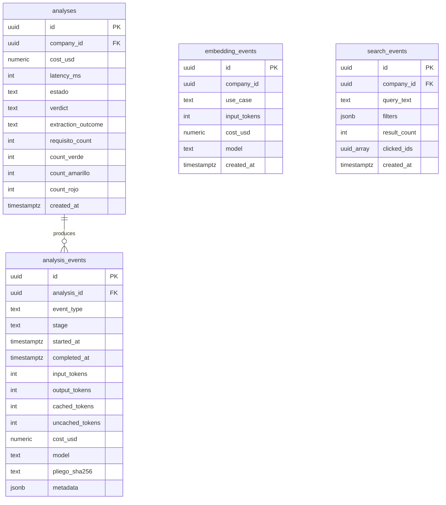
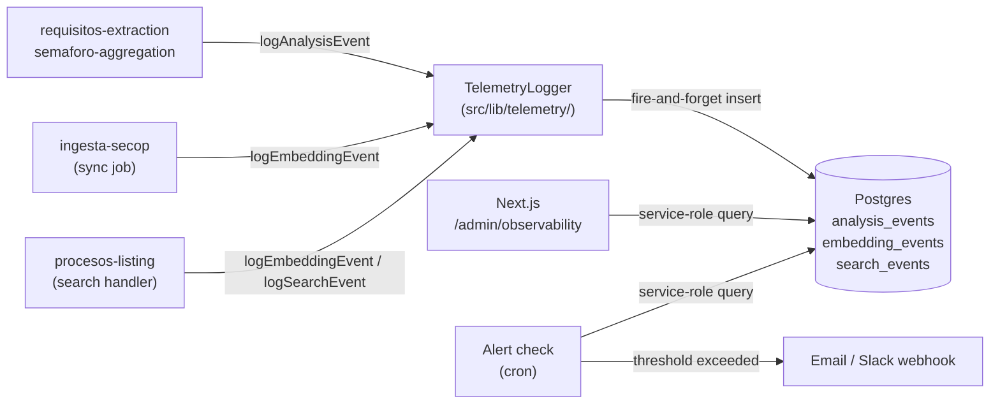

# cost-observability — Software Design Document

## Intention

Instruments every analysis run, embedding call, and search query with structured telemetry written
to Postgres, then exposes that data on an internal admin dashboard. The primary goal is to make
the $0.04-per-analysis cost ceiling and the four discovery success metrics (conversion, relevance,
discovery-vs-manual ratio, catalog uniqueness) verifiable with real numbers instead of gut feel
during the 60-day pilot period. The dashboard is internal-only — pilots never see it.

---

## Use Cases

Detailed scenarios in [use-cases.md](./use-cases.md).

| Use Case | Description | User Stories |
|----------|-------------|-------------|
| [UC-01 — Log per-analysis telemetry](./use-cases.md#uc-01--log-per-analysis-telemetry-us-01-us-02) | Pipeline writes token counts, cost, latency, and outcome on every analysis run | US-01, US-02 |
| [UC-02 — Log embedding call telemetry](./use-cases.md#uc-02--log-embedding-call-telemetry-us-03) | Sync job and search query log token count and cost per embedding call | US-03 |
| [UC-03 — Log search query telemetry](./use-cases.md#uc-03--log-search-query-telemetry-us-04) | Every discovery search logs the query, filters, result count, and clicked result IDs | US-04 |
| [UC-04 — View cost dashboard](./use-cases.md#uc-04--view-cost-dashboard-us-05) | Internal admin views per-analysis cost distribution and rolling averages | US-05 |
| [UC-05 — View latency and quality dashboard](./use-cases.md#uc-05--view-latency-and-quality-dashboard-us-06) | Internal admin views p50/p95 latency and extraction-quality drift | US-06 |
| [UC-06 — View discovery metrics dashboard](./use-cases.md#uc-06--view-discovery-metrics-dashboard-us-07) | Internal admin views the four discovery success metrics | US-07 |
| [UC-07 — Receive same-day alert](./use-cases.md#uc-07--receive-same-day-alert-us-08) | System fires an email/Slack alert when an analysis exceeds $0.04 or p95 latency > 8 min | US-08 |

---

## Requirements

### Functional Requirements

| ID | Requirement | User Stories | Business Rules |
|----|-------------|-------------|----------------|
| REQ-001 | Create `analysis_events` append-only table in a `domain-model-mvp` rev 2 migration: `id`, `analysis_id`, `event_type`, `stage`, `started_at`, `completed_at`, `input_tokens`, `output_tokens`, `cached_tokens`, `uncached_tokens`, `cost_usd`, `model`, `pliego_sha256 text`, `metadata jsonb`. `pliego_sha256` is denormalized from `pliego_uploads.file_sha256` for single-table diagnostic queries — `analyses` and `pliego_uploads` remain authoritative (see RN-010). No UPDATE path | US-01 | RN-001, RN-002, RN-010 |
| REQ-002 | Create `embedding_events` append-only table: `id`, `company_id` (nullable for system sync), `use_case` (`sync` or `search_query`), `input_tokens`, `cost_usd`, `model`, `created_at` | US-03 | RN-001, RN-003 |
| REQ-003 | Create `search_events` append-only table: `id`, `company_id`, `query_text`, `filters jsonb`, `result_count`, `clicked_ids uuid[]`, `created_at` | US-04 | RN-001, RN-004 |
| REQ-004 | Implement a `TelemetryLogger` TypeScript module (`src/lib/telemetry/`) exposing non-blocking fire-and-forget helpers: `logAnalysisEvent(...)`, `logEmbeddingEvent(...)`, `logSearchEvent(...)`. Failures are caught internally and logged to stderr — never thrown to the caller | US-01, US-02, US-03, US-04 | RN-005 |
| REQ-005 | Compute `cost_usd` from actual model pricing using a hard-coded pricing table (`PRICING` constant) with a `// Last updated: YYYY-MM-DD` comment. Pricing must cover Claude Sonnet (input, output, cached), OpenAI `text-embedding-3-small` (per 1k tokens) | US-01, US-03 | RN-006 |
| REQ-006 | Wire `logAnalysisEvent` into the requisitos-extraction pipeline: one event per LLM call (extraction, repair retry). Wire into the semáforo-aggregation service to record the matching stage latency | US-01, US-02 | RN-005 |
| REQ-007 | Wire `logEmbeddingEvent` into the ingesta-secop sync job (use_case: `sync`) and into the procesos-listing semantic search path (use_case: `search_query`) | US-03 | RN-005 |
| REQ-008 | Wire `logSearchEvent` into the procesos-listing search handler: log query, filters (modalidad, cuantia_min/max, entidad), result_count, and clicked_ids on result-click | US-04 | RN-005 |
| REQ-009 | Expose an internal admin dashboard at `/admin/observability` (Next.js App Router) gated by `role = 'admin'` check on the Supabase `users` table. Dashboard renders four sections: Cost, Latency, Extraction Quality, Discovery Metrics | US-05, US-06, US-07 | RN-007 |
| REQ-010 | Cost section: per-analysis cost histogram (last 30 days), 7-day rolling average, worst-10-analyses table showing `analysis_id`, `company_id`, `cost_usd`, `created_at` | US-05 | RN-007 |
| REQ-011 | Latency section: p50 and p95 end-to-end latency; p50/p95 per stage (`ingestion`, `extraction`, `matching`). Computed over the last 30 days from `analysis_events` | US-06 | RN-007 |
| REQ-012 | Extraction Quality section: reads `analyses.extraction_outcome` (typed column — `'success'`, `'partial'`, or `'failure'`) and `analyses.requisito_count` (int). Displays (a) % full-success, % partial, % failure over a rolling 7-day and 30-day window with a trend sparkline for drift detection — NULL rows excluded from percentages; (b) verdict counts widget showing distribution of `analyses.count_verde`, `analyses.count_amarillo`, `analyses.count_rojo` with a 7-day trend. Both sub-widgets source from `analyses` typed columns (see REQ-016) | US-06 | RN-007, RN-011 |
| REQ-013 | Discovery Metrics section: (a) conversion rate = analyses started / searches with clicks; (b) avg result_count per search; (c) click-through rate = searches with ≥1 entry in `clicked_ids` / total searches (sourced from `search_events.clicked_ids` — behavioral relevance proxy; explicit user relevance ratings are deferred to post-pilot); (d) discovery-vs-manual ratio = analyses from procesos in `procesos_index` / total analyses; (e) catalog uniqueness = distinct `proceso_id` values in `procesos_index` | US-07 | RN-007 |
| REQ-014 | Implement a scheduled alert check (Supabase cron or Next.js cron route) that fires daily: if any analysis in the last 24 h has `cost_usd > 0.04`, or if rolling p95 latency > 8 min, send an alert email or Slack webhook to the Coltratos team | US-08 | RN-008 |
| REQ-015 | Apply RLS to all three new telemetry tables: `analysis_events` scoped via join to `analyses.company_id`; `embedding_events` scoped by `company_id` (or open for system rows where `company_id IS NULL` — admin-only read); `search_events` scoped by `company_id`. Admin route uses service-role client; no pilot-facing exposure | US-05, US-06, US-07 | RN-007, RN-009 |
| REQ-016 | Add typed columns to `analyses` in `domain-model-mvp` rev 2 migration: `extraction_outcome text CHECK (extraction_outcome IN ('success','partial','failure'))`, `requisito_count int`, `count_verde int`, `count_amarillo int`, `count_rojo int`. All nullable — rows created before this feature ships will have NULL values. Pipeline writes all five columns at the end of each analysis run. These are the sole authoritative source for REQ-012 dashboard queries | US-01, US-06 | RN-001, RN-011 |

### Non-Functional Requirements

| ID | Category | Requirement |
|----|----------|-------------|
| NFR-01 | Reliability | Telemetry logging MUST be non-blocking — a write failure must not surface to the user or fail a pipeline stage |
| NFR-02 | Privacy | MUST NOT log PII in any telemetry column. `query_text` may contain company-supplied text; scrub or truncate at 500 chars |
| NFR-03 | Cost accuracy | `cost_usd` computed from pricing table must be within 1% of Anthropic/OpenAI invoiced cost per analysis |
| NFR-04 | Freshness | Dashboard data must reflect events written within the last hour (no batch ETL delay). Guard: re-evaluate this NFR if total row count across `analysis_events`, `embedding_events`, and `search_events` exceeds 1M rows combined — at that point direct-query latency may require materialized views or a summary table |
| NFR-05 | Security | `/admin/observability` returns HTTP 403 for any user without `role = 'admin'`. No telemetry data is served to pilot users |
| NFR-06 | Observability scope | Cost log MUST include repair retries and OCR fallback calls — not just the happy-path Sonnet call (per integrations.md) |

---

## Business Rules

| Rule | Description |
|------|-------------|
| RN-001 | All three telemetry tables are append-only. No UPDATE or DELETE path; rows are retained indefinitely to support historical trend analysis |
| RN-002 | `analysis_events` rows are linked to `analyses` via FK. One `analyses` row may have multiple `analysis_events` (one per LLM call: extraction, repair, OCR fallback) |
| RN-003 | `embedding_events.company_id` is nullable — bulk sync calls have no company context. Admin dashboard must handle NULLs without error |
| RN-004 | `search_events.clicked_ids` captures which `proceso_id` values the user clicked from the result list. An empty array means the user searched but did not click. Used to compute conversion rate |
| RN-005 | Logging is fire-and-forget. Every `logXxxEvent` helper wraps its Supabase insert in a `try/catch`; on failure it writes to `console.error` with a structured log line and returns normally. The caller pipeline never awaits a thrown error |
| RN-006 | Pricing table is hard-coded with a `// Last updated: YYYY-MM-DD` comment. `uncached_tokens = input_tokens - cached_tokens`. Cost formula for Sonnet: `(uncached_tokens * INPUT_PRICE + cached_tokens * CACHE_READ_PRICE + output_tokens * OUTPUT_PRICE) / 1_000_000`. Cost formula for `text-embedding-3-small`: `(input_tokens * EMBEDDING_PRICE) / 1_000`. The pricing constant owner must update the date comment on each model price change |
| RN-007 | The admin dashboard route uses the Supabase service-role key (via a server-side route handler) so it can read across all company rows. The service-role key MUST NOT be exposed to the browser |
| RN-008 | Alert thresholds are fixed: per-analysis cost > $0.04; rolling p95 latency > 480 seconds. Alerts fire to the Coltratos team only — never to pilot users. The alert recipient list is an environment variable, not hard-coded |
| RN-009 | No telemetry table or dashboard query MUST expose company identity or query content to any user other than the Coltratos admin. Pilot user JWTs MUST NOT be able to query `analysis_events`, `embedding_events`, or `search_events` directly |
| RN-010 | `analysis_events.pliego_sha256` is a denormalized copy of `pliego_uploads.file_sha256` for the pliego that triggered the analysis. It enables single-table duplicate-hash diagnostics without joining `analyses → pliego_uploads`. `analyses` and `pliego_uploads` remain authoritative; this column must never be updated after insert |
| RN-011 | `analyses.extraction_outcome`, `analyses.requisito_count`, `analyses.count_verde`, `analyses.count_amarillo`, `analyses.count_rojo` are written by the pipeline at the end of each analysis run. All nullable — pre-observability rows have NULL values. Dashboard queries MUST exclude NULL rows from percentage and average calculations rather than treating NULL as failure |

---

## Test Cases

### TC-001 — logAnalysisEvent does not throw on Supabase failure (REQ-004, RN-005)

**Given** the Supabase client is configured to reject all writes
**When** `logAnalysisEvent(validPayload)` is called
**Then** the function returns without throwing and logs to stderr

### TC-002 — cost_usd computed correctly for a Claude Sonnet call (REQ-005, RN-006)

**Given** a payload with `input_tokens=1000`, `cached_tokens=500`, `output_tokens=200`
**When** `computeAnalysisCost({ inputTokens: 1000, cachedTokens: 500, outputTokens: 200 })` is called
**Then** the returned value equals `(500 * INPUT_PRICE + 500 * CACHE_READ_PRICE + 200 * OUTPUT_PRICE) / 1_000_000`

### TC-003 — cost_usd computed correctly for an embedding call (REQ-005, RN-006)

**Given** a payload with `input_tokens=300` for `text-embedding-3-small`
**When** `computeEmbeddingCost({ inputTokens: 300 })` is called
**Then** the returned value equals `(300 * EMBEDDING_PRICE) / 1_000`

### TC-004 — analysis_events INSERT succeeds with valid payload (REQ-001)

**Given** an `analyses` row exists
**When** a valid `analysis_events` row is inserted with all required fields
**Then** the row is persisted and readable via service-role client

### TC-005 — analysis_events RLS blocks pilot user from reading events (REQ-015, RN-009)

**Given** an authenticated user with `role = 'member'`
**When** the user queries `SELECT * FROM analysis_events`
**Then** zero rows are returned (RLS filters all rows)

### TC-006 — embedding_events nullable company_id accepted (REQ-002, RN-003)

**Given** an `embedding_events` insert with `company_id = NULL` and `use_case = 'sync'`
**When** the insert is executed via service-role client
**Then** the row is persisted without error

### TC-007 — search_events clicked_ids empty array accepted (REQ-003, RN-004)

**Given** a search query that produced results but no clicks
**When** `logSearchEvent({ ..., clicked_ids: [] })` is called
**Then** the row is persisted with `clicked_ids = '{}'`

### TC-008 — admin dashboard returns 403 for non-admin user (REQ-009, NFR-05)

**Given** an authenticated user with `role = 'member'`
**When** the user requests `GET /admin/observability`
**Then** the response status is 403 and no telemetry data is returned

### TC-009 — alert fires when analysis cost exceeds threshold (REQ-014, RN-008)

**Given** an `analyses` row with `cost_usd = 0.05` created in the last 24 h
**When** the daily alert check runs
**Then** an alert notification is sent to the configured recipient

### TC-010 — alert fires when p95 latency exceeds 8 min (REQ-014, RN-008)

**Given** a batch of `analysis_events` producing a p95 latency of 500 seconds
**When** the daily alert check runs
**Then** an alert notification is sent to the configured recipient

### TC-011 — conversion rate computed correctly (REQ-013, RN-004)

**Given** 10 `search_events` rows, 4 of which have non-empty `clicked_ids`; 3 of those 4 have a linked `analyses` row started within 24 h
**When** the dashboard queries the conversion rate metric
**Then** conversion rate = 3/10 = 30%

### TC-012 — repair retry cost included in per-analysis total (REQ-006, NFR-06)

**Given** an analysis with one extraction event and one repair-retry event in `analysis_events`
**When** the cost section aggregates `SUM(cost_usd) GROUP BY analysis_id`
**Then** the total includes both events' cost

### TC-013 — verdict counts written and sum to requisito_count (REQ-016, RN-011)

**Given** an analysis run that extracts 10 requisitos (6 verde, 3 amarillo, 1 rojo)
**When** the pipeline completes and writes to `analyses`
**Then** `count_verde = 6`, `count_amarillo = 3`, `count_rojo = 1`, and `requisito_count = 10`
**And** `count_verde + count_amarillo + count_rojo = requisito_count`

### TC-014 — extraction_outcome typed column set correctly (REQ-016, RN-011)

**Given** an analysis run where all requisitos are successfully extracted
**When** the pipeline writes the outcome to `analyses`
**Then** `analyses.extraction_outcome = 'success'`
**And** a second run with one failed category sets `extraction_outcome = 'partial'`

### TC-015 — pliego_sha256 denormalized correctly onto analysis_events (REQ-001, RN-010)

**Given** a `pliego_uploads` row with `file_sha256 = 'abc123...'` and an associated `analyses` row
**When** the pipeline inserts an `analysis_events` row for that analysis
**Then** `analysis_events.pliego_sha256 = 'abc123...'`

### TC-016 — click-through rate computed correctly (REQ-013)

**Given** 10 `search_events` rows; 4 have non-empty `clicked_ids`; 6 have `clicked_ids = '{}'`
**When** the dashboard queries click-through rate
**Then** click-through rate = 4/10 = 40%

### TC-017 — Extraction Quality dashboard excludes NULL rows from percentages (RN-011)

**Given** 5 `analyses` rows: 3 with `extraction_outcome` set, 2 with `extraction_outcome IS NULL`
**When** the dashboard computes % success/partial/failure
**Then** denominator = 3, not 5 — NULL rows are excluded

---

## UX/UI

Internal-only. Function over form. The `/admin/observability` page is a simple server-rendered
Next.js page with four sections: Cost, Latency, Extraction Quality, Discovery Metrics. No Figma
design required — use the existing `design-system` tokens for layout and typography. Pilots never
navigate to or see this route.

---

## Architecture

### Architecture Decision Records

| ADR | Title | Impact on this feature |
|-----|-------|----------------------|
| ADR-003 | Supabase RLS for Tenant Isolation | Telemetry tables get RLS; admin dashboard bypasses via service-role server-side client |
| ADR-013 | Next.js 16 App Router | Admin dashboard implemented as an App Router route under `app/admin/` |
| ADR-001 | Kysely as query builder | Dashboard aggregate queries use Kysely; `TelemetryLogger` uses Supabase client directly for simplicity |

### Tradeoffs

| Tradeoff | We chose | Over | Rationale |
|----------|----------|------|-----------|
| Telemetry storage | Postgres append-only tables | External APM (Datadog, New Relic) | No commercial APM in MVP; Postgres is already the stack; simple queries sufficient |
| Dashboard implementation | Next.js `/admin` App Router route | Separate static page or Metabase | Already in stack; gated by existing `role` check; no extra infra |
| Alert delivery | Email/Slack webhook via env var | PagerDuty, OpsGenie | No on-call tooling at MVP scale; same-day email is sufficient |
| Pricing table | Hard-coded constant with date comment | Fetched from config or API | Simpler; explicit audit trail of when pricing was last verified |
| Schema location | `domain-model-mvp` rev 2 migration | Inline in this spec | Keeps domain authority clean; avoids two specs defining competing schema for the same table |
| Logging strategy | Fire-and-forget (no await on failure) | Synchronous write with retry | Analysis pipeline latency must not be degraded by telemetry failures |
| Dashboard query window | 30-day rolling | None specified | 60-day pilot window suggests 30-day rolling captures recent-half trends without anchoring to stale pre-pilot data; revisit after pilot |

### Performance Goals & Metrics

| Metric | Target | Measurement |
|--------|--------|-------------|
| Dashboard page load | < 3s at MVP scale | Manual timing in development |
| Telemetry write overhead | < 5ms added to pipeline stage | Measure in integration test |
| Alert check latency | Fires within 1 h of threshold breach | Cron schedule interval |

### Data Model

The three new telemetry tables are defined in `domain-model-mvp` rev 2 (forward reference — this
spec does not contain the DDL; see the rev 2 delta from `domain-model-mvp`).

| Entity | Key Fields | Notes |
|--------|-----------|-------|
| `analysis_events` | `analysis_id`, `event_type`, `stage`, token counts, `cost_usd`, `pliego_sha256` | One row per LLM call (extraction, repair, OCR); append-only. `pliego_sha256` denormalized from `pliego_uploads` for diagnostic queries (RN-010) |
| `embedding_events` | `company_id` (nullable), `use_case`, `input_tokens`, `cost_usd` | Covers both sync and search-query embedding calls |
| `search_events` | `company_id`, `query_text`, `filters`, `result_count`, `clicked_ids` | Source of truth for the four discovery metrics |

### API / Data Contracts

| Endpoint | Method | Description |
|----------|--------|-------------|
| `/admin/observability` | GET (page) | Server-rendered admin dashboard; 403 for non-admin |
| `/api/admin/observability/data` | GET (JSON) | Optional: server action or route handler returning aggregated metrics |
| `/api/cron/alert-check` | POST (cron) | Daily alert check triggered by Supabase cron or Vercel cron |

Full contracts in [../contract/contracts.md](../contract/contracts.md).

### Service Integrations

| System | Direction | Data |
|--------|-----------|------|
| `requisitos-extraction` | Producer | LLM token counts, latency, extraction outcome |
| `semaforo-aggregation` | Producer | Matching stage latency |
| `ingesta-secop` | Producer | Embedding token counts per sync batch |
| `procesos-listing` | Producer | Embedding token counts per query, search event (query, filters, clicks) |
| Supabase Postgres | Consumer (write) | `analysis_events`, `embedding_events`, `search_events` inserts |
| `/admin/observability` | Consumer (read) | Aggregated metrics via service-role client |
| Alert cron | Consumer (read) | Threshold query over last 24 h |

---

## Dependencies

| Dependency | Relationship | Notes |
|------------|-------------|-------|
| `domain-model-mvp` rev 2 | Upstream schema | Adds `analysis_events`, `embedding_events`, `search_events` tables with RLS; adds typed columns to `analyses` (`extraction_outcome`, `requisito_count`, `count_verde`, `count_amarillo`, `count_rojo` per REQ-016); adds `pliego_sha256 text` to `analysis_events` (per REQ-001/RN-010). This spec carries a forward reference — all DDL lives in the `domain-model-mvp` rev 2 delta, not here |
| `requisitos-extraction` | Downstream wiring target | `logAnalysisEvent` called after each LLM call |
| `semaforo-aggregation` | Downstream wiring target | Stage latency emitted via `logAnalysisEvent` |
| `ingesta-secop` | Downstream wiring target | `logEmbeddingEvent` called per sync batch |
| `procesos-listing` | Downstream wiring target | `logEmbeddingEvent` + `logSearchEvent` called per user search |

---

## Revision Log

| Date | Change | Reason |
|------|--------|--------|
| 2026-05-05 | Initial spec created | Pilot observability — make cost ceiling and discovery metrics verifiable |
| 2026-05-05 | Rev 2 — coverage fixes | Fix 1: verdict counts (count_verde/amarillo/rojo) on analyses + REQ-012 widget (TC-013); Fix 2: extraction_outcome + requisito_count typed columns on analyses via REQ-016, RN-011 (TC-014, TC-017); Fix 3: pliego_sha256 denormalized onto analysis_events, RN-010 (TC-015); REQ-013 adds click-through rate (TC-016), notes relevance ratings deferred; NFR-04 adds 1M-row re-evaluation guard; 30-day window rationale added to Tradeoffs |
