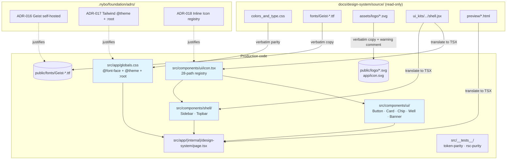
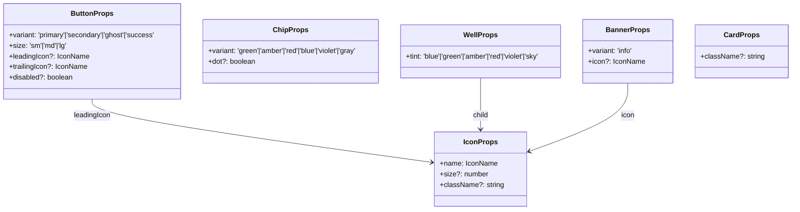
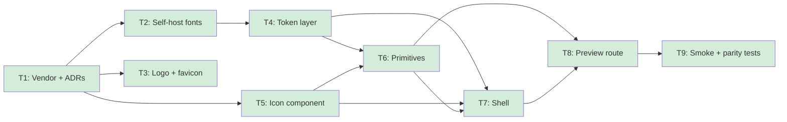

# design-system - Overview

## Spec Reference

[spec.md](../spec/spec.md) · [use-cases.md](../spec/use-cases.md)

## Problem + Solution

- **Problem.** The codebase has approved backend specs (domain-model, pdf-ingestion, requisitos-extraction, semaforo-aggregation, project-bootstrap) but no FE foundation. Building 9 product screens (Dashboard → Configuración) without a shared visual language guarantees drift, redundant components, and tokens defined in multiple places.
- **Solution.** Translate the user's Claude Design bundle (vendored under [docs/design-system/source/](../source/)) into a thin foundation: tokens in `src/app/globals.css`, self-hosted Geist + JetBrains Mono, COLTRATOS logo SVGs, a typed `<Icon>` registry, 5 primitives (Button, Card, Chip, Well, Banner), and the navy app shell (Sidebar, Topbar). Every downstream FE spec composes this layer.
- **Approach.** Tailwind v4 `@theme` + CSS custom properties dual layer (ADR-017). Inline SVG icon registry, no external icon dep (ADR-018). Self-hosted Geist all 9 weights (ADR-016). Server Components by default; Sidebar is the only Client Component in v1.
- **Output.** 4 ADR / spec edits, 50 vendored bundle files, 10 font files in `public/`, 3 SVG files in `public/`+`app/`, 1 globals.css rewrite, 6 component files + 2 barrels in `src/components/`, 1 preview page at `/design-system`, 4 test files. After ship: any future FE spec lands without inventing tokens or primitives.

## Architecture Diagram

## Data Model

This spec adds **no domain entities and no database tables**. The "data" is asset / config / component code.

**Key TypeScript contracts (immutable once shipped):**

## Task Index

| Task | File | Description | Dependencies |
|------|------|-------------|--------------|
| T1 | [01-plan-01-vendor-and-adrs.md](./01-plan-01-vendor-and-adrs.md) | Vendor source bundle (already done) + verify file count + write 3 ADRs (016 / 017 / 018) | None |
| T2 | [01-plan-02-self-host-fonts.md](./01-plan-02-self-host-fonts.md) | Copy 10 Geist `.ttf` files to `public/fonts/`; preload Variable in `app/layout.tsx`; load JetBrains Mono via `next/font/google` | T1 |
| T3 | [01-plan-03-logo-and-favicon.md](./01-plan-03-logo-and-favicon.md) | Copy 2 logo SVGs to `public/logo/`; create `app/icon.svg` favicon; add warning comment per REQ-013 | T1 |
| T4 | [01-plan-04-token-layer.md](./01-plan-04-token-layer.md) | Rewrite `src/app/globals.css` with `@import "tailwindcss"`, 10 `@font-face` blocks, Tailwind v4 `@theme` block, `:root` mirror block | T2 |
| T5 | [01-plan-05-icon-component.md](./01-plan-05-icon-component.md) | Author `src/components/ui/icon.tsx` with 28-path registry + typed `IconName` union; type-test at `__tests__/icon.test-d.ts` | T1 |
| T6 | [01-plan-06-primitives.md](./01-plan-06-primitives.md) | Author Button, Card+CardHead+CardBody, Chip, Well, Banner under `src/components/ui/`; barrel at `index.ts` | T4, T5 |
| T7 | [01-plan-07-shell.md](./01-plan-07-shell.md) | Author `Sidebar` (Client) and `Topbar` (Server) under `src/components/shell/`; barrel at `index.ts` | T4, T5, T6 |
| T8 | [01-plan-08-preview-route.md](./01-plan-08-preview-route.md) | Author `src/app/(internal)/design-system/page.tsx` rendering 10 specimen cards translated from `preview/*.html` | T6, T7 |
| T9 | [01-plan-09-smoke-and-parity-tests.md](./01-plan-09-smoke-and-parity-tests.md) | Token-parity test, RSC-purity grep test, preview-page smoke test | T8 |

## Dependency Graph

**External dependency:** [project-bootstrap](../../project-bootstrap/spec/spec.md) MUST ship before any task here runs. It provides the `package.json`, `tsconfig.json`, Tailwind v4 wiring, `app/`, and `src/` that every task assumes.
