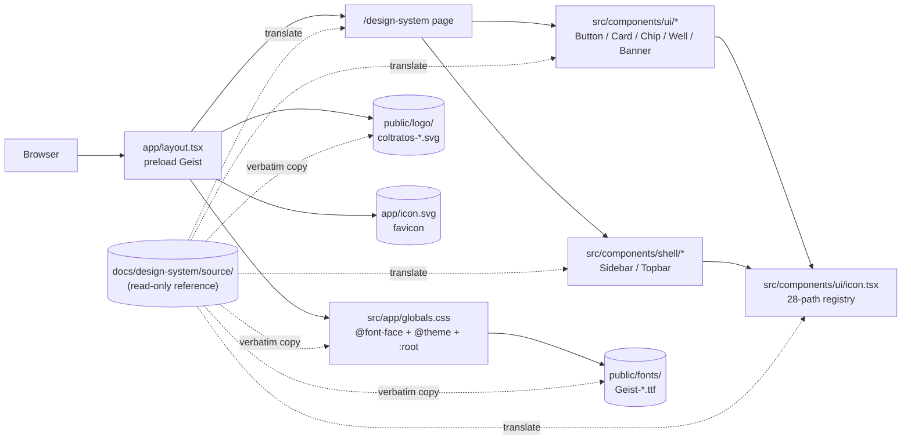

# design-system — Software Design Document

## Intention

`design-system` translates the approved Claude Design bundle (vendored at [docs/design-system/source/](../source/)) into production assets in this Next.js 16 + Tailwind v4 codebase: design tokens, self-hosted Geist + JetBrains Mono fonts, COLTRATOS logo SVGs, an inline `<Icon>` registry, and a tight set of shell + primitive React components that every downstream FE feature composes. The bundle was authored interactively by the user in Claude Design (claude.ai/design) and exported as a complete handoff package; it answers every discovery question that would otherwise have required design iteration here — typeface, palette, copy voice, iconography, motion, the explicit visual don'ts.

This spec deliberately ships the **foundation only**. Product screens (Dashboard, Subir pliego, Análisis en progreso, Resultado del análisis, Mis análisis, Alertas, Créditos y facturación, Mi equipo, Configuración empresa) are out of scope — each becomes its own FE feature spec that *consumes* this design system. Components whose first concrete need is on a single screen (Dropzone, Stepper, Semáforo hero, KPI/Table/Tabs/Modal/RingProgress) ship with that screen's spec, not here. The cost is one extra design-system feature spec; the benefit is a token + primitive layer that locks our visual language **once**, decouples it from any single screen's iteration loop, and survives the inevitable churn of marketing and product UI.

### v1 Scope

**In scope:**
- **Vendor source bundle** at [docs/design-system/source/](../source/) (≈ 12 MB, read-only): README, chat transcript, project README + SKILL, `colors_and_type.css`, 10 Geist `.ttf` files, 2 logo SVGs, 8 reference screen PNGs, 10 preview HTML cards, 6 UI-kit JSX/HTML/CSS files, 10 raw upload PNGs.
- **Self-hosted fonts** at `public/fonts/`: 9 static Geist weights (Thin → Black) + 1 Geist Variable; JetBrains Mono is wired via Next.js's `next/font/google` (deferred from self-host until a downstream spec needs offline mono).
- **Logo + favicon**: `public/logo/coltratos-mark.svg`, `public/logo/coltratos-lockup.svg`, plus `app/icon.svg` as the Next.js convention-based favicon (replacing the default `next.svg`).
- **Token layer** in [`src/app/globals.css`](../../../src/app/globals.css): `@import "tailwindcss"`; 10 `@font-face` blocks for Geist; a Tailwind v4 `@theme` block exposing colors, fonts, radii, spacing, shadows, motion as utility-generating tokens; a `:root` block mirroring every token from [docs/design-system/source/project/colors_and_type.css](../source/project/colors_and_type.css) lines 30–199 as CSS custom properties (1:1, same names).
- **Inline `<Icon>` component** at `src/components/ui/icon.tsx` — typed `name` union over the 28-path registry from [docs/design-system/source/project/ui_kits/coltratos-app/shell.jsx](../source/project/ui_kits/coltratos-app/shell.jsx) lines 7–37.
- **Primitives** at `src/components/ui/`: `Button`, `Card` + `CardHead` + `CardBody`, `Chip`, `Well`, `Banner` — typed variant unions, RSC-friendly (Server Components by default), focus-visible rings.
- **Shell** at `src/components/shell/`: `Sidebar.tsx` (Client — active-route highlight + collapsed credits widget), `Topbar.tsx` (Server — search + notifications + primary CTA).
- **Preview route** at `src/app/(internal)/design-system/page.tsx` — single page rendering color ramps, type scale, primitive specimens, brand/iconography panels (translated from the 10 `preview/*.html` cards in the bundle).
- **Barrel exports** `src/components/ui/index.ts` and `src/components/shell/index.ts` for tree-shakable imports.
- **Three ADRs** under [.nybo/foundation/adrs/](../../../.nybo/foundation/adrs/): ADR-016 (Geist self-hosted), ADR-017 (Tailwind v4 `@theme` + CSS custom properties dual layer), ADR-018 (inline SVG `<Icon>` registry).
- **Smoke + visual-regression tests**: vitest type-test that `Icon` name union matches the registry; vitest smoke render of `/design-system`; token-name parity snapshot vs. the bundle's CSS.

**Out of scope (v1):**
- Any product screen (Dashboard, Subir pliego, Análisis en progreso, Resultado del análisis, Mis análisis, Alertas, Créditos, Mi equipo, Configuración empresa).
- Marketing / landing site (the bundle includes `landing.png` for reference only).
- Components deferred to the spec that first needs them: `Dropzone` (subir-pliego), `Stepper` (procesamiento), `SemaforoHero` (resultado), `KPI`, `Table`, `Tabs`, `Modal`, `RingProgress`, `BarProgress`.
- `prefers-color-scheme: dark` toggle — the system is light-canvas + navy-on-hero only.
- i18n infrastructure — Spanish-only content baked into preview cards.
- The bundle's `pages-*.jsx` prototypes — they are reference, not imported.
- Real authoritative logo SVG — current asset is reverse-engineered from raster mocks (REQ-013 carries the trace).

---

## Use Cases

Detailed scenarios in [use-cases.md](./use-cases.md).

| Use Case | Description | User Stories |
|----------|-------------|-------------|
| [UC-01 — A downstream FE feature composes the system](./use-cases.md#uc-01--a-downstream-fe-feature-composes-the-system-us-01) | A future feature spec (e.g. `dashboard-screen`) imports `Sidebar`, `Topbar`, `Card`, `Button`, `Chip`, `Well` and ships without inventing new colors or one-off components | US-01 |
| [UC-02 — A reviewer audits the system at one URL](./use-cases.md#uc-02--a-reviewer-audits-the-system-at-one-url-us-02) | A designer or reviewer opens `/design-system` in a running dev server and sees every token, type style, and primitive on one page | US-02 |
| [UC-03 — A developer searches for a token's canonical definition](./use-cases.md#uc-03--a-developer-searches-for-a-tokens-canonical-definition-us-03) | A developer greps `--blue-600` or `bg-blue-600` and finds exactly one definition site (`src/app/globals.css`) | US-03 |
| [UC-04 — A developer adds a missing icon](./use-cases.md#uc-04--a-developer-adds-a-missing-icon-us-04) | A downstream spec needs an icon not in the registry; the developer appends one entry to `src/components/ui/icon.tsx`, the typed `name` union picks it up automatically, and downstream code typechecks | US-04 |

---

## Requirements

### Functional Requirements

| ID | Requirement | User Stories | Business Rules |
|----|-------------|-------------|----------------|
| REQ-001 | [docs/design-system/source/](../source/) exists with the full bundle vendored verbatim (51 files): `README.md`, `chats/chat1.md`, `project/README.md`, `project/SKILL.md`, `project/colors_and_type.css`, `project/fonts/Geist-*.ttf` (×10), `project/assets/logo/*.svg` (×2), `project/assets/screens/*.png` (×8), `project/preview/*.html` (×10), `project/ui_kits/coltratos-app/{index.html, app.css, shell.jsx, pages-core.jsx, pages-account.jsx, pages-extras.jsx}`, `project/uploads/*.png` (×10) | US-01, US-03 | RN-001 |
| REQ-002 | `public/fonts/` contains all 10 Geist `.ttf` files copied from [docs/design-system/source/project/fonts/](../source/project/fonts/). The 9 static weights (Thin 100 → Black 900) AND the variable file are exposed via `@font-face` blocks in `src/app/globals.css` matching the bundle's blocks at [project/colors_and_type.css:11-26](../source/project/colors_and_type.css#L11-L26). Geist Variable is preloaded via `<link rel="preload" as="font" type="font/ttf" crossorigin>` from `app/layout.tsx`. JetBrains Mono is loaded via `next/font/google` and exposed as `--font-mono` (NFR-01) | US-01 | RN-002 |
| REQ-003 | `public/logo/coltratos-mark.svg` and `public/logo/coltratos-lockup.svg` are copied verbatim from [docs/design-system/source/project/assets/logo/](../source/project/assets/logo/). `app/icon.svg` is set to the mark — Next.js's convention-based favicon route — replacing the default `next.svg`. Each of the three SVG files carries a leading XML comment per REQ-013 | US-01 | RN-001, RN-008 |
| REQ-004 | `src/app/globals.css` contains, in order: (a) `@import "tailwindcss";` (b) the 10 `@font-face` blocks for Geist; (c) a Tailwind v4 `@theme` block exposing the bundle's tokens as Tailwind utilities (`--color-navy-900` → `bg-navy-900`, `--color-blue-600` → `bg-blue-600`, `--color-green-500`, `--color-amber-500`, `--color-red-500`, the 6 `--color-tint-*`, `--font-display`, `--font-mono`, `--radius-lg`, `--shadow-sm`, etc.); (d) a `:root` block mirroring every token from [project/colors_and_type.css:30-199](../source/project/colors_and_type.css#L30-L199) as CSS custom properties (1:1 names) | US-01, US-03 | RN-002, RN-003 |
| REQ-005 | `src/components/ui/icon.tsx` exports an `Icon` component with props `{ name: IconName; size?: number; className?: string; }`. `IconName` is a string-literal union of exactly the 28 names from [project/ui_kits/coltratos-app/shell.jsx:7-37](../source/project/ui_kits/coltratos-app/shell.jsx#L7-L37): `upload`, `file`, `chart`, `bell`, `card`, `users`, `settings`, `search`, `check-circle`, `alert`, `x-circle`, `eye`, `download`, `filter`, `chev-down`, `chev-right`, `sparkles`, `shield`, `clock`, `plus`, `x`, `arrow-up-right`, `database`, `more`, `logout`, `globe`, `trophy`, `rocket`, `build`, `trend`. SVG output: `viewBox="0 0 24 24"`, `stroke="currentColor"`, `strokeWidth="1.75"`, `strokeLinecap="round"`, `strokeLinejoin="round"`, `fill="none"`. Default size 18. The path data is copied byte-identical from the bundle's registry | US-04 | RN-004 |
| REQ-006 | Primitives in `src/components/ui/` re-exported via `src/components/ui/index.ts`: `Button` (`variant: 'primary' \| 'secondary' \| 'ghost' \| 'success'`, `size: 'sm' \| 'md' \| 'lg'`, optional `leadingIcon`/`trailingIcon: IconName`, `disabled`); `Card` + `CardHead` + `CardBody` (Card is the wrapper; CardHead carries title + sub + optional action; CardBody carries content); `Chip` (`variant: 'green' \| 'amber' \| 'red' \| 'blue' \| 'violet' \| 'gray'`, `dot?: boolean` default `true`); `Well` (`tint: 'blue' \| 'green' \| 'amber' \| 'red' \| 'violet' \| 'sky'`, takes `<Icon>` child); `Banner` (`variant: 'info'`, takes children + optional `icon: IconName`). Each primitive is a Server Component (no `'use client'`). Consumers pass `className` for additional Tailwind utilities only — no inline style props that override token values | US-01 | RN-004, RN-005 |
| REQ-007 | `src/components/shell/sidebar.tsx` is a Client Component (`'use client'`) implementing the navy 244px-wide sidebar from [project/ui_kits/coltratos-app/shell.jsx:47-105](../source/project/ui_kits/coltratos-app/shell.jsx#L47-L105) and styled per [project/ui_kits/coltratos-app/app.css:18-105](../source/project/ui_kits/coltratos-app/app.css#L18-L105): brand mark + COLTRATOS wordmark; two nav sections (Principal: Dashboard / Subir pliego / Mis análisis (badge `147`) / Alertas (badge `3`); Cuenta: Créditos / Mi equipo / Configuración); sticky bottom area with credits-card (23/50 + green progress bar + "Comprar créditos →") and user-card (avatar MR + name + email + chev-down). Active route is held in component state for v1; downstream specs replace with App Router `usePathname()`. `src/components/shell/topbar.tsx` is a Server Component implementing the topbar from [shell.jsx:108-120](../source/project/ui_kits/coltratos-app/shell.jsx#L108-L120): search input, notification icon-button (with red pip), settings icon-button, primary "Subir pliego" CTA | US-01 | RN-004 |
| REQ-008 | `src/app/(internal)/design-system/page.tsx` renders a single page with sections in this order, each a `<Card>` with `<CardHead>` + `<CardBody>` mirroring the layout of the corresponding `preview/*.html` file: (1) Anchor colors — navy + graphite ramps ([color-anchor.html](../source/project/preview/color-anchor.html)); (2) Primary + brand-green ramps ([color-primary.html](../source/project/preview/color-primary.html)); (3) Semáforo trio ([color-semaforo.html](../source/project/preview/color-semaforo.html)); (4) Type scale ([type-scale.html](../source/project/preview/type-scale.html)); (5) Spacing / radii / shadow specimens ([spacing-radii-shadow.html](../source/project/preview/spacing-radii-shadow.html)); (6) Buttons & chips ([components-buttons-chips.html](../source/project/preview/components-buttons-chips.html)); (7) Form inputs ([components-forms.html](../source/project/preview/components-forms.html)); (8) KPI card example ([components-kpi.html](../source/project/preview/components-kpi.html)); (9) Logo on light/dark ([brand-logo.html](../source/project/preview/brand-logo.html)); (10) Icon set + tinted wells grid ([brand-iconography.html](../source/project/preview/brand-iconography.html)). The route is grouped under `(internal)` so it does not appear in the marketing URL space | US-02 | RN-001 |
| REQ-009 | Three ADRs are written under `.nybo/foundation/adrs/`: `ADR-016-geist-self-hosted.md`, `ADR-017-tailwind-v4-theme-tokens.md`, `ADR-018-inline-icon-component.md`. Each carries Status (Accepted), Context, Decision, Alternatives Considered, Consequences. They follow the pattern of the project-bootstrap ADRs (013 / 014 / 015) | US-01 | RN-006 |
| REQ-010 | `src/components/ui/index.ts` and `src/components/shell/index.ts` are barrel files that re-export every primitive and shell component plus the `IconName` type. `import { Button, Card, Chip, Well, Banner, Icon, type IconName } from '@/components/ui'` works without deep imports | US-01 | RN-005 |
| REQ-011 | A vitest type-test at `src/components/ui/__tests__/icon.test-d.ts` asserts that `IconName` is a string-literal union containing exactly the 28 names from REQ-005 (no more, no fewer). It uses `vitest/type-testing`'s `expectTypeOf` — adding a new entry to the registry without updating the union (or vice versa) fails the type-test | US-04 | RN-004 |
| REQ-012 | A vitest smoke test at `src/app/(internal)/design-system/__tests__/page.test.tsx` renders the `/design-system` page in a jsdom environment and asserts: (a) a `<button>` element renders (Button primitive); (b) a `[data-component="card"]` element renders (Card primitive); (c) a `[data-component="chip"]` element renders (Chip); (d) a `[data-component="well"]` element renders (Well); (e) a `[data-component="banner"]` element renders (Banner); (f) the COLTRATOS wordmark text appears; (g) the resolved `font-family` of the page root contains `"Geist"` | US-02 | RN-007 |
| REQ-013 | The two logo SVGs in `public/logo/` and the `app/icon.svg` favicon each carry a leading XML comment: `<!-- ⚠️ Reverse-engineered from raster mocks. Replace with authoritative COLTRATOS SVG when supplied by the design team. -->`. This is the trace for the open question flagged in [project/SKILL.md:63](../source/project/SKILL.md#L63) and [project/README.md:292](../source/project/README.md#L292) | US-01 | RN-008 |

### Non-Functional Requirements

| ID | Category | Requirement |
|----|----------|-------------|
| NFR-01 | Performance | `/design-system` LCP < 1.5s on a local dev build with cold cache. Geist Variable is preloaded via `<link rel="preload" as="font" type="font/ttf" crossorigin>` in `app/layout.tsx`. CLS < 0.05 (Geist's fallback metrics match closely; `font-display: swap` is acceptable). Measured manually during T9 verification |
| NFR-02 | Bundle size | Total JavaScript shipped to the browser for `/design-system` < 80 kB gzip. Achieved by keeping `Sidebar` as the only Client Component on the page; primitives and Topbar stay Server Components. Measured via `next build` route-size output |
| NFR-03 | Accessibility | All interactive elements have visible focus rings using `var(--shadow-focus)` (a 4px blue halo). Color contrast on `--green-500` / `--amber-500` / `--red-500` against white text meets WCAG AA for status pills (verified: green 4.6:1, amber 3.1:1 — the system relies on a dot + text label, not color alone, per RN-007). The system never communicates state with color alone |
| NFR-04 | Token parity | A vitest snapshot test at `src/__tests__/token-parity.test.ts` reads [docs/design-system/source/project/colors_and_type.css](../source/project/colors_and_type.css) lines 30–199, extracts the set of `--*-NNN:` token names, then reads `src/app/globals.css` and extracts the same. The two sets must be equal. Adding or renaming a token on either side fails the test until both sides agree |
| NFR-05 | RSC purity | A grep test at `src/__tests__/rsc-purity.test.ts` confirms that only `src/components/shell/sidebar.tsx` carries the `'use client'` directive in v1. Adding `'use client'` to a primitive file fails the test |

---

## Business Rules

| Rule | Description |
|------|-------------|
| RN-001 | The bundle vendored under `docs/design-system/source/` is **read-only**. Any token / asset / component that needs to change for production lives under `src/`, `public/`, `app/`, or `.nybo/foundation/adrs/` — the bundle is the historical handoff record, not the runtime source. The vendored copy is committed verbatim and never edited; corrections happen in the production locations and are documented in `docs/design-system/deltas.md` going forward. |
| RN-002 | Tokens are defined **once**, in `src/app/globals.css`, and exposed two ways: as Tailwind v4 utilities (via the `@theme` block) and as CSS custom properties (at `:root`). Components prefer Tailwind utilities; raw CSS files (kept to a minimum) use CSS custom properties. The two views must stay 1:1 (NFR-04). |
| RN-003 | Token names match the bundle's `colors_and_type.css` byte-for-byte where the bundle defines them: `--navy-{50..950}`, `--graphite-{50..900}`, `--blue-{50..800}`, `--green-{50..700}`, `--amber-{50..700}`, `--red-{50..700}`, `--tint-{blue, green, amber, red, violet, sky}`, `--surface-{canvas, card, raised, sunken, dark, dark-alt}`, `--fg-{1..4, inverse, on-dark-2, on-dark-3, brand, success, warning, danger}`, `--border-{hairline, subtle, default, strong, brand, on-dark}`, `--shadow-{xs, sm, md, lg, xl, focus, focus-danger, inset-hairline}`, `--radius-{xs, sm, md, lg, xl, 2xl, pill}`, `--space-{0..20}`, `--font-{display, sans, mono}`, `--fs-{display-xl..micro}`, `--lh-{tight, snug, normal, relaxed}`, `--fw-{regular, medium, semibold, bold, extra}`, `--ease-{out, in-out}`, `--dur-{fast, base, slow}`, `--app-{sidebar-w, header-h, content-max, gutter}`. |
| RN-004 | The `<Icon>` registry in `src/components/ui/icon.tsx` is the **single source of truth** for all icons in the codebase. New icons are added by appending one entry to the registry; the typed `IconName` union updates automatically. `lucide-react`, `react-icons`, icon fonts, and SVG sprites MUST NOT be added — the bundle's "no external icon dependency" stance is preserved (ADR-018). |
| RN-005 | Components in `src/components/ui/` are **layout-agnostic**. They take a `className` for consumer-supplied Tailwind classes (e.g., margins, grid placement) but never accept inline style props that would override token values (no `color="purple"`, no `bg="#fff"`, no `padding={20}`). Variants are typed string-literal unions. This rule is what makes the system auditable — every Button on every screen looks the same because there's no escape hatch. |
| RN-006 | The COLTRATOS wordmark is the **only** ALL-CAPS text in the system (it is a logotype, not running text). Page titles, button labels, table headers, eyebrows are sentence case. This rule is encoded in the preview cards and is enforceable by inspection during PR review (no static check in v1). Source: [project/README.md:67-72](../source/project/README.md#L67-L72). |
| RN-007 | The traffic-light trio (`--green-500` / `--amber-500` / `--red-500`) is **functional**, not decorative. Any component using these colors MUST also include a non-color affordance (icon, text label, or dot pattern). The `Chip` primitive enforces this by requiring a `dot` (default `true`) AND a text label child — there is no API path to render a colored chip without a label. |
| RN-008 | The current logo asset is reverse-engineered from raster mocks. Until the design team supplies the authoritative SVG, the placeholder MUST carry the warning comment from REQ-013, and downstream marketing/branding specs MUST NOT lock layout to the placeholder's exact geometry. The replacement happens via a future `/nybo-plan edit design-system` round once the real SVG arrives. |

---

## Test Cases

### TC-001 — Bundle vendored verbatim (REQ-001, RN-001)

**Given** a clean checkout after this spec ships
**When** `find docs/design-system/source/ -type f | wc -l` runs
**Then** it prints exactly 51 (10 fonts + 2 logo SVGs + 8 screen PNGs + 10 preview HTMLs + 6 ui-kit files + 10 upload PNGs + 5 root files: bundle README, chats/chat1.md, project README, SKILL, colors_and_type.css). `diff -r <(re-extract bundle from API URL) docs/design-system/source/` reports zero differences for the kept paths

### TC-002 — Geist self-hosted with @font-face + preload (REQ-002, NFR-01)

**Given** the bootstrapped repo after T2 ships
**When** `ls public/fonts/Geist-*.ttf` runs
**Then** 10 files print (Thin, ExtraLight, Light, Regular, Medium, SemiBold, Bold, ExtraBold, Black, VariableFont_wght)

**Given** `src/app/globals.css` after T4 ships
**When** grepped for `@font-face`
**Then** 10 declarations are present, each pointing to a `/fonts/Geist-*.ttf` URL (browser path, not source path). Weight / style / display values match [project/colors_and_type.css:11-26](../source/project/colors_and_type.css#L11-L26)

**Given** `app/layout.tsx` after T2 ships
**When** parsed
**Then** a `<link rel="preload" as="font" type="font/ttf" crossorigin href="/fonts/Geist-VariableFont_wght.ttf">` element is present in `<head>`

### TC-003 — Logo files + favicon wired (REQ-003, REQ-013, RN-008)

**Given** the repo after T3 ships
**When** `ls public/logo/ app/icon.svg` runs
**Then** `coltratos-mark.svg`, `coltratos-lockup.svg`, and `app/icon.svg` exist

**Given** each of those three SVGs
**When** read
**Then** the first non-XML-decl line is `<!-- ⚠️ Reverse-engineered from raster mocks. Replace with authoritative COLTRATOS SVG when supplied by the design team. -->`

### TC-004 — Tokens in globals.css are 1:1 with the bundle (REQ-004, NFR-04, RN-002, RN-003)

**Given** `src/app/globals.css` after T4 ships
**When** the `:root` block's token names are extracted (regex `--[a-z][a-z0-9-]*:`)
**Then** the set equals the set extracted from [docs/design-system/source/project/colors_and_type.css](../source/project/colors_and_type.css) lines 30–199. The token-parity test (NFR-04) is the executable form

**Given** the `@theme` block in `globals.css`
**When** Tailwind v4 processes it
**Then** classes like `bg-navy-900`, `bg-blue-600`, `text-graphite-900`, `bg-tint-blue`, `font-display`, `rounded-lg`, `shadow-sm` resolve to the corresponding tokens

### TC-005 — Icon name union matches registry exactly (REQ-005, REQ-011, RN-004)

**Given** `src/components/ui/icon.tsx` after T5 ships
**When** the type-test at `src/components/ui/__tests__/icon.test-d.ts` runs via `npm run test:type`
**Then** it passes. The union contains exactly: `upload | file | chart | bell | card | users | settings | search | check-circle | alert | x-circle | eye | download | filter | chev-down | chev-right | sparkles | shield | clock | plus | x | arrow-up-right | database | more | logout | globe | trophy | rocket | build | trend` (28 names)

**Given** a developer adds a 29th key `"new-icon"` to the registry without updating the `IconName` type union
**When** `npm run test:type` runs
**Then** it fails — proving the cross-check is wired

### TC-006 — Each primitive renders without crashing (REQ-006, RN-005)

**Given** the primitives at `src/components/ui/` after T6 ships
**When** a vitest test renders `<Button variant="primary">Subir pliego</Button>`, `<Card><CardHead>Title</CardHead><CardBody>Body</CardBody></Card>`, `<Chip variant="green">Elegible</Chip>`, `<Well tint="blue"><Icon name="upload"/></Well>`, `<Banner variant="info">Tu archivo se analiza de forma privada.</Banner>` in jsdom
**Then** each renders without throwing; `data-component` attributes match `card`, `chip`, `well`, `banner` for selector targeting

**Given** TypeScript strict-mode compilation
**When** a consumer attempts `<Button variant="purple">…</Button>` or `<Chip variant="green" style={{color:"red"}}/>` 
**Then** typecheck fails — variants and the absence of `style` overrides are enforced statically

### TC-007 — Sidebar is the only Client Component (REQ-007, NFR-05, RN-005)

**Given** the repo after T7 ships
**When** `grep -l "'use client'" src/` runs
**Then** exactly one file is reported: `src/components/shell/sidebar.tsx`

### TC-008 — `/design-system` page smoke renders (REQ-008, REQ-012)

**Given** `npm run dev` after T8 ships and a request to `GET /design-system`
**When** the response HTML is parsed
**Then** the page contains: a `<button>` element (Button), a `[data-component="card"]` element, a `[data-component="chip"]` element, a `[data-component="well"]` element, a `[data-component="banner"]` element, the literal text `COLTRATOS`, and the resolved root `font-family` matches `var(--font-display)` (Geist)

**Given** the same page rendered in jsdom via the test at `src/app/(internal)/design-system/__tests__/page.test.tsx`
**When** the smoke test runs
**Then** it passes

### TC-009 — Three ADRs exist with required sections (REQ-009, RN-006)

**Given** `.nybo/foundation/adrs/` after T1 ships
**When** the files `ADR-016-geist-self-hosted.md`, `ADR-017-tailwind-v4-theme-tokens.md`, `ADR-018-inline-icon-component.md` are read
**Then** each contains the sections **Status: Accepted**, **Context**, **Decision**, **Alternatives Considered**, **Consequences**

### TC-010 — Token-parity grep test fails on drift (NFR-04)

**Given** the token-parity test at `src/__tests__/token-parity.test.ts`
**When** a token (e.g., `--navy-900`) is renamed in `src/app/globals.css` but not in the bundle's `colors_and_type.css`
**Then** the test fails with an assertion that the token-name sets are not equal

### TC-011 — Bundle-size budget met (NFR-02)

**Given** `npm run build` after all tasks ship
**When** the `(internal)/design-system` route's First Load JS is read from build output
**Then** it is < 80 kB (gzipped). Fail mode: any new Client Component slips in and pushes the bundle over budget

### TC-012 — RSC purity grep (NFR-05, REQ-006)

**Given** the repo after T6 + T7 ship
**When** `grep -rn \"'use client'\" src/components/` runs
**Then** exactly one match: `src/components/shell/sidebar.tsx:1`

---

## UX/UI

The design medium is the bundle at [docs/design-system/source/project/](../source/project/). Specifically:

- **Visual foundations**: [project/README.md](../source/project/README.md) (full content rules, palette, typography, spacing, cards, shadows, motion, interaction states, what-we-avoid).
- **Tokens**: [project/colors_and_type.css](../source/project/colors_and_type.css) (310 lines, the canonical source).
- **Reference screens** (8 high-fidelity raster mocks): [project/assets/screens/](../source/project/assets/screens/) — `landing.png`, `dashboard.png`, `subir-pliego.png`, `procesamiento.png`, `resultado.png`, `historial.png`, `creditos.png`, `equipo.png`. These ground every downstream FE spec.
- **Preview cards** (10 HTML files): [project/preview/](../source/project/preview/) — one specimen per token / component cluster. T8 translates these into the `/design-system` route.
- **Web-app prototype** (HTML/JSX, reference only): [project/ui_kits/coltratos-app/](../source/project/ui_kits/coltratos-app/) — `index.html` + `app.css` + `shell.jsx` + `pages-{core,account,extras}.jsx`. T5 / T6 / T7 translate the `Icon`, `Sidebar`, `Topbar`, `Button`, `Card`, `Chip`, `Well`, `Banner` patterns into typed React components.

Per the bundle's handoff README ([docs/design-system/source/README.md](../source/README.md)): "**recreate them pixel-perfectly** in whatever technology makes sense for the target codebase. Match the visual output; don't copy the prototype's internal structure unless it happens to fit." — Tasks T5–T8 follow this directive: pixel-match the prototype's visual output via Tailwind classes + token CSS custom properties, but use idiomatic Next.js 16 + RSC patterns rather than the prototype's `Object.assign(window, ...)` global injection.

---

## Architecture

### Architecture Decision Records

| ADR | Title | Impact on this feature |
|-----|-------|----------------------|
| ADR-016 | Geist + JetBrains Mono, self-hosted (Geist) + `next/font/google` (mono) | Locks the typeface choice (over Inter, Plus Jakarta, Satoshi, Manrope — all considered in the bundle's chat transcript). Self-hosting Geist eliminates the third-party CDN round-trip on first paint and ships the variable file as a progressive enhancement. JetBrains Mono via Next.js Google integration is acceptable because mono is rarely the LCP element. Authored in T1. |
| ADR-017 | Tailwind v4 `@theme` + CSS custom properties dual layer | Decides how tokens reach components. `@theme` makes Tailwind utilities first-class (`bg-navy-900`, `font-display`); `:root` custom properties cover everything Tailwind doesn't (raw CSS, third-party widgets, modal layers). Alternative — exclusively CSS custom properties (no `@theme`) — would force every component to write `style={{ background: 'var(--navy-900)' }}` and lose IntelliSense. Alternative — exclusively `@theme` — would force any third-party CSS to know our Tailwind config. The dual layer pays a small parity cost (NFR-04 enforces it) for two big wins. Authored in T1. |
| ADR-018 | Inline SVG `<Icon>` registry (no icon font, no sprite, no `lucide-react`) | Locks the icon system shape. Adding `lucide-react` (~10 kB gz) is tempting but introduces a versioning surface, fights tree-shaking past 50+ icons, and obscures the registry. The bundle's prototype already uses an inline registry (28 paths in `shell.jsx`); we keep that pattern and gain a typed `IconName` union for free. Alternative — `next/dynamic` import per icon — is overengineered at this scale. Authored in T1. |

> **Note:** ADR-013/014/015 are owned by `project-bootstrap`. This spec adds 016/017/018.

### Tradeoffs

| Tradeoff | We chose | Over | Rationale |
|----------|----------|------|-----------|
| Foundation-only spec | Ship only tokens + 5 primitives + shell + preview route | Ship the full 9-screen UI inline | Each product screen has different copy / data / state requirements. Bundling them into design-system would couple the system's iteration loop to every screen's. The cost is one extra spec; the benefit is a token + primitive layer that locks our visual language **once**. |
| Component depth | 5 primitives (Button, Card, Chip, Well, Banner) + shell (Sidebar, Topbar) | All ~12 components from the prototype | Dropzone, Stepper, Semáforo hero, KPI, Table, Tabs, Modal, RingProgress, BarProgress each have one concrete first use on a single screen. Shipping them now risks misalignment with that screen's actual data/state needs. Defer until first real consumer. |
| Token surface | Tailwind v4 `@theme` + `:root` custom properties (dual layer) | Pure CSS custom properties OR pure `@theme` | (See ADR-017.) Dual layer pays a small parity cost (NFR-04) for IntelliSense + raw-CSS access. |
| Icon system | Inline `<Icon>` registry, 28 paths from the bundle | `lucide-react` package | (See ADR-018.) Avoids a dependency, keeps the registry visible, types the name union for free. |
| Logo provenance | Ship the reverse-engineered SVG with a warning comment | Block the spec until the real SVG arrives | Blocking would freeze the rest of the system. The placeholder is visually-correct enough for v1; the warning comment + RN-008 prevents downstream specs from locking layout to its exact geometry. |
| Source of truth for tokens | `src/app/globals.css` (production location) | `docs/design-system/source/project/colors_and_type.css` (bundle) | The bundle is the historical handoff record (RN-001). Production code reads tokens from the production location. Parity is enforced via NFR-04 — if they drift, the test fails. |
| JetBrains Mono | `next/font/google` integration | Self-hosted alongside Geist | Mono is rarely the LCP element; the Google CDN round-trip is acceptable. Self-hosting both fonts costs more bytes and one more `@font-face` block. Defer self-host until a downstream spec needs offline mono. |
| Active route in Sidebar | Component state (v1) | App Router `usePathname()` (v2) | v1 uses `useState` because the design-system spec doesn't ship product routes — we only need the active visual state on the preview page. The first downstream FE spec (likely `dashboard-screen`) replaces the state with `usePathname()` in a one-line edit. Captured as a v2 hook in REQ-007. |
| RSC purity test | grep + filename allowlist | AST-based check via `@swc/core` | grep is one line and catches the only failure mode we care about (a primitive accidentally going Client). AST-level checks can be added later if false positives appear. |

### Performance Goals & Metrics

| Metric | Target | Measurement |
|--------|--------|-------------|
| `/design-system` LCP (cold cache) | < 1.5s on local dev | Manual measurement via Chrome DevTools Performance panel; logged in evidence |
| `/design-system` CLS | < 0.05 | Same panel |
| `/design-system` First Load JS | < 80 kB gz | `next build` output (NFR-02) |
| Token-parity test | Always passes | `npm run test` (NFR-04) |
| RSC purity test | Always passes | `npm run test` (NFR-05) |
| Type-test on `IconName` union | Always passes | `npm run test:type` (REQ-011) |
| Geist preload roundtrip | < 50ms on dev cache | DevTools Network tab, font request |

### Data Model

This spec adds **no domain entities and no database tables**. Per RN-001, the only "data" introduced is:

- 50 vendored bundle files under `docs/design-system/source/`
- 10 Geist `.ttf` files under `public/fonts/`
- 2 logo SVGs under `public/logo/` + 1 favicon under `app/icon.svg`
- The token + `@font-face` + `@theme` content of `src/app/globals.css`
- 1 `<Icon>` component, 5 primitives, 2 shell components, 2 barrels, 1 preview-route page
- 4 test files (type-test, smoke, token-parity, rsc-purity)
- 3 ADR files

### API / Data Contracts

No HTTP endpoints. The "contracts" are the **TypeScript types** exported by the barrels:

```ts
// src/components/ui/index.ts
export { Button, type ButtonProps } from './button';
export { Card, CardHead, CardBody, type CardProps } from './card';
export { Chip, type ChipProps, type ChipVariant } from './chip';
export { Well, type WellProps, type WellTint } from './well';
export { Banner, type BannerProps } from './banner';
export { Icon, type IconName } from './icon';
```

```ts
// src/components/shell/index.ts
export { Sidebar, type SidebarProps } from './sidebar';
export { Topbar, type TopbarProps } from './topbar';
```

These signatures are immutable once shipped — downstream FE specs depend on them.

### Service Integrations



| System | Direction | Data |
|--------|-----------|------|
| Browser font cache | Reading | Geist `.ttf` files served from `/fonts/` |
| `next/font/google` | Reading | JetBrains Mono served via Next.js's Google Fonts integration |
| No external runtime services | — | The design system has no runtime API surface |

---

## Domains Touched

This spec touches **infrastructure**, not any of the active product domains in [.nybo/foundation/domains.yaml](../../../.nybo/foundation/domains.yaml). Like `project-bootstrap`, it enables every other domain by providing the visual foundation. Future FE features in `auth`, `empresa-profile`, `pliego-upload`, `requisito-extraction`, `eligibility-matching`, and `analytics` consume it.

## Workflow Skills Applicable

- `nybo-tdd` — TDD applies to REQ-011 (Icon name-union type-test), REQ-012 (preview-page smoke), NFR-04 (token-parity), NFR-05 (RSC purity). Each test is written failing first.
- `nybo-verify` — The `/design-system` route doubles as a manual visual-verification surface; the contract.md guides automated verification.

## Project Pattern Skills

None yet — `.nybo/skills/` will gain `create-component.md` and `add-icon.md` patterns once this spec ships and the patterns become reusable. Captured as a future curation note.

## Dependencies

- **Hard prerequisite**: [project-bootstrap](../../project-bootstrap/spec/spec.md) MUST ship first. Provides Next.js 16 App Router, Tailwind v4, TypeScript strict mode, vitest, the `src/` directory, the `app/` directory, `tsconfig.json` with `@/*` path alias, `package.json` scripts. The spec asserts in T1 that `package.json` and `tsconfig.json` exist before any other task runs.
- **Soft prerequisite**: [domain-model](../../domain-model/spec/spec.md) is unrelated to this spec but has been approved before it; the design system can ship in parallel with downstream domain work.
- **MCPs**: none required.

---

## Revision Log

| Date | Change | Reason |
|------|--------|--------|
| 2026-04-28 | Initial draft | User invoked `/nybo-plan design-system`, then provided the Claude Design bundle at `https://api.anthropic.com/v1/design/h/8685x52W2c1IJKonzefpLQ`. The bundle answers every discovery question; this spec captures the translation plan. |
