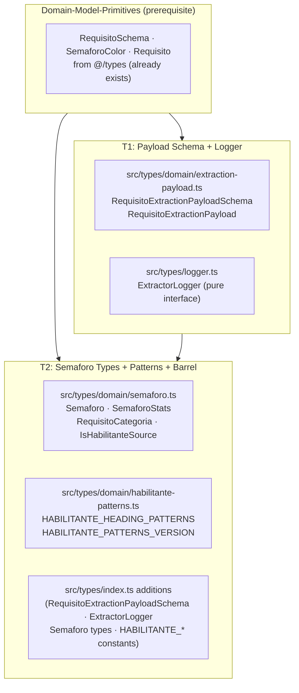
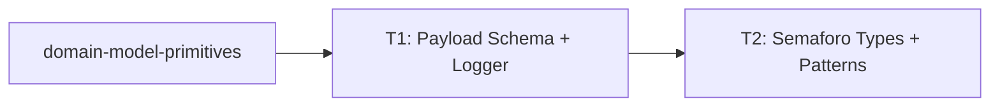

# domain-model-extraction-contracts — Feature Overview

## Spec Reference

[Spec](../spec/spec.md)

## Problem + Solution

- `requisitos-extraction` and `semaforo-aggregation` need shared TypeScript/Zod contracts before their own implementations begin. Without them each feature would define `RequisitoExtractionPayload`, `Semaforo`, or `HABILITANTE_HEADING_PATTERNS` independently — causing silent schema drift and duplicate versioned constants.
- Solution: Define the LLM output schema (`RequisitoExtractionPayloadSchema`), the structural logger interface (`ExtractorLogger`), the semáforo view types (`Semaforo`, `SemaforoStats`), and the versioned habilitante heading constants (`HABILITANTE_HEADING_PATTERNS`) as a single, independently executable spec. All definitions re-exported from the existing `src/types/index.ts` barrel.
- No Postgres tables, no migrations, no RLS. Pure TypeScript/Zod additions to `src/types/`.

## Architecture Diagram

## Task Index

| Task | File | Description | Dependencies |
|------|------|-------------|--------------|
| T1 | [01-plan-01-payload-schema.md](./01-plan-01-payload-schema.md) | `RequisitoExtractionPayloadSchema` + `ExtractorLogger` interface | `domain-model-primitives` |
| T2 | [01-plan-02-semaforo-types.md](./01-plan-02-semaforo-types.md) | Semaforo view types + `HABILITANTE_HEADING_PATTERNS` constants + barrel additions | T1 |

## Dependency Graph

T1 adds the LLM-output contract and logger interface. T2 adds the aggregation view types, pattern constants, and wires everything into the barrel. Both depend on `domain-model-primitives` being complete.
