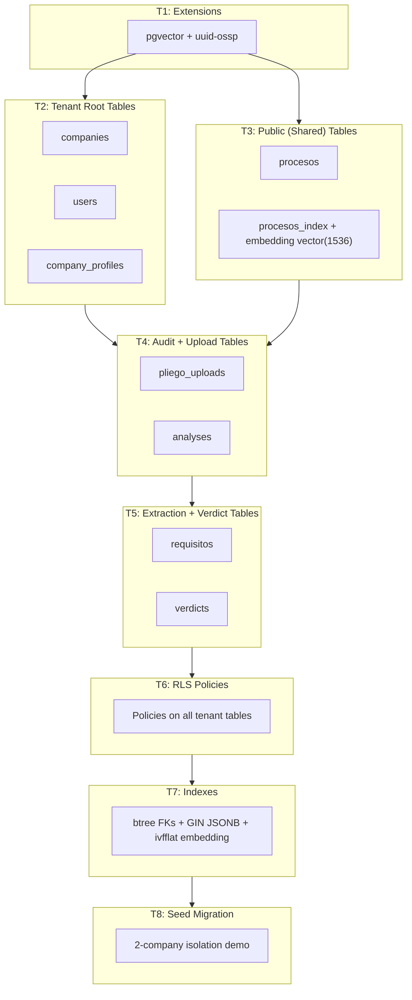
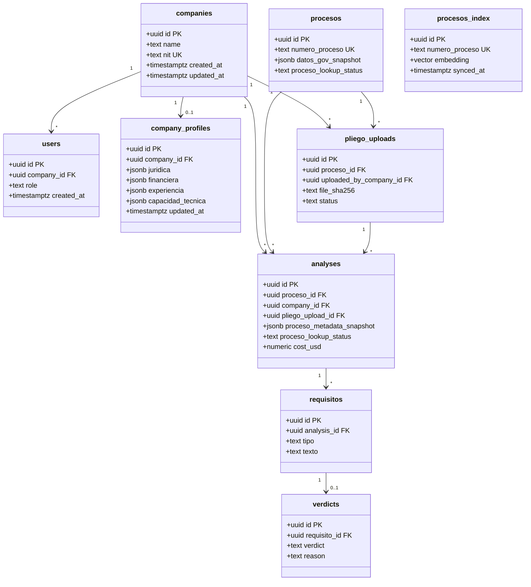
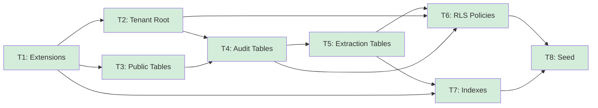

# domain-model-mvp — Implementation Overview

## Spec Reference

[Spec](../spec/spec.md)

## Problem + Solution

- The COLTRATOS MVP needs a complete, production-ready Supabase schema that supports discovery (pgvector semantic search), pliego upload with legal audit trail, LLM-driven extraction, deterministic semáforo verdicts, and per-analysis cost observability — all with strict multi-tenant isolation
- Solution: one versioned SQL migration per logical group, applied in dependency order, covering 9 tables with RLS policies, indexes (btree, GIN, ivfflat), and a seed migration demonstrating cross-company isolation
- All tables use `uuid` PKs with `gen_random_uuid()`, `timestamptz` timestamps, and explicit `ON DELETE` semantics; no implicit defaults
- Deliverable: Supabase migration files under `supabase/migrations/` that apply cleanly on a fresh project

## Architecture Diagram

## Data Model

Nine tables across three tenancy zones:

## Task Index

| Task | File | Description | Dependencies |
|------|------|-------------|--------------|
| T1 | [01-plan-T1-extensions.md](./01-plan-T1-extensions.md) | Enable pgvector and uuid-ossp extensions | None |
| T2 | [01-plan-T2-tenant-root.md](./01-plan-T2-tenant-root.md) | Create companies, users, company_profiles tables | T1 |
| T3 | [01-plan-T3-public-tables.md](./01-plan-T3-public-tables.md) | Create procesos and procesos_index (no RLS) | T1 |
| T4 | [01-plan-T4-audit-tables.md](./01-plan-T4-audit-tables.md) | Create pliego_uploads and analyses with FKs | T2, T3 |
| T5 | [01-plan-T5-extraction-tables.md](./01-plan-T5-extraction-tables.md) | Create requisitos and verdicts with FKs | T4 |
| T6 | [01-plan-T6-rls-policies.md](./01-plan-T6-rls-policies.md) | RLS policies for all tenant tables | T2, T4, T5 |
| T7 | [01-plan-T7-indexes.md](./01-plan-T7-indexes.md) | Indexes: btree on FKs, GIN on JSONB, ivfflat on embedding | T1–T5 |
| T8 | [01-plan-T8-seed.md](./01-plan-T8-seed.md) | Seed migration demonstrating 2-company isolation | T6, T7 |

## Dependency Graph

