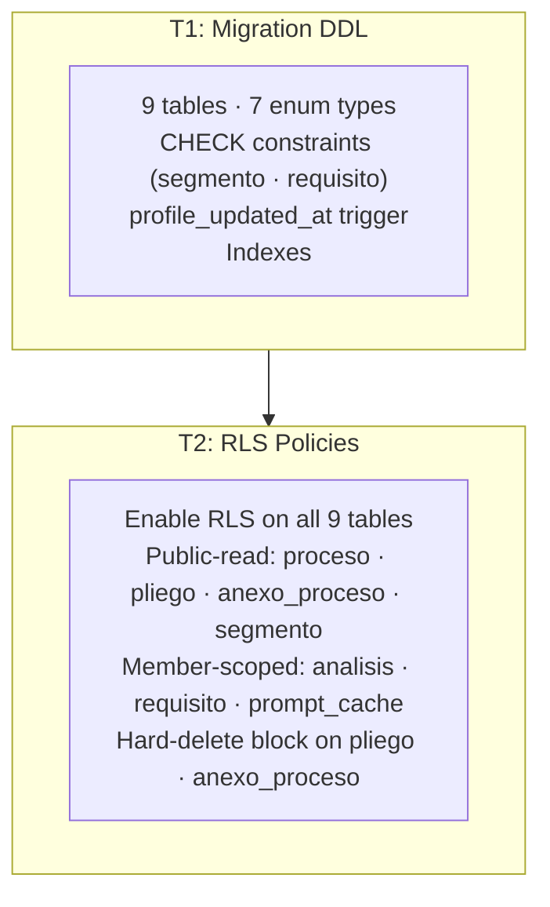

# domain-model-postgres — Feature Overview

## Spec Reference

[Spec](../spec/spec.md)

## Problem + Solution

- No Postgres schema exists; downstream migrations cannot define FKs or RLS policies against nonexistent tables.
- Solution: One migration creates all 9 tables, 7 custom enum types, CHECK constraints, trigger, and indexes. A second migration enables RLS and defines per-table policies. Two files keep DDL and access-control independently reviewable and rollback-safe.
- The bifurcated RLS model is the cornerstone: `proceso`, `pliego`, `anexo_proceso`, `segmento` are public-read (any `authenticated` user); `analisis`, `requisito`, `prompt_cache` are scoped via `empresa_member` join.
- `empresa.profile_updated_at` is trigger-owned — no application code writes it directly. The Postgres trigger `set_empresa_profile_updated_at()` fires on `UPDATE` when `nombre` or `nit` changes.

## Architecture Diagram

## Task Index

| Task | File | Description | Dependencies |
|------|------|-------------|--------------|
| T1 | [01-plan-01-postgres-migration.md](./01-plan-01-postgres-migration.md) | DDL migration: 9 tables, 7 enums, CHECK constraints, trigger, indexes | None |
| T2 | [01-plan-02-rls-policies.md](./01-plan-02-rls-policies.md) | RLS enable + bifurcated per-table policies | T1 |

## Dependency Graph

T1 must complete first — tables must exist before RLS can be enabled on them.
