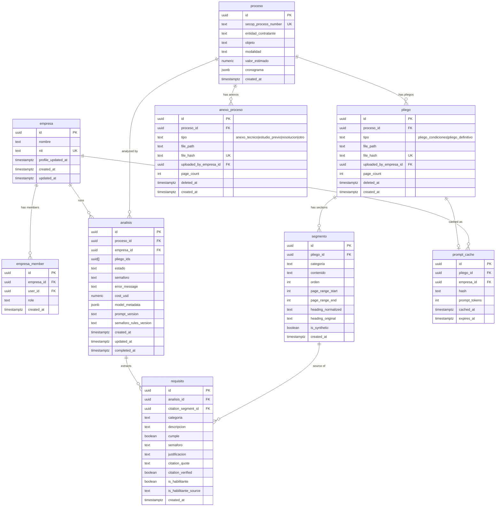

# domain-model-postgres — Software Design Document

## Intention

Establishes the Supabase Postgres layer of the COLTRATOS domain model: one versioned SQL migration that creates all 9 tables with FK constraints, unique indexes, check constraints, and Postgres enums; bifurcated RLS policies enforcing tenant isolation; and the `set_empresa_profile_updated_at()` trigger. The TypeScript/Zod contracts for the same entities live in `domain-model-primitives`. Field names here must exactly match Zod schema field names (snake_case throughout) per NFR-02.

## Use Cases

Detailed scenarios in [use-cases.md](./use-cases.md).

| Use Case | Description | User Stories |
|----------|-------------|-------------|
| [UC-01 — Run database migration](./use-cases.md#uc-01--run-database-migration-us-03) | DB admin applies the versioned migration to create all tables with correct constraints | US-03 |
| [UC-02 — Enforce tenant isolation on empresa-private tables](./use-cases.md#uc-02--enforce-tenant-isolation-on-empresa-private-tables-us-04) | RLS enforces empresa-private tables are invisible across empresa boundaries; public tables remain readable by all authenticated users | US-04 |

---

## Requirements

### Functional Requirements

| ID | Requirement | User Stories | Business Rules |
|----|-------------|-------------|----------------|
| REQ-001 | Generate one Supabase migration creating all 9 tables (`empresa`, `empresa_member`, `proceso`, `pliego`, `anexo_proceso`, `segmento`, `analisis`, `requisito`, `prompt_cache`) with FK constraints, unique indexes, and check constraints. `pliego_tipo` Postgres enum: `pliego_condiciones`/`pliego_definitivo`; `anexo_proceso_tipo` enum: `anexo_tecnico`/`estudio_previo`/`resolucion`/`otro` | US-03 | RN-001, RN-002, RN-003, RN-004, RN-007, RN-008, RN-009 |
| REQ-002 | `segmento` table includes: `page_range_start INT NOT NULL CHECK (page_range_start >= 1)`, `page_range_end INT NOT NULL`, `heading_normalized TEXT NULL`, `heading_original TEXT NULL`, `is_synthetic BOOLEAN NOT NULL DEFAULT false`, plus three named CHECK constraints: `segmento_page_range_valid` (`page_range_start <= page_range_end AND page_range_start >= 1`), `segmento_heading_both_or_neither` (both heading columns null or both non-null), `segmento_synthetic_iff_null_heading` (`is_synthetic = (heading_normalized IS NULL)`) | US-03 | RN-005, RN-006 |
| REQ-003 | Apply bifurcated RLS policies: `proceso`/`pliego`/`anexo_proceso`/`segmento` grant SELECT to any `authenticated` user; `analisis`/`requisito`/`prompt_cache` are scoped by the user's empresa membership via `empresa_member` join | US-04 | RN-010, RN-011, RN-012 |
| REQ-004 | `proceso`, `pliego`, `anexo_proceso`, and `segmento` grant `INSERT`/`UPDATE` to any `authenticated` user (no empresa-membership check) in v1 | US-04 | RN-012 |
| REQ-005 | `requisito` table includes citation columns: `citation_segment_id UUID NOT NULL REFERENCES segmento(id)`, `citation_quote TEXT NOT NULL CHECK (length(citation_quote) <= 200)` (constraint name: `requisito_citation_quote_length`), `citation_verified BOOLEAN NOT NULL DEFAULT false` | US-03 | RN-013 |
| REQ-006 | `analisis` table includes: `cost_usd NUMERIC(10,6) NULL`, `model_metadata JSONB NULL`, `prompt_version TEXT NULL`, `semaforo_rules_version TEXT NULL` — all four nullable | US-03 | RN-001 |
| REQ-007 | `empresa` table includes `profile_updated_at TIMESTAMPTZ NOT NULL DEFAULT now()`. Postgres trigger `set_empresa_profile_updated_at()` fires `BEFORE UPDATE` on `empresa`, sets `profile_updated_at = now()` whenever any business column changes, excludes `profile_updated_at` from its own dirty-check to avoid recursion | US-03 | RN-014 |
| REQ-008 | `requisito` table includes `categoria TEXT NOT NULL CHECK (categoria IN ('juridico','financiero','tecnico','experiencia'))` (constraint name: `requisito_categoria_narrow`) — denormalized from `segmento.categoria`, narrow set only (no `general`) | US-03 | RN-015, RN-016 |
| REQ-009 | `requisito` table includes `is_habilitante BOOLEAN NOT NULL` and `is_habilitante_source TEXT NOT NULL CHECK (is_habilitante_source IN ('structural','llm','manual'))` (constraint name: `requisito_is_habilitante_source_valid`) | US-03 | RN-017 |

### Non-Functional Requirements

| ID | Category | Requirement |
|----|----------|-------------|
| NFR-01 | Security | RLS policies must block cross-tenant reads for `analisis` and `requisito`; no row from empresa A visible to a user of empresa B |
| NFR-02 | Consistency | Postgres column names must exactly match Zod schema field names from `domain-model-primitives` (snake_case throughout) |

---

## Business Rules

| Rule | Description |
|------|-------------|
| RN-001 | `analisis.estado` is constrained to the Postgres enum `analisis_estado`: `pending`, `extracting`, `analyzing`, `completed`, `failed`. Forward-only state machine; transition logic lives in the service layer. |
| RN-002 | `requisito.cumple` is a nullable boolean (`BOOLEAN NULL`). `NULL` = sin información — evaluator could not determine. |
| RN-003 | `pliego.file_hash` and `anexo_proceso.file_hash` are SHA-256 of the raw file bytes. Each table has its own UNIQUE constraint — independent dedup spaces. Cross-table case (same bytes as both pliego and anexo) is permitted and produces two rows. |
| RN-004 | `pliego` and `anexo_proceso` use soft-delete via `deleted_at TIMESTAMPTZ NULL`. Hard deletes are prohibited; procurement records require legal hold. `proceso` does NOT have a `deleted_at` column. |
| RN-005 | **Heading triple-equivalence** on `segmento` (DB layer): `is_synthetic = true` ⇔ `heading_normalized IS NULL` ⇔ `heading_original IS NULL`. Enforced by two CHECK constraints: `segmento_heading_both_or_neither` and `segmento_synthetic_iff_null_heading`. Consumers MUST branch on `is_synthetic` (intent), not on heading nullability (data shape). |
| RN-006 | **`segmento.page_range_*` semantics** (DB layer): both columns are 1-indexed, both `>= 1`, `page_range_start <= page_range_end`. Enforced via CHECK constraint `segmento_page_range_valid`. |
| RN-007 | `segmento.categoria` is constrained to: `juridico`, `financiero`, `tecnico`, `experiencia`, `general`. `general` is the fallback for content that does not belong to any recognized Colombian SECOP II pliego category. |
| RN-008 | `analisis.pliego_ids` is `UUID[] NOT NULL`. v1 cardinality is always 1. No length constraint — v2 may pass multiple pliegos without a schema migration. |
| RN-009 | `pliego_tipo` Postgres enum is restricted to `pliego_condiciones`/`pliego_definitivo`. Non-pliego documents live in `anexo_proceso` with its own `anexo_proceso_tipo` enum (`anexo_tecnico`/`estudio_previo`/`resolucion`/`otro`). |
| RN-010 | Every empresa-scoped RLS policy joins through `empresa_member` (`empresa_id`, `user_id`) to bind rows to authenticated users. |
| RN-011 | Multi-tenant isolation is enforced at the database layer for empresa-private tables (`analisis`, `requisito`, `prompt_cache`). No service-role bypass permitted for tenant-scoped reads. |
| RN-012 | `proceso`, `pliego`, `anexo_proceso`, and `segmento` are public procurement records. SELECT granted to any `authenticated` user with no `empresa_member` join. INSERT/UPDATE also gated only on `authenticated` (not empresa-membership) in v1. |
| RN-013 | **Citation contract on `requisito`**: FK `citation_segment_id REFERENCES segmento(id) NOT NULL`. `citation_quote` capped at 200 chars via CHECK constraint `requisito_citation_quote_length`. Quote verification (NFD-normalized substring match) is a downstream consumer's responsibility; `citation_verified` stores the verdict. |
| RN-014 | **Trigger-owned `empresa.profile_updated_at`**: `set_empresa_profile_updated_at()` fires BEFORE UPDATE, sets the column to `now()` whenever any business column changes. Trigger excludes `profile_updated_at` from its dirty-check to avoid recursion. Acts as a cache-invalidation signal for downstream extraction caches — every empresa edit invalidates the cached prompt prefix automatically. |
| RN-015 | **Narrow `requisito.categoria`**: CHECK constraint `requisito_categoria_narrow` restricts to `('juridico','financiero','tecnico','experiencia')`. `general` is rejected at the DB layer — mirrors the Zod-level rejection in `domain-model-primitives`. |
| RN-016 | **`requisito.categoria` immutability**: column is populated at INSERT via the extraction pipeline; no application-level UPDATE path exists. Compile-time enforcement via Kysely `ColumnType<RequisitoCategoria, RequisitoCategoria, never>` in `domain-model-primitives`. |
| RN-017 | **Tiered `is_habilitante_source`**: CHECK constraint `requisito_is_habilitante_source_valid` restricts to `('structural','llm','manual')`. The classifier itself lives in `requisitos-extraction`; `domain-model-postgres` only defines the column shape and constraint. |

---

## Test Cases

### TC-001 — Pliego file_hash uniqueness; independent dedup space (REQ-001, RN-003)

**Given** the migration applied to a Supabase test instance
**When** two rows are inserted into `pliego` with the same `file_hash`
**Then** Postgres rejects the second insert with a unique constraint violation

**When** an insert is attempted into `anexo_proceso` with that same `file_hash`
**Then** the insert succeeds — independent dedup space

### TC-002 — AnexoProceso file_hash UNIQUE within its table (REQ-001, RN-003)

**Given** the migration is applied and an `anexo_proceso` row exists with a given `file_hash`
**When** a second insert is attempted into `anexo_proceso` with the same `file_hash`
**Then** Postgres rejects with a unique constraint violation

**When** an insert is attempted into `pliego` with that same `file_hash`
**Then** the insert succeeds

### TC-003 — Postgres rejects rows violating heading both-or-neither constraint (REQ-002, RN-005)

**Given** the migration has been applied
**When** a `segmento` row is inserted with `heading_normalized = 'capacidad juridica'` AND `heading_original IS NULL`
**Then** Postgres rejects with a CHECK violation on `segmento_heading_both_or_neither`

### TC-004 — Postgres rejects rows violating is_synthetic ⇔ null-heading constraint (REQ-002, RN-005)

**Given** the migration has been applied
**When** a `segmento` row is inserted with `is_synthetic = true` AND both heading columns non-null
**Then** Postgres rejects with a CHECK violation on `segmento_synthetic_iff_null_heading`

**When** a `segmento` row is inserted with `is_synthetic = false` AND both heading columns NULL
**Then** Postgres also rejects

### TC-005 — Postgres rejects invalid page_range_* (REQ-002, RN-006)

**Given** the migration has been applied
**When** a `segmento` row is inserted with `page_range_start = 5, page_range_end = 3`
**Then** Postgres rejects with a CHECK violation on `segmento_page_range_valid`

**When** a `segmento` row is inserted with `page_range_start = 0`
**Then** Postgres also rejects

### TC-006 — pliego_tipo Postgres enum rejects anexo values (REQ-001, RN-009)

**Given** the migration is applied
**When** `SELECT enum_range(NULL::pliego_tipo)` is queried
**Then** result contains exactly `{pliego_condiciones, pliego_definitivo}`

**When** `SELECT enum_range(NULL::anexo_proceso_tipo)` is queried
**Then** result contains exactly `{anexo_tecnico, estudio_previo, resolucion, otro}`

### TC-007 — RLS blocks cross-tenant Analisis SELECT (REQ-003, RN-010, RN-011)

**Given** empresa A and empresa B each have one análisis for the same proceso
**When** a user of empresa A executes `SELECT * FROM analisis` via authenticated Supabase client
**Then** only empresa A's análisis is returned; empresa B's row is invisible

### TC-008 — Proceso is publicly readable across empresas (REQ-003, REQ-004, RN-012)

**Given** a proceso row exists
**And** user A (member of empresa A) and user B (member of empresa B) are authenticated
**When** each executes `SELECT * FROM proceso WHERE id = '<proceso_id>'`
**Then** both queries return the same proceso row

### TC-009 — Analisis from empresa A invisible to empresa B (REQ-003, RN-011)

**Given** empresa A has one análisis and empresa B has one análisis for the same proceso
**When** a user of empresa B executes `SELECT * FROM analisis WHERE proceso_id = '<proceso_id>'`
**Then** only empresa B's análisis is returned; empresa A's row is invisible

### TC-010 — AnexoProceso publicly readable across empresas (REQ-003, RN-012)

**Given** an `anexo_proceso` row exists
**And** user A and user B (different empresas) are authenticated
**When** each executes `SELECT * FROM anexo_proceso WHERE id = '<anexo_id>'`
**Then** both queries return the same row

### TC-011 — Postgres CHECK rejects citation_quote > 200 chars (REQ-005, RN-013)

**Given** the migration is applied
**When** a `requisito` row is inserted with `citation_quote = repeat('a', 201)`
**Then** Postgres rejects with a CHECK violation on `requisito_citation_quote_length`

### TC-012 — analisis telemetry columns accept NULL (REQ-006)

**Given** the migration is applied
**When** an `analisis` row is inserted with `cost_usd = NULL`, `model_metadata = NULL`, `prompt_version = NULL`, `semaforo_rules_version = NULL`
**Then** the insert succeeds

### TC-013 — Trigger auto-bumps empresa.profile_updated_at on UPDATE (REQ-007, RN-014)

**Given** the migration is applied and an `empresa` row exists with `profile_updated_at = T0`
**When** `UPDATE empresa SET nombre = 'New Name' WHERE id = ...` executes at time T1 > T0
**Then** the row's `profile_updated_at` is `>= T1`

**When** a no-op `UPDATE empresa SET profile_updated_at = profile_updated_at WHERE id = ...` executes
**Then** the trigger does NOT bump — dirty-check sees no change to a watched column

### TC-014 — Postgres CHECK rejects invalid categoria on requisito (REQ-008, RN-015)

**Given** the migration is applied
**When** a `requisito` row is inserted with `categoria = 'general'`
**Then** Postgres rejects with a CHECK violation on `requisito_categoria_narrow`

**When** inserted with `categoria = 'juridico'`
**Then** insert succeeds

### TC-015 — Postgres CHECK rejects invalid is_habilitante_source (REQ-009, RN-017)

**Given** the migration is applied
**When** a `requisito` row is inserted with `is_habilitante_source = 'auto'`
**Then** Postgres rejects with a CHECK violation on `requisito_is_habilitante_source_valid`

---

## UX/UI

No UI. Developer-facing foundation feature.

---

## Architecture

### Architecture Decision Records

| ADR | Title | Impact |
|-----|-------|--------|
| ADR-003 | Supabase RLS for tenant isolation | Empresa-scoped policies reference `auth.uid()` and join `empresa_member`; public tables use `authenticated` role check only |
| ADR-008 | Pliego/AnexoProceso split — narrow Pliego semantics | `pliego_tipo` enum stays narrow; `anexo_proceso_tipo` covers everything else. Two tables instead of one discriminator-overloaded table. |

### Tradeoffs

| Tradeoff | We chose | Over | Rationale |
|----------|----------|------|-----------|
| Tenant isolation layer | Postgres RLS (bifurcated) | Application middleware | RLS survives direct DB access, admin queries, and future services without code changes |
| Soft-delete | `deleted_at` on pliego and anexo_proceso | Status enum or proceso soft-delete | Preserves exact deletion time for legal audit; proceso is a public procurement record — deletion is not a valid operation |
| File-hash dedup space | Independent UNIQUE per table | Cross-table CHECK trigger | Cross-table content collision is essentially impossible in practice; independent UNIQUE keeps the schema simple |
| `empresa.profile_updated_at` ownership | Postgres trigger | Application-managed timestamp | Trigger is bulletproof — every UPDATE path bumps it, including direct SQL and admin tools |
| Named CHECK constraints | Explicit names on all constraints | Anonymous constraints | Named constraints produce readable error messages (e.g. `requisito_categoria_narrow`) — essential for debugging integration tests |

### Performance Goals & Metrics

| Metric | Target | Measurement |
|--------|--------|-------------|
| Migration apply time | < 5s on empty DB | `supabase db push` timing in dev |

### Data Model

### API / Data Contracts

No HTTP endpoints. Migration file: `supabase/migrations/20260425000000_domain_model.sql`.

### Service Integrations

| System | Direction | Data |
|--------|-----------|------|
| Supabase Postgres | Write | DDL migration + bifurcated RLS policies + trigger |
| `domain-model-primitives` | Parallel dependency — column names must match exactly (NFR-02) | Postgres column names mirror Zod field names (snake_case) |

---

## Revision Log

| Date | Change | Reason |
|------|--------|--------|
| 2026-04-30 | Split from monolithic `domain-model` spec (rev 5, 2026-04-27). Archived at `docs/archive/domain-model/`. Extracted: migration (9 tables, enums, FKs, unique indexes, all CHECK constraints), bifurcated RLS policies, `set_empresa_profile_updated_at()` trigger, citation/habilitante columns on requisito, telemetry columns on analisis. | Monolithic spec grew to 549 lines across 5 revisions; split into independently executable specs by implementation layer. |
