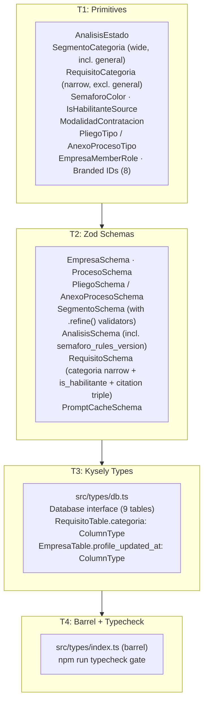
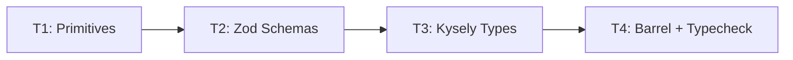

# domain-model-primitives — Feature Overview

## Spec Reference

[Spec](../spec/spec.md)

## Problem + Solution

- No shared type definitions exist; every downstream feature would invent its own `Proceso`, `Pliego`, `AnexoProceso`, or `Requisito` interface, causing silent schema drift.
- Solution: One Zod-first definition per entity generates TypeScript types, validates runtime data, and maps 1:1 to Postgres columns. Eight Zod entity schemas share one canonical home under `src/types/`.
- `requisito.categoria` is the **narrow** `RequisitoCategoria` (excludes `general`, distinct from `SegmentoCategoria`) and is **immutable post-INSERT** — recategorization goes through orchestrator-level cache invalidation + re-extraction, not row-level UPDATE (RN-016, RN-017).
- Kysely consumes the same column names via a hand-authored `Database` interface, making queries type-safe without introspection tooling.

## Architecture Diagram

## Task Index

| Task | File | Description | Dependencies |
|------|------|-------------|--------------|
| T1 | [01-plan-01-primitives.md](./01-plan-01-primitives.md) | Branded IDs, enum literals (incl. narrow `RequisitoCategoria` and `IsHabilitanteSource`), ADR stubs | None |
| T2 | [01-plan-02-zod-schemas.md](./01-plan-02-zod-schemas.md) | Zod schemas + inferred TS types for 8 entities (incl. citation fields on Requisito, telemetry on Analisis, `profile_updated_at` on Empresa) | T1 |
| T3 | [01-plan-03-kysely-types.md](./01-plan-03-kysely-types.md) | Kysely `Database` interface — row, insert, and update types for 9 tables. `RequisitoTable.categoria` and `EmpresaTable.profile_updated_at` immutability via `ColumnType` | T2 |
| T4 | [01-plan-04-barrel-exports.md](./01-plan-04-barrel-exports.md) | Barrel `src/types/index.ts` (re-exports all schemas, types, Kysely interface) + typecheck gate | T2, T3 |

## Dependency Graph

T1 must complete before T2. T3 must follow T2. T4 is the final gate after T2 and T3.
