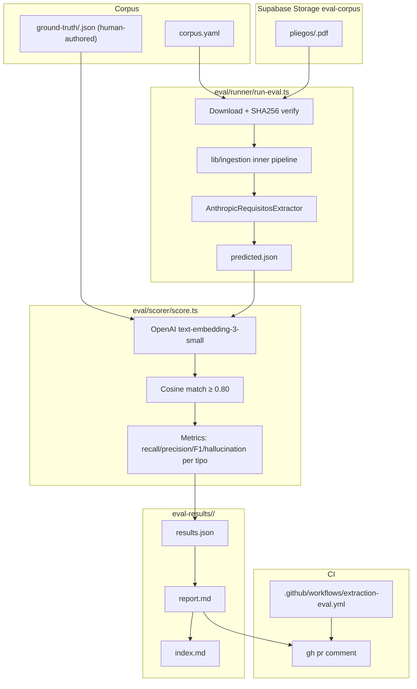
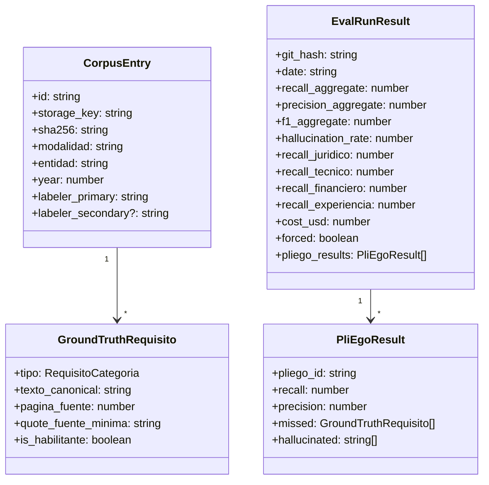
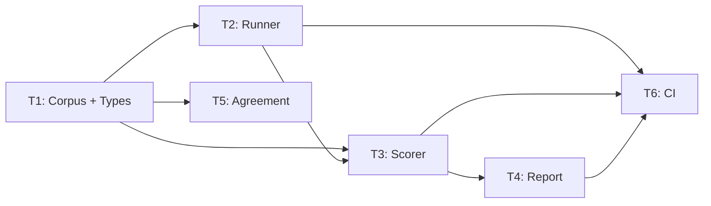

# extraction-eval-harness — Overview

## Spec Reference

[Spec](../spec/spec.md)

## Problem + Solution

- No reproducible measurement exists for extraction quality — the ≥85% recall claim is unverifiable without a labeled corpus and a scorer.
- Solution: a lightweight in-house eval harness: labeled corpus (20 pliegos), a runner that drives the production pipeline, an embedding-based scorer, and a CI gate on every extraction change.
- Implemented as a standalone `eval/` directory (TypeScript, `tsx` runner) that imports from `lib/` and `@/types` but lives outside `src/`. No new database tables; results committed to `eval-results/`.
- Output: committed markdown report + JSON per git hash, PR comment from CI, trend index across runs.

## Architecture Diagram

## Data Model

No new Supabase tables. All state lives in committed files.

## Task Index

| # | File | Description | Dependencies |
|---|------|-------------|--------------|
| T1 | [01-plan-01-corpus-ground-truth-schema.md](./01-plan-01-corpus-ground-truth-schema.md) | Types, manifest schema, directory layout, labeling protocol | None |
| T2 | [01-plan-02-runner.md](./01-plan-02-runner.md) | Runner script, empresa stub, storage download | T1 |
| T3 | [01-plan-03-scorer.md](./01-plan-03-scorer.md) | Embedding, cosine matching, metrics computation | T1, T2 |
| T4 | [01-plan-04-report-generator.md](./01-plan-04-report-generator.md) | Markdown + JSON report, index.md append | T3 |
| T5 | [01-plan-05-interlabeler-agreement.md](./01-plan-05-interlabeler-agreement.md) | CSV import, Cohen's kappa computation | T1 |
| T6 | [01-plan-06-ci-integration.md](./01-plan-06-ci-integration.md) | GitHub Actions workflow, package.json scripts | T2, T3, T4 |

## Dependency Graph

