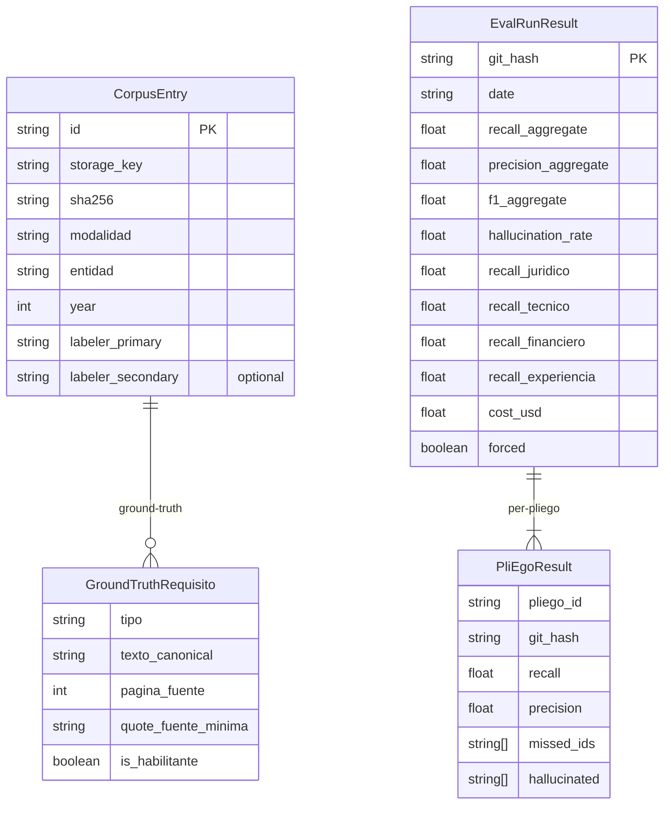
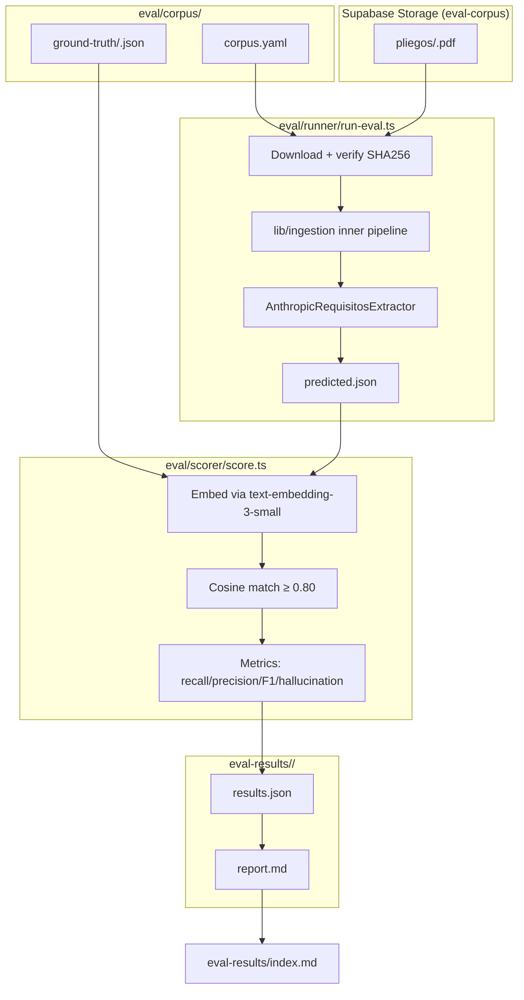

# extraction-eval-harness — Software Design Document

## Intention

`extraction-eval-harness` is a reproducible, versioned measurement system for requisito extraction quality. It runs the production extraction pipeline (`pdf-ingestion` + `requisitos-extraction`) against a ground-truth–labeled corpus of 20 real SECOP II pliegos, then scores predicted requisitos against human-authored ground truth using embedding-based matching. Every prompt change or model swap generates a committed result; regressions are caught on PR, not in pilot. The feature gates the `Verified` status of `requisitos-extraction` — the ≥85% recall claim is only credible when this harness backs it.

## Use Cases

Detailed scenarios in [use-cases.md](./use-cases.md).

| Use Case | Description | User Stories |
|----------|-------------|-------------|
| [UC-01 — Run on-demand eval](./use-cases.md#uc-01) | Engineer runs `npm run eval` and gets a markdown report + committed JSON in `eval-results/` | US-01 |
| [UC-02 — PR gate on extraction change](./use-cases.md#uc-02) | CI runs eval on every PR touching `lib/extraction/**`; posts summary comment; fails if gates missed | US-02 |
| [UC-03 — Human labeling session](./use-cases.md#uc-03) | Labeler follows protocol → fills CSV → import script converts to ground-truth JSON | US-03 |
| [UC-04 — Per-tipo recall drill-down](./use-cases.md#uc-04) | Report surfaces recall, precision, F1 per tipo (`juridico`, `tecnico`, `financiero`, `experiencia`) with missed + hallucinated lists | US-04 |
| [UC-05 — Inter-labeler agreement](./use-cases.md#uc-05) | `compute-agreement` computes Cohen's kappa on the 5 dual-labeled pliegos and appends result to the run report | US-05 |

---

## Requirements

### Functional Requirements

| ID | Requirement | User Stories | Business Rules |
|----|-------------|-------------|----------------|
| REQ-001 | Define `GroundTruthRequisito` Zod schema: `{ tipo: RequisitoCategoria, texto_canonical: string, pagina_fuente: number, quote_fuente_minima: string (≤200 chars), is_habilitante: boolean }`. Ground truth files are arrays of this type. | US-01, US-03 | RN-001 |
| REQ-002 | Define `CorpusManifest` Zod schema (YAML-parsed): one entry per pliego with `id`, `storage_key` (Supabase Storage path), `sha256`, `modalidad`, `entidad`, `year`, `tipo_pliego: 'pliego_definitivo'`, `labeler_primary`, `labeler_secondary?`, `date_labeled`, **`ground_truth_exhaustive: boolean`** (true = labeler annotated every requisito habilitante; false = sample only). Ground-truth JSON lives at `eval/corpus/ground-truth/<id>.json`. | US-01 | RN-002, RN-013 |
| REQ-003 | Corpus MUST contain ≥20 pliegos spanning ≥4 modalidades: `licitacion_publica`, `concurso_de_meritos`, `contratacion_directa`, `minima_cuantia`. Selection criteria documented in `eval/corpus/corpus.yaml` header comment. | US-01 | RN-003 |
| REQ-004 | ≥5 pliegos MUST have a second independent labeler annotation at `eval/corpus/ground-truth/labeler-b/<id>.json` (same schema as primary). These are the inter-labeler agreement set. | US-05 | RN-004 |
| REQ-005 | Runner script `eval/runner/run-eval.ts` accepts `--pliego=<id>` (single) or `--all` (all corpus). For each pliego: fetches PDF from Supabase Storage using service role key; pipes buffer through `lib/ingestion/` inner pipeline; feeds `Segment[]` + `Empresa` stub to `AnthropicRequisitosExtractor`; writes `ExtractorOutput` to `eval-results/<git-hash>/<id>/predicted.json`. | US-01 | RN-005 |
| REQ-006 | Runner resolves `<git-hash>` via `git rev-parse --short HEAD` at invocation time. If `eval-results/<git-hash>/` already exists, runner exits with a warning and skips re-running unless `--force` is passed. Past results are never overwritten. | US-01 | RN-006 |
| REQ-007 | Scorer `eval/scorer/score.ts` embeds each `GroundTruthRequisito.texto_canonical` and each predicted `Requisito.descripcion` using OpenAI `text-embedding-3-small` (baseline). Before any main eval run, scorer MUST execute a **calibration step** against the 5 dual-labeled pliegos: treat labeler-b annotations as "predicted" and labeler-a as "ground truth", run the full cosine-match pipeline, compute agreement rate (fraction of labeler-b entries matched to a labeler-a entry at the current threshold). If agreement < 0.80, scorer logs a `scorer_calibration_warning`, automatically retries calibration with `text-embedding-3-large`, and uses the larger model for the main eval run if its calibration agreement ≥ 0.80. If neither model reaches 0.80, eval aborts with `SCORER_CALIBRATION_FAILED` and recommends lowering `MATCH_THRESHOLD`. Chosen embedding model and calibration agreement rate are recorded in `results.json` as `scorer_embedding_model` and `scorer_calibration_agreement`. | US-01, US-04 | RN-007, RN-012 |
| REQ-008 | Scorer computes per-pliego and aggregate: `recall` (truth matched / total truth), `precision` (predicted matched / total predicted), `F1`, and `hallucination_rate`. **Hallucination is only computed for pliegos marked `ground_truth_exhaustive: true` in `corpus.yaml`** — those where the labeler has annotated every requisito habilitante in the pliego, not a sample. For exhaustive pliegos: `hallucinated = predicted entries with cosine < MATCH_THRESHOLD to all ground-truth entries`; `hallucination_rate = len(hallucinated) / len(predicted)`. For non-exhaustive pliegos: `hallucination_rate = null` (unmatched predicted may be correct unlabeled entries). Each `HallucinatedEntry` carries `{ descripcion: string, tipo: RequisitoCategoria, citation_segment_id: SegmentoId }`. Reports per-tipo breakdowns for each of `{juridico, tecnico, financiero, experiencia}`. | US-01, US-04 | RN-008, RN-013 |
| REQ-009 | Scorer produces `EvalResult` JSON at `eval-results/<git-hash>/results.json` and a markdown report at `eval-results/<git-hash>/report.md`. Report includes: aggregate + per-tipo table, **per-pliego table with per-pliego recall + stddev of recall across corpus**, missed-requisito list (truth entries with no predicted match), hallucinated-requisito list (only for `ground_truth_exhaustive` pliegos), scorer calibration block. | US-01, US-04 | RN-008 |
| REQ-010 | Report generator appends an entry to `eval-results/index.md` (created if absent): `| <git-hash> | <date> | <aggregate-recall> | <aggregate-precision> | <F1> | pass/fail |`. | US-01 | RN-009 |
| REQ-011 | Inter-labeler agreement script `eval/labeling/compute-agreement.ts` computes **Cohen's kappa** on the 5 dual-labeled pliegos. Agreement is calculated on the binary classification: each requisito in primary labeling is matched to the nearest secondary requisito (same cosine similarity approach) and the `is_habilitante` and `tipo` assignments are compared. Kappa gate is **tiered**: `kappa < 0.60` fails CI (labels are noise — eval results are unreliable); `0.60 ≤ kappa < 0.75` warns; `kappa ≥ 0.75` passes. Both `kappa_habilitante` and `kappa_tipo` must independently pass their tier. Kappa result appended to the run's `report.md`. | US-05 | RN-004, RN-010, RN-014 |
| REQ-012 | CI workflow `.github/workflows/extraction-eval.yml` triggers on PRs touching `lib/extraction/**`, `eval/**`, or `.github/workflows/extraction-eval.yml`. Runs `npm run eval -- --all` (uses `ANTHROPIC_API_KEY` + `OPENAI_API_KEY` + `SUPABASE_SERVICE_ROLE_KEY` CI secrets). Posts a PR comment via `gh pr comment` with the aggregate table + pass/fail verdict. Fails the workflow if quality gates are missed. | US-02 | RN-011 |
| REQ-013 | Labeling CSV import script `eval/labeling/import-csv.ts` converts a Google Sheets export (CSV with columns: `tipo, texto_canonical, pagina_fuente, quote_fuente_minima, is_habilitante`) to the ground-truth JSON format. Validates each row against `GroundTruthRequisito` schema; prints Zod errors and exits non-zero on failure. | US-03 | RN-001 |
| REQ-014 | Empresa stub for runner: a minimal valid `Empresa` object (no real company data) defined in `eval/runner/empresa-stub.ts`. It satisfies the `AnthropicRequisitosExtractor` input contract. Engineers update it to reflect the profile dimensions they want to evaluate against. | US-01 | RN-005 |
| REQ-015 | `npm run eval` entry in `package.json` maps to `tsx eval/runner/run-eval.ts`. `npm run eval:score` maps to `tsx eval/scorer/score.ts`. `npm run eval:report` maps to `tsx eval/report/generate-report.ts`. `npm run eval:agreement` maps to `tsx eval/labeling/compute-agreement.ts`. | US-01 | — |

### Non-Functional Requirements

| ID | Category | Requirement |
|----|----------|-------------|
| NFR-01 | Performance | Full 20-pliego run MUST complete in < 45 min wall-clock at default `--concurrency=4`. Embedding calls batched at 100 texts per OpenAI request. |
| NFR-02 | Cost | Full eval run ≤ $2.50 USD total (≈ $0.04 extraction × 20 pliegos + ~$0.01 embeddings). Cost logged per-run in `results.json`. |
| NFR-03 | Quality gate — aggregate | Aggregate recall across all 20 pliegos ≥ 0.85. CI fails below this threshold. |
| NFR-04 | Quality gate — per-tipo | Per-tipo recall ≥ 0.80 for each of `{juridico, tecnico, financiero, experiencia}`. A tipo with zero ground-truth instances in the corpus is excluded from the floor (not a pass by default — triggers a corpus-gap warning). |
| NFR-05 | Ground truth integrity | Ground truth MUST be human-authored only. `import-csv.ts` validates provenance; the `corpus.yaml` `labeler_primary` field names the human. CI MUST NOT run `AnthropicRequisitosExtractor` to generate or augment ground-truth files. |
| NFR-06 | Inter-labeler agreement — tiered gate | `kappa < 0.60` (either `kappa_habilitante` or `kappa_tipo`): CI fails — labels are noise. `0.60 ≤ kappa < 0.75`: run report warns, CI passes. `kappa ≥ 0.75`: passes. |
| NFR-07 | Immutability | `eval-results/<git-hash>/` directories are append-only. `--force` flag documents the override in `results.json` as `{ "forced": true, "reason": "..." }`. |
| NFR-08 | Type safety | `npm run typecheck` passes for all files under `eval/`. Domain types imported from `@/types`; no local re-declarations. |
| NFR-09 | Corpus growth path | At N=20, recall confidence interval is ≈ ±0.05. **Eval gates MUST NOT promote to L3 trust until corpus reaches N≥50.** `corpus.yaml` header documents current N and CI-width estimate. When N crosses 50, a spec revision is required to re-evaluate the gate thresholds. |
| NFR-10 | Scorer calibration | Calibration step (REQ-007) runs before every eval. `scorer_embedding_model` and `scorer_calibration_agreement` MUST be logged in `results.json`. CI fails if `SCORER_CALIBRATION_FAILED` is raised. |

---

## Business Rules

| Rule | Description |
|------|-------------|
| RN-001 | Ground truth files MUST be authored by humans. LLM-generated or synthetic ground truth is not permitted. This is enforced by convention (no `import-llm-truth.ts` script), documented in `eval/corpus/labeling-protocol.md`, and the `labeler_primary` field in `corpus.yaml` names the responsible human. |
| RN-002 | PDFs are stored in Supabase Storage bucket `eval-corpus` under `pliegos/<sha256>.pdf` (not committed to git — pliegos can be 5–30 MB each). The `corpus.yaml` `sha256` field is the integrity check; runner verifies SHA256 after download before processing. |
| RN-003 | Corpus selection: pliegos MUST be `pliego_definitivo` only (not prepliego, not adendas), sourced from SECOP II (public domain). Minimum coverage: ≥4 different entidades, ≥4 modalidades. Corpus grows in batches; each addition requires a `corpus.yaml` update and a re-run to establish the new baseline. |
| RN-004 | The 5 dual-labeled pliegos are selected to span all 4 modalidades (≥1 per modalidad). The second labeler works independently from the CSV template before seeing the primary annotation. |
| RN-005 | Runner uses the REAL `AnthropicRequisitosExtractor` (not mock) against the real Anthropic API. This is intentional — the eval measures production quality, not mock fidelity. |
| RN-006 | Results are identified by git hash of the extraction code, not by date alone. This ensures each result can be tied to an exact implementation state. Running the same git hash twice with `--force` appends a `forced: true` marker. |
| RN-007 | Matching algorithm: cosine similarity of `text-embedding-3-small` embeddings (1536 dims), with automatic upgrade to `text-embedding-3-large` if calibration agreement < 0.80 (see REQ-007, RN-012). Threshold `MATCH_THRESHOLD = 0.80` default; tunable via `--threshold`. Rationale: requisitos in pliegos are often paraphrased between the pliego text and the labeler's `texto_canonical`; pure exact matching produces too many false negatives. Page proximity tiebreak reduces cross-section false positives. |
| RN-008 | Per-tipo recall reported separately. A high aggregate recall MUST NOT mask a low per-tipo recall. Both gates (NFR-03 + NFR-04) must pass independently. |
| RN-009 | `eval-results/index.md` accumulates across all runs (never truncated). It is the trend analysis surface — no external dashboard needed. |
| RN-010 | Cohen's kappa computed on per-requisito `is_habilitante` (boolean agreement) AND `tipo` (4-class agreement) independently. Reported as `kappa_habilitante` and `kappa_tipo`. |
| RN-011 | CI posts the eval result as a PR comment regardless of pass/fail. A failing gate fails the workflow status, but the comment is always posted so engineers can see the diff. |
| RN-012 | **Scorer calibration:** before the main eval run, the scorer validates its own matching quality against the 5 dual-labeled pliegos. Calibration agreement < 0.80 means the embedding model + threshold combination cannot reliably distinguish matched from unmatched pairs — recall scores computed with this scorer are untrustworthy. The calibration step is not optional; it is the self-check that prevents the eval from silently lying when extraction degrades. |
| RN-013 | **Hallucination metric requires exhaustive labeling.** `hallucination_rate` is only valid for pliegos where the labeler has annotated every requisito habilitante (not a sample). `CorpusEntry.ground_truth_exhaustive: boolean` flags this. For non-exhaustive pliegos, unmatched predicted entries may be correct unlabeled requisitos — computing hallucination rate on them would produce a false positive metric. Report MUST show `null` for non-exhaustive pliegos and annotate why. The labeling protocol MUST instruct labelers to annotate ALL requisitos habilitantes for exhaustive entries. |
| RN-014 | **Kappa tiered gate:** `kappa < 0.60` on either dimension means the two labelers are not converging — the corpus is unreliable as a quality signal and CI MUST fail. The threshold of 0.60 is the conventional floor for "slight agreement" (Cohen 1960); below it, disagreement is more likely systematic bias than annotation noise. |

---

## Test Cases

### TC-001 — Ground-truth schema validates clean JSON (REQ-001)

**Given** a valid array of `GroundTruthRequisito` objects in JSON
**When** parsed with the Zod schema
**Then** validation passes with no errors

### TC-002 — Ground-truth schema rejects unknown tipo (REQ-001, RN-001)

**Given** a `GroundTruthRequisito` with `tipo: 'general'`
**When** parsed with the Zod schema
**Then** Zod rejects with a discriminated error on `tipo`

### TC-003 — Corpus manifest validates against schema (REQ-002)

**Given** the committed `eval/corpus/corpus.yaml` parsed as YAML
**When** validated with `CorpusManifest` Zod schema
**Then** ≥20 entries, each with `id`, `storage_key`, `sha256`, `modalidad`, `entidad`, `year`, `tipo_pliego`, `labeler_primary`

### TC-004 — Corpus spans ≥4 modalidades (REQ-003, RN-003)

**Given** the `corpus.yaml` entries
**When** `modalidad` values are deduplicated
**Then** at least `{licitacion_publica, concurso_de_meritos, contratacion_directa, minima_cuantia}` are present

### TC-005 — Runner writes predicted.json per pliego (REQ-005)

**Given** a stub corpus with one pliego and a mock extractor
**When** the runner executes with `--pliego=stub-001`
**Then** `eval-results/<git-hash>/stub-001/predicted.json` exists and is valid `ExtractorOutput` JSON

### TC-006 — Runner skips re-run without --force (REQ-006, RN-006)

**Given** `eval-results/<git-hash>/stub-001/` already exists
**When** runner is invoked without `--force`
**Then** runner prints a warning and exits 0 without overwriting the file

### TC-007 — Scorer computes correct recall for a known case (REQ-007, REQ-008)

**Given** ground truth with 4 requisitos and predicted with 3 matching + 1 hallucinated
**When** scorer runs with embeddings mocked to return cosine = 1.0 for matches and 0.0 for non-matches
**Then** `recall = 0.75`, `precision = 0.75`, `hallucination_rate = 0.25`

### TC-008 — Per-tipo recall computed independently (REQ-008, RN-008)

**Given** ground truth with 2 juridico + 2 tecnico, and predicted missing both tecnico entries
**When** scorer runs
**Then** `recall_juridico = 1.0`, `recall_tecnico = 0.0`, `recall_aggregate = 0.5`

### TC-009 — Report appended to index.md (REQ-010)

**Given** a completed eval run
**When** report generator runs
**Then** `eval-results/index.md` gains one new row with git hash, date, aggregate metrics, pass/fail

### TC-010 — Cohen's kappa computed on dual-labeled pliego (REQ-011, RN-010)

**Given** primary and secondary ground-truth files for one pliego with 10 requisitos each, 8 of which match
**When** `compute-agreement` runs
**Then** `kappa_habilitante` and `kappa_tipo` are computed and written to the run report

### TC-011 — Import CSV rejects invalid tipo (REQ-013, RN-001)

**Given** a CSV with one row having `tipo = 'general'`
**When** `import-csv.ts` runs
**Then** exits non-zero and prints Zod validation error identifying the row

### TC-012 — SHA256 verification after storage download (RN-002)

**Given** a downloaded pliego PDF whose computed SHA256 does not match `corpus.yaml`
**When** runner verifies integrity
**Then** runner raises an error, skips the pliego, and logs `corpus_integrity_failure`

---

## UX/UI

Internal engineering tooling — no user-facing UI. Output surfaces:
- `eval-results/<git-hash>/report.md` — markdown, committed alongside code
- `eval-results/index.md` — trend table across all runs
- PR comment posted by CI with aggregate table + pass/fail badge

---

## Architecture

### ADRs

No new ADRs introduced. Applies existing decisions:
- Embedding model: **OpenAI `text-embedding-3-small`** (consistent with `integrations` domain — procesos_index uses this model; the eval harness inherits the choice to avoid two embedding spaces).
- PDF storage: **Supabase Storage** (`eval-corpus` bucket, separate from tenant `pliegos` bucket per `integrations` domain RN).
- Inner pipeline purity boundary: respected — runner calls `lib/ingestion/` inner pipeline directly; harness lives in `eval/`, never in `lib/` or `src/`.
- Ground truth human-only: no ADR needed, enforced by tooling and convention.

### Open Design Decisions (resolved inline)

| Decision | Resolution |
|----------|-----------|
| Corpus pliego sourcing | Download from SECOP II portal (public domain), store in Supabase Storage `eval-corpus` bucket. Runner downloads via service role key + SHA256 integrity check. |
| Labeling tooling | Google Sheets CSV template → `import-csv.ts` → JSON. No custom UI. Template committed at `eval/corpus/labeling-template.csv`. |
| Embedding model for matching | `text-embedding-3-small` (OpenAI) — consistent with `integrations` domain. Cost ~$0.01 per full eval run at corpus size. |
| Report format | Markdown committed to `eval-results/`. Static and durable; no live dashboard needed at this scale. |

### Data Model

### Pipeline Flow

### Service Integrations

- **Anthropic SDK** — `AnthropicRequisitosExtractor` (runner only; not in scorer or report)
- **OpenAI SDK** — `text-embedding-3-small` (scorer + agreement script)
- **Supabase Storage** — corpus PDF download (runner only; service role key)
- **`gh` CLI** — PR comment in CI workflow

### Task Decomposition

| # | Task | File(s) | Dependencies |
|---|------|---------|--------------|
| T1 | Corpus + ground-truth schema | `eval/types.ts`, `eval/corpus/corpus.yaml`, `eval/corpus/labeling-protocol.md`, `eval/corpus/labeling-template.csv` | None |
| T2 | Runner | `eval/runner/run-eval.ts`, `eval/runner/empresa-stub.ts` | T1 |
| T3 | Scorer | `eval/scorer/score.ts`, `eval/scorer/embeddings.ts`, `eval/scorer/metrics.ts` | T1, T2 |
| T4 | Report generator | `eval/report/generate-report.ts` | T3 |
| T5 | Inter-labeler agreement | `eval/labeling/compute-agreement.ts`, `eval/labeling/import-csv.ts` | T1 |
| T6 | CI integration | `.github/workflows/extraction-eval.yml`, `package.json` scripts | T2, T3, T4 |
