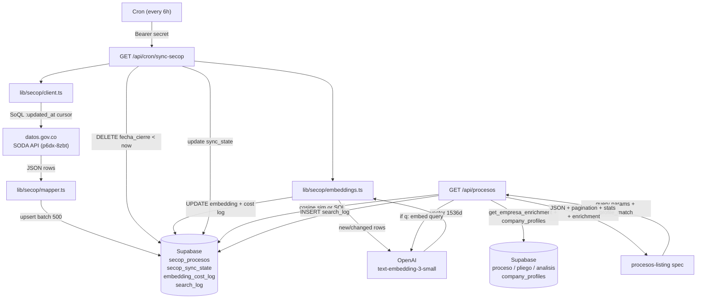
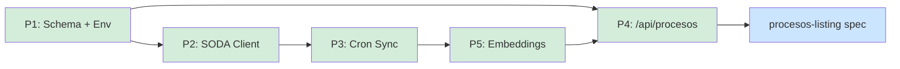

# secop-ingestion-and-listing — Overview

## Spec Reference

[Spec](../spec/spec.md)

## Problem + Solution

- COLTRATOS listing module consumes mock data — no real procesos shown
- Pilots waste time browsing SECOP's slow portal; semantic search over `objeto_a_contratar` not available there
- Solution: Cron polls SODA API incrementally every 6 hours → local `secop_procesos` table → embeddings via OpenAI → `/api/procesos` endpoint (structural SQL or vector search) → frontend
- SODA and OpenAI are never on the user-facing request path; latency and quota risk stay in the cron layer

## Architecture

## Task Index

| Task | File | Description | Dependencies |
|------|------|-------------|--------------|
| P1 | [01-plan-P1-schema-env.md](./01-plan-P1-schema-env.md) | DB migration (secop_procesos + embedding column + search_log + embedding_cost_log) + env vars | None |
| P2 | [01-plan-P2-soda-client.md](./01-plan-P2-soda-client.md) | `lib/secop/types.ts` + `soql.ts` + `client.ts` + `mapper.ts` | P1 |
| P3 | [01-plan-P3-cron-sync.md](./01-plan-P3-cron-sync.md) | `/api/cron/sync-secop` route + pruning + 6h cron config | P1, P2 |
| P5 | [01-plan-P5-embeddings.md](./01-plan-P5-embeddings.md) | `lib/secop/embeddings.ts` + change-detection + cost logging | P1, P3 |
| P4 | [01-plan-P4-procesos-endpoint.md](./01-plan-P4-procesos-endpoint.md) | `GET /api/procesos` (vector search + profile-match + search logging) | P1, P5 |

> Frontend redesign: `procesos-listing` spec (depends on P4 types being frozen).

## Dependency Graph

P2 can start as soon as P1 is done. P3 requires P2. P5 requires P3 (cron route must call embedder). P4 can start in parallel with P5 but the vector search path requires P5 to be merged first.
