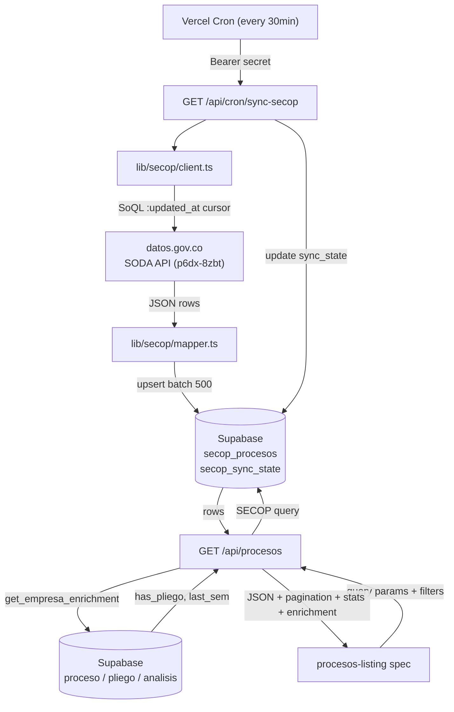
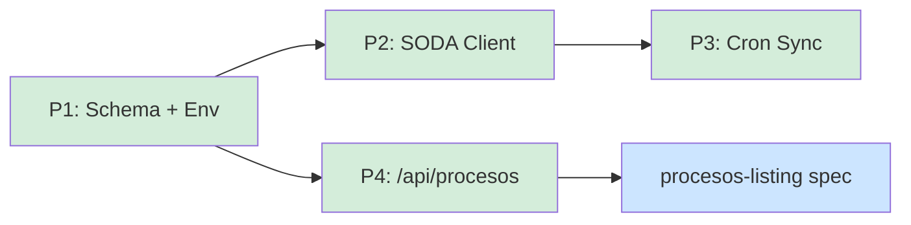

# secop-ingestion-and-listing — Overview

## Spec Reference

[Spec](../spec/spec.md)

## Problem + Solution

- COLTRATOS listing module consumes mock data — no real procesos shown
- Solution: Vercel Cron polls SODA API incrementally → local `secop_procesos` table → `/api/procesos` endpoint → frontend
- SODA is never on the user-facing request path; latency and quota risk stay in the cron layer

## Architecture

## Task Index

| Task | File | Description | Dependencies |
|------|------|-------------|--------------|
| P1 | [01-plan-P1-schema-env.md](./01-plan-P1-schema-env.md) | DB migration + `get_empresa_enrichment` fn + Supabase types + env vars | None |
| P2 | [01-plan-P2-soda-client.md](./01-plan-P2-soda-client.md) | `lib/secop/types.ts` + `soql.ts` + `client.ts` + `mapper.ts` | P1 |
| P3 | [01-plan-P3-cron-sync.md](./01-plan-P3-cron-sync.md) | `/api/cron/sync-secop` route + `vercel.json` cron config | P1, P2 |
| P4 | [01-plan-P4-procesos-endpoint.md](./01-plan-P4-procesos-endpoint.md) | `GET /api/procesos` with filters, enrichment, stats, pagination, sort | P1 |

> Frontend redesign: `procesos-listing` spec (depends on this spec's P4).

## Dependency Graph

P2 and P4 can run in parallel after P1. P3 is independent of P4. `procesos-listing` depends on P4 types being frozen.
