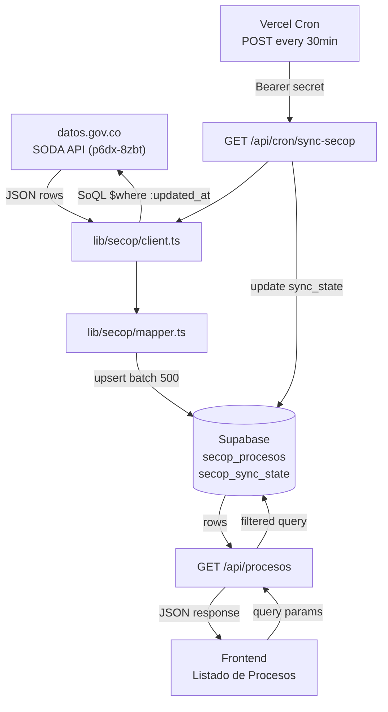
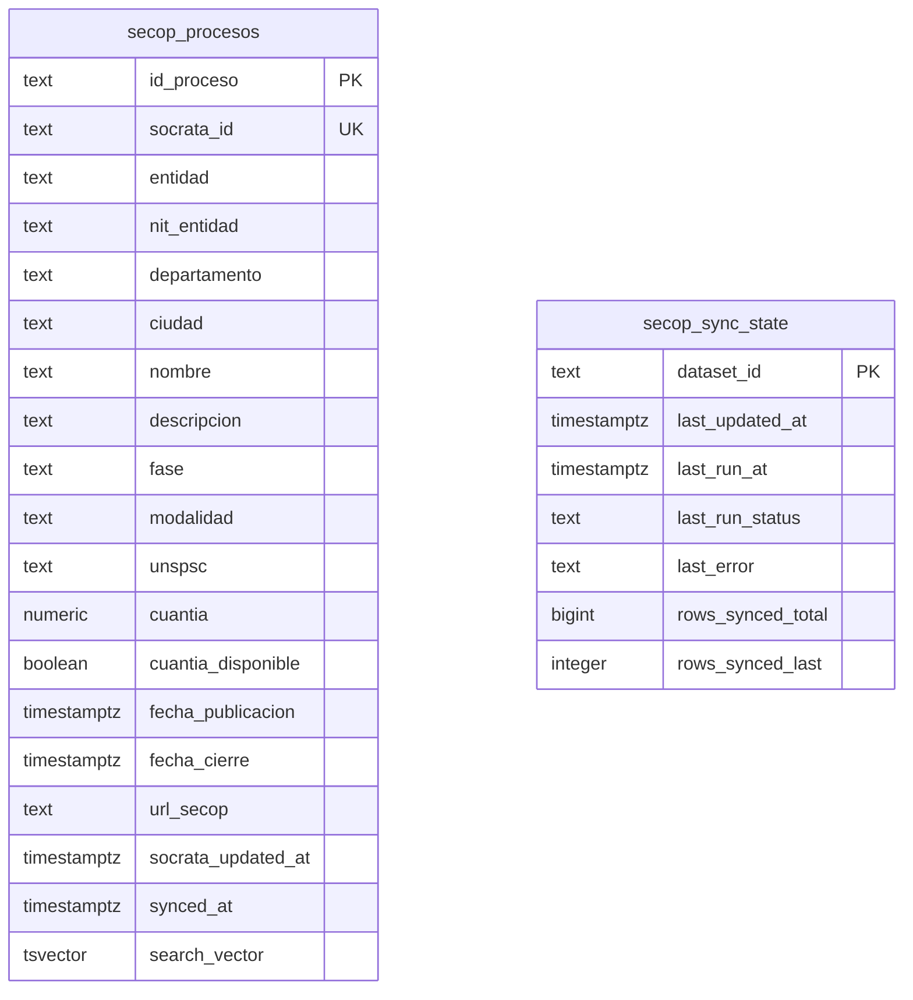

# secop-ingestion-and-listing — Software Design Document

## Intention

Replace the mock data source in the COLTRATOS proceso listing module with real SECOP II data from `datos.gov.co`. A Vercel Cron syncs procesos into a local Supabase table every 30 minutes via incremental polling. The frontend reads from an internal `/api/procesos` endpoint backed by Supabase — never from SODA directly. The business outcome is: an SME opens COLTRATOS, sees a filterable list of real open procesos, and judges whether the product is useful.

## Out of Scope

- Contratos históricos (`jbjy-vk9h`), proveedores, SECOP I, TVEC
- Semantic matching, embeddings, pgvector
- LLM pliego analysis
- Frontend listing redesign → see `procesos-listing` spec
- Auth/billing/freemium tiers
- Observability beyond Vercel logs

## Use Cases

Detailed scenarios in [use-cases.md](./use-cases.md).

| Use Case | Description |
|----------|-------------|
| UC-01 — Browse open procesos | User sees paginated list of real SECOP II procesos, filtered by departamento/fase/modalidad/cuantia |
| UC-02 — Full-text search | User types keyword, gets procesos matching nombre/descripcion/entidad |
| UC-03 — Sort procesos | User sorts by recency, closing date, or cuantia |
| UC-04 — Cron sync (incremental) | Cron fires, fetches only rows updated since last run, upserts into Supabase |
| UC-05 — Cron sync (initial backfill) | First run: fetches last 90 days of open procesos; subsequent runs are incremental |
| UC-06 — Cron resumes after partial failure | Cron marks partial, saves last `:updated_at`; next fire resumes from that cursor |

---

## Requirements

### Functional Requirements

| ID | Requirement |
|----|-------------|
| REQ-001 | Cron at `/api/cron/sync-secop` runs every 30 min, protected by `CRON_SECRET` Bearer token |
| REQ-002 | First sync backfills last 90 days of open procesos only (avoids fetching 5M+ rows) |
| REQ-003 | Subsequent syncs are incremental: only rows where `:updated_at > last_updated_at` |
| REQ-004 | Sync upserts in batches of 500 by `id_proceso`; re-runs are idempotent |
| REQ-005 | Sync state persisted in `secop_sync_state`; includes `last_updated_at`, `rows_synced_last`, `last_run_status` |
| REQ-006 | On mid-sync failure, marks `partial` and saves last consumed `:updated_at`; next cron resumes |
| REQ-007 | `GET /api/procesos` reads only from Supabase, never from SODA on the request path |
| REQ-008 | `/api/procesos` supports filters: `departamento` (comma-sep multi-value), `ciudad`, `fase` (comma-sep multi-value), `modalidad` (comma-sep multi-value), `unspsc`, `cuantia_min`, `cuantia_max`, `q`, `sort`, `page`, `page_size` |
| REQ-009 | Full-text search via `search_vector @@ websearch_to_tsquery('spanish', q)` |
| REQ-010 | Response shape matches the contract in §API Contract; paginated with `total` and `total_pages` |
| REQ-011 | Response includes empresa-scoped enrichment per row: `has_pliego` (bool), `has_analisis` (bool), `last_sem` (`verde|amarillo|rojo|null`), `last_analisis_id` (string|null); computed via LEFT JOIN through `proceso` bridge table; empresa_id sourced from JWT |
| REQ-012 | `page_size > 100` returns 400 |
| REQ-013 | All env vars validated at build time via Zod in `lib/env.ts`; build fails if missing |
| REQ-014 | Response includes filter-aware `stats` object: `total_abiertos` (fase IN open set), `cierran_esta_semana` (fecha_cierre BETWEEN now AND now+7d), `cuantia_total` (SUM where cuantia_disponible = true); computed from same filtered dataset as `data` |

### Non-Functional Requirements

| ID | Category | Requirement |
|----|----------|-------------|
| NFR-01 | Performance | `/api/procesos` p95 < 300 ms for paginated queries |
| NFR-02 | Performance | Cron incremental run with 0 changes completes in < 3 s |
| NFR-03 | Security | `DATOS_GOV_APP_TOKEN`, `CRON_SECRET` never leaked to client bundle |
| NFR-04 | Reliability | Cron timeout-aware: cuts cleanly before Vercel limit, marks `partial`, resumes next fire |
| NFR-05 | Correctness | Upsert by `id_proceso` is idempotent; duplicate runs produce no duplicate rows |
| NFR-06 | Caching | `/api/procesos` returns `Cache-Control: private, s-maxage=60, stale-while-revalidate=300` — `private` because response contains empresa-scoped enrichment |

---

## Business Rules

| Rule | Description |
|------|-------------|
| RN-001 | SODA must never be called on the user-facing request path — only via cron |
| RN-002 | Initial backfill scoped to `fecha_de_publicacion_del_proceso > now() - 90 days` AND open fase to avoid 5M+ row import |
| RN-003 | `cuantia` strings `"0"`, `""`, `"No Definido"`, `"N/A"` map to `null`; `cuantia_disponible` generated column reflects this |
| RN-004 | Dates: ISO parse; any parse failure → `null` (never throw on bad date) |
| RN-005 | SODA column names come from the snapshot in `specs/secop/dataset-schema-snapshot.json` — that file is the source of truth |
| RN-006 | Cron call without valid Bearer token → 401; no processing |
| RN-007 | Sort `closing_soon` filters `fecha_cierre > now()` to exclude already-closed procesos |
| RN-008 | `secop_sync_state` is only accessible via service role; never from client |

---

## API Contract

### `GET /api/procesos`

**Query params (all optional):**

| Param | Type | Example |
|-------|------|---------|
| `departamento` | string | `Bolívar` |
| `ciudad` | string | `Cartagena` |
| `fase` | string | `Presentación de oferta` |
| `modalidad` | string | `Mínima cuantía` |
| `cuantia_min` | number | `10000000` |
| `cuantia_max` | number | `500000000` |
| `q` | string (full-text) | `software` |
| `unspsc` | string | `43232300` |
| `page` | number (default 1) | `1` |
| `page_size` | number (default 20, max 100) | `20` |
| `sort` | enum: `recent` \| `closing_soon` \| `cuantia_desc` | `recent` |

**Response:**
```json
{
  "data": [
    {
      "id_proceso": "CO1.BDOS.XXXXXXX",
      "entidad": "ALCALDÍA DE CARTAGENA",
      "departamento": "Bolívar",
      "ciudad": "Cartagena",
      "nombre": "Adquisición de licencias de software",
      "descripcion": "...",
      "fase": "Presentación de oferta",
      "modalidad": "Mínima cuantía",
      "unspsc": "43232300",
      "cuantia": 45000000,
      "cuantia_disponible": true,
      "fecha_publicacion": "2026-04-15T10:00:00.000Z",
      "fecha_cierre": "2026-05-10T17:00:00.000Z",
      "url_secop": "https://community.secop.gov.co/...",
      "has_pliego": false,
      "has_analisis": false,
      "last_sem": null,
      "last_analisis_id": null
    }
  ],
  "pagination": {
    "page": 1,
    "page_size": 20,
    "total": 342,
    "total_pages": 18
  },
  "stats": {
    "total_abiertos": 1247,
    "cierran_esta_semana": 34,
    "cuantia_total": 8750000000
  }
}
```

> `has_pliego` and `has_analisis` are empresa-scoped. `last_sem` / `last_analisis_id` come from the most recent completed `analisis` row for this `id_proceso` + `empresa_id`. All four fields are `null` for unauthenticated callers (which are rejected by auth gate anyway). `stats` reflects the same filter set as `data` — not global totals.

---

## Test Cases

### TC-001 — Cron rejects unauthenticated call (REQ-001, RN-006)
**Given** GET to `/api/cron/sync-secop` with no Bearer token
**When** handler processes request
**Then** returns 401

### TC-002 — Initial backfill limited to 90 days (REQ-002)
**Given** `secop_sync_state.last_updated_at` is null
**When** cron fires
**Then** SODA query filters `fecha_de_publicacion_del_proceso > now()-90d`; row count < full dataset

### TC-003 — Incremental sync uses cursor (REQ-003)
**Given** `last_updated_at = T`
**When** cron fires
**Then** SODA query uses `$where=:updated_at > 'T'`; rows with `updated_at <= T` not fetched

### TC-004 — Upsert is idempotent (REQ-004, NFR-05)
**Given** 3 rows already in `secop_procesos`
**When** cron runs again with same data
**Then** still 3 rows; no duplicates; `synced_at` updated

### TC-005 — Partial failure saves cursor (REQ-006)
**Given** sync fails after processing batch 2 of 5
**When** error is caught
**Then** `last_run_status = 'partial'`; `last_updated_at` = max of batches 1-2; next cron starts from that cursor

### TC-006 — /api/procesos returns paginated response (REQ-007, REQ-010)
**Given** 50 rows in `secop_procesos`
**When** GET with `page=2&page_size=20`
**Then** `data` has 20 items; `pagination.total=50`, `pagination.page=2`, `pagination.total_pages=3`

### TC-007 — Filter by departamento (REQ-008)
**Given** rows for Bolívar and Cundinamarca
**When** GET with `departamento=Bolívar`
**Then** only Bolívar rows returned

### TC-008 — Full-text search (REQ-009)
**Given** rows with nombre containing "software" and rows without
**When** GET with `q=software`
**Then** only matching rows returned

### TC-009 — page_size > 100 rejected (REQ-012)
**When** GET with `page_size=101`
**Then** 400

### TC-010 — Sort closing_soon excludes past fechas (RN-007)
**When** GET with `sort=closing_soon`
**Then** rows with `fecha_cierre < now()` not in response; results ordered by `fecha_cierre asc`

### TC-013 — Enrichment present when empresa has pliego + analisis (REQ-011)
**Given** empresa A has a `pliego` and a completed `analisis` for `id_proceso = "X"`, empresa B does not
**When** empresa A calls `GET /api/procesos` and "X" is in results
**Then** row for "X" has `has_pliego=true`, `has_analisis=true`, `last_sem` = analisis.semaforo, `last_analisis_id` = analisis.id
**And** empresa B's token sees the same row with `has_pliego=false`, `has_analisis=false`

### TC-014 — Enrichment null when no empresa interaction (REQ-011)
**Given** empresa has never uploaded a pliego or run analysis for any proceso
**When** `GET /api/procesos`
**Then** all rows have `has_pliego=false`, `has_analisis=false`, `last_sem=null`, `last_analisis_id=null`

### TC-015 — Stats respect active filters (REQ-014)
**Given** 100 rows total, 30 in Bolívar, 10 closing this week (all in Bolívar)
**When** `GET /api/procesos?departamento=Bolívar`
**Then** `stats.total_abiertos ≤ 30`; `stats.cierran_esta_semana ≤ 10`; global totals NOT returned

### TC-011 — Env vars missing fails build (REQ-013)
**Given** `DATOS_GOV_APP_TOKEN` not set
**When** Next.js build runs
**Then** build fails with Zod error from `lib/env.ts`

### TC-012 — No secrets in client bundle (NFR-03)
**When** production build analyzed
**Then** `DATOS_GOV_APP_TOKEN` and `CRON_SECRET` absent from `.next/static`

---

## Architecture

### System Diagram



### Data Model



### Tradeoffs

| Tradeoff | We chose | Over | Rationale |
|----------|----------|------|-----------|
| Sync strategy | Incremental polling by `:updated_at` | Webhooks | SODA has no webhooks |
| Cache location | `secop_procesos` in Supabase | Redis / Vercel KV | No new infra; query flexibility; RLS included |
| Full-text search | `tsvector` generated column | pgvector embeddings | Sufficient for MVP; pgvector post-MVP |
| Backfill scope | 90 days + open fase only | Full history | Avoids 5M+ row import on first run |
| Endpoint cache | `Cache-Control s-maxage=60` | No cache | 60s staleness acceptable; reduces DB load |
| Client position | Server-side only in cron | Edge/client fetch | Keeps secrets server-side; SODA not on hot path |

### Risk Register

| Risk | Probability | Impact | Mitigation |
|------|-------------|--------|------------|
| SODA schema changes (CCE renames column) | Medium | High | Snapshot committed; mapper logs missing columns |
| Initial backfill timeout on Vercel Hobby (10s) | High | Medium | 90-day scope + open fase limit; cron resumes via `partial` |
| `cuantia` mostly NULL | Confirmed | Medium | UI shows "Cuantía no publicada"; `cuantia_disponible` flag |
| 429 throttling on SODA | Low (with token) | Low | Exponential backoff, 3 retries |
| Frontend contract differs from §API | Medium | Low | Mapper in endpoint absorbs difference; never touch frontend schema |

---

## Success Criteria

- [ ] Cron runs every 30 min without intervention for 7 days
- [ ] `secop_procesos` has >5000 rows with non-null `nombre`, `entidad`, `fecha_publicacion`
- [ ] `/api/procesos` responds p95 < 300ms for paginated queries
- [ ] COLTRATOS UI shows real filterable procesos without visible regression
- [ ] Zero credentials leaked to client bundle

---

## Pre-Approval Gate

Before running:
1. Confirm response contract (§API Contract) matches frontend expectation, or paste real shape for mapper adjustment
2. Confirm Vercel plan (Hobby = 10s timeout, Pro = 60s) — affects cron timeout strategy
3. Confirm `DATOS_GOV_APP_TOKEN` generated and saved
