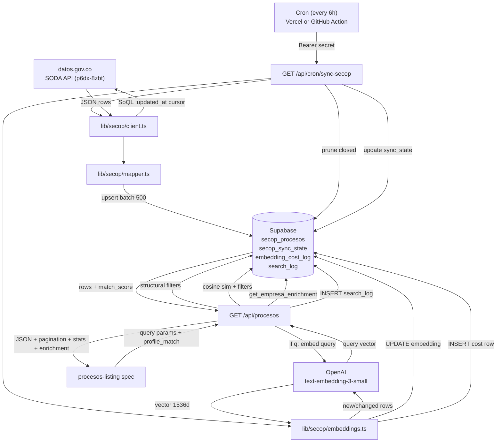
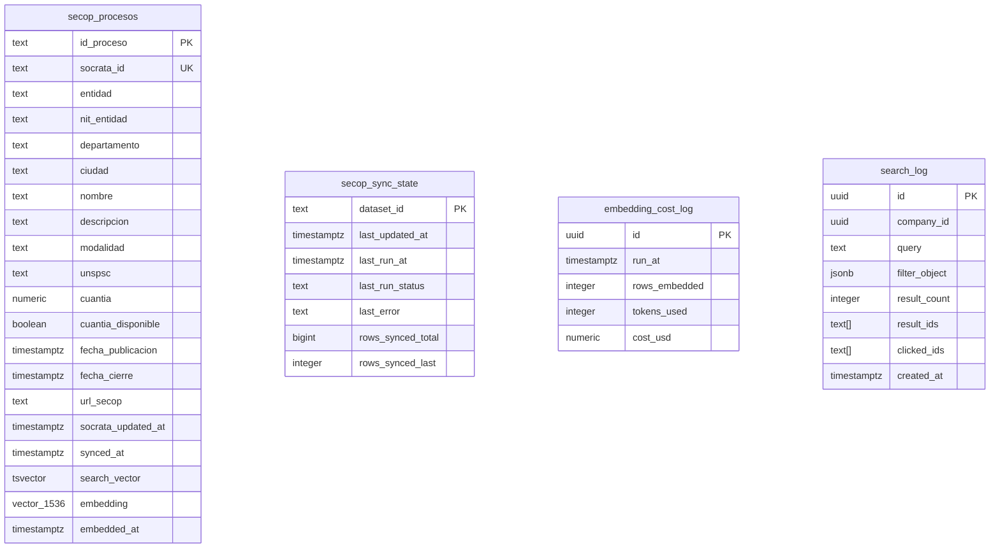

# secop-ingestion-and-listing — Software Design Document

## Intention

Replace the mock data source in the COLTRATOS proceso listing module with real SECOP II data from `datos.gov.co`. A cron job syncs open procesos into a local Supabase table every 6 hours via incremental polling, and computes semantic embeddings (OpenAI `text-embedding-3-small`) for each new or changed proceso. The frontend reads from an internal `/api/procesos` endpoint backed by Supabase — never from SODA directly. When a free-text query is present, the API embeds the query and returns results ranked by cosine similarity; when only structural filters are applied, plain SQL is used. The business outcome is: pilots discover SECOP II opportunities matching their profile criteria directly inside COLTRATOS, without needing to use SECOP's own portal.

## Out of Scope

- Contratos históricos (`jbjy-vk9h`), proveedores, SECOP I, TVEC
- LLM pliego analysis
- Frontend listing redesign → see `procesos-listing` spec
- Auth/billing/freemium tiers
- Watchlists, saved searches, email alerts, push notifications — v2
- "Similar Procesos", side-by-side comparisons — v2
- Scraping SECOP web portal — only datos.gov.co API
- Embedding full pliego documents — only `nombre` + `descripcion` fields
- Observability beyond Vercel logs and `embedding_cost_log` table

## Use Cases

Detailed scenarios in [use-cases.md](./use-cases.md).

| Use Case | Description |
|----------|-------------|
| UC-01 — Browse open procesos | User sees paginated list of real SECOP II procesos, filtered by departamento/modalidad/cuantia |
| UC-02 — Semantic search | User types keyword, gets procesos ranked by semantic similarity to `nombre`+`descripcion` |
| UC-03 — Profile-match filter | API derives UNSPSC / valor / ubicación constraints from company_profiles and applies them |
| UC-04 — Sort procesos | User sorts by recency, closing date, or cuantia |
| UC-05 — Cron sync (incremental) | Cron fires every 6 hours, fetches only rows updated since last run, upserts into Supabase, prunes closed procesos |
| UC-06 — Cron sync (initial backfill) | First run: fetches open procesos from datos.gov.co; subsequent runs are incremental |
| UC-07 — Embedding sync | After each sync batch, computes embeddings for new/changed rows; skips unchanged; logs cost |
| UC-08 — Cost logging | Each cron run appends one row to `embedding_cost_log` with tokens_used and cost_usd |

---

## Requirements

### Functional Requirements

| ID | Requirement |
|----|-------------|
| REQ-001 | Cron at `/api/cron/sync-secop` runs every 6 hours, protected by `CRON_SECRET` Bearer token |
| REQ-002 | First sync backfills open procesos only (avoids fetching 5M+ rows) |
| REQ-003 | Subsequent syncs are incremental: only rows where `:updated_at > last_updated_at` |
| REQ-004 | Sync upserts in batches of 500 by `id_proceso`; re-runs are idempotent |
| REQ-005 | Sync state persisted in `secop_sync_state`; includes `last_updated_at`, `rows_synced_last`, `last_run_status` |
| REQ-006 | On mid-sync failure, marks `partial` and saves last consumed `:updated_at`; next cron resumes |
| REQ-007 | After each sync batch, prune closed procesos: `DELETE FROM secop_procesos WHERE fecha_cierre < now()` |
| REQ-008 | Embeddings computed for new or changed rows only (detect via `socrata_updated_at > embedded_at`); unchanged rows never re-embedded |
| REQ-009 | Each embedding covers `nombre || ' ' || descripcion` (≤200 tokens); model: `text-embedding-3-small`; dimension: 1536 |
| REQ-010 | Embedding cost logged per cron run in `embedding_cost_log`: `rows_embedded`, `tokens_used`, `cost_usd` |
| REQ-011 | `GET /api/procesos` reads only from Supabase, never from SODA on the request path |
| REQ-012 | `/api/procesos` supports filters: `departamento` (multi-value), `ciudad`, `modalidad` (multi-value), `unspsc` (multi-value), `cuantia_min`, `cuantia_max`, `fecha_cierre_from`, `fecha_cierre_to`, `q`, `profile_match`, `sort`, `page`, `page_size` |
| REQ-013 | When `q` is present: embed query via OpenAI → cosine similarity search (`<=>` operator); return `match_score` per row |
| REQ-014 | When `profile_match=true`: derive filters from `company_profiles.alcance_comercial` (UNSPSC intersection, valor range, preferred departamentos); combinable with free-text |
| REQ-015 | When only structural filters (no `q`): plain SQL with indexes; no OpenAI call; `match_score` absent from response |
| REQ-016 | Every search request logged to `search_log`: `company_id`, `query`, `filter_object`, `result_count`, `result_ids` |
| REQ-017 | Response shape matches contract in §API Contract; paginated with `total` and `total_pages` |
| REQ-018 | Response includes empresa-scoped enrichment per row: `has_pliego`, `has_analisis`, `last_sem`, `last_analisis_id`; empresa_id sourced from JWT |
| REQ-019 | `page_size > 100` returns 400 |
| REQ-020 | All env vars validated at build time via Zod in `lib/env.ts`; build fails if missing |
| REQ-021 | Response includes filter-aware `stats` object: `total_abiertos`, `cierran_esta_semana`, `cuantia_total` |
| REQ-022 | Direct Proceso ID lookup available at `GET /api/procesos/[id]`: calls datos.gov.co for a single record if not in index |

### Non-Functional Requirements

| ID | Category | Requirement |
|----|----------|-------------|
| NFR-01 | Performance | `/api/procesos` p95 < 300 ms for structural-filter-only queries |
| NFR-02 | Performance | `/api/procesos` with `q` (vector search): p95 < 500 ms |
| NFR-03 | Performance | Cron incremental run with 0 changes completes in < 3 s |
| NFR-04 | Security | `DATOS_GOV_APP_TOKEN`, `CRON_SECRET`, `OPENAI_API_KEY` never leaked to client bundle |
| NFR-05 | Reliability | Cron timeout-aware: cuts cleanly before Vercel limit, marks `partial`, resumes next fire |
| NFR-06 | Correctness | Upsert by `id_proceso` is idempotent; duplicate runs produce no duplicate rows |
| NFR-07 | Correctness | Embeddings never recomputed for unchanged rows (change-detection gate) |
| NFR-08 | Caching | `/api/procesos` returns `Cache-Control: private, s-maxage=60, stale-while-revalidate=300` |

---

## Business Rules

| Rule | Description |
|------|-------------|
| RN-001 | SODA must never be called on the user-facing request path — only via cron |
| RN-002 | Sync scoped to open procesos only; closed procesos (fecha_cierre < now()) pruned after each sync batch |
| RN-003 | `cuantia` strings `"0"`, `""`, `"No Definido"`, `"N/A"` map to `null`; `cuantia_disponible` generated column reflects this |
| RN-004 | Dates: ISO parse; any parse failure → `null` (never throw on bad date) |
| RN-005 | SODA column names come from the snapshot in `specs/secop/dataset-schema-snapshot.json` — that file is the source of truth |
| RN-006 | Cron call without valid Bearer token → 401; no processing |
| RN-007 | Sort `closing_soon` filters `fecha_cierre > now()` to exclude already-closed procesos |
| RN-008 | `secop_sync_state` and `embedding_cost_log` are only accessible via service role; never from client |
| RN-009 | `match_score` is cosine similarity (0–1); only present in response when `q` is non-empty |
| RN-010 | Profile-match filter combines UNSPSC intersection, valor range, and departamento from `company_profiles`; each sub-filter is applied only if the profile field is non-null/non-empty |
| RN-011 | Embedding model output must not be logged; only token counts and cost_usd are stored |

---

## API Contract

### `GET /api/procesos`

**Query params (all optional):**

| Param | Type | Example |
|-------|------|---------|
| `departamento` | string (multi-value csv) | `Bolívar,Cundinamarca` |
| `ciudad` | string | `Cartagena` |
| `modalidad` | string (multi-value csv) | `Mínima cuantía,Licitación pública` |
| `unspsc` | string (multi-value csv) | `43232300,72000000` |
| `cuantia_min` | number | `10000000` |
| `cuantia_max` | number | `500000000` |
| `fecha_cierre_from` | ISO date string | `2026-05-01` |
| `fecha_cierre_to` | ISO date string | `2026-08-31` |
| `q` | string (free-text) | `software gestión documental` |
| `profile_match` | boolean | `true` |
| `page` | number (default 1) | `1` |
| `page_size` | number (default 20, max 100) | `20` |
| `sort` | enum: `recent` \| `closing_soon` \| `valor_desc` \| `relevance` | `relevance` |

**Response:**
```json
{
  "data": [
    {
      "id_proceso": "CO1.BDOS.XXXXXXX",
      "entidad": "ALCALDÍA DE CARTAGENA",
      "departamento": "Bolívar",
      "ciudad": "Cartagena",
      "nombre": "Adquisición de licencias de software",
      "descripcion": "...",
      "modalidad": "Mínima cuantía",
      "unspsc": "43232300",
      "cuantia": 45000000,
      "cuantia_disponible": true,
      "fecha_publicacion": "2026-04-15T10:00:00.000Z",
      "fecha_cierre": "2026-05-10T17:00:00.000Z",
      "url_secop": "https://community.secop.gov.co/...",
      "has_pliego": false,
      "has_analisis": false,
      "last_sem": null,
      "last_analisis_id": null,
      "match_score": 0.87
    }
  ],
  "pagination": {
    "page": 1,
    "page_size": 20,
    "total": 342,
    "total_pages": 18
  },
  "stats": {
    "total_abiertos": 1247,
    "cierran_esta_semana": 34,
    "cuantia_total": 8750000000
  }
}
```

> `match_score` is `null` when `q` is absent; a float 0–1 when `q` is present (cosine similarity). `has_pliego` and `has_analisis` are empresa-scoped. `stats` reflects the same filter set as `data` — not global totals. `fase` field removed from response: all synced procesos are open by definition (closed ones are pruned).

### `GET /api/procesos/[id]`

Fallback for direct lookup (closed, pre-publication, or sync-lagged procesos). Calls datos.gov.co SODA for a single record by `id_proceso`. Returns the SODA row shape (no enrichment, no match_score). 30-second timeout; on timeout returns 504.

---

## Test Cases

### TC-001 — Cron rejects unauthenticated call (REQ-001, RN-006)
**Given** GET to `/api/cron/sync-secop` with no Bearer token
**When** handler processes request
**Then** returns 401

### TC-002 — Initial sync scoped to open procesos (REQ-002)
**Given** `secop_sync_state.last_updated_at` is null
**When** cron fires
**Then** SODA query includes open-fase filter; row count reflects only open subset

### TC-003 — Incremental sync uses cursor (REQ-003)
**Given** `last_updated_at = T`
**When** cron fires
**Then** SODA query uses `$where=:updated_at > 'T'`; rows with `updated_at <= T` not fetched

### TC-004 — Upsert is idempotent (REQ-004, NFR-06)
**Given** 3 rows already in `secop_procesos`
**When** cron runs again with same data
**Then** still 3 rows; no duplicates; `synced_at` updated

### TC-005 — Closed procesos pruned after sync (REQ-007)
**Given** `secop_procesos` has 5 rows; 2 have `fecha_cierre < now()`
**When** cron completes a sync batch
**Then** 2 rows deleted; 3 rows remain

### TC-006 — Embedding computed for new rows (REQ-008)
**Given** 10 newly upserted rows with `embedded_at = null`
**When** embedding phase runs
**Then** OpenAI called; `embedding IS NOT NULL` for all 10; `embedding_cost_log` has 1 new row

### TC-007 — Embedding skipped for unchanged rows (REQ-008, NFR-07)
**Given** 10 rows already embedded with `socrata_updated_at <= embedded_at`
**When** embedding phase runs again
**Then** OpenAI not called; `embedding_cost_log` row shows `rows_embedded = 0`

### TC-008 — /api/procesos returns paginated response (REQ-011, REQ-017)
**Given** 50 rows in `secop_procesos`
**When** GET with `page=2&page_size=20`
**Then** `data` has 20 items; `pagination.total=50`, `pagination.page=2`, `pagination.total_pages=3`

### TC-009 — Structural filters: no OpenAI call (REQ-015)
**Given** GET with `departamento=Bolívar` and no `q`
**When** handler executes
**Then** OpenAI not called; all rows have `match_score=null`

### TC-010 — Vector search: match_score present (REQ-013)
**Given** GET with `q=software gestión` and rows with embeddings
**When** handler executes
**Then** OpenAI called once (for query embedding); rows have `match_score` float; ordered by `match_score desc`

### TC-011 — Profile-match derives filters from company_profiles (REQ-014)
**Given** company profile has `alcance_comercial.unspsc = ["43232300"]`, `valor_max = 500000000`
**When** GET with `profile_match=true`
**Then** only rows with `unspsc = "43232300"` AND `cuantia <= 500000000` returned

### TC-012 — Search request logged (REQ-016)
**Given** GET with `q=software` and `departamento=Bolívar`
**When** handler returns 200
**Then** `search_log` has 1 new row with `company_id`, `query="software"`, `filter_object`, `result_count`, `result_ids`

### TC-013 — page_size > 100 rejected (REQ-019)
**When** GET with `page_size=101`
**Then** 400

### TC-014 — Enrichment present when empresa has pliego + analisis (REQ-018)
**Given** empresa A has a `pliego` and a completed `analisis` for `id_proceso = "X"`, empresa B does not
**When** empresa A calls `GET /api/procesos` and "X" is in results
**Then** row for "X" has `has_pliego=true`, `has_analisis=true`, `last_sem` = analisis.semaforo, `last_analisis_id` = analisis.id
**And** empresa B's token sees the same row with `has_pliego=false`, `has_analisis=false`

### TC-015 — Stats respect active filters (REQ-021)
**Given** 100 rows total, 30 in Bolívar, 10 closing this week (all in Bolívar)
**When** `GET /api/procesos?departamento=Bolívar`
**Then** `stats.total_abiertos ≤ 30`; `stats.cierran_esta_semana ≤ 10`; global totals NOT returned

### TC-016 — Env vars missing fails build (REQ-020)
**Given** `DATOS_GOV_APP_TOKEN` not set
**When** Next.js build runs
**Then** build fails with Zod error from `lib/env.ts`

### TC-017 — No secrets in client bundle (NFR-04)
**When** production build analyzed
**Then** `DATOS_GOV_APP_TOKEN`, `CRON_SECRET`, `OPENAI_API_KEY` absent from `.next/static`

---

## Architecture

### System Diagram



### Data Model



### Tradeoffs

| Tradeoff | We chose | Over | Rationale |
|----------|----------|------|-----------|
| Sync strategy | Incremental polling by `:updated_at` | Webhooks | SODA has no webhooks |
| Search: free-text | pgvector cosine similarity | tsvector only | Semantic match over objeto_a_contratar is core product differentiator |
| Embedding model | `text-embedding-3-small` | `text-embedding-3-large` | 5× cheaper; sufficient recall for MVP |
| Cache location | `secop_procesos` in Supabase | Redis / Vercel KV | No new infra; query flexibility; RLS included |
| Backfill scope | Open procesos only | Full history | Avoids 5M+ row import on first run |
| Endpoint cache | `Cache-Control private, s-maxage=60` | No cache | 60s staleness acceptable; reduces DB load; `private` because empresa-scoped |
| Client position | Server-side only in cron | Edge/client fetch | Keeps secrets server-side; SODA not on hot path |
| Cron cadence | 6 hours | 30 minutes | Discovery flow tolerates 6h lag; reduces OpenAI embedding costs |

### Risk Register

| Risk | Probability | Impact | Mitigation |
|------|-------------|--------|------------|
| SODA schema changes (CCE renames column) | Medium | High | Snapshot committed; mapper logs missing columns |
| Initial backfill timeout on Vercel Hobby (10s) | High | Medium | Open-fase scope limit; cron resumes via `partial` |
| `cuantia` mostly NULL | Confirmed | Medium | UI shows "Cuantía no publicada"; `cuantia_disponible` flag |
| 429 throttling on SODA | Low (with token) | Low | Exponential backoff, 3 retries |
| OpenAI rate limit on embedding batch | Low | Low | Batch 20 rows per API call; retry with backoff |
| Frontend contract differs from §API | Medium | Low | Mapper in endpoint absorbs difference; never touch frontend schema |

---

## Success Criteria

- [ ] Cron runs every 6 hours without intervention for 7 days
- [ ] `secop_procesos` has >5000 rows with non-null `nombre`, `entidad`, `fecha_publicacion`
- [ ] All rows have non-null `embedding` after first cron run
- [ ] Closed procesos pruned; no row with `fecha_cierre < now()` remains after sync
- [ ] `/api/procesos` responds p95 < 300ms for structural filters, < 500ms for vector search
- [ ] COLTRATOS UI shows real filterable procesos without visible regression
- [ ] Zero credentials leaked to client bundle
- [ ] `embedding_cost_log` populated after each cron run

---

## Pre-Approval Gate

Before running:
1. Confirm `OPENAI_API_KEY` generated and saved to Vercel project settings
2. Confirm `DATOS_GOV_APP_TOKEN` generated and saved
3. Confirm Vercel plan (Hobby = 10s timeout, Pro = 60s) — affects cron timeout strategy
4. Confirm pgvector extension enabled in Supabase project (`CREATE EXTENSION IF NOT EXISTS vector`)
