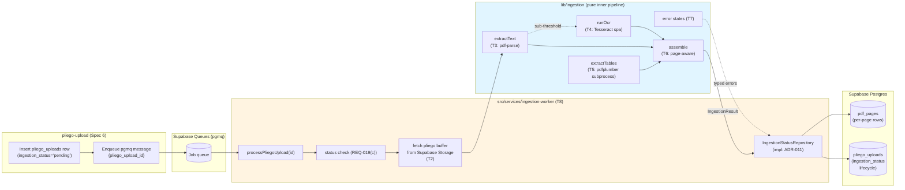
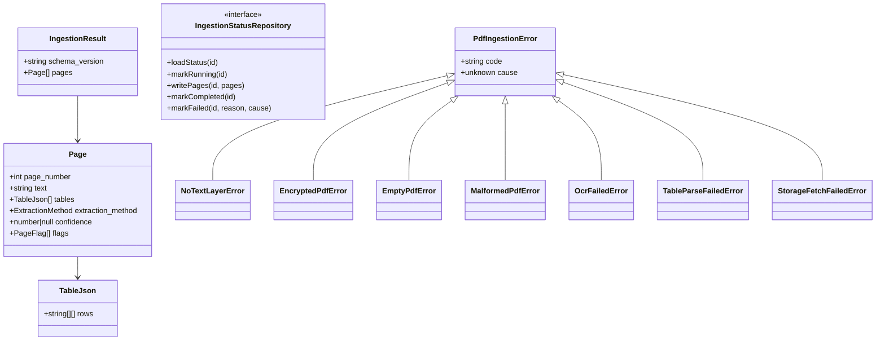
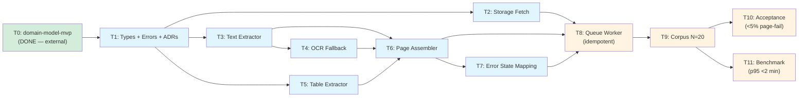

# pdf-ingestion — Feature Overview

## Spec Reference

[Spec](../../pdf-ingestion/spec/spec.md) · [Use Cases](../../pdf-ingestion/spec/use-cases.md) · [Contract](../../pdf-ingestion/contract/contract.md)

## Problem + Solution

- The MVP requires per-page extracted text and structured tables from uploaded pliegos so downstream `requisitos-extraction` can run cite-back, page-aware analysis. Per `mvp-scope.md` §59, ingestion MUST do text-layer extraction first, OCR fallback for image-only pages, and library-based table parsing — pages with no extractable content MUST be flagged, not silently dropped.
- Solution: a **queue-fed worker** invoked by Supabase Queues (pgmq). The entrypoint `processPliegoUpload(pliego_upload_id)` lives under `src/services/ingestion-worker/`; the **inner pipeline** (text extraction → OCR fallback → table extraction → page assembly) lives under `lib/ingestion/` and remains pure, testable, and deterministic.
- Architecture: the side-effectful entrypoint is split from the pure inner pipeline via a repository port (ADR-010 + ADR-011). NFR-03 scoped purity scan applies to `lib/ingestion/**` only; the worker is exempt by design.
- Hosting: the worker runs off-Vercel because Tesseract OCR requires a system install. Railway primary, Fly.io fallback (per ADR-009).
- Output: per-page rows in `pdf_pages` (owned by `domain-model-mvp`) plus a `pliego_uploads.ingestion_status` lifecycle (`pending → running → completed | failed`) with controlled `ingestion_failure_reason` vocabulary.
- v1 ingests `Pliego` only; `AnexoProceso` is stored but not ingested in v1.

## Architecture Diagram

## Data Model

No new database entities — `domain-model-mvp` rev 1 owns `pliego_uploads` (with the four ingestion columns) and `pdf_pages`. This feature produces in-memory `IngestionResult` and writes through the repository port.

**Invariant (RN-014):** `pages` is 1-indexed and contiguous. Empty pages surface with `extraction_method='empty'` and the `'no_text_extracted'` flag — never silently dropped.

## Task Index

| Task | File | Description | Dependencies |
|------|------|-------------|--------------|
| **T0** | _Prerequisite — DONE_ | `domain-model-mvp` rev 1 has shipped `pliego_uploads` ingestion columns + `pdf_pages` table + ADR-013. T0 is satisfied externally; this entry is now a verification step | (External — done 2026-05-04) |
| T1 | [01-plan-01-types-errors.md](./01-plan-01-types-errors.md) | Error hierarchy (7 subclasses) + ADRs 004/005-stub/007/008/009/010/011/012 + `IngestionResult`/`Page`/`TableJson`/`IngestionStatusRepository` types | T0 |
| T2 | [01-plan-02-storage-fetch.md](./01-plan-02-storage-fetch.md) | `fetchPliegoBuffer(id)` from Supabase Storage at per-tenant prefix | T1 |
| T3 | [01-plan-03-text-extractor.md](./01-plan-03-text-extractor.md) | `pdf-parse` per-page text extractor + typed-error mapping | T1 |
| T4 | [01-plan-04-ocr-fallback.md](./01-plan-04-ocr-fallback.md) | Tesseract OCR fallback (Spanish lang pack) + confidence capture + `'ocr_low_confidence'` flag | T1, T3 |
| T5 | [01-plan-05-table-extractor.md](./01-plan-05-table-extractor.md) | pdfplumber subprocess-based table extractor; per-page failure flags, never fails ingestion | T1 |
| T6 | [01-plan-06-page-assembler.md](./01-plan-06-page-assembler.md) | Assemble `IngestionResult` from text + OCR + tables + flags; page-contiguity invariant | T3, T4, T5 |
| T7 | [01-plan-07-error-states.md](./01-plan-07-error-states.md) | Map inner-pipeline errors onto controlled `ingestion_failure_reason` vocabulary | T1, T6 |
| T8 | [01-plan-08-queue-worker.md](./01-plan-08-queue-worker.md) | `processPliegoUpload(id)` queue-worker entrypoint; idempotent writeback per REQ-019; concurrency control | T2, T6, T7 |
| T9 | [01-plan-09-corpus.md](./01-plan-09-corpus.md) | 20-pliego corpus + `corpus.yaml` manifest + golden sketches + `tests/fixtures/pliegos/README.md` | T8 |
| T10 | [01-plan-10-acceptance.md](./01-plan-10-acceptance.md) | Acceptance test asserting <5% page-failure rate over corpus + manifest schema validation | T9 |
| T11 | [01-plan-11-bench.md](./01-plan-11-bench.md) | Performance benchmark: p95 <2 min over 200-page pliegos in corpus | T9 |

## Dependency Graph

T3, T5 can run in parallel after T1. T4 depends on T3 (sub-threshold detection). T6 joins them. T8 is the integration point. T10 + T11 share T9 as a soft prerequisite (corpus must exist).
