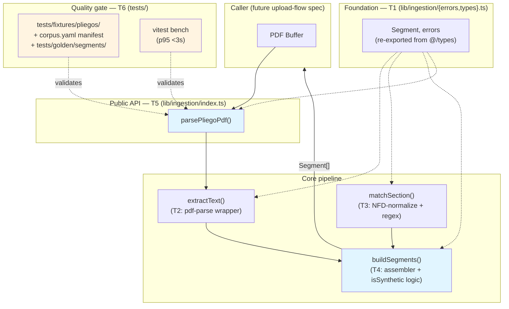
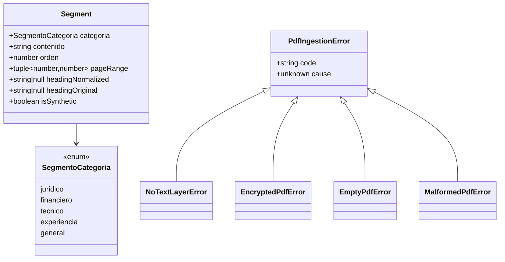
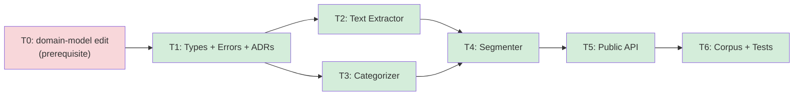

# pdf-ingestion — Feature Overview

## Spec Reference

[Spec](../../pdf-ingestion/spec/spec.md) · [Use Cases](../../pdf-ingestion/spec/use-cases.md)

## Problem + Solution

- The extraction stage cannot consume raw PDF bytes — it needs categorized text segments to bound LLM cost and stay deterministic per `Pliego`.
- Solution: a single pure async function `parsePliegoPdf(buffer): Promise<Segment[]>` under `lib/ingestion/` that does PDF text extraction and heuristic Spanish-language section categorization with no I/O.
- Module location follows the repo-wide `lib/` vs `src/services/` convention: pure utilities under `lib/`, stateful/I-O-coupled services under `src/services/`. Ingestion is pure.
- Key approach: `pdf-parse` for text extraction, NFD-normalize-then-match regex heuristics (per REQ-005's mandatory formula) for Colombian SECOP-II conventions, dual-form heading persistence (`headingNormalized` + `headingOriginal`) with explicit `isSynthetic` boolean as the intent flag, and discriminated typed errors for failure modes.
- Output: `Segment[]` consumed by `upload-flow` to persist as `segmento` rows (FK: `pliego_id`); downstream [`requisitos-extraction`](../../requisitos-extraction/spec/spec.md) filters out `isSynthetic === true` and `categoria === 'general'` segments per RN-012.
- v1 ingests `Pliego` only; `AnexoProceso` entities are stored but not parsed (orchestrator gates).

## Architecture Diagram

## Data Model

No new database entities. `Segment` is owned by `domain-model` after the prerequisite T0 edit (adds `general` category, `page_range_*` columns, dual heading columns, `is_synthetic` boolean) and the rev-3 rename (entity `Pliego` replacing `Documento`; `Segmento.pliego_id` FK). This feature only re-exports `Segment`.

**Invariant (RN-011 / DB CHECK constraints):** `isSynthetic === true` ⇔ `headingNormalized === null` ⇔ `headingOriginal === null`. Consumers branch on `isSynthetic`, not on heading nullability.

## Task Index

| Task | File | Description | Dependencies |
|------|------|-------------|--------------|
| **T0** | _Prerequisite_ — `/nybo-plan edit domain-model` (revs 2 + 3) | (rev 2) Add `general` to `SegmentoCategoria`; add `page_range_start/end`, `heading_normalized`/`heading_original` (nullable), `is_synthetic` columns; add 3 CHECK constraints; Zod `.refine()` validators. (rev 3) Rename `Documento` → `Pliego` (table + FKs); restrict `pliego_tipo` to 2 values; define sibling `AnexoProceso` (schema-only in v1). | None (blocks T1) |
| T1 | [01-plan-01-types-errors.md](./01-plan-01-types-errors.md) | `Segment` type alias + `PdfIngestionError` hierarchy + ADRs 004/005/006/007 | T0 |
| T2 | [01-plan-02-text-extractor.md](./01-plan-02-text-extractor.md) | `pdf-parse` wrapper returning per-page text array; throws typed errors on failure modes | T1 |
| T3 | [01-plan-03-categorizer.md](./01-plan-03-categorizer.md) | `matchSection()` + `normalizeForMatch()` — NFD-normalize-then-match per REQ-005's formula | T1 |
| T4 | [01-plan-04-segmenter.md](./01-plan-04-segmenter.md) | `buildSegments()` — assembles `Segment[]` with `pageRange`, dual heading capture, and `isSynthetic` correlation | T2, T3 |
| T5 | [01-plan-05-public-api.md](./01-plan-05-public-api.md) | `parsePliegoPdf()` public entry point + barrel + scoped purity scan test (NFR-03) | T4 |
| T6 | [01-plan-06-corpus-and-tests.md](./01-plan-06-corpus-and-tests.md) | 5-pliego corpus + `corpus.yaml` manifest + golden outputs + acceptance test + vitest bench | T5 |

## Dependency Graph

T2 and T3 can run in parallel after T1. T6 is the final acceptance gate.
