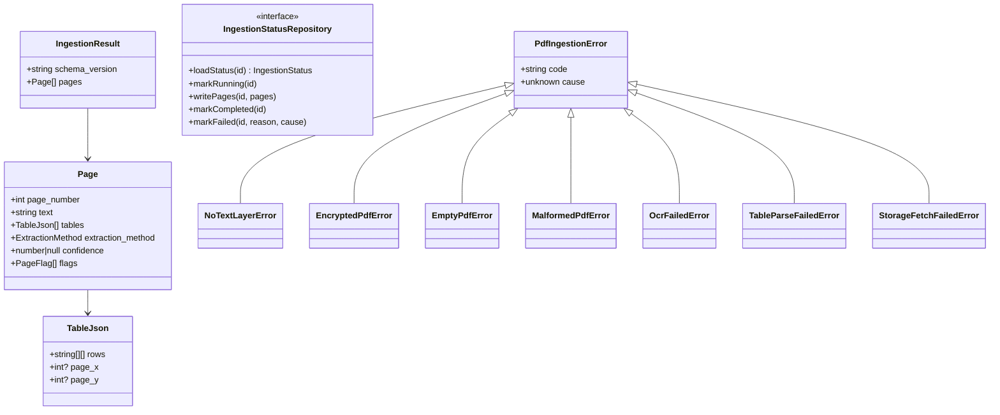
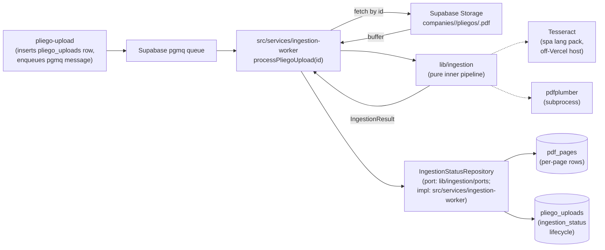

# pdf-ingestion — Software Design Document

## Changelog rev 3 → rev 4

This rev re-aligns pdf-ingestion with the consolidated MVP definition (`mvp-scope.md` §59 — *"PDF handling: text-layer extraction first, OCR fallback for image-only pages, libraries (not regex) for tables. Pages with no extractable content MUST be flagged in the result, not silently dropped"*) and the queue-fed ingestion pipeline established in the 2026-05-04 pilot-research conversation. The eight changes below are the full surface of the rev:

| # | Change | Cross-reference |
|---|--------|-----------------|
| 1 | **ADR-005 marked Superseded by ADR-010.** The rev-1 pure-only boundary precluded the queue-fed I/O entrypoint mvp-scope §59 mandates; ADR-010 replaces it with a worker boundary that splits side-effectful entry from a pure inner pipeline. | mvp-scope.md §59 |
| 2 | **ADR-010 added (queue-worker entrypoint, scoped purity preserved).** Worker entrypoint side-effectful in `src/services/ingestion-worker/`; inner pipeline pure in `lib/ingestion/`. | mvp-scope.md §59 |
| 3 | **ADR-011 added (writeback via repository port).** `IngestionStatusRepository` interface in `lib/ingestion/ports/`; `SupabaseIngestionStatusRepository` impl in `src/services/ingestion-worker/`. | mvp-scope.md §59 |
| 4 | **ADR-008 sub-decision: pdfplumber via subprocess** (vs Lambda vs sidecar). Subprocess wins for MVP. | mvp-scope.md §59 (table parsing) |
| 5 | **ADR-009 sharpened: Railway primary, Fly.io fallback** for Tesseract host (off-Vercel because Tesseract requires system install). | mvp-scope.md §59 (OCR) |
| 6 | **ADR-012 added (Supabase pgmq for job dispatch),** with pg-boss noted as fallback if pgmq reliability issues emerge in pilot. | mvp-scope.md §59 |
| 7 | **T8 idempotency requirement made explicit** — see REQ-019 below for the verbatim contract. | mvp-scope.md §59 |
| 8 | **NFR-03 scope (`lib/ingestion/**`) reaffirmed** — not a relaxation; the scoped purity boundary was introduced rev 1 and is preserved unchanged. The new worker code (`src/services/ingestion-worker/`) is exempt by design (per ADR-010 + ADR-011). | mvp-scope.md §59 |

Rev 3 was approved on 2026-04-27 as a pure-function pdf-ingestion contract. mvp-scope.md was consolidated on 2026-04-28 and codified the OCR + table-parsing + empty-page-flagging requirements (§59) that this rev now ships. The 2026-05-04 pilot-research conversation established the queue-fed pipeline (Supabase pgmq dispatch → off-Vercel worker → page-aware writeback). All 15 prior task checkboxes in `99-progress.md` were unchecked at re-plan time; no implementation work is lost.

---

## Intention

`pdf-ingestion` is the queue-fed worker that converts an uploaded pliego PDF into per-page extracted text + structured tables, writes one row per page into `pdf_pages`, and transitions `pliego_uploads.ingestion_status` from `pending → running → completed | failed`. The entrypoint is `processPliegoUpload(pliego_upload_id)` invoked by a Supabase Queues (pgmq) consumer running on an off-Vercel host (Railway primary, Fly.io fallback — required because Tesseract OCR is a system install).

The ingestion is **side-effectful at the entrypoint** (storage fetch, database writeback, queue ack) and **pure at the inner pipeline** (text → OCR → tables → page assembly). The two are split via a repository port (ADR-011): the worker depends on `IngestionStatusRepository` (interface in `lib/ingestion/ports/`); the Supabase implementation lives under `src/services/ingestion-worker/`. The inner pipeline under `lib/ingestion/` retains the rev-1 purity contract — same NFR-03 scoped scan, same forbidden-imports list — so the deterministic, testable core is unchanged in shape; only the I/O wrapper around it is new.

This split is the rev-4 architectural change: the rev-1 pure-function entrypoint (ADR-005, superseded) could not host the queue-fed lifecycle that mvp-scope §59 requires; ADR-010 + ADR-011 keep the purity boundary by moving it inward one layer.

### v1 Scope

**In scope:** Process `Pliego` uploads (`pliego_condiciones`, `pliego_definitivo`) end-to-end: storage fetch by `pliego_upload_id` → text-layer extraction → OCR fallback for sub-threshold pages → library-based table extraction → page-aware result assembly → idempotent writeback to `pdf_pages` and `pliego_uploads`. OCR (Tesseract, Spanish lang pack) and table parsing (pdfplumber via subprocess — see ADR-008) are first-class v1 features per mvp-scope §59.

**Out of scope (v1):** `AnexoProceso` entities. Anexos are stored in the database (per `domain-model-mvp`) but are not ingested in v1. Anexo ingestion may need different heuristics or a separate pipeline altogether — deferred to v1.1+. The orchestration layer (`pliego-upload` spec) is responsible for routing only Pliego uploads onto the ingestion queue.

## Use Cases

Detailed scenarios in [use-cases.md](./use-cases.md).

| Use Case | Description | User Stories |
|----------|-------------|--------------|
| [UC-01 — Ingest a clean SECOP-II pliego (page-aware output)](./use-cases.md#uc-01--ingest-a-clean-secop-ii-pliego-page-aware-output-us-01) | Worker fetches pliego from storage by `pliego_upload_id`, returns one page row per PDF page | US-01 |
| [UC-02 — Surface unparseable PDFs as typed errors (corrupted + password-protected)](./use-cases.md#uc-02--surface-unparseable-pdfs-as-typed-errors-us-02) | Encrypted, malformed, or empty PDFs surface as `failed` ingestion with discriminated `ingestion_failure_reason` | US-02 |
| [UC-04 — Validate against a labeled corpus (N=20 + page-failure-rate metric)](./use-cases.md#uc-04--validate-against-a-labeled-corpus-us-04) | CI runs the worker over 20 real pliegos and asserts <5% page-failure rate, <2 min p95 on 200-page input | US-04 |
| [UC-05 — Scanned pliego falls through to OCR successfully](./use-cases.md#uc-05--scanned-pliego-falls-through-to-ocr-successfully-us-01) | Image-only pages trigger Tesseract OCR; OCR confidence captured per page | US-01 |
| [UC-06 — Multi-column tables parsed into structured rows](./use-cases.md#uc-06--multi-column-tables-parsed-into-structured-rows-us-01) | 2-col and 3-col tables emerge as JSONB row arrays in `pdf_pages.tables` | US-01 |
| [UC-07 — Unreadable page surfaces flag without dropping](./use-cases.md#uc-07--unreadable-page-surfaces-flag-without-dropping-us-02) | A page yielding no text is inserted with `'no_text_extracted'` flag, never silently dropped | US-02 |

---

## Requirements

### Functional Requirements

| ID | Requirement | User Stories | Business Rules |
|----|-------------|--------------|----------------|
| REQ-002 | The **inner pipeline** under `lib/ingestion/` MUST remain pure: no Supabase, Storage, network, or filesystem calls; no module-level state mutation; no `console.*` or other logging side effects. The purity scope is `lib/ingestion/**` only — the worker entrypoint under `src/services/ingestion-worker/` is exempt by design (see NFR-03, ADR-010). | US-01 | RN-001 |
| REQ-007 | On encrypted PDFs (password-protected), the worker MUST set `pliego_uploads.ingestion_status = 'failed'`, `ingestion_failure_reason = 'encrypted_pdf'`, and surface a user-facing error message via the status row. The inner pipeline raises `EncryptedPdfError` (a typed subclass of `PdfIngestionError`); the worker maps it to the failure-reason vocabulary defined in `domain-model-mvp` REQ-007. | US-02 | RN-006 |
| REQ-008 | When a page's text-layer extraction yields fewer than `OCR_TRIGGER_THRESHOLD` (default 50 chars) of usable text, the inner pipeline MUST fall back to OCR (Tesseract, Spanish lang pack `spa`). OCR confidence MUST be captured and exposed on the `pdf_pages.confidence` column. | US-01 | RN-006, RN-009 |
| REQ-009 | On empty/zero-page PDFs or buffers `pdf-parse` cannot decode, the inner pipeline raises `EmptyPdfError`; the worker maps to `ingestion_failure_reason = 'pdf_unreadable'`. | US-02 | RN-006 |
| REQ-010 | All thrown errors from the inner pipeline MUST extend a common `PdfIngestionError` base class with a `code` discriminator (extended set: `NO_TEXT_LAYER`, `ENCRYPTED`, `EMPTY`, `MALFORMED`, `OCR_FAILED`, `TABLE_PARSE_FAILED`, `STORAGE_FETCH_FAILED`). The worker maps each `code` onto the controlled `ingestion_failure_reason` vocabulary. | US-02 | RN-006 |
| REQ-011 | The inner pipeline MUST be **deterministic**: invoking it twice on the same PDF buffer MUST return deeply-equal page results. The worker writeback MUST be **idempotent on `pliego_upload_id`** (re-delivery from queue retry, manual replay, or crash recovery MUST NOT produce duplicate page rows or duplicate status transitions — see REQ-019). | US-01 | RN-001, RN-007 |
| REQ-013 | **Queue-worker entrypoint signature:** `processPliegoUpload(pliego_upload_id: string): Promise<void>`. The worker is the only public surface of `src/services/ingestion-worker/`. It is invoked by the pgmq consumer (one consumer process, configurable concurrency). | US-01 | RN-013 |
| REQ-014 | **Per-page output schema** (matches `pdf_pages` columns): `{ page_number: int (1-indexed), text: string, tables: TableJson[], extraction_method: 'text_layer'|'ocr'|'table_parser'|'empty', confidence: number|null (0..1), flags: ('no_text_extracted'|'ocr_low_confidence'|'table_parse_failed'|'image_only')[] }`. The page array is contiguous, 1-indexed, with no gaps. | US-01 | RN-002, RN-014 |
| REQ-015 | **OCR trigger:** if `text-layer extracted text length < OCR_TRIGGER_THRESHOLD` (default 50 chars) for a page, run Tesseract with Spanish lang pack (`spa`). On OCR success, set `extraction_method = 'ocr'` and write the OCR-derived confidence to `confidence`. On OCR failure, raise `OcrFailedError` and let the worker set `ingestion_failure_reason = 'ocr_timeout'`. | US-01 | RN-006, RN-014 |
| REQ-016 | **Table extraction:** library-based (pdfplumber via subprocess — see ADR-008). MUST support 2-column and 3-column tables. Tables emerge as JSONB row arrays on `pdf_pages.tables`. On parse failure for a page's tables, set `'table_parse_failed'` flag and proceed; never fail the whole ingestion on a per-page table issue. | US-01 | RN-014 |
| REQ-017 | **Empty-page flag MUST surface, never silently drop.** A page yielding zero extractable content (no text-layer text, OCR also yields nothing) MUST be inserted into `pdf_pages` with `text = ''`, `extraction_method = 'empty'`, `flags = ['no_text_extracted']`. Page contiguity is preserved. | US-02 | RN-014, RN-017 |
| REQ-018 | **Storage fetch:** the worker MUST fetch the pliego file from Supabase Storage at the per-tenant prefix `companies/<company_id>/pliegos/<sha256>.pdf` derived from the `pliego_uploads` row (`uploaded_by_company_id`, `file_sha256`). On fetch failure (object missing, network error), raise `StorageFetchFailedError`; the worker maps to `ingestion_failure_reason = 'unknown'` and includes the cause. | US-01 | RN-008, RN-013 |
| REQ-019 | **Idempotent writeback (T8 contract — verbatim):** *Worker MUST be idempotent — keyed by `pliego_upload_id`. Re-delivery (queue retry, manual replay, crash recovery) MUST NOT produce duplicate page rows, duplicate ingestion_result writes, or duplicate status transitions. Implementation requirements: (a) Status writes are upserts keyed on `pliego_upload_id`. (b) Page-row writes use upsert on `(pliego_upload_id, page_number)`. (c) Worker checks `ingestion_status` at entry: if already 'completed', return without reprocessing; if 'processing' and last update older than [TIMEOUT, suggest 10 min], assume crash and reprocess; if 'processing' and recent, defer to in-flight worker. (d) Concurrency control: queue MUST guarantee at-most-one in-flight delivery per `pliego_upload_id` via visibility timeout, OR worker MUST acquire an advisory lock on `pliego_upload_id` before processing.* Resumability (continuing from partial work after crash) is NOT required in MVP — full reprocess on retry is acceptable. Documented as v1.1 candidate in `suggestions.md`. | US-01 | RN-007, RN-013 |
| REQ-020 | **Eval corpus N=20.** Provide a labeled corpus of 20 real Colombian pliegos under `tests/fixtures/pliegos/` with a `corpus.yaml` manifest listing per pliego: `source_entity`, `modalidad`, `year`, `tipo`, `manual_labels` (path to golden file: per-page expected text/tables sketch), `date_added`. | US-04 | RN-010 |
| REQ-021 | **<5% page failure rate gate.** Across the eval corpus, the aggregate fraction of pages flagged with `'no_text_extracted'`, `'ocr_low_confidence'`, or `'table_parse_failed'` MUST be <5%. CI fails otherwise. | US-04 | RN-010 |
| REQ-022 | **200-page p95 <2 min performance gate.** A vitest benchmark over the 20-pliego corpus (filtered to pliegos ≤200 pages, ≥10 iterations per fixture) MUST show p95 end-to-end ingestion time <120000ms. | US-04 | RN-010 |
| REQ-023 | **Manual table-quality review on 5 sampled pliegos.** A documented manual review pass on 5 sampled pliegos from the corpus, scoring extracted-table fidelity (rows correctly grouped, columns correctly split). Result is captured in `tests/fixtures/pliegos/table-review.md` and re-run when ADR-008 is revisited. | US-04 | RN-010 |
| REQ-024 | **Domain types** — `Page`, `TableJson`, `IngestionResult`, and the `IngestionStatusRepository` port — MUST be imported from `@/types` (or `lib/ingestion/ports/`), not redefined locally in the worker. The worker writeback maps `Page` → `pdf_pages` columns 1:1 (snake_case at the persistence boundary). | US-01 | RN-008 |

### Non-Functional Requirements

| ID | Category | Requirement |
|----|----------|-------------|
| NFR-01 | Performance | End-to-end ingestion p95 < 2 min for 200-page PDFs, measured via vitest bench over the corpus (REQ-022 gate). Includes storage fetch + text extraction + OCR fallback + table extraction + writeback. |
| NFR-02 | Correctness | <5% page failure rate across the eval corpus (REQ-021 gate). Manual table-quality review on 5 sampled pliegos (REQ-023). |
| NFR-03 | Purity (scope-shrink reaffirmation) | A CI grep test scans `lib/ingestion/**` (excluding `__tests__/` and `*.test.*` within that path; treating `tests/**` as out-of-scope) and fails if it finds: `@supabase/*`, `@anthropic-ai/sdk`, `node:fs`, `node:fs/promises`, `node:net`, `node:http`, `node:https`, common logger modules (`pino`, `winston`, `bunyan`, `@logtape/`, plus an "in-house logger module" placeholder), or `process.env.[A-Z_]+` direct reads. **The scope is `lib/ingestion/**` only** — code under `src/services/ingestion-worker/` is exempt by design (per ADR-010, ADR-011). The scope was introduced rev 1; rev 4 reaffirms it without changing the forbidden-imports list. The worker depends on `IngestionStatusRepository` from `lib/ingestion/ports/` (interface only) — the Supabase implementation lives in `src/services/`, not under `lib/`. |
| NFR-04 | File size | Each file in `lib/ingestion/` and `src/services/ingestion-worker/` stays under 500 lines (per `.nybo/foundation/conventions.yaml`). |
| NFR-05 | Type safety | `npm run typecheck` passes in strict mode with no `any` in the public API surface (worker entrypoint signature, `IngestionResult`/`Page`/`TableJson`/`IngestionStatusRepository` types). |

---

## Business Rules

| Rule | Description |
|------|-------------|
| RN-001 | The **inner pipeline** under `lib/ingestion/` is pure. The **worker** under `src/services/ingestion-worker/` is side-effectful at the entrypoint and depends on the inner pipeline through value-passing only (page-aware buffer in, `IngestionResult` out, then writeback through the repository port). The purity boundary moved inward one layer relative to rev 1 (ADR-005 superseded by ADR-010), but is preserved unchanged at its new scope. |
| RN-006 | Failure modes are **typed errors** in the inner pipeline, never silent fallbacks. The worker maps `error.code` onto the controlled `ingestion_failure_reason` vocabulary defined in `domain-model-mvp` REQ-007 (`pdf_unreadable`, `ocr_timeout`, `page_limit_exceeded`, `encrypted_pdf`, `unknown`). |
| RN-007 | The inner pipeline is **deterministic** for a given input buffer. The worker writeback is **idempotent** on `pliego_upload_id` (REQ-019). Re-delivery never produces duplicate rows. |
| RN-008 | Domain types come from `domain-model-mvp` via `@/types` and from `lib/ingestion/ports/` for the `IngestionStatusRepository` interface. The worker MUST NOT redefine `Page`, `TableJson`, `IngestionResult`, or any domain-model column shape locally. |
| RN-009 | The OCR trigger threshold (`OCR_TRIGGER_THRESHOLD = 50` chars) is a constant, not a parameter — same input always yields the same OCR/no-OCR decision per page. |
| RN-010 | The validation corpus (N=20) is a hard quality gate. CI fails if either page-failure rate exceeds 5% or 200-page p95 exceeds 120s. Lowering the thresholds requires a spec revision. |
| RN-013 | **Queue-worker boundary.** The worker is invoked exclusively by the pgmq consumer with one argument: `pliego_upload_id`. The worker fetches the file from storage, computes the `IngestionResult`, writes through the repository port, and acks the queue message. No HTTP surface, no direct user-callable function. |
| RN-014 | **Page contiguity invariant.** The page array in `IngestionResult` is 1-indexed and contiguous. No page is silently dropped. Pages with no extractable content surface with `extraction_method = 'empty'` and the `'no_text_extracted'` flag. |
| RN-015 | **OCR confidence captured + exposed.** When OCR runs for a page, the per-page confidence (Tesseract returns 0–100; normalize to 0..1) is written to `pdf_pages.confidence`. Below `OCR_LOW_CONFIDENCE_THRESHOLD = 0.5`, also append the `'ocr_low_confidence'` flag (page is not failed — flagged for downstream review). |
| RN-016 | **Storage-fetch idempotency.** Fetching the same `pliego_upload_id` twice returns the same bytes (Supabase Storage objects at `companies/<company_id>/pliegos/<sha256>.pdf` are immutable per content-addressed naming; the SHA-256 in the path enforces this). |
| RN-017 | **Ingestion-result schema versioning.** `IngestionResult` carries a `schema_version` field (string, semver). v1.0 covers the page-aware shape defined here. Schema changes require a spec edit and a new version. |

---

## Test Cases

### TC-001 — Page-aware output on a clean pliego (REQ-014, RN-002, RN-014)

**Given** a fixture pliego of 12 pages with extractable text on every page
**When** the worker runs `processPliegoUpload(id)`
**Then** `pdf_pages` contains exactly 12 rows for that `pliego_upload_id`, with `page_number` `[1, 2, ..., 12]` contiguous, every `text` non-empty, and `pliego_uploads.ingestion_status = 'completed'`

### TC-002 — Encrypted PDF maps to typed error + status row (REQ-007, REQ-010)

**Given** a password-protected fixture pliego
**When** the worker runs
**Then** `pliego_uploads.ingestion_status = 'failed'`, `ingestion_failure_reason = 'encrypted_pdf'`, and the inner pipeline raised `EncryptedPdfError`

### TC-003 — Corrupted/malformed PDF maps to typed error + status row (REQ-009, REQ-010)

**Given** a fixture file that is not a valid PDF
**When** the worker runs
**Then** `pliego_uploads.ingestion_status = 'failed'`, `ingestion_failure_reason = 'pdf_unreadable'`, and the inner pipeline raised `MalformedPdfError`

### TC-004 — OCR fallback for image-only page (REQ-008, REQ-015, RN-015)

**Given** a fixture pliego where page 3 is an image-only scan (sub-threshold text-layer extraction)
**When** the worker runs
**Then** the `pdf_pages` row for page 3 has `extraction_method = 'ocr'`, `text` is non-empty, and `confidence` is populated

### TC-005 — Multi-column table extraction (REQ-016)

**Given** a fixture pliego with a 3-column financial-indicators table on page 5
**When** the worker runs
**Then** the `pdf_pages` row for page 5 has `tables` containing at least one entry whose row-array width matches the source table's column count (≥3)

### TC-006 — Empty-page flag surfaces (REQ-017, RN-014)

**Given** a fixture pliego where page 4 yields no text from text-layer or OCR
**When** the worker runs
**Then** the `pdf_pages` row for page 4 has `text = ''`, `extraction_method = 'empty'`, `flags` includes `'no_text_extracted'`, page is NOT missing from the output

### TC-007 — Idempotent re-delivery (REQ-011, REQ-019, RN-007)

**Given** a successfully-completed `pliego_upload_id` and a re-delivery from the queue
**When** the worker runs again on the same id
**Then** no duplicate `pdf_pages` rows are inserted; status remains `completed`; the worker returns early (per REQ-019 (c))

### TC-008 — Storage fetch by id (REQ-018)

**Given** a `pliego_upload_id` whose `uploaded_by_company_id` and `file_sha256` resolve to `companies/<company_id>/pliegos/<sha256>.pdf`
**When** the worker fetches storage
**Then** the byte buffer matches the original upload (test asserts SHA-256 equality before invoking the inner pipeline)

### TC-009 — Scoped purity scan (NFR-03, RN-001)

**Given** the file tree under `lib/ingestion/`, with the scan rule: include `lib/ingestion/**`, exclude `__tests__/` and `*.test.*` within that path; `tests/**` is out-of-scope
**When** the purity grep test runs
**Then** zero matches are found for any forbidden import. The worker code under `src/services/ingestion-worker/` is **not** in scope of this test (per NFR-03 reaffirmation).

### TC-010 — Eval corpus <5% page-failure rate (REQ-021, RN-010, NFR-02)

**Given** the 20-pliego corpus
**When** the acceptance test runs
**Then** the aggregate fraction of pages flagged with any of `'no_text_extracted' | 'ocr_low_confidence' | 'table_parse_failed'` is < 0.05

### TC-011 — Performance gate p95 <2 min on 200 pages (REQ-022, NFR-01, RN-010)

**Given** the corpus filtered to pliegos ≤200 pages
**When** the vitest benchmark runs ≥10 iterations per fixture
**Then** the global p95 of end-to-end `processPliegoUpload` durations is < 120000ms

### TC-012 — Domain types imported, not redefined (REQ-024, RN-008)

**Given** the source files under `lib/ingestion/` and `src/services/ingestion-worker/`
**When** scanned for local declarations of `Page`, `TableJson`, `IngestionResult`
**Then** none are found apart from the canonical declarations in `lib/ingestion/ports/` and `@/types`

### TC-013 — `corpus.yaml` manifest schema (REQ-020)

**Given** `tests/fixtures/pliegos/corpus.yaml`
**When** parsed
**Then** every entry has `source_entity`, `modalidad`, `year`, `tipo`, `manual_labels`, `date_added`; manifest contains 20 entries; every `tipo` is a valid `pliego_tipo` enum value

---

## UX/UI

No UI in this spec. `pdf-ingestion` is a backend worker. The user-facing surfaces (upload form, status indicator, page viewer) live in the `pliego-upload` and `coltratos-app-ui` specs.

---

## Architecture

### Architecture Decision Records

| ADR | Title | Status | Impact on this feature |
|-----|-------|--------|----------------------|
| ADR-004 | `pdf-parse` as PDF text extractor | Accepted | Locked in by the user during discovery; alternatives (pdfjs-dist, pdf2json) are out of scope. ADR file authored in T1. |
| ADR-005 | Pure-function service boundary for ingestion | **Superseded by ADR-010 (rev 4)** | Originally captured the rev-1 pure-function contract. Superseded because the queue-fed entrypoint requires side-effectful I/O that the pure-only boundary precluded. *This stub is authored on 2026-05-04 to capture a decision that was planned in rev 1 but never authored on disk before being superseded in rev 4.* The pure pipeline is preserved at its new scope (`lib/ingestion/**`) under ADR-010. |
| ADR-007 | Validation corpus size and quality gates over time | Accepted (rev 4 update) | N=20 / <5% page-failure / p95 <2 min on 200 pages is the v1 ship gate (was N=5 / ≥80% match in rev 1 — tightened to align with mvp-scope §59 and the ≥85% extraction-accuracy quality bar). Larger corpora and tighter accuracy bars are gated by product milestones. ADR file updated in T9. |
| ADR-008 | Library-based table extraction via pdfplumber | Accepted (rev 4) | pdfplumber chosen for 2-col/3-col Spanish-language pliego tables. **Sub-decision: subprocess vs Lambda vs sidecar — subprocess wins** for MVP (single-container deploy, lowest operational complexity). **Revision trigger:** *Revisit subprocess packaging if (a) PDF processing volume exceeds ~500 pliegos/day sustained, (b) memory pressure from concurrent pdfplumber processes destabilizes the Node worker, or (c) Python dependency tree blocks Node container builds in CI.* |
| ADR-009 | Off-Vercel worker host for Tesseract OCR | Accepted (rev 4) | Tesseract requires a system install incompatible with Vercel's serverless runtime. **Railway primary, Fly.io fallback.** **Switch trigger:** *cost crosses $50/mo OR cold-start p95 >60s.* **Review cadence:** *Reevaluate hosting choice at end of each sprint review based on cost-observability data.* |
| ADR-010 | Queue-worker boundary split | Accepted (rev 4) | *Supersedes ADR-005 because the queue-worker entrypoint requires side-effectful I/O that the pure-only boundary precluded. Pure pipeline preserved under scoped scan.* Worker entrypoint side-effectful in `src/services/ingestion-worker/`; inner pipeline pure in `lib/ingestion/`. NFR-03 scope is reaffirmed at `lib/ingestion/**`. |
| ADR-011 | Writeback via repository port | Accepted (rev 4) | `IngestionStatusRepository` interface lives in `lib/ingestion/ports/` (interface only — no Supabase imports under `lib/`). `SupabaseIngestionStatusRepository` implementation lives under `src/services/ingestion-worker/`. Cross-references ADR-010: the port is the seam that lets the inner pipeline stay pure while the worker performs I/O. |
| ADR-012 | Supabase Queues (pgmq) for job dispatch | Accepted (rev 4) | *pgmq is not currently listed in Supabase's official feature-stage table and the product still has pre-release components (Partitioned Queue). If reliability issues emerge in pilot, fallback is pg-boss on the same Postgres instance — same primitive, different library, similar transactional properties.* Decision recorded; revisit at end of pilot if reliability or operability issues surface. |

### Tradeoffs

| Tradeoff | We chose | Over | Rationale |
|----------|----------|------|-----------|
| Purity boundary | Inner pipeline pure (`lib/ingestion/`); worker side-effectful (`src/services/ingestion-worker/`) | Single pure function; OR fully I/O-coupled service end-to-end | Preserves the rev-1 deterministic-core property where it matters (parsing, OCR, table extraction, page assembly) while honoring the queue-fed lifecycle that mvp-scope §59 mandates. The repository port (ADR-011) is the seam. |
| OCR bundling | Tesseract on off-Vercel worker host (Railway primary, Fly.io fallback) | OCR API (cloud service, per-call cost) OR no OCR (rev 1 default) | mvp-scope §59 mandates OCR fallback for image-only pages. Tesseract is one-time install + zero per-call cost, well-suited to Spanish pliegos at MVP volume. Hosting moves off Vercel because Tesseract requires a system install. |
| Table-extraction library | pdfplumber via subprocess | tabula-py (Java dep), camelot (Ghostscript dep), regex-on-text | mvp-scope §59 mandates library-based table parsing (not regex). pdfplumber is pure Python, handles 2-col/3-col Spanish tables well, and runs as a subprocess from the Node worker. ADR-008 sub-decision documents the alternatives. |
| Queue-worker boundary | Supabase pgmq + worker process | HTTP-triggered job; cron-polled job; in-process synchronous on upload | Queue-fed gives at-least-once delivery semantics for free, decouples upload latency from extraction latency, supports retry. ADR-010/011/012 are the cluster of decisions implementing this. |
| Page-aware output | One `pdf_pages` row per PDF page | One `ingestion_result` JSONB blob; OR segmented `Segment[]` (rev 1) | Per-page rows are queryable, indexable, and align with how downstream `requisitos-extraction` consumes the document (per-page cite-back). The rev-1 `Segment[]` structure was tied to a regex-categorizer that mvp-scope §59 obsoleted; categorization moves to `requisitos-extraction` over the per-page text. |

### Performance Goals & Metrics

| Metric | Target | Measurement |
|--------|--------|-------------|
| End-to-end p95, 200-page PDF | < 2 min (120000ms) | vitest bench over corpus (REQ-022) |
| Page-failure rate | < 5% | acceptance test over 20-pliego corpus (REQ-021) |
| OCR confidence (per OCR'd page) | Captured (any value 0..1) | Asserted at unit and corpus level |
| Memory ceiling per worker invocation | < 1GB RSS delta | Manual `process.memoryUsage` probe in benchmark |

### Data Model

This feature does not own any database tables — `domain-model-mvp` rev 1 owns `pliego_uploads` (with the four ingestion columns) and `pdf_pages`. This feature produces in-memory `IngestionResult` and writes it through the repository port. Shapes:



### Dependencies on `domain-model-mvp` (T0 — SATISFIED EXTERNALLY)

`domain-model-mvp` rev 1 has shipped the schema this spec depends on. T0 is therefore satisfied externally; this spec's T0 entry is now a verification step rather than a prerequisite-edit step.

Schema items shipped in `domain-model-mvp` rev 1:

1. `pliego_uploads` four ingestion columns: `ingestion_status`, `ingestion_started_at`, `ingestion_completed_at`, `ingestion_failure_reason`. **Lifecycle ownership: `pdf-ingestion` is the sole writer** (per `domain-model-mvp` REQ-007).
2. `pdf_pages` table per REQ-014 with composite PK `(pliego_upload_id, page_number)`, columns `text`, `tables` (jsonb), `extraction_method`, `confidence`, `flags`, `created_at`. RLS via join chain `pdf_pages.pliego_upload_id → pliego_uploads.uploaded_by_company_id`.
3. ADR-013 (per-page table vs JSONB blob — chose per-page table) recorded in `domain-model-mvp`.

### Dependencies on `pliego-upload` (Spec 6)

The `pliego-upload` spec owns: (a) the `pliego_upload_id` schema and the upload form flow, (b) the **queue-trigger contract** — `pliego-upload` enqueues a pgmq message containing `pliego_upload_id` after the upload row is inserted, (c) the **status callback** — the user-facing surface reads `pliego_uploads.ingestion_status` to render the upload-progress indicator. `pdf-ingestion` is the consumer of (b) and the writer of (c).

### Dependencies on `storage` (Spec 2)

The `storage` spec owns the per-tenant prefix path convention (`companies/<company_id>/pliegos/<sha256>.pdf`) and the RLS read policy on the storage bucket. `pdf-ingestion` reads from this path using a service-role client (which bypasses RLS); the user-facing read path is owned by `storage`.

### API / Data Contracts

No HTTP endpoints. The contract surface is the worker entrypoint signature plus the repository port:

```typescript
// src/services/ingestion-worker/index.ts
export function processPliegoUpload(pliego_upload_id: string): Promise<void>
// Side effects: storage fetch, IngestionResult construction, repository writes, queue ack
// Idempotent on pliego_upload_id (REQ-019)

// lib/ingestion/ports/ingestion-status-repository.ts
export interface IngestionStatusRepository {
  loadStatus(id: string): Promise<{ ingestion_status: 'pending'|'running'|'completed'|'failed', ingestion_started_at: Date | null }>
  markRunning(id: string): Promise<void>
  writePages(id: string, pages: Page[]): Promise<void>
  markCompleted(id: string): Promise<void>
  markFailed(id: string, reason: IngestionFailureReason, cause: unknown): Promise<void>
}
```

### Service Integrations



| System | Direction | Data |
|--------|-----------|------|
| `pdf-parse` (npm) | Reading | PDF buffer in; per-page text out |
| Tesseract (system install on worker host) | Reading | Per-page rasterized image; OCR text + confidence out |
| pdfplumber (Python, subprocess) | Reading | PDF buffer; structured table rows out |
| Supabase Storage | Reading | Pliego PDF object at per-tenant prefix |
| Supabase Postgres (`pliego_uploads`, `pdf_pages`) | Writing | Status transitions + per-page rows |
| Supabase pgmq | Reading + acking | Job-dispatch messages |
| `@/types` (domain-model-mvp) | Reading | Domain types |

---

## Domains Touched

- **pliego-upload** — pdf-ingestion is the consumer of the upload-queue trigger.
- **requisito-extraction** — the consumer of `pdf_pages` per-page text + tables.
- **integrations** — Tesseract, pdfplumber, Supabase Storage, Supabase pgmq are first-class integrations with their own constraints.
- **pdf-ingestion** — **candidate for new domain promotion** per ADR-007 second-strategy condition. With OCR + table extraction + queue-worker patterns, the surface is now too broad to live under `pliego-upload` only. Promote via `/nybo-curate domains` after first ship.

## Workflow Skills Applicable

- `nybo-tdd` — TDD remains the natural fit; corpus + acceptance tests are the test bedrock.
- `nybo-verify` — corpus test, benchmark, and idempotency test are the verify gates.

## Project Pattern Skills

None yet — `.nybo/skills/` is empty for this greenfield project. After this feature ships, the **queue-worker boundary split** (pure inner pipeline + side-effectful entrypoint via repository port) is a strong candidate for `/nybo-curate extract`.

---

## Revision Log

| Date | Change | Reason |
|------|--------|--------|
| 2026-04-26 | Initial draft | — |
| 2026-04-26 | Tightened three contract ambiguities: (1) scoped NFR-03 purity grep to `lib/ingestion/**` excluding test files; (2) locked NFD normalization formula and dual-form heading persistence (`headingNormalized` + `headingOriginal`) with `isSynthetic` boolean as intent flag; (3) added ADR-007 for validation corpus growth plan tied to product milestones. Path relocation `src/services/pdf-ingestion/` → `lib/ingestion/` per repo-wide `lib/` vs `src/services/` convention. | Resolving these at spec time prevents wrong defaults at Execute time and rework on column shape, normalization choice, and quality-bar trajectory. |
| 2026-04-26 | Propagation edit from domain-model rev 3: renamed all narrative references "Documento" → "Pliego" throughout spec, use-cases, task plans, contract; cache key terminology `(documento_hash, empresa_id)` → `(pliego_hash, empresa_id)`; expanded T0 prerequisite block from 8 items to 11 (adds Pliego rename, AnexoProceso defined, narrow `pliego_tipo`); added "v1 Scope" subsection making in-scope (Pliego) and out-of-scope (AnexoProceso) explicit; added "Upstream Caller Contract" subsection requiring orchestrator to gate AnexoProceso uploads from `parsePliegoPdf`; added Tradeoffs row for v1 entity scope. No functional change to function signature, purity contract, NFD strategy, heading invariants, error hierarchy, or T2/T3 parallelism. | Vocabulary alignment with domain-model rev 3. |
| 2026-04-27 | Add `process.env.*` + `@anthropic-ai/sdk` to NFR-03 (cross-spec purity-grep parity); converge logger detection to enumeration; fix residual `claude-extraction` → `requisitos-extraction` stale references; fix three Documento leftovers + verify.md `documento_id`. No functional changes. | Cross-spec purity-grep parity + vocabulary-audit closure. |
| 2026-05-04 | **Rev 4 — Re-plan to align with mvp-scope §59 + queue-fed pipeline.** Pure function → queue-fed worker; v1 ingestion is queue-fed and side-effectful at entrypoint; inner pipeline retains purity boundary. Added OCR + library-based tables + empty-page flagging as in-scope (per mvp-scope §59). REQ surface restructured (~20 REQs); RN restructured; TC restructured; ADR-005 superseded by ADR-010; ADRs 008/009/010/011/012 added; ADR-007 tightened to N=20 / <5% page-failure / p95 <2min on 200 pages. T8 idempotency expanded to verbatim contract on `pliego_upload_id`. NFR-03 scope `lib/ingestion/**` reaffirmed (worker code under `src/services/ingestion-worker/` exempt by design). T0 prerequisite satisfied externally by `domain-model-mvp` rev 1. Cross-spec follow-up: `requisitos-extraction` RN-012 (synthetic + general filter) is obsolete and must be retired in a separate Sprint 3 edit session. | Rev 3 was approved 2026-04-27 as a pure-function pdf-ingestion contract. mvp-scope.md was consolidated 2026-04-28 and codified the OCR + table-parsing + empty-page-flagging requirements (§59) that this rev now ships. The 2026-05-04 pilot-research conversation established the queue-fed pipeline. All 15 prior task checkboxes were unchecked at re-plan time; no work lost. |
