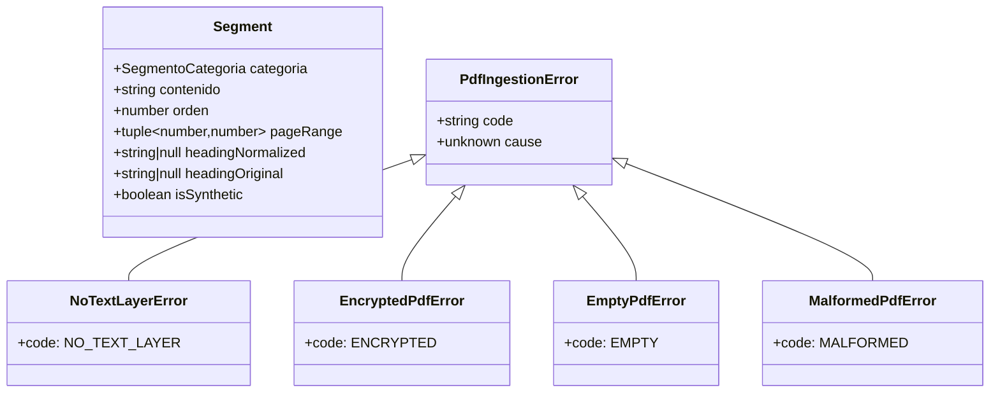
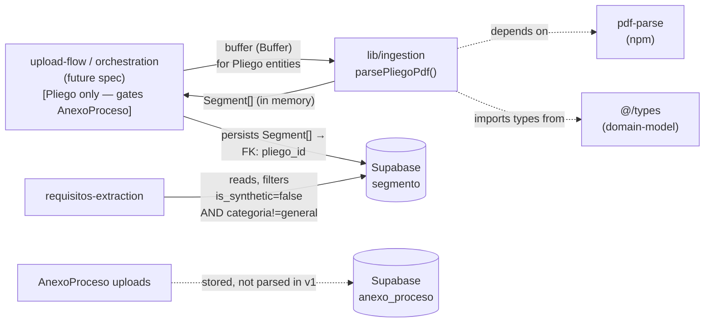

# pdf-ingestion — Software Design Document

## Intention

`pdf-ingestion` converts a raw pliego PDF buffer into a categorized list of `Segment` objects so the downstream extraction stage receives clean inputs. It is a **pure async function** — `(buffer: Buffer) => Promise<Segment[]>` — with zero side effects: no Supabase calls, no file I/O, no logging, no global state. Because parsing depends only on document bytes (not on the analyzing empresa), its results are safe to cache against the `Pliego` row, so two empresas analyzing the same proceso reuse the same segments.

It lives under `lib/ingestion/` per the repo-wide `lib/` vs `src/services/` convention: pure utilities that receive their dependencies as parameters and have no global configuration coupling go under `lib/`; stateful or I/O-coupled services that own dependency wiring live under `src/services/`.

### v1 Scope

**In scope:** Parse `Pliego` entities (`pliego_condiciones`, `pliego_definitivo`) into `Segment[]`. The function signature `parsePliegoPdf` was always correctly named for the user vocabulary; with [domain-model revision 3](../domain-model/spec/spec.md), the entity name now matches.

**Out of scope (v1):** `AnexoProceso` entities (`anexo_tecnico`, `estudio_previo`, `resolucion`, `otro`). Anexos are stored in the database (per domain-model RN-012) but are not segmented or extracted in v1. Anexo parsing may need different heuristics or a separate function altogether — deferred to v1.1+ along with OCR support. The orchestration layer (upload-flow, future spec) is responsible for routing only Pliego buffers to `parsePliegoPdf`.

## Use Cases

Detailed scenarios in [use-cases.md](./use-cases.md).

| Use Case | Description | User Stories |
|----------|-------------|-------------|
| [UC-01 — Parse a clean SECOP-II pliego](./use-cases.md#uc-01--parse-a-clean-secop-ii-pliego-us-01) | Orchestrator passes a PDF buffer; function returns ordered, categorized `Segment[]` | US-01 |
| [UC-02 — Reject unparseable PDFs with typed errors](./use-cases.md#uc-02--reject-unparseable-pdfs-with-typed-errors-us-02) | Encrypted, scanned-only, or empty PDFs return discriminated error types | US-02 |
| [UC-03 — Fall back to synthetic `general` when headers are non-standard](./use-cases.md#uc-03--fall-back-to-general-when-headers-are-non-standard-us-03) | Pliegos with unconventional section titles still produce a usable `Segment[]` | US-03 |
| [UC-04 — Validate against a labeled corpus](./use-cases.md#uc-04--validate-against-a-labeled-corpus-us-04) | CI runs the function over 5 real pliegos and asserts ≥80% category-match rate | US-04 |

---

## Requirements

### Functional Requirements

| ID | Requirement | User Stories | Business Rules |
|----|-------------|-------------|----------------|
| REQ-001 | Export a single public function `parsePliegoPdf(buffer: Buffer): Promise<Segment[]>` from `lib/ingestion/index.ts` | US-01 | RN-001 |
| REQ-002 | The function must be **pure**: no Supabase, Storage, network, or filesystem calls; no module-level state mutation; no `console.*` or other logging side effects | US-01 | RN-001 |
| REQ-003 | Each returned `Segment` must carry: `categoria`, `contenido`, `orden` (zero-indexed, contiguous), `pageRange` (`[startPage, endPage]`, 1-indexed inclusive), `headingNormalized` (`string \| null`), `headingOriginal` (`string \| null`), `isSynthetic` (`boolean`) | US-01 | RN-002, RN-003, RN-011 |
| REQ-004 | `Segment.categoria` must be one of: `juridico \| financiero \| tecnico \| experiencia \| general` — `general` is the fallback when no header pattern matches | US-01, US-03 | RN-004 |
| REQ-005 | Header detection MUST normalize input via `text.normalize('NFD').replace(/[̀-ͯ]/g, '').toLowerCase()` before applying regex. Patterns are authored in normalized form (e.g. `/\bcapacidad\s+juridica\b/`, never `/CAPACIDAD\s+JURÍDICA/i`). | US-01 | RN-005 |
| REQ-006 | Detect the following Colombian SECOP-II header families via regex against the normalized line: "capacidad juridica", "capacidad financiera", "capacidad tecnica", "experiencia", "requisitos habilitantes" | US-01 | RN-004, RN-005 |
| REQ-007 | On encrypted PDFs (password-protected), throw `EncryptedPdfError` (a typed subclass of `PdfIngestionError`) | US-02 | RN-006 |
| REQ-008 | On PDFs whose total extracted text length is below `MIN_TEXT_THRESHOLD` (200 chars), throw `NoTextLayerError` — v1 does not OCR | US-02 | RN-006, RN-009 |
| REQ-009 | On empty/zero-page PDFs or buffers `pdf-parse` cannot decode, throw `EmptyPdfError` | US-02 | RN-006 |
| REQ-010 | All thrown errors must extend a common `PdfIngestionError` base class with a `code` discriminator (`NO_TEXT_LAYER`, `ENCRYPTED`, `EMPTY`, `MALFORMED`) | US-02 | RN-006 |
| REQ-011 | The function must be **deterministic**: invoking it twice on the same buffer must return deeply-equal `Segment[]` | US-01 | RN-001, RN-007 |
| REQ-012 | Domain types `Segment` (this feature's surface), `SegmentoCategoria` (extended via T0), and the `Pliego`/`PliegoTipo` types referenced in the orchestration boundary must be imported from `@/types`, not redefined locally. The `Segment` shape's persistence-side reference is `pliego_id` (not `documento_id`) per domain-model rev 3. | US-01 | RN-008 |
| REQ-013 | When a recognized header is matched, set `isSynthetic: false`, `headingOriginal` to the source line as it appeared in the PDF (preserving case, accents, surrounding whitespace trimmed), and `headingNormalized` to the normalized form produced by the formula in REQ-005 | US-01 | RN-005, RN-011 |
| REQ-014 | For front-matter segments and no-header-fallback segments, set `isSynthetic: true`, `headingOriginal: null`, `headingNormalized: null` | US-01, US-03 | RN-011 |
| REQ-015 | Provide a labeled corpus of 5 real Colombian pliegos under `tests/fixtures/pliegos/` with a `corpus.yaml` manifest listing per pliego: `source_entity`, `modalidad`, `year`, `manual_labels` (path to golden file), `date_added` (ISO date) | US-04 | RN-010 |
| REQ-016 | Provide a vitest acceptance test that asserts category-match rate ≥80% across the corpus, where "match" means: for each golden segment, the produced segment with overlapping `pageRange` carries the same `categoria` | US-04 | RN-010 |
| REQ-017 | Provide a vitest benchmark proving p95 parse time <3s for ≤20MB PDFs, run over the corpus | US-01 | RN-007 |

### Non-Functional Requirements

| ID | Category | Requirement |
|----|----------|-------------|
| NFR-01 | Performance | p95 parse time <3s for PDFs ≤20MB, measured via vitest bench over the corpus on CI hardware |
| NFR-02 | Correctness | ≥80% category-match rate against the golden corpus (5 real pliegos, manually labeled) |
| NFR-03 | Purity | A CI grep test scans `lib/ingestion/**` (excluding any `__tests__` or `.test.*` files within that path; treating `tests/**` as out-of-scope) and fails if it finds: `@supabase/*`, `@anthropic-ai/sdk`, `node:fs`, `node:fs/promises`, `node:net`, `node:http`, `node:https`, common logger modules (`pino`, `winston`, `bunyan`, `@logtape/`, plus an "in-house logger module" placeholder for future shared loggers), or `process.env.[A-Z_]+` direct reads. The forbidden list converges with [requisitos-extraction REQ-017](../../requisitos-extraction/spec/spec.md) and [semaforo-aggregation REQ-013](../../semaforo-aggregation/spec/spec.md) for cross-spec parity — pdf-ingestion has no LLM use case today, but `@anthropic-ai/sdk` is included defensively to prevent future contributors from experimenting with LLM-based segmentation inside `lib/ingestion/`. |
| NFR-04 | File size | Each file in `lib/ingestion/` stays under 500 lines (per `.nybo/foundation/conventions.yaml`) |
| NFR-05 | Type safety | `npm run typecheck` passes in strict mode with no `any` in the public API surface |

---

## Business Rules

| Rule | Description |
|------|-------------|
| RN-001 | `parsePliegoPdf` is a **pure function**. It does not read or write the database, the filesystem, the network, or any logger. The caller (orchestration spec) owns persistence, dedup via `pliego.file_hash`, and observability. |
| RN-002 | Segments are emitted in **document order**: `orden` is zero-indexed, strictly increasing, and contiguous (no gaps). |
| RN-003 | `pageRange` is `[startPage, endPage]`, both **1-indexed and inclusive**. Page numbers reflect the PDF page index reported by `pdf-parse`. |
| RN-004 | `categoria` is constrained to: `juridico \| financiero \| tecnico \| experiencia \| general`. `general` is the **only legitimate fallback** when no header family matches; never silently drop content. |
| RN-005 | Header matching uses the **mandatory normalization formula** `text.normalize('NFD').replace(/[̀-ͯ]/g, '').toLowerCase()`. Regex patterns are authored against the normalized form. The `headingOriginal` field preserves the raw source line for UI display (Colombian users expect uppercase + accented headings); `headingNormalized` preserves the matched normalized form for analytics, re-categorization, and audit. |
| RN-006 | Failure modes are **typed errors**, never silent fallbacks. Callers discriminate via `error.code`. v1 does not OCR scanned PDFs — they are surfaced as `NO_TEXT_LAYER`. |
| RN-007 | The function is **deterministic** for a given input buffer. No randomness, no timestamps, no environment dependence in the output. |
| RN-008 | Domain types come from the domain-model spec via `@/types`. This feature must not redefine `Segmento`, `Pliego`, `SegmentoCategoria`, or any heading-related shapes. Where this feature needs a shape the domain-model lacks, the domain-model is **edited first** (see Architecture Dependencies). |
| RN-009 | The text-layer threshold (`MIN_TEXT_THRESHOLD = 200` chars) distinguishes "PDF with minimal text but real content" from "scan-only PDF". Constant, not a parameter, so behavior is reproducible. |
| RN-010 | The validation corpus is a hard quality gate. CI must fail if either category-match rate drops below 80% or p95 latency exceeds 3s. Lowering the thresholds requires a spec revision. |
| RN-011 | `isSynthetic === true` ⇔ `headingNormalized === null` ⇔ `headingOriginal === null`. The DB enforces this via two CHECK constraints (see Architecture Dependencies). `isSynthetic` is the **source of truth** for downstream logic; consumers must branch on `isSynthetic`, never on heading nullability. NULL describes the data shape; `isSynthetic` describes the intent. |
| RN-012 | **Downstream consumer contract**: [`requisitos-extraction`](../../requisitos-extraction/spec/spec.md) (and any future requisito-extraction consumer) MUST exclude both `isSynthetic === true` AND `categoria === 'general'` segments from requisito extraction. Both kinds of segments are persisted for completeness and audit but are not eligible for LLM-driven extraction. |

---

## Test Cases

### TC-001 — Returns `Segment[]` in document order on a clean pliego (REQ-001, REQ-003, RN-002)

**Given** a buffer of `tests/fixtures/pliegos/clean-pliego-001.pdf`
**When** `parsePliegoPdf(buffer)` resolves
**Then** the result is a non-empty `Segment[]` with `orden` `[0, 1, ..., n-1]` strictly increasing, and every `pageRange[0] <= pageRange[1]`

### TC-002 — Categorizes the four canonical sections correctly (REQ-006, RN-004)

**Given** the clean pliego corpus
**When** parsed
**Then** segments under "CAPACIDAD JURÍDICA" carry `categoria: 'juridico'`, "CAPACIDAD FINANCIERA" → `'financiero'`, "CAPACIDAD TÉCNICA" → `'tecnico'`, "EXPERIENCIA" → `'experiencia'`

### TC-003 — Mandatory normalization formula (REQ-005, RN-005)

**Given** synthetic single-page PDFs with the same content but headers `"CAPACIDAD FINANCIERA"`, `"capacidad financiera"`, and `"Capacidad Financiera"`
**When** each is parsed
**Then** all three return one segment with `categoria: 'financiero'`, `isSynthetic: false`, `headingNormalized: 'capacidad financiera'`, and `headingOriginal` matching the raw form (case + accents preserved)

### TC-004 — Falls back to synthetic `general` when no header matches (REQ-004, REQ-014, RN-011)

**Given** a synthetic PDF whose only header line is `"DISPOSICIONES VARIAS"` (not in any header family)
**When** parsed
**Then** the result contains at least one segment with `categoria: 'general'`, `isSynthetic: true`, `headingNormalized: null`, `headingOriginal: null`; the function does not throw

### TC-005 — Encrypted PDFs throw `EncryptedPdfError` (REQ-007, REQ-010, RN-006)

**Given** a buffer of a password-protected PDF
**When** `parsePliegoPdf(buffer)` is called
**Then** it rejects with an `EncryptedPdfError` whose `code === 'ENCRYPTED'` and `instanceof PdfIngestionError`

### TC-006 — Scan-only PDFs throw `NoTextLayerError` (REQ-008, RN-006, RN-009)

**Given** a buffer of an image-only scan
**When** parsed
**Then** it rejects with `NoTextLayerError` whose `code === 'NO_TEXT_LAYER'`

### TC-007 — Malformed buffer throws `EmptyPdfError` or `MalformedPdfError` (REQ-009, REQ-010)

**Given** a `Buffer.from('not a pdf')`
**When** parsed
**Then** it rejects with a typed `PdfIngestionError` (never raw `pdf-parse` exception)

### TC-008 — Determinism (REQ-011, RN-007)

**Given** any fixture buffer in the corpus
**When** `parsePliegoPdf(buffer)` is invoked twice
**Then** both results are deeply equal via `expect(a).toEqual(b)`

### TC-009 — Purity scan correctly scoped (NFR-03, RN-001)

**Given** the file tree under `lib/ingestion/`
**When** the purity grep test runs (excluding `__tests__/` and `*.test.*` within `lib/ingestion/`; treating `tests/**` as out-of-scope)
**Then** zero matches are found for `@supabase/*`, `node:fs`, `node:net`, `node:http`, or any logger module

### TC-010 — Corpus quality gate ≥80% (REQ-016, RN-010, NFR-02)

**Given** the 5 fixtures in `tests/fixtures/pliegos/` and matching golden outputs in `tests/golden/segments/`
**When** the acceptance test runs
**Then** category-match rate is ≥0.80

### TC-011 — Performance gate p95 <3s (REQ-017, NFR-01, RN-010)

**Given** the corpus
**When** the vitest benchmark runs each pliego ≥10 times
**Then** the p95 of `parsePliegoPdf` durations is <3000ms

### TC-012 — Domain types imported, not redefined (REQ-012, RN-008)

**Given** the source files under `lib/ingestion/`
**When** scanned for local type declarations of `Segment`, `Segmento`, or `SegmentoCategoria`
**Then** none are found (apart from re-exports); types must originate in `@/types`

### TC-013 — Real header → both heading fields populated, `isSynthetic: false` (REQ-013, RN-011)

**Given** a synthetic PDF with header line `"   CAPACIDAD JURÍDICA   "` (with surrounding whitespace)
**When** parsed
**Then** the corresponding segment has `isSynthetic: false`, `headingOriginal: 'CAPACIDAD JURÍDICA'` (trimmed), `headingNormalized: 'capacidad juridica'`

### TC-014 — Synthetic segment invariants (REQ-014, RN-011)

**Given** any segment in any output where `isSynthetic === true`
**When** inspected
**Then** `headingNormalized === null` AND `headingOriginal === null`. Conversely, `isSynthetic === false` ⇒ both heading fields are non-null.

### TC-015 — `corpus.yaml` manifest schema (REQ-015)

**Given** `tests/fixtures/pliegos/corpus.yaml`
**When** parsed
**Then** every entry has the keys `source_entity`, `modalidad`, `year`, `manual_labels`, `date_added`; `manual_labels` resolves to an existing path under `tests/golden/segments/`; `date_added` is an ISO-8601 date

---

## UX/UI

No UI in this spec. `pdf-ingestion` is a developer-facing pure utility consumed by the orchestration / upload-flow specs. The labeled corpus under `tests/fixtures/pliegos/` is the only "interface" reviewers interact with.

---

## Architecture

### Architecture Decision Records

| ADR | Title | Impact on this feature |
|-----|-------|----------------------|
| ADR-004 | `pdf-parse` as PDF text extractor | Locked in by the user during discovery; alternatives (pdfjs-dist, pdf2json) are out of scope for v1. ADR file authored in T1. |
| ADR-005 | Pure-function service boundary for ingestion | The service exposes a single async function with no side effects. Persistence and dedup are the orchestration spec's responsibility. ADR file authored in T1. |
| ADR-006 | Heuristic regex segmentation, not LLM segmentation | Bounds Claude cost; deterministic; offline-friendly. Heuristics fall back to synthetic `general` rather than escalating to LLM calls. ADR file authored in T1. |
| ADR-007 | Validation corpus size and quality gates over time | N=5 / ≥80% is the v1 ship gate. Larger corpus and tighter accuracy bars are gated by product milestones (paying user, pricing tiers), not by CI. ADR file authored in T1. |

### Tradeoffs

| Tradeoff | We chose | Over | Rationale |
|----------|----------|------|-----------|
| Purity boundary | Side-effect-free function | Service class with injected Supabase + logger | Determinism enables pliego-keyed caching; testability requires no mocks |
| Module location | `lib/ingestion/` | `src/services/pdf-ingestion/` | Repo-wide convention: pure utilities under `lib/`, stateful/I-O-coupled services under `src/services/` |
| Segmentation strategy | Regex heuristics | LLM-driven segmentation | Bounds cost; deterministic; offline-friendly |
| Header tolerance strategy | NFD-normalize-then-match (REQ-005) | Case-insensitive regex on raw form | Decouples normalization concern from pattern definitions; patterns stay simple and readable |
| Heading persistence | Dual form (`headingNormalized` + `headingOriginal`) | Single normalized form | Normalized form supports analytics + re-categorization; original form preserves Colombian convention (uppercase + accents) for UI fidelity |
| Synthetic-segment marker | Explicit `isSynthetic` boolean | Inferring from NULL heading columns | NULL describes data shape; `isSynthetic` describes intent. They correlate but are distinct concerns; consumers branching on intent stay decoupled from storage shape |
| OCR support | Out of scope (deferred to v1.1) | Tesseract or cloud OCR in v1 | Adds dependency, latency, non-determinism; v1 corpus has no scan-only pliegos |
| Fallback policy | Emit synthetic `general` segment | Throw on unrecognized headers | Pliegos with non-standard structure are common; failing would block extraction needlessly |
| Quality gate location | Corpus + golden outputs in CI | Property-based tests only | Real pliegos catch real-world chaos; golden review forces an explicit decision when the algorithm changes |
| v1 entity scope | Pliego only; AnexoProceso deferred to v1.1+ | Single ingestion entry point for all proceso documents | Anexos may need different segmentation heuristics (estudios previos and resoluciones have different structural conventions than pliegos). Keeping ingestion focused on Pliego in v1 lets the corpus and acceptance test stay tight; AnexoProceso ingestion can ship as a separable function (or extend `parsePliegoPdf` with explicit branching) without disturbing the v1 quality gates. |

### Performance Goals & Metrics

| Metric | Target | Measurement |
|--------|--------|-------------|
| p95 parse time, ≤20MB PDF | < 3s | vitest bench over corpus, ≥10 iterations per fixture |
| p99 parse time, ≤20MB PDF | < 5s (soft) | Same benchmark; soft target — not a CI gate |
| Memory ceiling per call | < 500MB RSS delta | Manual `process.memoryUsage` probe in benchmark |
| Category-match rate (corpus) | ≥ 80% (v1) | Acceptance test in `tests/acceptance/pdf-ingestion.test.ts` |

### Data Model

This feature does not own any database tables. It produces an in-memory `Segment[]` whose shape mirrors the **post-T0 `segmento` insert type** plus `pageRange` reshaped from the two columns into a tuple. Heading and synthesis fields map 1:1.



### Dependencies on `domain-model` (HARD PREREQUISITE — T0)

The following changes must ship via `/nybo-plan edit domain-model` **before T1 of this spec begins**. Items 1–8 are scoped to [domain-model revision 2](../domain-model/spec/spec.md); items 9–11 are scoped to [revision 3](../domain-model/spec/spec.md):

1. `SegmentoCategoria` enum extended with `general`.
2. `segmento.page_range_start INT NOT NULL` and `segmento.page_range_end INT NOT NULL` with `CHECK (page_range_start <= page_range_end AND page_range_start >= 1)`.
3. `segmento.heading_normalized TEXT NULL` (nullable).
4. `segmento.heading_original TEXT NULL` (nullable).
5. `segmento.is_synthetic BOOLEAN NOT NULL DEFAULT false`.
6. CHECK constraint: `(heading_normalized IS NULL AND heading_original IS NULL) OR (heading_normalized IS NOT NULL AND heading_original IS NOT NULL)` — both-or-neither.
7. CHECK constraint: `(is_synthetic = true AND heading_normalized IS NULL) OR (is_synthetic = false AND heading_normalized IS NOT NULL)` — synthetic ⇔ null heading.
8. `SegmentoSchema` (Zod) updated with `heading_normalized: z.string().nullable()`, `heading_original: z.string().nullable()`, `is_synthetic: z.boolean()`, plus a `.refine()` that mirrors the two CHECK constraints at the application layer.
9. **Pliego entity rename complete** (formerly `Documento`): table `documento` → `pliego`; FK columns `segmento.documento_id` → `pliego_id`, `analisis.documento_ids` → `pliego_ids`, `prompt_cache.documento_id` → `pliego_id`. `Segment` insert shape's persistence reference is `pliego_id`.
10. **AnexoProceso sibling entity defined** at the schema level (independent table, distinct enum, identical RLS) — schema-only in v1; not ingested by pdf-ingestion.
11. **`pliego_tipo` enum restricted** to `pliego_condiciones` and `pliego_definitivo` — anexo values live in `anexo_proceso_tipo`.

Until T0 (all 11 items) ships, this spec is blocked.

### API / Data Contracts

No HTTP endpoints. The single contract is the function signature:

```typescript
// lib/ingestion/index.ts
import type { Segment } from '@/types'

export function parsePliegoPdf(buffer: Buffer): Promise<Segment[]>
// Throws: PdfIngestionError (subclasses: NoTextLayerError | EncryptedPdfError | EmptyPdfError | MalformedPdfError)
```

### Downstream Consumer Contract

The [`requisitos-extraction`](../../requisitos-extraction/spec/spec.md) spec (and any future requisito-extraction consumer) operates over `Pliego[]` (v1 always passes exactly one `Pliego`). It MUST exclude segments where `isSynthetic === true` OR `categoria === 'general'` from requisito extraction. Both kinds are persisted for completeness and audit, but neither is eligible for LLM-driven extraction. Consumers branch on these two fields explicitly — they MUST NOT infer extraction-eligibility from heading nullability or any other indirect signal.

### Upstream Caller Contract

The `upload-flow` (or any orchestrator routing PDFs to `parsePliegoPdf`) MUST invoke this function only for `Pliego` entities (`pliego_condiciones`, `pliego_definitivo`). `AnexoProceso` PDFs are stored in the database but NOT segmented in v1. This routing is the orchestrator's responsibility, not pdf-ingestion's — the function itself is entity-agnostic at its signature (it accepts a `Buffer`). Concentrating the entity-typed routing decision in the orchestrator preserves pdf-ingestion's pure-function contract and leaves anexo parsing as a separable v1.1+ feature.

### Service Integrations



| System | Direction | Data |
|--------|-----------|------|
| `pdf-parse` (npm) | Reading | PDF buffer in; per-page text out |
| `@/types` (domain-model) | Reading | `Segment`, `SegmentoCategoria` types |
| Supabase / Storage / loggers | **None** | Pure function — no integration permitted (NFR-03) |

---

## Domains Touched

- **pliego-upload** — pdf-ingestion is the parsing leg of the upload pipeline.
- **requisito-extraction** — the consumer of `Segment[]`.

A standalone `pdf-ingestion` domain may be promoted via `/nybo-curate domains` if a second segmentation strategy ships (e.g., OCR). For v1, conventions live under `pliego-upload`.

## Workflow Skills Applicable

- `nybo-tdd` — TDD is the natural fit; corpus + golden outputs are the test bedrock.
- `nybo-verify` — corpus test and benchmark are the verify gates.

## Project Pattern Skills

None yet — `.nybo/skills/` is empty for this greenfield project. After this feature ships, the heuristic-categorizer pattern is a candidate for `/nybo-curate extract`.

---

## Revision Log

| Date | Change | Reason |
|------|--------|--------|
| 2026-04-26 | Initial draft | — |
| 2026-04-26 | Tightened three contract ambiguities: (1) scoped NFR-03 purity grep to `lib/ingestion/**` excluding test files; (2) locked NFD normalization formula and dual-form heading persistence (`headingNormalized` + `headingOriginal`) with `isSynthetic` boolean as intent flag; (3) added ADR-007 for validation corpus growth plan tied to product milestones. Path relocation `src/services/pdf-ingestion/` → `lib/ingestion/` per repo-wide `lib/` vs `src/services/` convention. | Resolving these at spec time prevents wrong defaults at Execute time and rework on column shape, normalization choice, and quality-bar trajectory. |
| 2026-04-26 | Propagation edit from [domain-model revision 3](../domain-model/spec/spec.md): renamed all narrative references "Documento" → "Pliego" throughout spec, use-cases, task plans, contract; cache key terminology `(documento_hash, empresa_id)` → `(pliego_hash, empresa_id)`; expanded T0 prerequisite block from 8 items to 11 (adds Pliego rename, AnexoProceso defined, narrow `pliego_tipo`); added "v1 Scope" subsection making in-scope (Pliego) and out-of-scope (AnexoProceso) explicit; added "Upstream Caller Contract" subsection requiring orchestrator to gate AnexoProceso uploads from `parsePliegoPdf`; added Tradeoffs row for v1 entity scope. No functional change to function signature, purity contract, NFD strategy, heading invariants, error hierarchy, or T2/T3 parallelism. | Vocabulary alignment with domain-model rev 3 — "Pliego" matches user vocabulary precisely. Without this propagation, narrative references diverge from the schema, which becomes a stale-context source for future Executor Agents. |
