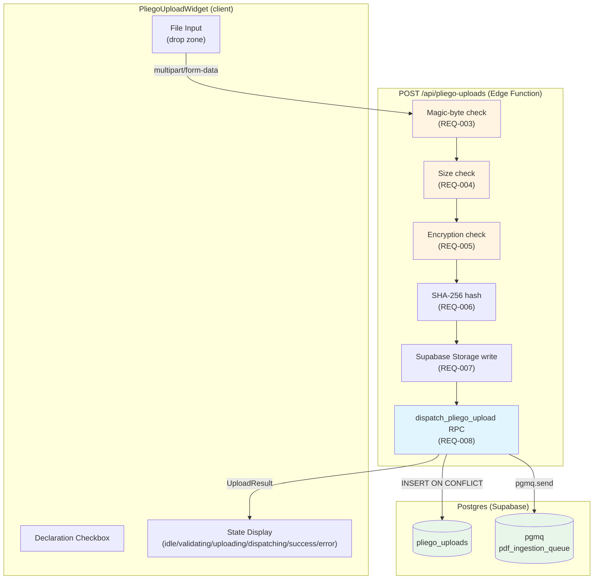
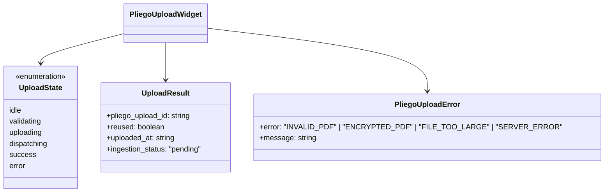
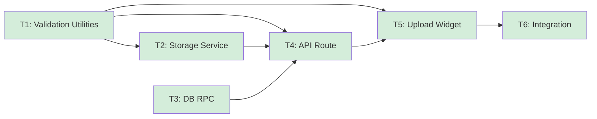

# pliego-upload — Overview

## Spec Reference

[Spec](../spec/spec.md)

## Problem + Solution

- Companies must upload a pliego PDF to trigger the semáforo analysis, but raw file uploads need a security boundary, an audit trail, and atomic queue dispatch
- Solution: server-side validation pipeline (magic bytes → size → encryption → SHA-256 → storage → RPC) backed by a DB RPC that atomically inserts the audit row and dispatches the pgmq job
- Widget is decoupled from the analysis flow so it can be lifted post-MVP; state machine covers all five discrete upload states
- Output: `pliego_upload_id` returned to the caller; `pdf-ingestion` worker picks up from there via pgmq

## Architecture Diagram

## Data Model

`pliego_uploads` schema is defined and owned by `domain-model-mvp`. This feature does not introduce new tables or migrations beyond a storage policy and one stored procedure.

## Task Index

| Task | File | Description | Dependencies |
|------|------|-------------|--------------|
| T1 | [01-plan-01-validation-utilities.md](./01-plan-01-validation-utilities.md) | Types + pure validation utilities (client + server) | None |
| T2 | [01-plan-02-storage-service.md](./01-plan-02-storage-service.md) | Supabase Storage service + pliegos bucket RLS policy migration | T1 |
| T3 | [01-plan-03-db-rpc.md](./01-plan-03-db-rpc.md) | `dispatch_pliego_upload` stored procedure + migration | None |
| T4 | [01-plan-04-api-route.md](./01-plan-04-api-route.md) | POST `/api/pliego-uploads` Edge Function | T1, T2, T3 |
| T5 | [01-plan-05-upload-widget.md](./01-plan-05-upload-widget.md) | `PliegoUploadWidget` + `DeclarationCheckbox` + `usePliegoUpload` hook | T1, T4 |
| T6 | [01-plan-06-integration.md](./01-plan-06-integration.md) | Wire widget into analysis flow step 6 page | T5 |

## Dependency Graph

