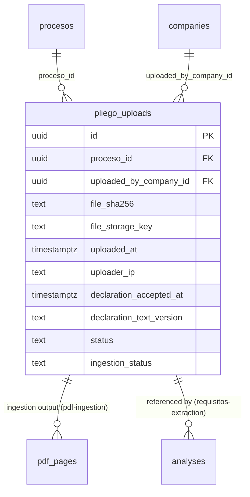
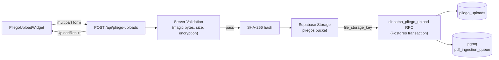

# pliego-upload — Software Design Document

## Intention

`pliego-upload` is the upload-and-dispatch layer that lets an authenticated company user attach a pliego PDF to a selected Proceso. The feature covers the full server-side trust boundary: client-side UX validation, server-side magic-byte and size enforcement, password-protection rejection, SHA-256 audit trail, Supabase Storage write, `pliego_uploads` row creation with all required audit fields, and atomic pgmq dispatch to the `pdf_ingestion_queue` — scoped to step 6 of the MVP user journey. Worker behavior, ingestion retry logic, extraction quotas, and pliego library views are explicitly out of scope.

## Use Cases

Detailed scenarios in [use-cases.md](./use-cases.md).

| Use Case | Description | User Stories |
|----------|-------------|-------------|
| [UC-01 — Upload valid pliego](./use-cases.md#uc-01--upload-valid-pliego-us-01-us-04) | User selects PDF, accepts declaration, uploads; system validates, stores, inserts row, dispatches to queue | US-01, US-04 |
| [UC-02 — Upload duplicate pliego](./use-cases.md#uc-02--upload-duplicate-pliego-us-02) | Same SHA-256 already exists for this company + proceso; system reuses row, dispatches new job, shows toast | US-02 |
| [UC-03 — Reject invalid upload](./use-cases.md#uc-03--reject-invalid-upload-us-03) | File too large, not PDF, or password-protected; system rejects with specific error before any storage write | US-03 |

---

## Requirements

### Functional Requirements

| ID | Requirement | User Stories | Business Rules |
|----|-------------|-------------|----------------|
| REQ-001 | Client-side validation: `accept="application/pdf"` on file input + MIME type check + size ≤ 25 MB check before upload starts. UX only — not security enforcement | US-03 | RN-001 |
| REQ-002 | Declaration checkbox required: upload button is disabled until declaration is checked. `declaration_accepted_at` is recorded at server-side clock time of insert, not the client timestamp | US-04 | RN-002 |
| REQ-003 | Server-side magic-byte check: first 5 bytes of received buffer MUST equal `%PDF-` (`25 50 44 46 2D`). Return HTTP 422 on mismatch, before any storage write | US-03 | RN-001 |
| REQ-004 | Server-side size enforcement: reject files > 25 MB with HTTP 413 before any further processing | US-03 | RN-001 |
| REQ-005 | Password-protection detection: detect encrypted PDFs before storage upload. Reject with HTTP 422 and message `"Este PDF está protegido con contraseña. Sube una versión sin protección."` | US-03 | RN-005 |
| REQ-006 | SHA-256 hash: compute on the server from the received buffer using `crypto.createHash('sha256')`. Record in `pliego_uploads.file_sha256` | US-01 | RN-006 |
| REQ-007 | Supabase Storage upload: write buffer to `companies/<company_id>/pliegos/<sha256>.pdf` using the service-role client. Return `file_storage_key` | US-01 | RN-006 |
| REQ-008 | Atomic insert + dispatch via DB RPC `dispatch_pliego_upload`: (a) INSERT `pliego_uploads` row with all required audit fields, (b) handle hash collision via `ON CONFLICT DO NOTHING`, (c) call `pgmq.send('pdf_ingestion_queue', '{"pliego_upload_id":"<id>"}')` in the same transaction | US-01 | RN-004, RN-008 |
| REQ-009 | Hash collision handling: when UNIQUE constraint `(proceso_id, uploaded_by_company_id, file_sha256)` fires, reuse existing row, dispatch new pgmq job, return `{ reused: true, uploaded_at: <original_uploaded_at> }` | US-02 | RN-003 |
| REQ-010 | Uploader IP: capture from `x-forwarded-for` request header; store `null` if header is absent. Best-effort audit field | US-01 | RN-007 |
| REQ-011 | `PliegoUploadWidget` is a decoupled React component with props `{ procesoId: string, companyId: string, onSuccess: (result: UploadResult) => void, onError?: (err: PliegoUploadError) => void }`. No direct dependency on parent route state | US-01 | — |
| REQ-012 | Supabase Storage RLS policy: the `pliegos` bucket MUST have an explicit SQL storage policy restricting object reads to the `company_id` extracted from the storage path matching the caller's company. DB RLS does not automatically cover Storage | US-01 | RN-009 |
| REQ-013 | Progress states: widget renders discrete states — `idle → validating → uploading → dispatching → success | error`. Each state shows visible UI feedback | US-01 | — |

### Non-Functional Requirements

| ID | Category | Requirement |
|----|----------|-------------|
| NFR-01 | Performance | API response p95 < 3 s for a 25 MB PDF on a Vercel Edge Function (dominated by Supabase Storage write latency) |
| NFR-02 | Security | Server-side validation (REQ-003, REQ-004, REQ-005) is the security boundary. Client-side filtering is UX-only and can be bypassed |
| NFR-03 | Atomicity | `pliego_uploads` INSERT and `pgmq.send` MUST execute in the same Postgres transaction via DB RPC. Storage orphans on DB failure are acceptable for MVP — 90-day auto-delete TTL is the cleanup mechanism |
| NFR-04 | Idempotency | Submitting the same file twice produces exactly one `pliego_uploads` row (collision path) and dispatches a new pgmq job each time |

---

## Business Rules

| Rule | Description |
|------|-------------|
| RN-001 | Server validation (magic bytes, size, password detection) is the security gate. Client validation is a UX convenience and MUST NOT be trusted by the server |
| RN-002 | `declaration_accepted_at` is non-nullable. The server records the server-side timestamp at insert time — the client-side checkbox action time is not trusted |
| RN-003 | Hash collision (same `proceso_id + uploaded_by_company_id + file_sha256`) is reuse, not an error. Reuse path: return existing row, dispatch new job, surface a non-blocking toast: `"Este pliego ya fue cargado el [fecha]. Se reutilizó la versión existente."` |
| RN-004 | `pgmq.send` and `pliego_uploads` INSERT MUST be in the same Postgres transaction. If either fails, both roll back |
| RN-005 | Password-protected PDFs MUST be detected and rejected BEFORE the storage upload. This prevents queue pollution (the worker would mark it `failed` anyway) and avoids charging storage for an unprocessable file |
| RN-006 | Storage upload happens before DB insert. A DB failure after a successful storage write leaves an orphaned object. This is acceptable for MVP — the 90-day auto-delete policy on the storage bucket is the cleanup mechanism |
| RN-007 | `uploader_ip` is a best-effort audit field sourced from `x-forwarded-for`. Null is a valid stored value. This is not a legally defensible audit trail — a future signed-audit-log spec would be needed for that |
| RN-008 | Scope is upload + dispatch only. No ingestion polling, no semáforo trigger beyond the pgmq dispatch. The `pdf-ingestion` worker owns all post-dispatch behavior |
| RN-009 | The Supabase Storage policy for the `pliegos` bucket MUST be authored as an explicit SQL policy in a migration. DB RLS does not automatically cover Storage object access |

---

## Test Cases

### TC-001 — Valid PDF upload creates pliego_uploads row and dispatches pgmq job (REQ-008, RN-004)

**Given** an authenticated user with `company_id = 'C1'` and a valid PDF ≤ 25 MB
**And** the declaration checkbox is checked
**When** the user submits the upload form
**Then** a `pliego_uploads` row is inserted with `file_sha256` non-null, `uploaded_by_company_id = 'C1'`, `declaration_accepted_at IS NOT NULL`, `ingestion_status = 'pending'`
**And** a pgmq message is dispatched to `pdf_ingestion_queue` containing `pliego_upload_id`
**And** the API returns HTTP 201 with `{ pliego_upload_id, reused: false }`

### TC-002 — Magic-byte check rejects non-PDF buffer before storage write (REQ-003, RN-001)

**Given** a buffer whose first 5 bytes are NOT `%PDF-`
**When** the API endpoint receives the upload
**Then** HTTP 422 is returned
**And** no object is written to Supabase Storage
**And** no `pliego_uploads` row is created

### TC-003 — Size limit rejects file > 25 MB (REQ-004, RN-001)

**Given** a file of 26 MB
**When** the upload is submitted
**Then** HTTP 413 is returned before any storage write

### TC-004 — Password-protected PDF rejected before storage write (REQ-005, RN-005)

**Given** a PDF that is password-protected
**When** the upload is submitted
**Then** HTTP 422 is returned with a message containing `"protegido con contraseña"`
**And** no storage object is written
**And** no `pliego_uploads` row is created

### TC-005 — Hash collision reuses existing row and dispatches new pgmq job (REQ-009, RN-003)

**Given** a `pliego_uploads` row exists for `(proceso_id = 'P1', uploaded_by_company_id = 'C1', file_sha256 = 'abc')`
**When** the same company uploads the same PDF for the same Proceso
**Then** no new `pliego_uploads` row is created
**And** a new pgmq message IS dispatched with the existing `pliego_upload_id`
**And** the API returns HTTP 200 with `{ pliego_upload_id, reused: true, uploaded_at: <original_uploaded_at> }`

### TC-006 — Declaration unchecked disables upload button (REQ-002, RN-002)

**Given** the widget is rendered with a valid PDF selected
**And** the declaration checkbox is unchecked
**When** the user examines the UI
**Then** the upload button is disabled and no request is sent on click attempt

### TC-007 — Widget emits onSuccess with correct shape (REQ-011)

**Given** a successful upload completes
**When** `onSuccess` is invoked
**Then** it receives `{ pliego_upload_id: string, reused: boolean, uploaded_at: string, ingestion_status: 'pending' }`

### TC-008 — Storage RLS blocks cross-company read (REQ-012, RN-009)

**Given** company A uploaded a pliego at `companies/<A_id>/pliegos/<sha256>.pdf`
**When** an authenticated user of company B attempts to read that storage object via the authenticated client
**Then** Supabase Storage returns a 403 / access denied error

### TC-009 — uploader_ip is null when x-forwarded-for is absent (REQ-010, RN-007)

**Given** a request with no `x-forwarded-for` header
**When** the upload is processed
**Then** `pliego_uploads.uploader_ip` is stored as `null`

### TC-010 — dispatch_pliego_upload RPC is atomic: no row on pgmq failure (REQ-008, RN-004)

**Given** the pgmq `send` call fails inside the RPC (simulated by disabling the pgmq extension or via exception injection in a test migration)
**When** `dispatch_pliego_upload` is called
**Then** no `pliego_uploads` row is committed to the database

---

## UX/UI

Design references pending. Follow design-system spec conventions:

- **File input:** styled drop zone with click-to-browse fallback; shows filename + size on selection
- **Declaration:** labeled checkbox with the full declaration text inline: *"Declaro que este es el documento oficial publicado en SECOP II, sin modificaciones."*
- **Upload button:** disabled until both declaration is checked AND a valid file is selected
- **Progress:** inline status indicator per state:
  - `idle` — "Selecciona un pliego PDF"
  - `validating` — spinner + "Verificando archivo…"
  - `uploading` — progress indicator + "Subiendo…"
  - `dispatching` — spinner + "Procesando…"
  - `success` — checkmark + "Pliego cargado. El análisis comenzará en breve."
  - `error` — error icon + specific message
- **Hash-collision toast:** non-blocking, shows `"Este pliego ya fue cargado el [fecha]. Se reutilizó la versión existente."`
- **Error messages:** type-specific (size limit, format mismatch, encrypted PDF)

---

## Architecture

### Architecture Decision Records

| ADR | Title | Impact on this feature |
|-----|-------|----------------------|
| ADR-003 | RLS tenant isolation | Storage policy must enforce per-company path restriction; explicit SQL migration required (RN-009) |
| ADR-008 | Pliego / AnexoProceso split | Widget handles Pliego documents only; `AnexoProceso` upload is explicitly out of scope and MUST NOT share this component |
| ADR-013 | Next.js App Router | API route uses App Router `route.ts` convention; widget is a client component with `'use client'` |

### Tradeoffs

| Tradeoff | We chose | Over | Rationale |
|----------|----------|------|-----------|
| Storage-before-DB | Upload to Supabase Storage first, then call DB RPC | DB insert first, then upload | SHA-256 must be known before insert; storage path includes SHA-256; orphaned objects are low-risk (90-day TTL cleanup recovers them) |
| DB RPC for insert + dispatch | Single `dispatch_pliego_upload` RPC for INSERT + pgmq in one transaction | Two separate client calls | Prevents stuck state: a row inserted without a pgmq message would never be ingested |
| Server-side SHA-256 | Hash computed on server from received buffer | Client-side hash before upload | Server hash is authoritative for the audit trail; client hash can be tampered |
| Non-blocking toast for collision | Reuse silently, toast after success | Require user confirmation before reuse | Collision is benign; a modal blocks users who didn't intentionally re-upload the same file |

### Performance Goals & Metrics

| Metric | Target | Measurement |
|--------|--------|-------------|
| API response time p95 | < 3 s for 25 MB PDF | Integration test with 25 MB PDF fixture |
| Client-side validation latency | < 100 ms | Manual QA on file selection (MIME + size check only) |
| Widget state transition | No flickering | Manual QA on happy path |

### Data Model

`pliego_uploads` is defined and owned by `domain-model-mvp`. This feature reads from and inserts into it but does not modify the schema.

| Entity | Key Fields | Notes |
|--------|-----------|-------|
| `pliego_uploads` | `file_sha256`, `ingestion_status`, `declaration_accepted_at` | Schema from `domain-model-mvp`; UNIQUE on `(proceso_id, uploaded_by_company_id, file_sha256)`; `ingestion_status` owned by `pdf-ingestion` |

### API / Data Contracts

| Endpoint | Method | Request | Response |
|----------|--------|---------|----------|
| `/api/pliego-uploads` | POST | `multipart/form-data`: `file: File`, `proceso_id: string` | `201: { pliego_upload_id, reused, uploaded_at, ingestion_status }` · `413: { error: 'FILE_TOO_LARGE', message }` · `422: { error: 'INVALID_PDF' | 'ENCRYPTED_PDF', message }` |

`declaration_accepted_at` is NOT sent by the client — the server records it from its own clock at insert time.

### Service Integrations

| System | Direction | Data |
|--------|-----------|------|
| Supabase Storage | Write | PDF buffer → `companies/<company_id>/pliegos/<sha256>.pdf` |
| Supabase DB | Write | `dispatch_pliego_upload` RPC → `pliego_uploads` row + pgmq message |
| pgmq `pdf_ingestion_queue` | Write | `{ pliego_upload_id: string }` dispatched inside DB RPC |

