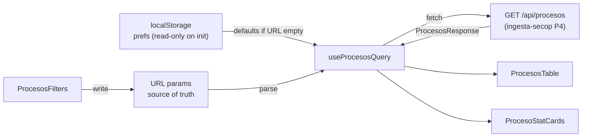
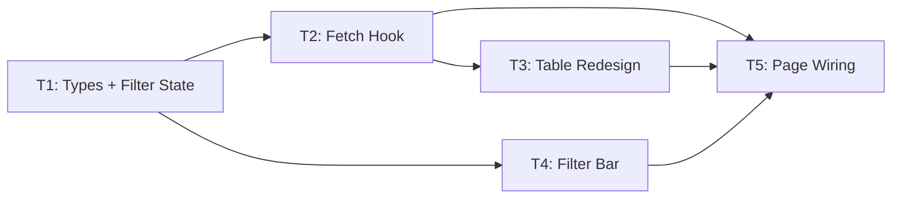

# procesos-listing — Overview

## Spec Reference

[Spec](../spec/spec.md)

## Problem + Solution

- Procesos page consumes mock data; no real SECOP rows, no empresa enrichment
- Solution: replace mock with `useProcesosQuery` hook → `/api/procesos`; URL as filter state; stat cards from `response.stats`; empresa badges from enrichment fields

## Architecture

## Task Index

| Task | File | Description | Dependencies |
|------|------|-------------|--------------|
| T1 | [01-plan-T1-types-filter-state.md](./01-plan-T1-types-filter-state.md) | Filter state type, URL serializer/deserializer, localStorage helper | ingesta-secop P4 types frozen |
| T2 | [01-plan-T2-fetch-hook.md](./01-plan-T2-fetch-hook.md) | `useProcesosQuery` hook: fetch, loading, error, pagination | T1 |
| T3 | [01-plan-T3-table-redesign.md](./01-plan-T3-table-redesign.md) | `ProcesosTable` + `ProcesoRow` components with real columns + badges | T2 |
| T4 | [01-plan-T4-filters.md](./01-plan-T4-filters.md) | `ProcesosFilters` component: multi-select, search, range, sort | T1 |
| T5 | [01-plan-T5-page-wiring.md](./01-plan-T5-page-wiring.md) | Wire page.tsx: stat cards, remove mock import, preference restore | T2, T3, T4 |

## Dependency Graph

T1 is the foundation. T2 and T4 can run in parallel after T1. T5 is the final integration.
