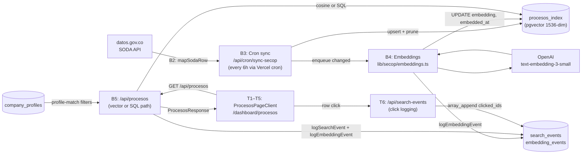
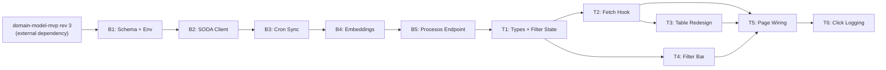

# procesos-listing — Overview

## Spec Reference

[Spec](../spec/spec.md)

## Problem + Solution

- Procesos page consumed mock data; no real SECOP rows, no semantic search, no company-profile filtering
- ingesta-secop was a separate spec covering sync + embedding + endpoint — merged here in rev 3
- Solution: B1–B5 backend tasks build the full sync + search stack; T1–T6 frontend tasks wire the UI

## System Architecture

## Task Index

| Task | File | Description | Dependencies |
|------|------|-------------|--------------|
| B1 | [01-plan-B1-schema-env.md](./01-plan-B1-schema-env.md) | Confirm domain-model-mvp rev 3 landed; set env vars | domain-model-mvp rev 3 merged |
| B2 | [01-plan-B2-soda-client.md](./01-plan-B2-soda-client.md) | SODA HTTP client, mapper (`id_proceso` → `numero_proceso`), SOQL builder | B1 |
| B3 | [01-plan-B3-cron-sync.md](./01-plan-B3-cron-sync.md) | Cron route: fetch, upsert, prune; enqueue for B4 | B2 |
| B4 | [01-plan-B4-embeddings.md](./01-plan-B4-embeddings.md) | Embed new/changed rows; write `embedding_events` | B3, OpenAI key set |
| B5 | [01-plan-B5-procesos-endpoint.md](./01-plan-B5-procesos-endpoint.md) | `/api/procesos` vector + SQL paths; profile-match; telemetry | B4 |
| T1 | [01-plan-T1-types-filter-state.md](./01-plan-T1-types-filter-state.md) | Filter state type, URL serializer/deserializer, localStorage helper | B5 types frozen |
| T2 | [01-plan-T2-fetch-hook.md](./01-plan-T2-fetch-hook.md) | `useProcesosQuery` hook: both search paths, match_score, abort | T1 |
| T3 | [01-plan-T3-table-redesign.md](./01-plan-T3-table-redesign.md) | `ProcesosTable` + `ProcesoRow`: columns, badges, match_score chip | T2 |
| T4 | [01-plan-T4-filters.md](./01-plan-T4-filters.md) | `ProcesosFilters`: profile_match toggle, UNSPSC, fecha range | T1 |
| T5 | [01-plan-T5-page-wiring.md](./01-plan-T5-page-wiring.md) | Wire page.tsx; stat cards; remove mock; direct ID lookup | T2, T3, T4 |
| T6 | [01-plan-T6-click-logging.md](./01-plan-T6-click-logging.md) | `/api/search-events` route: records clicked `numero_proceso` IDs | T5 |

## Dependency Graph

B1 is the gate. B2–B5 are linear (each depends on previous). T1–T6 are parallel where shown. T6 is the analytics tail.
