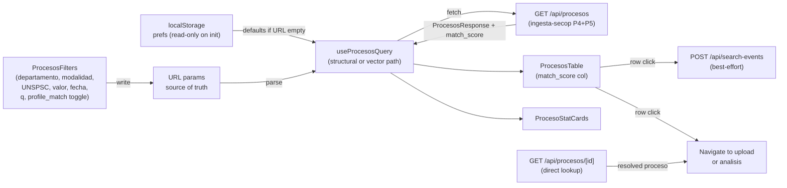
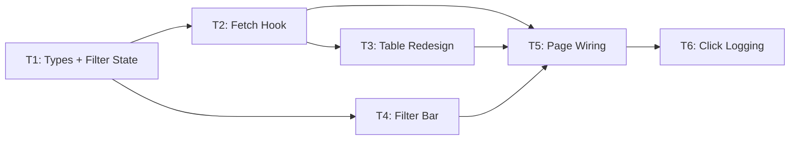

# procesos-listing — Overview

## Spec Reference

[Spec](../spec/spec.md)

## Problem + Solution

- Procesos page consumes mock data; no real SECOP rows, no empresa enrichment
- Pilots waste time browsing SECOP's slow portal; no semantic search or profile-based filtering available there
- Solution: replace mock with `useProcesosQuery` hook → `/api/procesos`; URL as filter state; semantic match score display; profile-match toggle; click logging; stat cards from `response.stats`; empresa badges from enrichment fields

## Architecture

## Task Index

| Task | File | Description | Dependencies |
|------|------|-------------|--------------|
| T1 | [01-plan-T1-types-filter-state.md](./01-plan-T1-types-filter-state.md) | Filter state type (incl. profile_match, UNSPSC, fecha_cierre, match_score), URL serializer/deserializer, localStorage helper | ingesta-secop P4+P5 types frozen |
| T2 | [01-plan-T2-fetch-hook.md](./01-plan-T2-fetch-hook.md) | `useProcesosQuery` hook: both search paths, match_score awareness, click beacon | T1 |
| T3 | [01-plan-T3-table-redesign.md](./01-plan-T3-table-redesign.md) | `ProcesosTable` + `ProcesoRow`: real columns, badges, match_score chip, click handler | T2 |
| T4 | [01-plan-T4-filters.md](./01-plan-T4-filters.md) | `ProcesosFilters`: profile_match toggle, UNSPSC multi-select, fecha cierre range, modalidad, departamento | T1 |
| T5 | [01-plan-T5-page-wiring.md](./01-plan-T5-page-wiring.md) | Wire page.tsx: stat cards, remove mock, preference restore, direct ID lookup | T2, T3, T4 |
| T6 | [01-plan-T6-click-logging.md](./01-plan-T6-click-logging.md) | `/api/search-events` route: records clicked processo IDs in search_log | T5 |

## Dependency Graph

T1 is the foundation. T2 and T4 can run in parallel after T1. T5 is the integration layer. T6 is the analytics layer added last.
