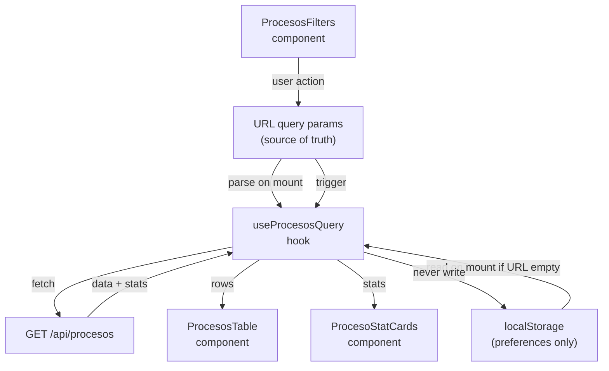

# procesos-listing — Software Design Document

## Intention

Redesign the `/dashboard/procesos` page to replace mock data with real SECOP II procesos from `/api/procesos` (delivered by `ingesta-secop`). The listing shows empresa-enriched SECOP data with server-side filters, URL-persistent state, filter-aware stat cards, and three distinct loading/empty/error states. The business outcome is: an authenticated user opens COLTRATOS, sees a personalized, filterable list of real open procesos with indicators showing which ones they have already uploaded pliego or run analysis for.

## Depends On

- `ingesta-secop` P4 fully shipped: `/api/procesos` must be live with enrichment + stats before this spec executes.
- `src/types/domain/procesos.ts` (frozen contract): `ProcesoListItem`, `ProcesosResponse`, `ProcesosStats`.

## Out of Scope

- Semáforo live-calculation for unanalyzed procesos — verdict only shown for rows where `has_analisis = true`
- Empresa profile filter preferences stored in DB — MVP uses localStorage; DB column is post-MVP
- UNSPSC autocomplete — filter present but simple text input in MVP
- Cierre date picker — filter present but simple text input in MVP
- `/mi-actividad` page (empresa stats dashboard) — separate spec

## Use Cases

Detailed scenarios in [use-cases.md](./use-cases.md).

| Use Case | Description |
|----------|-------------|
| UC-01 — Personalized listing on first visit | User lands on procesos page; filters pre-applied from localStorage (or empty if none saved); real SECOP rows visible |
| UC-02 — Multi-filter by departamento + modalidad | User selects multiple departamentos and modalidades; URL updates; stat cards reflect filtered subset |
| UC-03 — Keyword search | User types in search box; debounced request to `/api/procesos?q=...`; results update |
| UC-04 — Paginate through results | User clicks next page; URL `page` param updates; scroll to top |
| UC-05 — Share filtered view via URL | User copies URL with filter params; another user opens it and sees same filtered view |
| UC-06 — See empresa badges | Rows with `has_pliego=true` show "Pliego subido" badge; `has_analisis=true` shows semáforo pill |
| UC-07 — Empty state: no matching procesos | All active filters return 0 results; clear-filters CTA visible |
| UC-08 — Empty state: no data synced | `secop_procesos` table is empty (cron not run yet); system message shown |
| UC-09 — Restore saved preferences | User clicks "Restaurar preferencias"; localStorage defaults reapplied |

---

## Requirements

### Functional Requirements

| ID | Requirement |
|----|-------------|
| REQ-001 | Page fetches from `GET /api/procesos` with current filter state serialized as URL query params |
| REQ-002 | Filter state is serialized to URL on every change; browser back/forward navigates filter history |
| REQ-003 | Supported filters: `departamento` (multi-select), `modalidad` (multi-select), `fase` (multi-select), `q` (full-text), `cuantia_min`, `cuantia_max`, `sort`, `page`, `page_size` |
| REQ-004 | On first visit with no URL params: apply saved localStorage preferences (if any); otherwise default to fase=open, sort=recent, page_size=20 |
| REQ-005 | "Limpiar filtros" button resets all filters to global defaults (no localStorage reapplication) |
| REQ-006 | "Restaurar preferencias" button reapplies localStorage-saved filter state |
| REQ-007 | Filter changes reset `page` to 1 (avoid stale pagination) |
| REQ-008 | `q` input debounced 400ms before triggering fetch |
| REQ-009 | Stat cards display `total_abiertos`, `cierran_esta_semana`, `cuantia_total` from `response.stats`; values reflect active filters |
| REQ-010 | Table columns: sem indicator, Proceso (nombre + id_proceso), Entidad, Modalidad, Cuantía (formatted), Cierre (formatted), Badges (pliego/análisis), Actions |
| REQ-011 | Sem indicator: shows `SemPill` if `has_analisis=true` with `last_sem` value; shows neutral grey dot if `has_analisis=false` |
| REQ-012 | Empresa badges: "Pliego" chip if `has_pliego=true`; "Analizado" chip if `has_analisis=true` |
| REQ-013 | Row click: if `has_analisis=true` → navigate to `/dashboard/analisis/${last_analisis_id}`; else → navigate to `/dashboard/upload?procesoId=${id_proceso}` |
| REQ-014 | Loading state on filter change: table shows skeleton rows; stat cards show spinner |
| REQ-015 | Pagination loading state: subtle overlay on table (not skeleton) |
| REQ-016 | Empty state A ("no matching"): triggered when `data.length === 0` AND active filters exist; shows "Sin procesos con estos filtros" + "Limpiar filtros" CTA |
| REQ-017 | Empty state B ("no data synced"): triggered when `data.length === 0` AND no active filters; shows "Aún no hay procesos sincronizados" system message |
| REQ-018 | Error state: fetch returns non-200; shows "Error al cargar procesos" + retry button |
| REQ-019 | `datos.gov.co` never called from browser; dev tools show only requests to `/api/procesos` |

### Non-Functional Requirements

| ID | Category | Requirement |
|----|----------|-------------|
| NFR-01 | Performance | Filter change to table update < 500ms p95 (network time from local `/api/procesos` p95 300ms + render) |
| NFR-02 | UX | URL updates synchronously on filter change (no debounce on URL write) |
| NFR-03 | Correctness | No mock data imported anywhere in procesos page or its components |
| NFR-04 | Correctness | `DATOS_GOV_APP_TOKEN` and `CRON_SECRET` absent from `.next/static` bundle |
| NFR-05 | Accessibility | Filter selects and search input have visible labels; table has proper `<th>` headers |

### Business Rules

| Rule | Description |
|------|-------------|
| RN-001 | Sem indicator only shown when `has_analisis=true`; never infer verdict from SECOP data |
| RN-002 | Filter state serialized as URL params; URL is the single source of truth for active filters |
| RN-003 | localStorage preferences are defaults only — URL params override them; never push URL state to localStorage |
| RN-004 | `cuantia_total` displayed as COP formatted string (e.g. "$8.750.000.000"); null/zero shown as "—" |
| RN-005 | Row click destination depends on enrichment; always prefer analisis view over upload if analysis exists |
| RN-006 | Default open-fase set: `['Presentación de oferta', 'Borrador', 'Convocatoria', 'Pliego definitivo', 'En Proceso']` |

---

## Test Cases

### TC-001 — Page fetches from /api/procesos on mount (REQ-001)
**Given** user navigates to `/dashboard/procesos` with no URL params
**When** page mounts
**Then** fetch to `/api/procesos?fase=Presentación+de+oferta,...&sort=recent&page=1&page_size=20` made; mock not called

### TC-002 — Filter change updates URL (REQ-002)
**Given** user is on procesos page
**When** user selects "Bolívar" in departamento filter
**Then** URL changes to include `departamento=Bolívar`; new fetch triggered

### TC-003 — Multi-select departamento (REQ-003)
**Given** user selects "Bolívar" then "Cundinamarca"
**When** fetch fires
**Then** request includes `departamento=Bolívar%2CCundinamarca`

### TC-004 — Filter change resets page (REQ-007)
**Given** user is on page 3
**When** user changes departamento filter
**Then** URL `page=1`; fetch uses `page=1`

### TC-005 — q debounce (REQ-008)
**Given** user types "softw" then "software" within 400ms
**When** 400ms passes
**Then** exactly one fetch with `q=software`; no fetch for "softw"

### TC-006 — Stat cards from response.stats (REQ-009)
**Given** API returns `stats.total_abiertos=47`, `cierran_esta_semana=8`, `cuantia_total=8750000000`
**When** page renders
**Then** stat cards show "47", "8", "$8.750.000.000"

### TC-007 — Badges shown correctly (REQ-012)
**Given** row with `has_pliego=true, has_analisis=false`
**And** another row with `has_pliego=true, has_analisis=true`
**When** table renders
**Then** first row: "Pliego" chip visible, no "Analizado" chip; second row: both chips visible

### TC-008 — Row click with analisis → analisis page (REQ-013)
**Given** row with `has_analisis=true, last_analisis_id="ANA-123"`
**When** user clicks row
**Then** navigate to `/dashboard/analisis/ANA-123`

### TC-009 — Row click without analisis → upload page (REQ-013)
**Given** row with `has_analisis=false, id_proceso="CO1.BDOS.X"`
**When** user clicks row
**Then** navigate to `/dashboard/upload?procesoId=CO1.BDOS.X`

### TC-010 — Skeleton on filter change (REQ-014)
**Given** user changes a filter while table has rows
**When** new fetch is in-flight
**Then** skeleton rows visible; stat cards show spinner

### TC-011 — Empty state A: filters active (REQ-016)
**Given** API returns `data: [], pagination.total: 0` with active `departamento=Xyz` filter
**When** table renders
**Then** "Sin procesos con estos filtros" message; "Limpiar filtros" button visible

### TC-012 — Empty state B: no data synced (REQ-017)
**Given** API returns `data: [], pagination.total: 0` with NO active filters
**When** table renders
**Then** "Aún no hay procesos sincronizados" system message; no "Limpiar filtros" button

### TC-013 — Error state (REQ-018)
**Given** API returns 500
**When** fetch completes
**Then** "Error al cargar procesos" message; retry button visible; no rows or skeleton

### TC-014 — Restore preferences (REQ-006)
**Given** localStorage has `{ departamento: ['Bolívar'], modalidad: ['Mínima cuantía'] }`
**When** user clicks "Restaurar preferencias"
**Then** URL updates to `departamento=Bolívar&modalidad=Mínima+cuantía`; fetch fires with those params

### TC-015 — No mock imported (NFR-03)
**When** production build analyzed
**Then** `@/lib/mock` not imported by any module in the procesos page bundle

---

## Architecture

### Data Flow



### Component Tree

```
app/dashboard/procesos/page.tsx          ← server component wrapper
└── ProcesosPageClient                    ← "use client" root; owns URL state
    ├── ProcesoStatCards                  ← 3 stat cards, reads from hook.stats
    ├── ProcesosFilters                   ← filter bar; writes to URL
    └── ProcesosTable                     ← table; reads from hook.rows
        └── ProcesoRow                    ← per-row badges, sem indicator, click handler
```

### Data Model Changes

No DB changes. This spec is frontend-only. Depends on `secop_procesos`, `secop_sync_state`, `proceso`, `pliego`, `analisis` tables from `ingesta-secop`.

### API Contract (frozen)

Imported from `src/types/domain/procesos.ts` — do not redeclare locally. See `ingesta-secop` P4 for full type definitions.

### Tradeoffs

| Tradeoff | We chose | Over | Rationale |
|----------|----------|------|-----------|
| Filter state location | URL params | React state / Zustand | URL = shareable, bookmarkable, browser-native history |
| Fetch strategy | native `fetch` + `useState` | SWR / React Query | No extra dep; MVP traffic volume is low |
| localStorage for preferences | write on "Save" action | sync on every filter change | Prevents URL from being overwritten on load; URL is always truth |
| Empty state differentiation | two distinct states | single "no results" | User needs to know if it's their filters or the system |

---

## Success Criteria

- [ ] Mock data fully removed from procesos page and its components
- [ ] Real procesos visible in UI with correct SECOP fields
- [ ] Empresa badges shown for rows with pliego/analisis
- [ ] All filter types (multi-select, text, range) functional
- [ ] URL persists and restores filter state on reload
- [ ] Stat cards always reflect current filter subset
- [ ] All three loading/empty/error states reachable and correct

---

## Pre-Approval Gate

1. Confirm `ingesta-secop` P4 is shipped (endpoint live, types in `src/types/domain/procesos.ts`)
2. Confirm localStorage key name: `coltratos_procesos_filter_prefs` (or adjust)
3. Confirm stat card labels and icons match design system (`StatCard` component)
