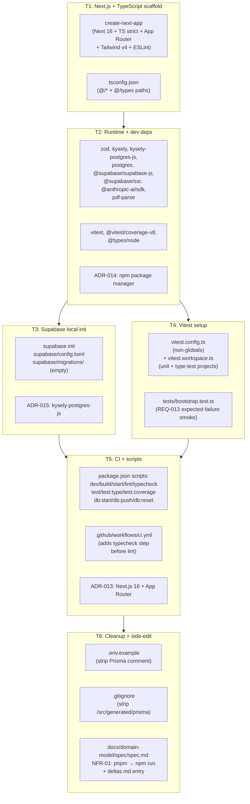
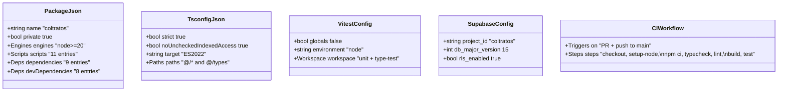
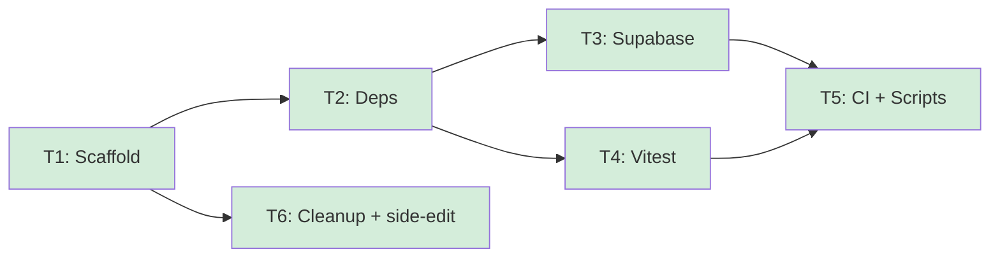

# project-bootstrap — Feature Overview

## Spec Reference

[Spec](../spec/spec.md) · [Use Cases](../spec/use-cases.md)

## Problem + Solution

- The repo has approved specs ([domain-model](../../domain-model/spec/spec.md), [pdf-ingestion](../../pdf-ingestion/spec/spec.md), [requisitos-extraction](../../requisitos-extraction/spec/spec.md), [semaforo-aggregation](../../semaforo-aggregation/spec/spec.md)) but no `package.json`, `tsconfig.json`, `supabase/`, or `src/`. T1 of any approved spec cannot run.
- Solution: a focused, opinionated bootstrap that initializes Next.js 16 + App Router + TypeScript strict + Supabase CLI + Kysely + Zod + vitest, wires CI to run typecheck + lint + build + test, and cleans up two stale Prisma leftovers from a pre-spec exploration.
- This spec writes **zero domain code** (per RN-010). The "domain" of bootstrap is configuration: `package.json`, `tsconfig.json`, `next.config.ts`, `vitest.config.ts`, `supabase/config.toml`, and `.github/workflows/ci.yml`.
- Three new ADRs (013/014/015) document the choices: Next.js 16 + App Router, npm as package manager, kysely-postgres-js as the Postgres dialect.
- One side-edit to [domain-model NFR-01](../../domain-model/spec/spec.md#L48): the only `pnpm` reference in any approved spec converges on `npm run typecheck` to match CI + AGENTS.md.

## Architecture Diagram

## Data Model

No new entities. No database tables. Per RN-010, all schema work is owned by [domain-model T3](../../domain-model/feat/01-plan-03-postgres-migration.md).

The configuration "data" introduced:

## Task Index

| Task | File | Description | Dependencies |
|------|------|-------------|--------------|
| T1 | [01-plan-01-nextjs-typescript-scaffold.md](./01-plan-01-nextjs-typescript-scaffold.md) | Initialize Next.js 16 + App Router + TypeScript strict + Tailwind v4. Configure `tsconfig.json` paths. Author placeholder `app/page.tsx` and `app/layout.tsx`. | None |
| T2 | [01-plan-02-runtime-dependencies.md](./01-plan-02-runtime-dependencies.md) | Install runtime + dev dependencies. Write ADR-014 (npm package manager). | T1 |
| T3 | [01-plan-03-supabase-local-init.md](./01-plan-03-supabase-local-init.md) | `supabase init`. Configure `supabase/config.toml`. Verify `supabase start` boots Docker stack. Write ADR-015 (kysely-postgres-js dialect). | T2 |
| T4 | [01-plan-04-vitest-setup.md](./01-plan-04-vitest-setup.md) | Configure vitest non-globals + workspace (unit + type-test projects). Author the bootstrap smoke test (REQ-013). | T2 |
| T5 | [01-plan-05-ci-typecheck-script.md](./01-plan-05-ci-typecheck-script.md) | Wire `package.json` scripts (`typecheck` etc.). Update `.github/workflows/ci.yml` to add `npm run typecheck` before lint. Write ADR-013 (Next.js 16 + App Router). | T1, T2 |
| T6 | [01-plan-06-cleanup-prisma-leftovers.md](./01-plan-06-cleanup-prisma-leftovers.md) | Edit `.env.example` (rewrite Prisma comment). Edit `.gitignore` (remove `/src/generated/prisma`). Side-edit [domain-model NFR-01](../../domain-model/spec/spec.md#L48): `pnpm typecheck` → `npm run typecheck`; append delta entry to [docs/domain-model/deltas.md](../../domain-model/deltas.md). | None (purely textual edits) |

## Dependency Graph

T1 must ship first (creates `package.json` and `tsconfig.json`). T2 (deps) blocks T3 (Supabase init writes scripts that need the runtime list known) and T4 (vitest needs to be installed). T5 (CI + scripts) needs both the script targets (T1/T2/T3/T4 must have produced them) and the dependency list. T6 (cleanup + side-edit) is purely textual and can run any time after T1.
