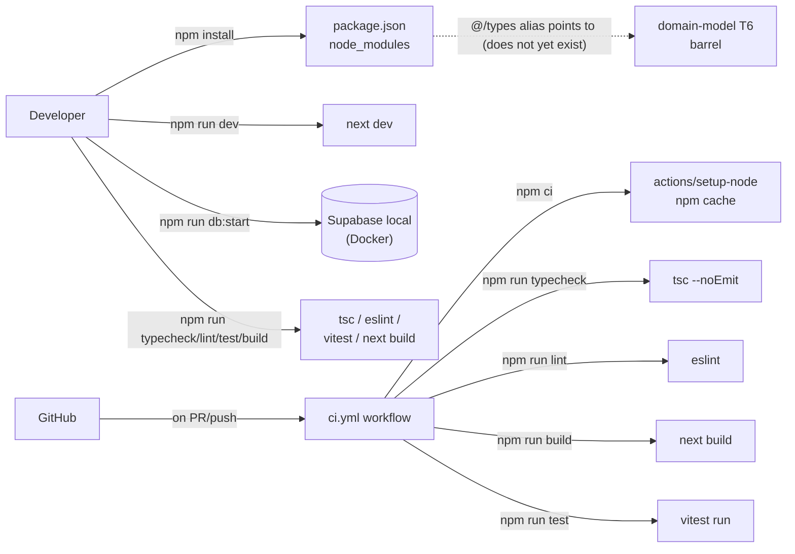

# project-bootstrap — Software Design Document

## Intention

`project-bootstrap` initializes the COLTRATOS codebase from an empty repository (only specs, nybo memory, and CI scaffolding exist today) into a runnable Next.js + TypeScript + Supabase + Kysely + Zod + vitest project. It is the **mechanical prerequisite** every other approved spec depends on — domain-model T1 cannot run `tsc --noEmit --strict` against `primitives.ts` if there is no `tsconfig.json`; pdf-ingestion T6 cannot run vitest benchmarks if vitest is not installed; requisitos-extraction REQ-005 cannot import `@anthropic-ai/sdk` if the package is not in `package.json`. This spec ships once at the very start and rarely if ever changes again.

The scope is deliberately narrow: install and configure the toolchain, wire up scripts, prove `npm install && npm run typecheck && npm run lint && npm run build && npm run test` exits 0 on a clean checkout, and clean up two stale leftovers from a pre-spec Prisma exploration. Domain logic, RLS policies, and migrations are owned by [domain-model](../../domain-model/spec/spec.md) and downstream specs — this spec writes **zero domain code**.

### v1 Scope

**In scope:**
- Next.js 16 (latest stable as of 2026-04-27) with App Router and React Server Components defaults.
- TypeScript ^5.6 in **strict** mode with `@/*` path aliases including `@/types` → `src/types/index.ts`.
- Tailwind CSS v4 (Next.js 16 default) — UI layer is out-of-scope but Tailwind is added now to avoid a re-bootstrap when the first FE feature lands.
- Supabase CLI initialized; local-dev stack (Docker-backed Postgres + Studio + Realtime) bootable via `supabase start`.
- Runtime dependencies: `zod`, `kysely`, `kysely-postgres-js`, `postgres`, `@supabase/supabase-js`, `@supabase/ssr` (App Router auth), `@anthropic-ai/sdk`, `pdf-parse`.
- Dev dependencies: `vitest`, `@vitest/coverage-v8`, `typescript`, `eslint`, `eslint-config-next`, `@types/node`.
- Vitest configured with **non-globals** (`import { describe, it, expect } from 'vitest'`) and a separate `tsconfig` for type-tests via `vitest/type-testing` (TC-005-style typecheck tests in domain-model).
- Package scripts: `dev`, `build`, `start`, `lint`, `typecheck`, `test`, `test:type` (vitest type-test runner), `test:coverage`, `db:start` (`supabase start`), `db:push` (`supabase db push`), `db:reset` (`supabase db reset`).
- CI workflow update: existing `.github/workflows/ci.yml` gains a `typecheck` step before `lint`. Node version stays at 20.x.
- Path alias `@/types` configured in `tsconfig.json` per [domain-model REQ-009 / 01-plan-06](../../domain-model/feat/01-plan-06-barrel-exports.md#L81).
- Cleanup of two Prisma leftovers identified by the architectural-guardrails audit: the `# para migraciones Prisma` comment in `.env.example` (line 4) and the `/src/generated/prisma` line in `.gitignore` (last entry). ADR-001 chose Kysely; both leftovers are stale.
- One-line side-edit to [domain-model NFR-01](../../domain-model/spec/spec.md#L48): `pnpm typecheck` → `npm run typecheck` (the only `pnpm` reference in any approved spec; converges on the package manager already wired into CI and AGENTS.md).
- Three ADRs: ADR-013 (Next.js 16 + App Router), ADR-014 (npm over pnpm/yarn), ADR-015 (kysely-postgres-js dialect over @vercel/postgres-kysely).

**Out of scope (v1):**
- Any domain code (`src/types/domain/*.ts`, `src/types/db.ts`, `src/types/index.ts`, migrations) — these are owned by domain-model.
- UI components, layouts, pages — owned by future FE specs.
- Production Vercel deployment configuration beyond what `next build` already produces.
- Authentication wiring (Supabase Auth client setup beyond installing `@supabase/ssr`).
- Pre-commit hooks (husky/lint-staged) — defer until a feature surfaces value.
- Docker Compose for application services — Supabase CLI's `supabase start` is the only Docker dependency in v1.

---

## Use Cases

Detailed scenarios in [use-cases.md](./use-cases.md).

| Use Case | Description | User Stories |
|----------|-------------|-------------|
| [UC-01 — Bootstrap a clean checkout](./use-cases.md#uc-01--bootstrap-a-clean-checkout-us-01) | Engineer clones the repo, runs `npm install`, then `npm run dev` boots the Next.js dev server | US-01 |
| [UC-02 — Run the full quality gate locally](./use-cases.md#uc-02--run-the-full-quality-gate-locally-us-02) | Engineer runs `npm run typecheck && npm run lint && npm run test && npm run build` and all four exit 0 | US-02 |
| [UC-03 — Boot the local Supabase stack](./use-cases.md#uc-03--boot-the-local-supabase-stack-us-03) | DB Admin runs `npm run db:start` and a local Postgres + Studio is reachable | US-03 |
| [UC-04 — CI runs typecheck on every PR](./use-cases.md#uc-04--ci-runs-typecheck-on-every-pr-us-04) | Pushing a PR triggers `.github/workflows/ci.yml` which runs typecheck + lint + build + test | US-04 |
| [UC-05 — Domain-model T1 unblocks](./use-cases.md#uc-05--domain-model-t1-unblocks-us-05) | After project-bootstrap ships, `domain-model` T1 can immediately run `tsc --noEmit --strict` against new `primitives.ts` | US-05 |

---

## Requirements

### Functional Requirements

| ID | Requirement | User Stories | Business Rules |
|----|-------------|-------------|----------------|
| REQ-001 | `package.json` exists at the repo root with `name: "coltratos"`, `private: true`, `engines.node: ">=20.0.0"`, and the script set: `dev`, `build`, `start`, `lint`, `typecheck`, `test`, `test:type`, `test:coverage`, `db:start`, `db:push`, `db:reset` | US-01, US-02 | RN-001, RN-005 |
| REQ-002 | Next.js 16 (latest stable, ^16.2) is installed and configured for **App Router** with React Server Components defaults. `next.config.ts` exists (TypeScript config; no JS-file leakage). `app/` directory has minimal `layout.tsx` + `page.tsx` so `npm run dev` produces a navigable page at `/` | US-01 | RN-002 |
| REQ-003 | `tsconfig.json` exists with `strict: true`, `noUncheckedIndexedAccess: true`, `target: "ES2022"`, `module: "esnext"`, `moduleResolution: "bundler"`, `paths.@/*: ["./src/*"]` AND **`paths.@/types: ["./src/types/index.ts"]`** (the explicit alias domain-model REQ-009 expects) | US-01, US-05 | RN-003 |
| REQ-004 | Runtime dependencies installed at exact major-version pins (per ADR-013/015 reasoning): `next ^16.2`, `react ^19`, `react-dom ^19`, `zod ^4`, `kysely ^0.28`, `kysely-postgres-js ^3.0`, `postgres ^3.4`, `@supabase/supabase-js ^2`, `@supabase/ssr ^0.6`, `@anthropic-ai/sdk ^0.66`, `pdf-parse ^1.1`. Versions resolved at T2 execution time; this spec authors a `// SDK_MAJOR=<n>` comment in any consumer config that pins a major (per [requisitos-extraction REQ-018](../../requisitos-extraction/spec/spec.md#L57)) | US-01 | RN-004 |
| REQ-005 | Dev dependencies installed: `typescript ^5.6`, `@types/node ^20`, `@types/react ^19`, `@types/react-dom ^19`, `vitest ^4`, `@vitest/coverage-v8 ^4`, `eslint ^9`, `eslint-config-next ^16`, `@anthropic-ai/sdk` types are bundled (no separate install). `tsx` for ad-hoc TS execution if needed | US-01, US-02 | RN-004 |
| REQ-006 | `vitest.config.ts` exists with non-globals (no `globals: true`), `environment: 'node'` for Node-runtime tests, and a separate `vitest.workspace.ts` registering both the runtime test suite and a `*.test-d.ts` type-test project per the [domain-model contract](../../domain-model/contract/contract.md#L19) | US-01, US-02 | RN-006 |
| REQ-007 | `supabase/` directory created via `supabase init`. `supabase/config.toml` exists with project_id `coltratos`, `db.major_version: 15`, default ports, RLS enabled. `supabase/migrations/` directory exists (empty — domain-model T3 writes the first migration) | US-03, US-05 | RN-007 |
| REQ-008 | `.github/workflows/ci.yml` updated: a new step `npm run typecheck` runs **before** `npm run lint`. The job continues to use `actions/setup-node@v4` with `node-version: '20'` and `cache: 'npm'`. Branches and triggers unchanged from current (PR to main/develop, push to main) | US-04 | RN-005 |
| REQ-009 | `.env.example` updated: the comment `# PostgreSQL directo (para migraciones Prisma)` rewritten to `# PostgreSQL directo (para supabase db push y conexiones sin pooling)`. The `DATABASE_URL` and `DIRECT_URL` keys are preserved (Kysely uses pooled `DATABASE_URL`; `supabase db push` uses `DIRECT_URL`). All other env keys preserved | US-01 | RN-008 |
| REQ-010 | `.gitignore` updated: the line `/src/generated/prisma` removed (Prisma is not in the stack). All other entries preserved | US-01 | RN-008 |
| REQ-011 | Three ADRs written under `.nybo/foundation/adrs/`: `ADR-013-nextjs-16-app-router.md`, `ADR-014-npm-package-manager.md`, `ADR-015-kysely-postgres-js-dialect.md`. Each carries Status (Accepted), Context, Decision, Alternatives Considered, Consequences | US-01 | RN-009 |
| REQ-012 | One-line side-edit to [domain-model NFR-01](../../domain-model/spec/spec.md#L48): `pnpm typecheck` → `npm run typecheck`. No other domain-model content changes. Recorded as a delta entry in [docs/domain-model/deltas.md](../../domain-model/deltas.md) | US-01, US-05 | RN-005 |
| REQ-013 | A boot smoke test exists at `tests/bootstrap.test.ts` that imports from `@/types` (which does NOT exist yet — the test is **expected to fail with "Cannot find module '@/types'"**, and that specific failure mode is the success criterion). When domain-model T6 ships, this test starts passing without modification — it is the structural proof that the path alias is wired correctly | US-05 | RN-003, RN-006 |

### Non-Functional Requirements

| ID | Category | Requirement |
|----|----------|-------------|
| NFR-01 | Idempotency | Re-running `npm install` on an already-bootstrapped repo produces zero diffs in `package.json`, `tsconfig.json`, `next.config.ts`, or `vitest.config.ts`. The bootstrap is reproducible from `package.json` + `package-lock.json` alone |
| NFR-02 | CI duration | CI quality job (typecheck + lint + build + test) completes in < 4 minutes on a fresh `actions/checkout` (cold cache) and < 2 minutes warm |
| NFR-03 | Local boot time | `npm install` (warm cache) + `npm run dev` reaches the first compiled page within 60s on a developer's machine |
| NFR-04 | Lockfile fidelity | `package-lock.json` is committed; `npm ci` (the CI installer) succeeds on a clean clone |
| NFR-05 | Toolchain hygiene | Zero `peerDependencies` warnings on a clean install. `npm audit --production` reports zero high-severity vulnerabilities at ship time (medium / low documented in evidence if present) |

---

## Business Rules

| Rule | Description |
|------|-------------|
| RN-001 | The repo uses **npm** as the package manager. The lockfile is `package-lock.json`. CI uses `npm ci`. AGENTS.md, [.github/workflows/ci.yml](../../../.github/workflows/ci.yml), and (after this spec) all spec text refer to `npm run <script>` — never `pnpm` or `yarn`. |
| RN-002 | Next.js uses **App Router**, not Pages Router. New routes live under `app/`; the `pages/` directory MUST NOT exist. Server Components are the default; Client Components are opt-in via `'use client'`. |
| RN-003 | TypeScript runs in **strict mode** with `noUncheckedIndexedAccess: true`. `any` is permitted only at clearly-marked boundaries (third-party JSON parsing, etc.) and MUST be flagged with a `// TODO: type` comment. The `@/*` path alias rooted at `src/*` is the only path alias; deep aliases (`@/types`, `@/lib`) are explicit entries that point to specific paths. |
| RN-004 | Runtime dependencies are pinned at the **major version** in `package.json` (`^x.y.z`); `package-lock.json` records exact versions. Major-version bumps require an ADR (or a delta to an existing ADR). [Requisitos-extraction REQ-018](../../requisitos-extraction/spec/spec.md#L57) is the precedent for Anthropic-SDK-style major pinning. |
| RN-005 | The CI quality gate (`.github/workflows/ci.yml`) runs **typecheck + lint + build + test** in that order. Typecheck runs first because it is the cheapest fail-fast signal — catches structural type errors before lint rules and before a full build. |
| RN-006 | Vitest uses **named imports** (`import { describe, it, expect } from 'vitest'`), not globals. Rationale: named imports keep the test file's dependencies explicit, survive grep audits (purity grep tests in pdf-ingestion / requisitos-extraction / semaforo-aggregation can detect imports they don't recognize), and avoid colliding with future framework-specific globals. |
| RN-007 | Supabase **local** development is a hard dependency for any spec writing migration tests (TC-004/006/008/009/011-013/017/018 in domain-model). `supabase start` requires Docker on the developer's machine. CI integration tests against a hosted Supabase instance (or skip the live-DB tests in CI without local Supabase) are out of v1 scope — the local-Docker contract is enough for development. |
| RN-008 | The `.env` file is **never committed**; `.env.example` is the canonical template. Stale references to deprecated tools (e.g., the `# para migraciones Prisma` comment) are removed during this spec's execution and never reintroduced. |
| RN-009 | Every architectural choice with downstream consequences (package manager, framework version pin, dialect choice, etc.) is documented as an **ADR** under `.nybo/foundation/adrs/`. ADRs follow the existing pattern (Title, Status, Context, Decision, Alternatives Considered, Consequences) established by ADR-001/002/003/008/009/010/011/012. |
| RN-010 | This spec writes **zero domain code**. No file under `src/types/domain/`, no migration under `supabase/migrations/`, no `lib/` content. Domain code is owned by `domain-model` and downstream specs; bootstrap only creates directories where needed and ensures the toolchain compiles an empty repo. |

---

## Test Cases

### TC-001 — `npm install` on a clean checkout exits 0 (REQ-001, REQ-004, REQ-005, NFR-04)

**Given** a freshly-cloned repo with no `node_modules/`
**When** `npm ci` (or `npm install`) is run
**Then** it exits with code 0; `node_modules/` is created; zero peer-dependency warnings; zero high-severity audit findings

### TC-002 — `npm run typecheck` exits 0 on the empty scaffold (REQ-003, REQ-008, NFR-01)

**Given** a bootstrapped repo with no domain code yet (no `src/types/domain/*.ts`)
**When** `npm run typecheck` runs
**Then** it exits with code 0. The path alias `@/types` resolves to `./src/types/index.ts` even though the file does not exist yet — Next.js's tsconfig `paths` is consulted lazily; an unimported alias does not fail typecheck

**When** an `app/page.tsx` adds `import { type Empresa } from '@/types'` (the file is intentionally missing)
**Then** typecheck **fails** with "Cannot find module '@/types' or its corresponding type declarations" — confirming the alias is wired and the failure mode is the expected one (TC-013-style precondition for domain-model T6)

### TC-003 — `npm run lint` exits 0 on the scaffold (REQ-005)

**Given** the bootstrapped repo with `eslint-config-next` extended
**When** `npm run lint` runs
**Then** it exits with code 0. The default Next.js scaffold (`app/layout.tsx`, `app/page.tsx`) passes the rule set without modification

### TC-004 — `npm run build` produces a `.next/` artifact (REQ-002)

**Given** the bootstrapped repo
**When** `npm run build` runs
**Then** it exits with code 0; a `.next/` directory is produced; `.next/server/app/page.html` exists (or the equivalent server-component output)

### TC-005 — `npm run test` exits 0 with the bootstrap smoke test passing (REQ-006, REQ-013)

**Given** the bootstrapped repo with `tests/bootstrap.test.ts` containing the smoke test described in REQ-013
**When** `npm run test` runs
**Then** the test runner reports 1 test passing (the smoke test that confirms vitest + the path alias compile but the imported `@/types` module is intentionally absent — the test asserts the failure shape, not the import success)

**Given** the same setup
**When** `npm run test:coverage` runs
**Then** it exits with code 0 and produces a coverage report under `coverage/`

### TC-006 — `npm run dev` boots Next.js (REQ-002, NFR-03)

**Given** the bootstrapped repo
**When** `npm run dev` is run
**Then** Next.js logs `Ready in <N> ms` to stdout within 60 seconds; the dev server is reachable at `http://localhost:3000`; a GET to `/` returns HTTP 200 with HTML containing the placeholder content from `app/page.tsx`

### TC-007 — `supabase start` boots the local stack (REQ-007, RN-007)

**Given** the bootstrapped repo, Docker running, and `supabase` CLI installed
**When** `npm run db:start` runs
**Then** it exits successfully and prints connection URLs for API / DB / Studio. `psql $DIRECT_URL -c '\dt'` returns zero tables (empty schema — domain-model T3 writes the first one)

### TC-008 — CI runs typecheck before lint (REQ-008, RN-005)

**Given** `.github/workflows/ci.yml` after the bootstrap edit
**When** the file is parsed
**Then** the `quality` job's `steps` list contains, in order: `actions/checkout`, `actions/setup-node`, `npm ci`, `npm run typecheck`, `npm run lint`, `npm run build`, `npm run test`. Typecheck appears **before** lint

### TC-009 — Path alias `@/types` is configured (REQ-003, REQ-013)

**Given** `tsconfig.json` after bootstrap
**When** parsed
**Then** `compilerOptions.paths` contains both `"@/*": ["./src/*"]` AND `"@/types": ["./src/types/index.ts"]` (the latter is the explicit alias domain-model REQ-009 / 01-plan-06 expects). The wildcard alias is the catch-all; the explicit `@/types` alias is for the barrel file that domain-model T6 will create

### TC-010 — Vitest uses non-globals (REQ-006, RN-006)

**Given** `vitest.config.ts` after bootstrap
**When** parsed
**Then** the config does NOT include `test.globals: true`. `tests/bootstrap.test.ts` uses `import { describe, it, expect } from 'vitest'` (verifiable via grep)

### TC-011 — Stale Prisma references are gone (REQ-009, REQ-010)

**Given** `.env.example` and `.gitignore` after bootstrap
**When** grepped for `prisma` (case-insensitive)
**Then** zero matches in either file. The `# para migraciones Prisma` comment is rewritten; the `/src/generated/prisma` line is removed

### TC-012 — Three ADRs exist with required sections (REQ-011, RN-009)

**Given** `.nybo/foundation/adrs/` after bootstrap
**When** the files `ADR-013-nextjs-16-app-router.md`, `ADR-014-npm-package-manager.md`, `ADR-015-kysely-postgres-js-dialect.md` are read
**Then** each contains the sections **Status: Accepted**, **Context**, **Decision**, **Alternatives Considered**, **Consequences**

### TC-013 — Domain-model NFR-01 says `npm run typecheck` (REQ-012)

**Given** [docs/domain-model/spec/spec.md](../../domain-model/spec/spec.md) after the side-edit
**When** grepped for `pnpm`
**Then** zero matches — the only prior occurrence in NFR-01 is now `npm run typecheck`

**Given** [docs/domain-model/deltas.md](../../domain-model/deltas.md) after the side-edit
**When** read
**Then** a new delta entry dated 2026-04-27 records the rename, mode `edit`, rationale: tooling consistency with project-bootstrap REQ-008 / RN-001

---

## UX/UI

No user-facing UI in this spec. The default Next.js scaffold's `app/page.tsx` is intentionally a placeholder ("COLTRATOS — coming soon") so `npm run dev` produces a navigable page (TC-006). FE specs replace it.

---

## Architecture

### Architecture Decision Records

| ADR | Title | Impact on this feature |
|-----|-------|----------------------|
| ADR-013 | Next.js 16 + App Router (not Pages Router) | Locks the framework version pin, the routing convention, and the React Server Components default. Alternatives: Next.js 15 (older minor; we'd inherit known perf bugs that 16.2's Turbopack work fixed); Pages Router (legacy; new routing patterns and Server Actions are App-Router-only). Consequences: (+) modern RSC defaults; (+) Server Actions usable in v2; (−) team must learn App Router conventions. ADR file authored in T1. |
| ADR-014 | npm as the package manager (not pnpm or yarn) | The existing `.github/workflows/ci.yml` uses `npm ci` and `cache: 'npm'`; AGENTS.md documents `npm run` scripts. Switching to pnpm would require updating CI, AGENTS.md, every spec that mentions a script (domain-model NFR-01 is the only one currently), and adding a `pnpm-lock.yaml`. Cost vs. benefit doesn't justify the switch in a single-repo greenfield project. Alternatives: pnpm (faster, better disk usage, but tooling change cost); yarn classic (legacy, deprecated). Consequences: (+) zero churn against existing CI; (−) larger `node_modules`. ADR file authored in T2. |
| ADR-015 | `kysely-postgres-js` as the Kysely dialect | The `postgres` driver (Postgres.js) supports both Node serverless runtimes and Bun; `kysely-postgres-js` is the official Kysely dialect for it. Alternatives: `@vercel/postgres-kysely` (locks us to Vercel's Postgres branding even though we're using Supabase); `pg` driver via the built-in `PostgresDialect` (heavier; no Bun support; older API). Consequences: (+) compatible with Vercel deploy and Supabase pooled connection; (+) Bun-ready for future migrations; (−) one extra dependency. ADR file authored in T3 (alongside Supabase init since the dialect choice affects connection-string handling). |

> **Note:** ADR-001 through ADR-012 already exist (or are stubbed in upstream specs). This spec adds ADR-013/014/015 only.

### Tradeoffs

| Tradeoff | We chose | Over | Rationale |
|----------|----------|------|-----------|
| Bootstrap as a separate spec | Standalone `project-bootstrap` spec | Implicit setup as part of domain-model T0 | The setup decisions (framework version, package manager, dialect) deserve their own ADR trail. Hiding them inside a domain-model run produces an undocumented base layer that future contributors can't audit. |
| Routing model | App Router | Pages Router | Default for new Next.js projects in 2026; Server Components reduce client bundle size (relevant for the eventual eligibility-results screen). Pages Router would force a migration in v2. |
| Package manager | npm | pnpm or yarn | Zero churn against existing CI + AGENTS.md. The pnpm performance benefit is real but doesn't justify the multi-file edit churn at this stage. |
| Kysely dialect | `kysely-postgres-js` (Postgres.js driver) | `@vercel/postgres-kysely` (Vercel-branded) or `pg` driver | Postgres.js is platform-neutral; Vercel-branded would imply Vercel-only deploy. The Vercel hosting choice in CORE.md is current but not future-proof. |
| Vitest globals | Non-globals (named imports) | `globals: true` (Jest-style) | Survives the purity-grep tests in pdf-ingestion / requisitos-extraction / semaforo-aggregation; keeps test imports explicit; avoids future global-name collisions. |
| Tailwind in v1 | Add at bootstrap time | Add lazily on first FE feature | Re-bootstrapping Tailwind into an existing app touches `tsconfig.json`, `next.config.ts`, the global CSS file, and PostCSS config simultaneously. Cheaper to do once now. The Tailwind config stays at the Next.js default until a FE spec actually customizes it. |
| Bootstrap smoke test (REQ-013) | Asserts the **expected failure mode** of the missing import | Skips the test until domain-model T6 ships | An "expected failure" is a stronger contract than no test: it proves the path alias is wired today, AND it flips automatically to a passing test the moment domain-model T6 creates the barrel file — a built-in cross-spec integration signal with zero glue code. |
| Side-edit domain-model NFR-01 | Bundle into this spec's REQ-012 | Separate `/nybo-plan edit domain-model` round | One-line edit that shares the rationale with REQ-008 / RN-001 (tooling consistency). Splitting it into another revision would create more deltas with the same justification. The delta entry in [docs/domain-model/deltas.md](../../domain-model/deltas.md) documents the cross-spec coupling. |

### Performance Goals & Metrics

| Metric | Target | Measurement |
|--------|--------|-------------|
| `npm ci` cold install duration | < 90s on CI runners | `actions/setup-node` cache miss; measured in CI logs |
| `npm ci` warm install duration | < 15s on CI runners | `actions/setup-node` cache hit |
| Full quality gate duration (cold cache) | < 4 minutes | `name: quality` job total time in CI |
| Full quality gate duration (warm cache) | < 2 minutes | Same job, `cache-hit: true` |
| `npm run dev` first-page TTFR | < 60s on developer machines | Manual measurement; logged in evidence |
| `npm run build` duration on the empty scaffold | < 30s | `time npm run build` |

### Data Model

This spec adds **no domain entities and no database tables**. Per RN-010, all schema work is owned by domain-model T3.

The only "data" this spec introduces is configuration:
- `package.json` (the dependency graph)
- `tsconfig.json` (the type-check configuration)
- `next.config.ts` (the framework configuration)
- `vitest.config.ts` + `vitest.workspace.ts` (the test runner configuration)
- `supabase/config.toml` (the local Supabase stack configuration)
- `.github/workflows/ci.yml` (the CI quality gate, edited not created)
- Three ADR files

### API / Data Contracts

No HTTP endpoints. No data contracts. The "contract" of this spec is the **toolchain shape** — a clean checkout that survives `npm install && npm run typecheck && npm run lint && npm run build && npm run test`.

### Service Integrations

| System | Direction | Data |
|--------|-----------|------|
| npm registry | Reading | Package metadata + tarballs at `npm install` time |
| Supabase CLI | Calling | `supabase start/stop/status/db push/db reset` (local Docker stack) |
| Docker daemon | Calling | Container lifecycle for the Supabase local stack |
| GitHub Actions | Reading | `.github/workflows/ci.yml` triggers on PR/push events |
| Anthropic / Vercel / Supabase production | **None in v1** | Production wiring is owned by future deployment specs |

---

## Domains Touched

This spec touches **infrastructure**, not any of the active product domains in [.nybo/foundation/domains.yaml](../../../.nybo/foundation/domains.yaml). It enables every other domain by providing the toolchain.

## Workflow Skills Applicable

- `nybo-tdd` — TDD applies to REQ-013's bootstrap smoke test (Red on missing module → Green when domain-model T6 ships).
- `nybo-verify` — CI quality gates and the local quality script are the verify substrate.

## Project Pattern Skills

None yet — `.nybo/skills/` already contains `create-api-route.md`, `create-component.md`, `create-service.md` (seeded), but they target post-bootstrap workflows.

## Dependencies

- **MCPs**: none required. context7 was used during spec authoring to fetch current Next.js / Kysely / vitest versions but is not a runtime dependency.

---

## Revision Log

| Date | Change | Reason |
|------|--------|--------|
| 2026-04-27 | Initial draft | Identified during `/nybo-run domain-model` as a hard prerequisite — the codebase had specs but no `package.json`, `tsconfig.json`, `supabase/`, or `src/`. Captured separately rather than bootstrapping inline so the framework/dialect/package-manager decisions get their own ADR trail. |
