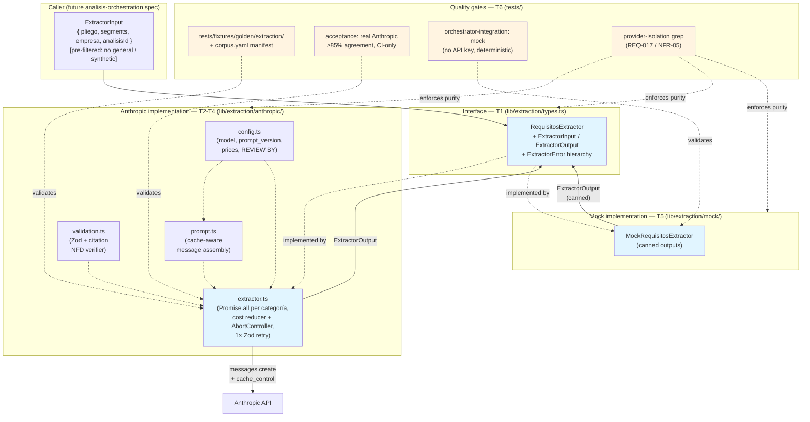
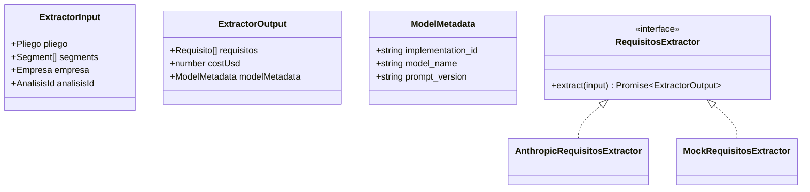
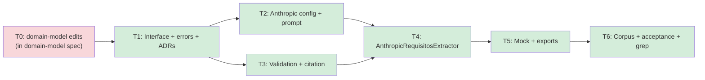

# requisitos-extraction — Feature Overview

## Spec Reference

[Spec](../../requisitos-extraction/spec/spec.md) · [Use Cases](../../requisitos-extraction/spec/use-cases.md)

## Problem + Solution

- The product's economic premise (≤$0.04 USD per análisis vs ~$50–150 USD manual) lives or dies on this stage. Upstream (ingestion, segmentation) is preparation; downstream (aggregation, UI) is presentation. Without extraction working at the right cost AND the right semantic quality, COLTRATOS has no business.
- Solution: a **provider-agnostic `RequisitosExtractor` interface** at `lib/extraction/types.ts` plus **one concrete `AnthropicRequisitosExtractor`** under `lib/extraction/anthropic/`. The orchestrator depends on the interface; v2 plugs in additional implementations without touching consumers.
- Key approach: dependency-injected SDK client + logger; `cache_control: ephemeral` blocks on system prompt + JSON schema and on empresa profile; one Claude call per `SegmentoCategoria` (max 4) via `Promise.all`; Zod-validated structured output with one internal retry; verbatim citation verification (NFD substring match) as a soft signal (`citation_verified: false`, not a reject); hard cost ceiling at $0.05 USD per call enforced via `AbortController`.
- Output: `ExtractorOutput = { requisitos: Requisito[], costUsd: number, modelMetadata: ModelMetadata }` consumed by the future `analisis-orchestration` spec, which owns persistence and the `(pliego.file_hash, empresa.id, implementation_id)` idempotency cache.

## Architecture Diagram

## Data Model

No new database tables. This feature requires schema additions to existing entities (12 items in T0 — see [spec.md → Dependencies](../spec/spec.md#dependencies-on-domain-model-hard-prerequisite--t0)) but the domain-model spec owns those edits.

In-memory shapes owned by this feature:

## Task Index

| Task | File | Description | Dependencies |
|------|------|-------------|--------------|
| T0 | (in `domain-model` spec) | Schema additions: 3 citation columns on `requisito`, 3 telemetry columns on `analisis`, `profile_updated_at` on `empresa`, Zod extensions, `ExtractorLogger` + `RequisitoExtractionPayload(Schema)` exports — 12 items total | (HARD PREREQUISITE) |
| T1 | [01-plan-01-foundation.md](./01-plan-01-foundation.md) | Provider-agnostic interface, error hierarchy, ADR-009 + ADR-010 | T0 |
| T2 | [01-plan-02-anthropic-config-prompt.md](./01-plan-02-anthropic-config-prompt.md) | `config.ts` (model, prompt_version, prices, REVIEW BY), `prompt.ts` (cache-aware message assembly) | T1 |
| T3 | [01-plan-03-validation-citation.md](./01-plan-03-validation-citation.md) | Zod validation against `RequisitoExtractionPayloadSchema`, NFD-normalized citation verifier | T1 |
| T4 | [01-plan-04-anthropic-extractor.md](./01-plan-04-anthropic-extractor.md) | `AnthropicRequisitosExtractor` orchestration: Promise.all per categoría, cost reducer + AbortController, 1× Zod retry, contract-violation logging | T2, T3 |
| T5 | [01-plan-05-mock-and-exports.md](./01-plan-05-mock-and-exports.md) | `MockRequisitosExtractor` + `lib/extraction/index.ts` and `lib/extraction/anthropic/index.ts` barrels | T4 |
| T6 | [01-plan-06-corpus-acceptance.md](./01-plan-06-corpus-acceptance.md) | 3-fixture golden corpus + `corpus.yaml` + real-Anthropic acceptance test (CI-only) + mock orchestrator integration test + provider-isolation grep CI test | T5 |

## Dependency Graph

T2 and T3 are independent — they can be implemented in parallel by two Executor Agents once T1 is done.
