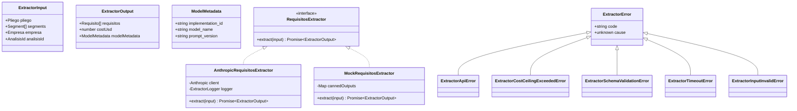
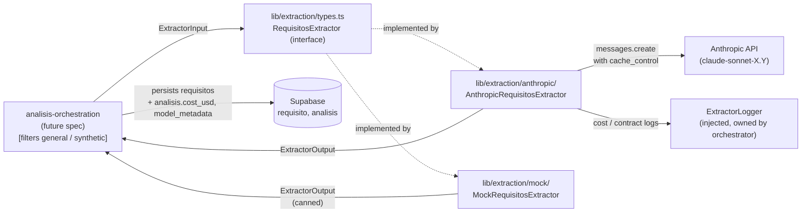

# requisitos-extraction — Software Design Document

## Intention

`requisitos-extraction` converts a `Pliego` (already segmented by [pdf-ingestion](../../pdf-ingestion/spec/spec.md)) plus an `Empresa` profile into a structured `Requisito[]` with eligibility verdicts. This is the **core value-creation step** of COLTRATOS: it replaces 4–8 hours of manual procurement-analyst review (~$50–150 USD in labor) with a sub-30-second LLM call costing $0.02–0.04 USD per análisis — at least two orders of magnitude cheaper, which is the entire economic premise of the SaaS.

The spec defines the extraction **capability** as a domain feature, not as any one provider's implementation. It ships **two artifacts** that must not be conflated:

1. **`RequisitosExtractor` interface** — provider-agnostic, lives at `lib/extraction/types.ts`, imports only domain types from `@/types`. Defines `extract(input: ExtractorInput): Promise<ExtractorOutput>`.
2. **`AnthropicRequisitosExtractor`** — concrete implementation under `lib/extraction/anthropic/`, the only implementation shipped in v1. Owns Anthropic prompt-cache structure, model pinning, and SDK calls.

The orchestrator (a future `analisis-orchestration` spec) depends on the **interface**, not the implementation. Dependency injection at the composition root wires the concrete extractor in. v2 may add OpenAI / Gemini / dual-extractor comparison without touching upstream contracts.

### v1 Scope

**In scope:** The provider-agnostic interface, error hierarchy, and one concrete `AnthropicRequisitosExtractor` implementation that produces `Requisito[]` with `descripcion`, per-requisito eligibility verdicts (`cumple`, `semaforo`, `justificacion`), and verifiable citations back to the source `Segmento`. A 3-pliego golden corpus + ≥85% agreement gate. A `MockRequisitosExtractor` for downstream integration tests.

**Out of scope (v1):** Multiple shipped implementations; streaming responses; multi-turn conversations; fine-tuning; segment-level cache keys (only pliego-level); analyses spanning multiple pliegos; comparative dual-extractor mode; aggregating per-requisito verdicts into the overall `Analisis.semaforo` (owned by [semaforo-aggregation](../../semaforo-aggregation/spec/spec.md), approved 2026-04-27); manual classification override for `is_habilitante` (the `'manual'` value of `is_habilitante_source` is reserved at the schema layer for v1.1+ user-correction UI; v1 extractors never emit it).

## Use Cases

Detailed scenarios in [use-cases.md](./use-cases.md).

| Use Case | Description | User Stories |
|----------|-------------|-------------|
| [UC-01 — Extract requisitos for an análisis](./use-cases.md#uc-01--extract-requisitos-for-an-análisis-us-01) | Orchestrator calls `extract()` with `(Pliego, Segment[], Empresa)`; receives `Requisito[]`, cost, and model metadata | US-01 |
| [UC-02 — Reject malformed inputs before any API call](./use-cases.md#uc-02--reject-malformed-inputs-before-any-api-call-us-02) | Empty segments / incomplete empresa profile raise `EXTRACTOR_INPUT_INVALID` synchronously | US-02 |
| [UC-03 — Cap unit cost via prompt caching + ceiling](./use-cases.md#uc-03--cap-unit-cost-via-prompt-caching--ceiling-us-03) | Cached prefix produces ≥85% input cache hit rate; hard ceiling at $0.05 USD per call | US-03 |
| [UC-04 — Validate against a 3-pliego golden corpus](./use-cases.md#uc-04--validate-against-a-3-pliego-golden-corpus-us-04) | CI runs the Anthropic extractor over 3 expert-scored pliegos and asserts ≥85% requisito-level agreement | US-04 |
| [UC-05 — Swap the implementation without touching consumers](./use-cases.md#uc-05--swap-the-implementation-without-touching-consumers-us-05) | A `MockRequisitosExtractor` substitutes for the Anthropic one in orchestrator tests with no consumer-side changes | US-05 |

---

## Requirements

### Functional Requirements

| ID | Requirement | User Stories | Business Rules |
|----|-------------|-------------|----------------|
| REQ-001 | Export a `RequisitosExtractor` interface from `lib/extraction/types.ts` with the single method `extract(input: ExtractorInput): Promise<ExtractorOutput>` | US-01, US-05 | RN-001, RN-002 |
| REQ-002 | `ExtractorInput` carries `{ pliego: Pliego, segments: Segment[], empresa: Empresa, analisisId: AnalisisId }` — domain types only, imported from `@/types`. No SDK or provider concepts (`cache_control`, message format, model strings) appear in the interface module | US-01, US-05 | RN-001, RN-002 |
| REQ-003 | `ExtractorOutput` carries `{ requisitos: Requisito[], costUsd: number, modelMetadata: ModelMetadata }`. `ModelMetadata` MUST be **imported from `@/types`** (canonical declaration lives in `src/types/db.ts` per [domain-model deltas.md](../../domain-model/deltas.md)). `lib/extraction/types.ts` MUST NOT declare a parallel `interface ModelMetadata` — a re-declaration produces structurally-equivalent-but-distinct-identity types that break orchestrator wiring | US-01, US-03 | RN-001, RN-003, RN-004 |
| REQ-004 | Define a typed error hierarchy at the interface level extending `ExtractorError`: `ExtractorApiError` (`code: 'EXTRACTOR_API_ERROR'`, retryable), `ExtractorCostCeilingExceededError` (`'EXTRACTOR_COST_CEILING_EXCEEDED'`, hard fail + alert), `ExtractorSchemaValidationError` (`'EXTRACTOR_SCHEMA_VALIDATION'`, hard fail after one internal retry), `ExtractorTimeoutError` (`'EXTRACTOR_TIMEOUT'`, hard fail), `ExtractorInputInvalidError` (`'EXTRACTOR_INPUT_INVALID'`, hard fail before any API call). Implementations MUST wrap provider-specific errors into one of these | US-01, US-02 | RN-005 |
| REQ-005 | Ship `AnthropicRequisitosExtractor` at `lib/extraction/anthropic/extractor.ts` implementing `RequisitosExtractor`. Receives `{ client: Anthropic, logger: ExtractorLogger }` as injected constructor dependencies; reads no `process.env` and makes no global SDK init calls | US-01 | RN-006, RN-008 |
| REQ-006 | Anthropic implementation issues **at most 4 concurrent calls per análisis**, one per `SegmentoCategoria` ∈ `{juridico, financiero, tecnico, experiencia}`. Calls run via `Promise.all`. Segments with `categoria === 'general'` or `is_synthetic === true` are silently skipped + logged as a contract violation; extraction continues. **Categoria denormalization**: every emitted `Requisito` MUST carry `categoria` set to the **narrow** `RequisitoCategoria` value derived from its source segmento — emitted on persistence, never as `'general'`. If a payload from the LLM somehow carries `categoria === 'general'`, the Zod `.refine()` on `RequisitoExtractionPayloadSchema` rejects it as `ExtractorSchemaValidationError` (REQ-009); the extractor does NOT silently rewrite `general` to a narrow value | US-01, US-03 | RN-007, RN-010, RN-015 |
| REQ-019 | **Tiered `is_habilitante` classification** (cross-spec contract owned by [semaforo-aggregation RN-014](../../semaforo-aggregation/spec/spec.md)). Every emitted `Requisito` carries `is_habilitante: boolean` and `is_habilitante_source: 'structural' \| 'llm' \| 'manual'` per [domain-model REQ-019 / RN-018](../../domain-model/spec/spec.md). The Anthropic implementation classifies via two tiers: **(a) Structural first** — for each source segmento, before the LLM call, check whether `segmento.heading_normalized` matches any pattern in `HABILITANTE_HEADING_PATTERNS` (imported from `@/types`, REQ-022 in domain-model). If yes, **all** requisitos extracted from that segmento are emitted with `is_habilitante = true` and `is_habilitante_source = 'structural'`; the LLM is not asked to classify habilitancia for these (the prompt instructs the model to omit the field on those calls and the extractor populates it post-validation). **(b) LLM fallback** — for segmentos whose `heading_normalized` matches no structural pattern (or is null), the LLM extractor classifies `is_habilitante` based on requisito text and context; the extractor sets `is_habilitante_source = 'llm'`. **(c) Manual override** is a v1.1+ feature; v1 extractors NEVER emit `'manual'`. The `'manual'` value is reserved at the schema layer | US-01, US-03 | RN-015, RN-016 |
| REQ-020 | **Acceptance test ≥80% structural** (cross-spec gate from semaforo-aggregation REQ-014). The `tests/acceptance/requisitos-extraction.real.test.ts` test, after running over the 3-fixture corpus, computes the distribution of `is_habilitante_source` across all habilitante-true requisitos. The test FAILS CI if the count where `is_habilitante_source === 'structural'` is < 80% of the total habilitante-true count (across all fixtures combined; an empty habilitante set skips the assertion). Rationale: forces `HABILITANTE_HEADING_PATTERNS` to do real work — an empty or under-specified pattern list fails this test. The pattern list is co-evolved with the corpus | US-04 | RN-014, RN-016 |
| REQ-021 | **Categoria narrowing at the validation boundary**. `RequisitoExtractionPayloadSchema` (imported from `@/types`, owned by domain-model REQ-016) carries a `.refine()` that rejects `categoria === 'general'`. The extractor uses this schema to validate every LLM output payload (REQ-009); a `general`-categoria payload surfaces as `ExtractorSchemaValidationError` after one retry attempt. The extractor does NOT pre-filter incoming segmentos by category (orchestrator owns that filter per RN-007) — but it DOES enforce the narrow contract on emitted requisitos via the payload schema | US-01 | RN-015 |
| REQ-007 | Anthropic implementation places `cache_control: { type: 'ephemeral' }` blocks on (a) the system prompt + Requisito JSON schema and (b) the Empresa profile block (including `profile_updated_at` in the cached prefix so empresa edits invalidate caches automatically) | US-03 | RN-008, RN-009 |
| REQ-008 | Resolve the Anthropic model name from a config constant at `lib/extraction/anthropic/config.ts` (e.g. `EXTRACTION_MODEL = 'claude-sonnet-4-6'`). The model string must NOT appear inside `extractor.ts` or `prompt.ts`. Config file carries a `// REVIEW BY YYYY-MM-DD` comment ≤6 months out (initial: `2026-10-26`) | US-01, US-03 | RN-008, RN-011 |
| REQ-009 | Validate the model's JSON output against `RequisitoExtractionPayloadSchema` (Zod). On Zod failure, retry **once** with a regenerated prompt that includes the validation error message; second failure raises `ExtractorSchemaValidationError`. The schema is imported from `@/types`, not redefined inside `lib/extraction/anthropic/`. **The `.refine()` on `categoria` rejecting `'general'` is part of this validation step** (per REQ-021) — the regeneration prompt MUST embed the specific Zod error message so the model corrects its `categoria` choice on retry | US-01 | RN-005, RN-013, RN-015 |
| REQ-010 | Each extracted requisito MUST carry `citation_segment_id: SegmentoId` and `citation_quote: string` (verbatim, ≤200 chars). After Zod validation, verify the quote is a substring of `segments[citation_segment_id].contenido` after NFD normalization (per [pdf-ingestion REQ-005](../../pdf-ingestion/spec/spec.md)). Mismatches set `citation_verified: false` on the persisted requisito; matches set `true`. Mismatches are NOT a hard failure | US-01 | RN-012, RN-013 |
| REQ-011 | Compute `costUsd` per call from the SDK's response usage (`input_tokens`, `cache_creation_input_tokens`, `cache_read_input_tokens`, `output_tokens`) and the per-million-token prices held in `lib/extraction/anthropic/config.ts`. Sum across all parallel calls into the returned `ExtractorOutput.costUsd` | US-03 | RN-003, RN-004 |
| REQ-012 | Enforce a **hard cost ceiling of $0.05 USD per `extract()` call**. If the cumulative cost across the parallel sub-calls exceeds the ceiling at any reduction step, raise `ExtractorCostCeilingExceededError` with the breached amount, abort remaining work, and emit a `cost_ceiling_breach` log via the injected logger | US-03 | RN-004 |
| REQ-013 | Provide a `MockRequisitosExtractor` at `lib/extraction/mock/extractor.ts` with a constructor accepting canned `(input → output)` mappings and default behavior. It implements the same interface and is the test double used by the orchestrator integration tests — proves no Anthropic concept leaks into the interface | US-05 | RN-002 |
| REQ-014 | Provide a 3-fixture validation corpus at `tests/fixtures/golden/extraction/` with `corpus.yaml` listing per fixture: `pliego_path`, `empresa_profile_path`, `expected_requisitos_path`, `date_scored`, `expert_reviewer`. Fixtures pair a fixture pliego (reusing `tests/fixtures/pliegos/` where possible) + an empresa profile JSON + the manually-scored expected `Requisito[]` | US-04 | RN-014 |
| REQ-015 | Provide a vitest acceptance test that runs `AnthropicRequisitosExtractor` against each corpus fixture and asserts ≥85% per-requisito agreement, where match = `same categoria` AND semantic-equivalent `descripcion` AND identical `cumple` verdict | US-04 | RN-014 |
| REQ-016 | Provide a SECOND vitest test that runs the orchestrator integration path against a `MockRequisitosExtractor` returning canned outputs — proves the orchestrator never depends on Anthropic-specific shapes | US-05 | RN-002 |
| REQ-017 | A CI grep test scans `lib/extraction/**` (excluding `__tests__/`, `*.test.*`, and `tests/**`) and fails if it finds: `@supabase/*`, `node:fs`, `node:net`, `node:http`, any logger module, or `process.env.*` reads. **Exception:** `@anthropic-ai/sdk` IS allowed under `lib/extraction/anthropic/**` but FORBIDDEN under `lib/extraction/types.ts`, `lib/extraction/mock/**`, or any sibling implementation directory | US-05 | RN-001, RN-006 |
| REQ-018 | Publish a `@anthropic-ai/sdk` major-version line in `package.json` and a `// SDK_MAJOR=<n>` comment in `lib/extraction/anthropic/config.ts` documenting which major version this spec was authored against (initial: whatever is current at T2 implementation time) | US-01 | RN-011 |

### Non-Functional Requirements

| ID | Category | Requirement |
|----|----------|-------------|
| NFR-01 | Performance | p95 `extract()` wall-clock latency < 30s for a typical pliego (4 categorías × 2–6k tokens each). Leaves ≥30s headroom under Vercel's 60s `maxDuration` ceiling |
| NFR-02 | Cost | Average `costUsd` per cached análisis: $0.02–0.04 USD (target). First-call cost (cache miss): ≤$0.06 USD. Hard ceiling per call: $0.05 USD enforced in code (REQ-012) |
| NFR-03 | Cache efficiency | ≥85% of input tokens served from cache after the first call per `(prompt_version, empresa_id)` pair, measured over corpus benchmark |
| NFR-04 | Quality | ≥85% requisito-level agreement vs expert manual scoring on the 3-fixture golden corpus |
| NFR-05 | Provider isolation | CI grep (REQ-017) passes with zero violations |
| NFR-06 | Type safety | `npm run typecheck` passes in strict mode; no `any` in the public interface surface (`lib/extraction/types.ts`) |
| NFR-07 | File size | Each file under `lib/extraction/` stays ≤500 lines per `.nybo/foundation/conventions.yaml` |

---

## Business Rules

| Rule | Description |
|------|-------------|
| RN-001 | The `RequisitosExtractor` interface module (`lib/extraction/types.ts`) is **provider-agnostic**. It imports only from `@/types` (domain) and references zero SDK, network, or environment primitives. Adding a second implementation (OpenAI, Gemini, etc.) MUST require zero edits to this file. |
| RN-002 | `ExtractorInput` and `ExtractorOutput` carry **only domain types**. No `cache_control` blocks, message roles, model strings, token counts, or any other provider concept appears at the interface boundary. Cost is reported as `number` (USD); model metadata as opaque strings. |
| RN-003 | `costUsd` is a **non-negative real number** OR `-1` to signal "unknown" (reserved for hypothetical future providers with opaque billing). Returning `0` would silently break alerting; implementations MUST NOT do so. |
| RN-004 | The **hard cost ceiling is $0.05 USD per `extract()` call** — higher than the $0.04 target ceiling so prompt iteration has headroom but tight enough that runaway loops or stuck cache misses page early. Breach is a typed error, not a warning. |
| RN-005 | Failure modes are typed errors at the interface level (REQ-004), never silent fallbacks or `null` returns. Orchestrators discriminate on `error.code`. Implementation-specific exceptions (Anthropic SDK errors, fetch failures, etc.) MUST be wrapped into one of the five categories. |
| RN-006 | Implementations receive their dependencies (SDK client, logger) via constructor injection. **No global config coupling**, no `process.env` reads inside `lib/extraction/`, no Supabase calls, no filesystem writes. The orchestrator owns persistence. |
| RN-007 | The Anthropic implementation issues **one Claude call per `SegmentoCategoria` ∈ `{juridico, financiero, tecnico, experiencia}`** — maximum 4 calls per análisis. `general` and `is_synthetic` segments are excluded by the orchestrator (per [pdf-ingestion RN-012](../../pdf-ingestion/spec/spec.md)); if any leak through, the implementation skips them and logs a contract violation but does not fail. |
| RN-008 | Anthropic prompt caching is **owned by the implementation, not the interface**. The interface knows nothing about cache blocks. The implementation places `cache_control` on the system prompt + JSON schema and on the Empresa profile block. The Empresa profile block embeds `profile_updated_at`, so empresa edits change the cached prefix and invalidate the cache for that empresa automatically. |
| RN-009 | **Cache invalidation strategy:** bumping `prompt_version` (string in `config.ts`) invalidates **all** caches globally; changing an empresa's profile invalidates caches for **that empresa only** (via `profile_updated_at` in the cached prefix). No TTL-based invalidation in v1; relies on Anthropic's ephemeral cache TTL (5 minutes) plus the explicit invalidation strategy. |
| RN-010 | `extract()` is **idempotent on `(pliego.file_hash, empresa.id, modelMetadata.implementation_id)`**. The orchestrator (not this feature) owns the persistence-side cache keyed on that triple. `implementation_id` is in the key so two providers analyzing the same `(pliego, empresa)` pair produce **distinct** cached results — different models extract differently, and conflating them would corrupt the cache. |
| RN-011 | **Model selection is a config constant, not a hardcoded string.** The Anthropic implementation reads `EXTRACTION_MODEL` from `lib/extraction/anthropic/config.ts`. The constant carries a `// REVIEW BY YYYY-MM-DD` comment ≤6 months out. A cheaper or faster Sonnet model directly improves unit economics, so the review cadence is a hard convention, not a suggestion. |
| RN-012 | Every requisito MUST cite **one** source segment (`citation_segment_id`) and a verbatim quote (`citation_quote`, ≤200 chars). Quotes are verified by NFD-normalized substring match against the cited segment's `contenido`. Mismatches mark `citation_verified: false` but DO NOT reject the requisito — providers paraphrase slightly with some frequency, and a hard fail produces too many false negatives. The orchestrator may surface unverified citations in the UI for manual review. |
| RN-013 | On Zod schema validation failure of the model output, the implementation retries **once** with a regenerated prompt embedding the validation error message. A second failure raises `ExtractorSchemaValidationError`. Retries on `ExtractorApiError` (transient/5xx/rate-limit) are the **orchestrator's** responsibility, not this feature's. |
| RN-014 | The validation corpus is a **hard quality gate**: the acceptance test fails CI if average requisito-level agreement drops below 85% across all fixtures. Lowering the threshold or shrinking the corpus requires a spec revision. Corpus growth tied to product milestones is governed by ADR-010. |
| RN-015 | **Categoria narrowing happens at validation, not at the segmento boundary**: the orchestrator pre-filters general/synthetic segmentos before calling `extract()` (per RN-007), but the **extractor itself enforces the narrow `RequisitoCategoria` contract via Zod**. `RequisitoExtractionPayloadSchema.categoria` is typed as the wide `SegmentoCategoria` for symmetry with the LLM's tokenizer, but a `.refine()` rejects `categoria === 'general'`. A `general` payload from the LLM is surfaced as `ExtractorSchemaValidationError` (after one retry per REQ-009). The persisted `Requisito.categoria` is therefore always one of `'juridico'`/`'financiero'`/`'tecnico'`/`'experiencia'` (per [domain-model REQ-018 / RN-017](../../domain-model/spec/spec.md)). The extractor does NOT silently map `general` to a narrow value. |
| RN-016 | **Tiered `is_habilitante` classification (cross-spec implementation)**: this spec implements the three-tier classifier specified in [semaforo-aggregation RN-014](../../semaforo-aggregation/spec/spec.md). (a) **Structural first**: if the source segmento's `heading_normalized` matches any pattern in `HABILITANTE_HEADING_PATTERNS` (imported from `@/types` per domain-model REQ-022), all extracted requisitos carry `is_habilitante = true` and `is_habilitante_source = 'structural'`; the LLM is bypassed for the habilitancia decision on those segmentos. (b) **LLM fallback**: for segmentos whose `heading_normalized` does not match any structural pattern (or is null), the LLM classifies based on requisito text + empresa context; `is_habilitante_source = 'llm'`. (c) **Manual override** (`'manual'`): reserved for v1.1+ user-correction UI. v1 extractors NEVER emit `'manual'`. The acceptance test (REQ-020) enforces ≥80% structural to keep the pattern list doing real work. The pattern list itself is owned by `domain-model` and versioned via `HABILITANTE_PATTERNS_VERSION`; this spec's golden corpus is regenerated whenever the version bumps. |

---

## Test Cases

### TC-001 — Interface module imports zero SDK / env primitives (REQ-001, REQ-002, RN-001, RN-002)

**Given** the file `lib/extraction/types.ts`
**When** scanned for imports and identifier references
**Then** zero matches for `@anthropic-ai/sdk`, `@supabase/*`, `process.env`, `node:*`, or any logger module are found

### TC-002 — `ExtractorOutput` carries domain types only (REQ-003, RN-002)

**Given** the exported `ExtractorOutput` type
**When** inspected at the type level
**Then** all field types resolve to either domain types from `@/types`, primitive types (`string`, `number`), or the explicit `ModelMetadata` shape — no SDK types appear

### TC-003 — Error hierarchy is exhaustive and discriminated (REQ-004, RN-005)

**Given** the `ExtractorError` base class and its five subclasses
**When** instantiated and inspected
**Then** each carries a unique `code` literal from the union `'EXTRACTOR_API_ERROR' | 'EXTRACTOR_COST_CEILING_EXCEEDED' | 'EXTRACTOR_SCHEMA_VALIDATION' | 'EXTRACTOR_TIMEOUT' | 'EXTRACTOR_INPUT_INVALID'`, and a TypeScript `switch` on `error.code` is exhaustive

### TC-004 — Anthropic extractor receives client + logger via constructor (REQ-005, RN-006)

**Given** `AnthropicRequisitosExtractor`
**When** instantiated without arguments
**Then** TypeScript rejects the call; only `new AnthropicRequisitosExtractor({ client, logger })` compiles

### TC-005 — Issues at most 4 concurrent calls (REQ-006, RN-007)

**Given** a stub `Anthropic` client recording every `messages.create` call and an input with segments across all 4 categorías
**When** `extract()` runs
**Then** exactly 4 calls were issued, all initiated within the same microtask tick (concurrent), grouped one per categoría

### TC-006 — Skips `general` and `is_synthetic` segments + logs violation (REQ-006, RN-007)

**Given** an input including a `categoria: 'general'` segment AND an `is_synthetic: true` segment alongside valid ones
**When** `extract()` runs
**Then** zero Claude calls are made for those segments, the logger receives a `contract_violation` log entry per skipped segment, and the call completes successfully with requisitos from the valid segments

### TC-007 — Cache control blocks on system prompt and empresa profile (REQ-007, RN-008, RN-009)

**Given** a recorded `messages.create` payload from `extract()`
**When** inspected
**Then** the system message and the empresa profile message both carry `cache_control: { type: 'ephemeral' }`, and the empresa profile block textually contains the `profile_updated_at` ISO timestamp

### TC-008 — Model resolved from config, not hardcoded (REQ-008, RN-011)

**Given** the source files under `lib/extraction/anthropic/`
**When** grepped for the literal `'claude-'`
**Then** zero matches outside `config.ts`. The `config.ts` file contains a `// REVIEW BY <YYYY-MM-DD>` comment whose date is ≤6 months from the file's `git log` first-commit date

### TC-009 — Zod validation retry-once-then-fail (REQ-009, RN-013)

**Given** a stub Anthropic client that returns malformed JSON on the first call and valid JSON on the second
**When** `extract()` runs
**Then** the result is successful and exactly 2 calls were made for that categoría; the regeneration prompt on call 2 includes the Zod error message

**Given** a stub returning malformed JSON twice
**When** `extract()` runs
**Then** it rejects with `ExtractorSchemaValidationError` (`code: 'EXTRACTOR_SCHEMA_VALIDATION'`) and exactly 2 calls were attempted

### TC-010 — Citation verification (REQ-010, RN-012)

**Given** a stub returning a requisito whose `citation_quote` is a verbatim NFD-normalized substring of the cited segment
**When** `extract()` runs
**Then** the returned requisito has `citation_verified: true`

**Given** a stub returning a requisito whose `citation_quote` paraphrases the segment (not a substring match)
**When** `extract()` runs
**Then** the requisito is returned with `citation_verified: false`; no error is raised

### TC-011 — Cost computation aggregates correctly (REQ-011, RN-003)

**Given** a stub returning `{ input_tokens: 1000, cache_creation_input_tokens: 5000, cache_read_input_tokens: 0, output_tokens: 500 }` for one categoría and `{ input_tokens: 200, cache_creation_input_tokens: 0, cache_read_input_tokens: 5000, output_tokens: 400 }` for another
**When** cost is computed using the prices in `config.ts`
**Then** `costUsd` equals the sum of (input + cache-creation + cache-read + output) × price-per-token across both calls, to 6 decimals

### TC-012 — Cost ceiling enforcement (REQ-012, RN-004)

**Given** a stub that returns usage data implying a cumulative cost of $0.06 USD across two completed calls (above the $0.05 ceiling)
**When** `extract()` reduces costs after each call resolves
**Then** the call rejects with `ExtractorCostCeilingExceededError` whose `breachedAmount === 0.06`; a `cost_ceiling_breach` log was emitted; remaining unresolved calls are aborted via `AbortController.abort()`

### TC-013 — Input validation rejects malformed input synchronously (REQ-002, RN-005)

**Given** an input with `segments: []` OR an empresa missing `nit`
**When** `extract()` is called
**Then** it rejects with `ExtractorInputInvalidError` (`code: 'EXTRACTOR_INPUT_INVALID'`) **before** any Anthropic SDK call is issued

### TC-014 — `MockRequisitosExtractor` satisfies the interface (REQ-013, RN-002)

**Given** a `MockRequisitosExtractor` instantiated with canned outputs
**When** assigned to a `RequisitosExtractor`-typed variable
**Then** TypeScript compiles; calling `extract()` returns the canned output verbatim with no Anthropic activity

### TC-015 — Corpus quality gate ≥85% (REQ-014, REQ-015, RN-014, NFR-04)

**Given** the 3 fixtures in `tests/fixtures/golden/extraction/` and the AnthropicRequisitosExtractor wired to a real Anthropic API key (CI-only)
**When** the acceptance test runs
**Then** the average requisito-level agreement is ≥0.85; per-fixture agreement and total cost are recorded in the test output

### TC-016 — Orchestrator integration test runs against the mock (REQ-016, RN-002)

**Given** a `MockRequisitosExtractor` returning canned `Requisito[]`
**When** the orchestrator integration path is exercised
**Then** the test passes without instantiating any Anthropic client; if the interface ever leaks an Anthropic concept, this test would fail to compile

### TC-017 — Provider isolation grep (REQ-017, NFR-05, RN-001, RN-006)

**Given** the file tree `lib/extraction/**` (excluding `__tests__/`, `*.test.*`, and `tests/**`)
**When** the purity grep test runs
**Then** zero forbidden matches under `lib/extraction/types.ts` or `lib/extraction/mock/**` (including `@anthropic-ai/sdk`); zero matches for `process.env`, `@supabase/*`, `node:fs`, `node:net`, `node:http`, or logger modules anywhere under `lib/extraction/**`. `@anthropic-ai/sdk` matches under `lib/extraction/anthropic/**` are permitted

### TC-018 — Corpus manifest schema (REQ-014)

**Given** `tests/fixtures/golden/extraction/corpus.yaml`
**When** parsed
**Then** every entry has the keys `pliego_path`, `empresa_profile_path`, `expected_requisitos_path`, `date_scored` (ISO date), `expert_reviewer`; all referenced paths exist on disk

### TC-019 — ≥80% of habilitante classifications are structural (REQ-020, RN-014, RN-016)

**Given** the 3-fixture golden corpus and the `AnthropicRequisitosExtractor` wired to a real Anthropic API key (CI-only)
**When** the acceptance test runs and aggregates `is_habilitante_source` across all habilitante-true requisitos in all fixtures
**Then** the count where `is_habilitante_source === 'structural'` is ≥80% of the total habilitante-true count

**Given** the same corpus
**When** `HABILITANTE_HEADING_PATTERNS` is mutated to an empty array in a test branch
**Then** the acceptance test fails (zero structural classifications, all LLM-tier) — confirming the gate actually exercises the pattern list

### TC-020 — Structural classification path bypasses the LLM for habilitancia (REQ-019, RN-016)

**Given** an input where one segmento has `heading_normalized: 'capacidad juridica'` (matches `HABILITANTE_HEADING_PATTERNS[1]`)
**When** `extract()` runs against a stub Anthropic client
**Then** all requisitos extracted from that segmento carry `is_habilitante: true` and `is_habilitante_source: 'structural'`. The recorded LLM prompt for that categoría's call does NOT include a "classify is_habilitante" instruction (the extractor populates the field post-validation from the structural match)

**Given** a segmento with `heading_normalized: 'condiciones tecnicas adicionales'` (matches no pattern)
**When** `extract()` runs
**Then** the requisitos from that segmento carry `is_habilitante` set per the LLM's output and `is_habilitante_source: 'llm'`

### TC-021 — Categoria narrowing rejects general payloads via Zod (REQ-009, REQ-021, RN-015)

**Given** a stub Anthropic client returning a JSON payload with `categoria: 'general'` (otherwise valid)
**When** `extract()` runs
**Then** the first call's Zod validation fails on the `.refine()`; the regeneration prompt embeds the Zod error message; if the retry also returns `categoria: 'general'`, `extract()` rejects with `ExtractorSchemaValidationError`. The extractor does NOT rewrite `general` to any narrow value silently

### TC-022 — Emitted Requisito.categoria is narrow (REQ-006, RN-015)

**Given** a successful `extract()` call against the corpus
**When** the returned `requisitos` array is inspected
**Then** every `Requisito.categoria` ∈ `{'juridico','financiero','tecnico','experiencia'}` — no `'general'` value appears

### TC-023 — `ModelMetadata` is imported from `@/types`, not redeclared (REQ-003)

**Given** the source of `lib/extraction/types.ts`
**When** scanned for `interface ModelMetadata` or `type ModelMetadata`
**Then** zero declarations are found; instead a single `import type { ModelMetadata } from '@/types'` is present

---

## UX/UI

No UI in this spec. `requisitos-extraction` is a developer-facing service consumed by the future `analisis-orchestration` spec. Cost telemetry surfaces via the injected logger interface; the orchestrator wires that into a `analisis_telemetry` row (out of this scope).

---

## Architecture

### Architecture Decision Records

| ADR | Title | Impact on this feature |
|-----|-------|----------------------|
| ADR-005 | Pure-function service boundary for ingestion | Establishes the `lib/` purity convention. This feature extends it: extraction is structurally pure (no I/O baked into the module) but **depends-injects** an SDK client, treated like a typed pure dependency. ADR-005 author already present in pdf-ingestion. |
| ADR-009 | Provider-agnostic extraction interface with provider-specific implementations | Justifies shipping the `RequisitosExtractor` interface despite v1 having only one implementation. Documents alternatives considered (universal LLM abstraction libraries; Anthropic-specific design with no abstraction layer) and consequences (future provider migration cost, negotiation leverage, comparative auditing capability, clean testability via `MockRequisitosExtractor`). ADR file authored in T1. |
| ADR-010 | Extraction validation corpus growth tied to product milestones | Distinct from ADR-007 (which governs pdf-ingestion's segmentation corpus). This corpus validates **semantic extraction quality** (does `Requisito[]` match expert judgment), not segmentation accuracy. Mandates: N=3 + ≥85% for v1 ship; N≥10 + ≥87% before first paying user; N≥30 + ≥90% before raising prices above $50/month. Stored at `tests/fixtures/golden/extraction/`. ADR file authored in T1. |

### Tradeoffs

| Tradeoff | We chose | Over | Rationale |
|----------|----------|------|-----------|
| Interface vs. provider-direct | Provider-agnostic interface + one impl | Anthropic-specific design with no abstraction | The interface is cheap (one type file) and unlocks v2 strategic optionality (provider migration, dual-extractor comparison). Without it, the v2 strategic feature is blocked by a refactor. |
| Cost reporting position | First-class field on `ExtractorOutput` | Provider-specific introspection or out-of-band telemetry | Cost is part of the contract because telemetry can't depend on provider quirks. A future provider with opaque billing returns `-1` (RN-003) — the contract still holds. |
| Cache invalidation | Implicit (prompt_version + profile_updated_at in cached prefix) | Explicit cache-clear API | An invalidation API leaks cache awareness into the interface. Embedding the invalidation triggers in the cached prefix itself means upstream code that "edits the empresa profile" automatically invalidates the cache without knowing the cache exists. |
| Citation enforcement | Verify substring; mark `citation_verified: false` on mismatch | Reject requisitos with bad citations | Providers paraphrase slightly with some frequency. Hard rejection over-filters; the `citation_verified` flag lets the orchestrator surface uncertain citations for manual review without dropping signal. |
| Cost ceiling | Hard fail at $0.05 per call | Soft warning + alert | A runaway prompt or pathological cache miss can blow unit economics in minutes. Hard fail with typed error is a circuit breaker; the alert path layers on top via the logger. |
| Concurrency strategy | One call per categoría in parallel | Sequential calls or single mega-prompt | Parallel calls minimize wall-clock latency (critical for the <30s p95 budget). One call per categoría keeps each prompt focused and the per-call output structured. Single mega-prompt would be cheaper per-token but risks output truncation and harder schema validation. |
| Model pinning | Config constant + 6-month review comment | Auto-upgrading "always-latest-Sonnet" | Auto-upgrade is operationally tempting but breaks reproducibility and risks silent quality regressions. The review comment is a hard convention because cheaper Sonnet directly improves unit economics — the cost of forgetting to review is ongoing margin loss. |
| Schema retry policy | One internal retry on Zod failure (regenerated prompt with error embedded) | Multiple retries OR no retry | Zod failures are usually one-off model hiccups; one retry catches ~80% of them. Multiple retries would interact badly with the cost ceiling. Zero retries would over-fail on transient quirks. |
| `MockRequisitosExtractor` location | First-class module under `lib/extraction/mock/` | Test-fixture under `tests/__mocks__/` | A mock implementation that satisfies the interface IS production code — it documents what implementations must do. Putting it under `lib/` enforces it through the same purity grep as the real one. |
| `is_habilitante` classification | Tiered: structural pattern match → LLM fallback → (v1.1+) manual override | Pure LLM classification | Habilitancia drives the knockout rule in semaforo-aggregation; pure LLM is operationally risky because (a) the model has no built-in incentive to distinguish "important" from "legally habilitante," and (b) Colombian procurement law makes the distinction specific. Structural patterns against normalized headings are deterministic, auditable, and cheap; LLM fallback handles edge cases. The ≥80% structural acceptance test (REQ-020) keeps the pattern list doing real work. Per RN-016, the cross-spec contract is owned by [semaforo-aggregation RN-014](../../semaforo-aggregation/spec/spec.md). |
| Categoria narrowing site | Zod `.refine()` on `RequisitoExtractionPayloadSchema` (the validation boundary itself) | Orchestrator-side filter after extraction | The narrowing rule is part of the **contract** the extractor enforces, not a downstream cleanup step. A `general`-categoria payload is structurally an extraction failure (per pdf-ingestion RN-012, general segments are excluded upstream and any payload reaching the validator is a contract violation). Surfacing it as `ExtractorSchemaValidationError` with retry semantics gives the LLM one chance to correct itself before the orchestrator sees a hard fail. |
| `ModelMetadata` ownership | Imported from `@/types` (canonical in domain-model's `src/types/db.ts`) | Re-declared in `lib/extraction/types.ts` | Identical-looking interfaces in two files are structurally equivalent but **nominally distinct** in TypeScript when used through type guards or as generic parameters. The orchestrator imports `ModelMetadata` from `@/types`; a parallel declaration here would force every cross-boundary usage into structural-only assignability and silently break narrowing. One canonical home. |

### Performance Goals & Metrics

| Metric | Target | Measurement |
|--------|--------|-------------|
| p95 `extract()` wall-clock latency | < 30s | vitest bench over corpus (real Anthropic API), ≥10 iterations per fixture, CI-only |
| p99 `extract()` wall-clock latency | < 45s (soft) | Same benchmark; soft target |
| Avg `costUsd` per cached call | $0.02–0.04 | Acceptance test sums `costUsd` across all 3 fixtures and reports avg |
| Avg `costUsd` per cache-miss call | ≤ $0.06 | First call of each fixture before warmup, recorded in benchmark |
| Cache-hit input-token ratio | ≥ 85% | Acceptance test inspects `cache_read_input_tokens / (input_tokens + cache_creation_input_tokens + cache_read_input_tokens)` |
| Requisito-level agreement vs expert | ≥ 85% (v1) | Acceptance test in `tests/acceptance/requisitos-extraction.test.ts` |

### Data Model

This feature does not own any database tables but **requires schema additions** to existing entities (see Dependencies below). It produces `Requisito[]` (the post-T0 shape) plus `ExtractorOutput` carrying cost and model metadata.



### Dependencies on `domain-model` (T0 — SHIPPED in domain-model rev 4 + rev 5)

All T0 prerequisites for this spec are now in domain-model (revs 4 + 5). Originally a 12-item rev-4 batch; rev-5 added 9 more items for [semaforo-aggregation](../../semaforo-aggregation/spec/spec.md), several of which this spec now relies on:

**From domain-model rev 4 (citation/telemetry/cache-invalidation):**
1. `requisito.citation_segment_id UUID NOT NULL REFERENCES segmento(id)` — required citation source.
2. `requisito.citation_quote TEXT NOT NULL CHECK (length(citation_quote) <= 200)` — verbatim quote.
3. `requisito.citation_verified BOOLEAN NOT NULL DEFAULT false` — whether NFD substring match passed.
4. `analisis.cost_usd NUMERIC(10,6) NULL`, `analisis.model_metadata JSONB NULL`, `analisis.prompt_version TEXT NULL`.
5. `empresa.profile_updated_at TIMESTAMPTZ NOT NULL DEFAULT now()` — cache-invalidation signal.
6. `RequisitoSchema`/`AnalisisSchema`/`EmpresaSchema` Zod extensions.
7. `@/types` exports `ExtractorLogger` interface and `RequisitoExtractionPayload(Schema)`. **`ModelMetadata` is owned by `src/types/db.ts` and re-exported via the barrel** (REQ-003 — this spec imports it, never redeclares).

**From domain-model rev 5 (categoria narrow + tiered classifier columns + Semaforo types):**
8. `requisito.categoria TEXT NOT NULL` with `requisito_categoria_narrow` CHECK — denormalized narrow `RequisitoCategoria`.
9. `requisito.is_habilitante BOOLEAN NOT NULL` — knockout-rule input.
10. `requisito.is_habilitante_source TEXT NOT NULL` with CHECK on `'structural'|'llm'|'manual'` — tier marker.
11. `requisito.categoria` Kysely shape `ColumnType<RequisitoCategoria, RequisitoCategoria, never>` — immutability at the type layer (domain-model RN-016): the extractor sets `categoria` at INSERT (via the orchestrator's persistence path); UPDATEs are forbidden at compile time.
12. `RequisitoSchema` and `RequisitoExtractionPayloadSchema` extended with `categoria`/`is_habilitante`/`is_habilitante_source`. The payload schema's `.refine()` rejects `categoria === 'general'` — the narrowing rule lives ON the schema this spec validates against.
13. `@/types` exports `RequisitoCategoria` (narrow union — distinct from `SegmentoCategoria`), `IsHabilitanteSource`, plus the `Semaforo`/`SemaforoStats` types (consumed by semaforo-aggregation, not by this spec — but co-located on the same barrel).
14. `@/types` exports `HABILITANTE_HEADING_PATTERNS: readonly RegExp[]` and `HABILITANTE_PATTERNS_VERSION: 'v1.0.0' as const` — the structural-tier pattern list (REQ-019, RN-016). Bumping the version is the cache-invalidation contract for any caching keyed on classifications.

T0 is fully shipped; this spec is unblocked.

### API / Data Contracts

No HTTP endpoints. The single boundary contract is the interface:

```typescript
// lib/extraction/types.ts
import type {
  AnalisisId,
  Empresa,
  ModelMetadata,            // canonical declaration in domain-model's src/types/db.ts (REQ-003)
  Pliego,
  Requisito,
  Segment,
} from '@/types'

export interface ExtractorInput {
  pliego: Pliego
  segments: Segment[]
  empresa: Empresa
  analisisId: AnalisisId
}

// NOTE: `ModelMetadata` is imported from '@/types' (line above), NEVER redeclared here.
// A parallel `interface ModelMetadata` in this file produces a structurally-equivalent
// but distinct-identity type that breaks the orchestrator's wiring. See REQ-003 / TC-023.

export interface ExtractorOutput {
  requisitos: Requisito[]
  costUsd: number
  modelMetadata: ModelMetadata
}

export interface RequisitosExtractor {
  extract(input: ExtractorInput): Promise<ExtractorOutput>
}

export type ExtractorErrorCode =
  | 'EXTRACTOR_API_ERROR'
  | 'EXTRACTOR_COST_CEILING_EXCEEDED'
  | 'EXTRACTOR_SCHEMA_VALIDATION'
  | 'EXTRACTOR_TIMEOUT'
  | 'EXTRACTOR_INPUT_INVALID'

export abstract class ExtractorError extends Error {
  abstract readonly code: ExtractorErrorCode
}
// Subclasses: ExtractorApiError, ExtractorCostCeilingExceededError, ...
```

### Upstream Caller Contract

The orchestrator MUST:
- Filter segments per pdf-ingestion's downstream contract: exclude `is_synthetic === true` AND `categoria === 'general'` BEFORE calling `extract()`.
- Persist `ExtractorOutput.requisitos`, `costUsd`, and `modelMetadata` to the database.
- Own the `(pliego.file_hash, empresa.id, modelMetadata.implementation_id)` idempotency check — short-circuit before calling `extract()` if a cached row exists.
- Map `ExtractorError.code` to user-facing messaging and to `Analisis.estado: failed` + `error_message` when appropriate.
- Retry `ExtractorApiError` (transient/retryable) per its own retry policy. Other `ExtractorError` subclasses are hard fails.

### Service Integrations



| System | Direction | Data |
|--------|-----------|------|
| `@anthropic-ai/sdk` | Calling | `messages.create` with `cache_control` blocks; reads usage in response |
| `@/types` (domain-model) | Reading | Domain types (interface module); domain types + Zod schemas (Anthropic implementation) |
| Injected `ExtractorLogger` | Writing | `cost_ceiling_breach`, `contract_violation`, `cost_telemetry` events |
| Supabase / Storage / `process.env` | **None** | Provider isolation grep (REQ-017) enforces this |

---

## Domains Touched

- **requisito-extraction** — primary domain for this feature.
- **eligibility-matching** — this spec produces the per-requisito verdict (`cumple`, `semaforo`, `justificacion`); the future `eligibility-matching` spec is responsible for aggregation into the overall `Analisis.semaforo` and any cross-requisito reasoning.
- **pliego-upload** — consumes the `Segment[]` produced upstream.
- **empresa-profile** — consumes the `Empresa` profile and depends on its `profile_updated_at` field for cache invalidation.

## Workflow Skills Applicable

- `nybo-tdd` — TDD is the natural fit; the corpus + golden outputs are the test bedrock.
- `nybo-verify` — corpus test, mock orchestrator test, and provider-isolation grep are the verify gates.

## Project Pattern Skills

None yet — `.nybo/skills/` is empty for this greenfield project. After this feature ships, two patterns are candidates for `/nybo-curate extract`:
- The **dependency-injected provider-agnostic interface** pattern (interface + concrete + mock under `lib/`).
- The **NFD-normalized substring citation verifier** (likely shareable with future RAG features).

## Dependencies

- **MCPs**: none required for this spec; the Anthropic SDK is a regular npm dependency, not an MCP integration.

---

## Revision Log

| Date | Change | Reason |
|------|--------|--------|
| 2026-04-26 | Initial draft | Discovery interview captured by Carlos: provider-agnostic interface + Anthropic-only v1 implementation; cost ceiling $0.05; ≥85% agreement on 3-fixture corpus; citation verification as soft signal; dependency-injected SDK client; provider-isolation grep mirroring pdf-ingestion's NFR-03 |
| 2026-04-27 | Apply 5 cross-spec edits owed to [semaforo-aggregation](../../semaforo-aggregation/spec/spec.md) T0 + reconcile `ModelMetadata` duplication + fix `eligibility-matching` dead reference. **Cross-spec edits**: (1) categoria denormalization onto emitted `Requisito` per REQ-006 (narrow `RequisitoCategoria`, never `general`); (2) tiered `is_habilitante` classification per new REQ-019 (structural-first via `HABILITANTE_HEADING_PATTERNS` from `@/types`, LLM fallback otherwise; `'manual'` reserved for v1.1+); (3) `is_habilitante_source` emission on every requisito (new RN-016); (4) `RequisitoExtractionPayloadSchema` narrowing rule via `.refine()` per REQ-021 (the schema itself rejects `categoria === 'general'`); (5) golden corpus regen with `is_habilitante` + `is_habilitante_source` annotations + new ≥80%-structural acceptance test per REQ-020. **Reconciliations**: REQ-003 changed from "export ModelMetadata" to "import ModelMetadata from `@/types`" (canonical in domain-model `src/types/db.ts`); TC-023 added; API/Data Contracts code block updated to drop the parallel declaration. **Dead-name fix**: §18 "future eligibility-matching spec" → "owned by semaforo-aggregation (approved 2026-04-27)"; reservation note added for `is_habilitante_source = 'manual'`. New RN-015 (categoria narrowing at validation), RN-016 (tiered classifier implementation). New TCs: TC-019 through TC-023. Tradeoffs gain rows for tiered classification, narrowing site, and `ModelMetadata` ownership. T0 dependency block restructured to reflect rev-4 (12 items, shipped) + rev-5 (7 additional items, shipped) — total 19 items. | The semaforo-aggregation spec (approved 2026-04-27) owns the `is_habilitante` knockout rule and depends on `requisitos-extraction` to emit the boolean and a tier-source marker. The five-item edit was queued in semaforo-aggregation §300 as the next required action after its approval; bundling all five plus the `ModelMetadata` and dead-name fixes in one revision keeps the artifact regen (golden corpus, ≥80%-structural test, prompt updates, validation hooks) atomic. The `ModelMetadata` reconciliation is the first time this spec narrows a structurally-equivalent type to a single declaration site — the hazard was identified by the type-consistency audit and would have surfaced as a subtle compile error at the orchestrator boundary. |
