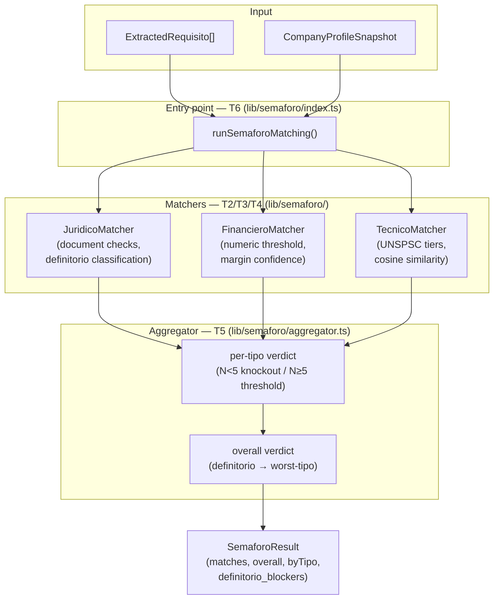
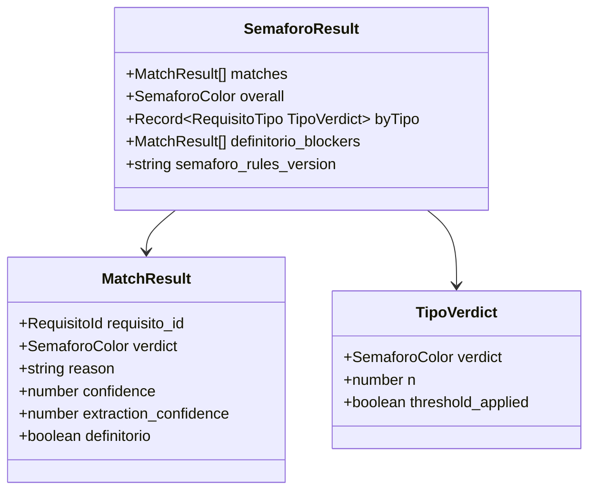
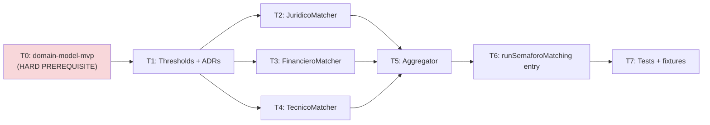

# semaforo-aggregation — Feature Overview

## Spec Reference

[Spec](../spec/spec.md) · [Use Cases](../spec/use-cases.md)

## Problem + Solution

- Pilots come to COLTRATOS for one thing: **bid or skip, with reasons**. Without matching, they interpret 47 individual requisitos manually — exactly the work COLTRATOS exists to eliminate.
- Solution: `runSemaforoMatching(requisitos, profile): SemaforoResult` — a pure function that compares extracted requirements against the company profile snapshot using per-tipo rules (Jurídico, Financiero, Técnico/Experiencia), produces a `reason + confidence` per requisito, and aggregates into overall verde/amarillo/rojo.
- Key approach: jurídico-definitorio knockout (structural impossibilities always rojo); N≥5 per-tipo threshold aggregation (30% rojo / 50% amarillo); confidence derived from evidence quality per tipo; all matching is deterministic — no LLM in this step.
- Output: in-memory `SemaforoResult` consumed by `analisis-orchestration` (persists to Supabase) and `semaforo-result` FE (renders).

## Architecture Diagram

## Data Model

No new database tables. New domain types in `@/types`:

## Task Index

| Task | File | Description | Dependencies |
|------|------|-------------|--------------|
| T0 | (in `domain-model-mvp` spec) | `CompanyProfileSnapshot`, `ExtractedRequisito` discriminated union, `MatchResult`/`SemaforoResult`/`TipoVerdict` types in `@/types`; `analisis.semaforo_rules_version` column | HARD PREREQUISITE |
| T1 | [01-plan-01-types.md](./01-plan-01-types.md) | `lib/semaforo/thresholds.ts` — all versioned constants + `DEFINITORIO_DOCUMENT_TYPES`; ADR-011/012/013/014 | T0 |
| T2 | [01-plan-02-juridico-matcher.md](./01-plan-02-juridico-matcher.md) | `lib/semaforo/juridico-matcher.ts` — definitorio classification, document checks, heuristics | T1 |
| T3 | [01-plan-03-financiero-matcher.md](./01-plan-03-financiero-matcher.md) | `lib/semaforo/financiero-matcher.ts` — numeric threshold matching, margin confidence formula | T1 |
| T4 | [01-plan-04-tecnico-matcher.md](./01-plan-04-tecnico-matcher.md) | `lib/semaforo/tecnico-matcher.ts` — UNSPSC tier matching, cosine similarity, experiencia | T1 |
| T5 | [01-plan-05-aggregator.md](./01-plan-05-aggregator.md) | `lib/semaforo/aggregator.ts` — per-tipo N≥5 threshold, overall verdict derivation | T2, T3, T4 |
| T6 | [01-plan-06-integration.md](./01-plan-06-integration.md) | `lib/semaforo/index.ts` — `runSemaforoMatching` entry point + public barrel + version stamp | T5 |
| T7 | [01-plan-07-tests.md](./01-plan-07-tests.md) | ≥15 golden fixtures (≥5 per tipo), unit tests per matcher, provider-isolation grep, 100% branch coverage | T6 |

## Dependency Graph

T2/T3/T4 can be implemented in parallel after T1.
