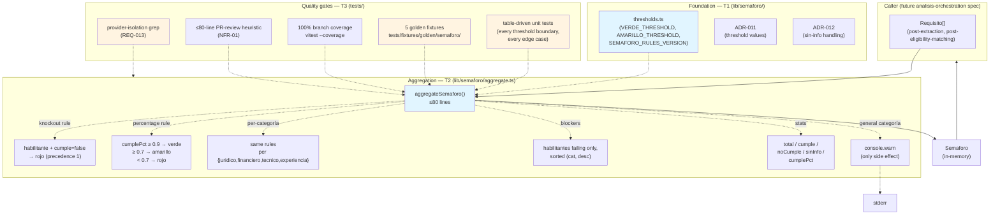
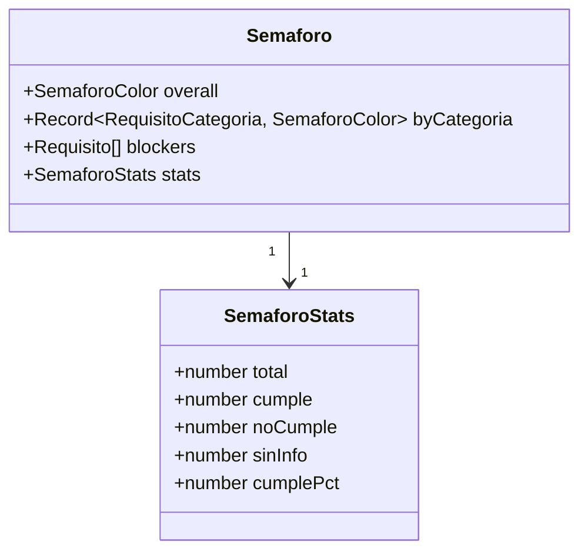
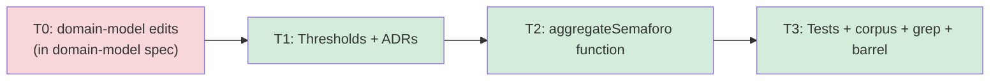

# semaforo-aggregation — Feature Overview

## Spec Reference

[Spec](../../semaforo-aggregation/spec/spec.md) · [Use Cases](../../semaforo-aggregation/spec/use-cases.md)

## Problem + Solution

- Without aggregation, users would interpret 47 individual requisitos manually — exactly the work COLTRATOS exists to eliminate. The verdict needs to be defensible in 10 seconds and auditable when challenged.
- Solution: a **pure function** `aggregateSemaforo(requisitos: Requisito[]): Semaforo` under `lib/semaforo/`, ~50 lines of production code, 100% branch coverage, deterministic.
- Key approach: knockout-rule precedence on habilitantes (any `is_habilitante=true AND cumple=false` → overall rojo); 90%/70% percentage thresholds applied when no knockout fires; sin-información excluded from the denominator + `amarillo` on all-null inputs (per ADR-012); `general` requisitos warned + excluded (RN-008); deterministic `blockers` ordering; versioned thresholds via `SEMAFORO_RULES_VERSION` so historical análisis remain explainable.
- Output: in-memory `Semaforo = { overall, byCategoria, blockers, stats }`, consumed verbatim by the future `analisis-orchestration` (persists to `Analisis`) and `semaforo-result` FE specs (renders).

## Architecture Diagram

## Data Model

No new database tables owned by this feature. Schema additions live in T0 (in `domain-model`):
- `requisito.categoria` (denormalized, narrow enum excluding `general`)
- `requisito.is_habilitante BOOLEAN NOT NULL`
- `requisito.is_habilitante_source TEXT NOT NULL` (CHECK in `'structural' | 'llm' | 'manual'`)
- `analisis.semaforo_rules_version TEXT NULL`
- `HABILITANTE_HEADING_PATTERNS` + `HABILITANTE_PATTERNS_VERSION` runtime constants exported from `@/types` for the requisitos-extraction tiered classifier (cross-spec)

Plus the new domain type `Semaforo` at `src/types/domain/semaforo.ts`:

## Task Index

| Task | File | Description | Dependencies |
|------|------|-------------|--------------|
| T0 | (in `domain-model` spec) | 9 schema items: `requisito.categoria` + `requisito.is_habilitante` + `requisito.is_habilitante_source`; Zod + extraction-payload + Kysely extensions for all three; `analisis.semaforo_rules_version`; `Semaforo`/`SemaforoStats`/`RequisitoCategoria`/`IsHabilitanteSource` types in `@/types`; `HABILITANTE_HEADING_PATTERNS` + `HABILITANTE_PATTERNS_VERSION` constants in `@/types` | (HARD PREREQUISITE) |
| T1 | [01-plan-01-foundation.md](./01-plan-01-foundation.md) | `lib/semaforo/thresholds.ts` + ADR-011 (thresholds) + ADR-012 (sin-info) | T0 |
| T2 | [01-plan-02-aggregate.md](./01-plan-02-aggregate.md) | `lib/semaforo/aggregate.ts` (≤80 lines target — PR-review heuristic, no CI gate): knockout + percentage + per-categoría + blockers + stats + general-warn | T1 |
| T3 | [01-plan-03-corpus-tests-isolation.md](./01-plan-03-corpus-tests-isolation.md) | Table-driven unit tests + 5 golden fixtures (with realistic `is_habilitante_source` distribution) + 100% branch coverage + provider-isolation grep + public barrel `lib/semaforo/index.ts` | T2 |

## Dependency Graph

Strictly serial — this is a small, focused feature. No parallelization opportunity within the spec.
