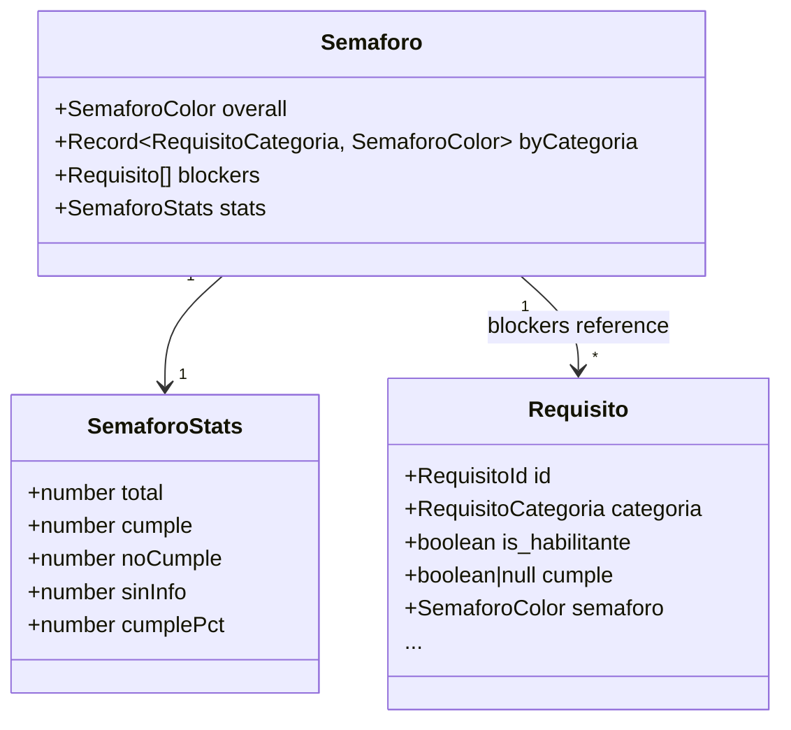
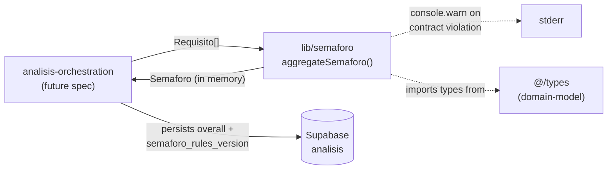

# semaforo-aggregation — Software Design Document

## Intention

`semaforo-aggregation` collapses a `Requisito[]` (produced by [requisitos-extraction](../../requisitos-extraction/spec/spec.md)) into a single, defensible verde/amarillo/rojo verdict the user can act on in 10 seconds: **bid or skip**. It also produces per-categoría sub-verdicts and a blockers list so the UI can show *why*. Without this stage, users would manually interpret 47 individual requisitos — exactly the manual work COLTRATOS exists to eliminate.

This is the spec where COLTRATOS's eligibility business rules **live and are testable in isolation**. Every threshold, every knockout rule, every edge case definition lives in one ~50-line file with 100% branch coverage. That isolation is deliberate: business rules embedded in JSX or buried in extraction prompts are undefendable when a user asks "why did I get rojo?"; the same rules in a pure, fully-tested function are auditable in seconds and tunable in one PR.

### v1 Scope

**In scope:** A pure function `aggregateSemaforo(requisitos: Requisito[]): Semaforo` at `lib/semaforo/`. Knockout rule on habilitantes; 90%/70% percentage thresholds; sin-información excluded from denominator; per-categoría sub-verdicts; deterministic blockers list; full stats breakdown. Versioned thresholds via `SEMAFORO_RULES_VERSION` so historical análisis remain explainable. Two ADRs (ADR-011 thresholds, ADR-012 sin-info handling). Exhaustive table-driven tests + 5 golden fixtures + provider-isolation grep CI test.

**Out of scope (v1):** Per-empresa custom thresholds (deferred to v2 enterprise tier); weighted requisitos (all count equally within their categoría); confidence intervals / probabilistic output; cross-análisis historical comparison; manual override + recompute API; threshold recalibration against real bid outcomes (a v1.1 work item once N≥10 paying users have produced N≥50 análisis).

## Use Cases

Detailed scenarios in [use-cases.md](./use-cases.md).

| Use Case | Description | User Stories |
|----------|-------------|-------------|
| [UC-01 — Aggregate a complete análisis to a verdict](./use-cases.md#uc-01--aggregate-a-complete-análisis-to-a-verdict-us-01) | Orchestrator passes `Requisito[]`; function returns `Semaforo` with overall + by-categoría + blockers + stats | US-01 |
| [UC-02 — Knockout rule fires on a failing habilitante](./use-cases.md#uc-02--knockout-rule-fires-on-a-failing-habilitante-us-02) | A single `is_habilitante=true` + `cumple=false` requisito forces overall=`rojo` regardless of percentages | US-02 |
| [UC-03 — Sin-información handling](./use-cases.md#uc-03--sin-información-handling-us-03) | All-null inputs return `amarillo`; partial-null inputs exclude nulls from the denominator | US-03 |
| [UC-04 — Empty / contract-violation inputs](./use-cases.md#uc-04--empty--contract-violation-inputs-us-04) | Empty `Requisito[]` returns `rojo`; `categoria='general'` requisitos are warned + excluded | US-04 |
| [UC-05 — Threshold tuning is versioned](./use-cases.md#uc-05--threshold-tuning-is-versioned-us-05) | Bumping a threshold requires bumping `SEMAFORO_RULES_VERSION`; orchestrator persists the version on `Analisis` for historical traceability | US-05 |

---

## Requirements

### Functional Requirements

| ID | Requirement | User Stories | Business Rules |
|----|-------------|-------------|----------------|
| REQ-001 | Export a single pure function `aggregateSemaforo(requisitos: Requisito[]): Semaforo` from `lib/semaforo/index.ts`. The function MUST be deterministic: invoking it twice with deeply-equal input returns deeply-equal output | US-01 | RN-001, RN-007 |
| REQ-002 | The function MUST be **pure**: no Supabase, network, or filesystem calls; no `Date.now()` / `new Date()` / `Math.random()`; no module-level state mutation; no input-array mutation. The single permitted side effect is `console.warn` on contract violations (RN-008) | US-01, US-04 | RN-001, RN-008 |
| REQ-003 | Return shape `Semaforo` is defined at `src/types/domain/semaforo.ts` (exported via `@/types`) as: `{ overall: SemaforoColor; byCategoria: Record<RequisitoCategoria, SemaforoColor>; blockers: Requisito[]; stats: { total, cumple, noCumple, sinInfo, cumplePct } }`. `RequisitoCategoria = 'juridico' \| 'financiero' \| 'tecnico' \| 'experiencia'` (NEVER includes `'general'` per RN-008) | US-01 | RN-002, RN-008 |
| REQ-004 | **Knockout rule** (precedence: 1): if any requisito has `is_habilitante === true AND cumple === false`, `overall === 'rojo'` regardless of percentage calculation. Same rule applies independently per categoría | US-02 | RN-003 |
| REQ-005 | **Percentage rule** (precedence: 2, only if knockout does not fire): compute `cumplePct = (count where cumple === true) / (count where cumple !== null)`. Map: `>= 90% → 'verde'`, `>= 70% AND < 90% → 'amarillo'`, `< 70% → 'rojo'`. Same rule applies independently per categoría | US-01 | RN-004 |
| REQ-006 | **Empty edge case**: `requisitos.length === 0` returns `{ overall: 'rojo', byCategoria: <amarillo for each categoría>, blockers: [], stats: { total: 0, cumple: 0, noCumple: 0, sinInfo: 0, cumplePct: 0 } }` | US-04 | RN-005 |
| REQ-007 | **All-sin-información edge case**: if every input requisito has `cumple === null` AND no knockout fires, `overall === 'amarillo'`. Per-categoría sub-verdicts follow the same rule. `cumplePct` is `0` (denominator zero produces `0`, NOT `NaN`) | US-03 | RN-006 |
| REQ-008 | **Per-categoría empty bucket**: a categoría with zero requisitos in the input gets `byCategoria[c] = 'amarillo'` (NOT `'verde'`). Rationale: empty data is not the same as "all good" | US-04 | RN-009 |
| REQ-009 | **Contract violation on `categoria === 'general'`**: if any input requisito carries `categoria === 'general'`, emit `console.warn('[semaforo-aggregation] contract violation: general-categoria requisito received', { requisitoId, segmentoId })` exactly once per offending requisito and exclude it from all aggregation. Do NOT throw; the análisis must still produce a result | US-04 | RN-008 |
| REQ-010 | **Blockers list**: `blockers` includes ONLY requisitos where `is_habilitante === true AND cumple === false`. Excludes `cumple === null`, excludes non-habilitante `cumple === false`. Sorted by `(categoria asc → juridico, financiero, tecnico, experiencia order; descripcion asc alphabetically)` for deterministic test stability | US-02 | RN-010 |
| REQ-011 | **Versioned thresholds**: thresholds and the knockout rule are exported from `lib/semaforo/thresholds.ts` as named constants — `VERDE_THRESHOLD = 0.9`, `AMARILLO_THRESHOLD = 0.7`, plus `SEMAFORO_RULES_VERSION = 'v1.0.0' as const`. The aggregation function imports these — does NOT inline the numbers | US-05 | RN-011 |
| REQ-012 | **Stats calculation**: `stats.total = requisitos.length` (after excluding `general` contract-violators); `stats.cumple = count where cumple === true`; `stats.noCumple = count where cumple === false`; `stats.sinInfo = count where cumple === null`. Invariant: `cumple + noCumple + sinInfo === total`. `cumplePct` is `0..1` floating point (NOT a percentage out of 100), to 6 decimals | US-01 | RN-012 |
| REQ-013 | A CI grep test scans `lib/semaforo/**` (excluding `__tests__/`, `*.test.*`, `tests/**`) and fails if it finds: `@supabase/*`, `@anthropic-ai/sdk`, `node:fs`/`net`/`http`, common loggers (`pino`, `winston`, `bunyan`, `@logtape/`), or `process.env.*` reads | US-01 | RN-001 |
| REQ-014 | Provide 5 golden fixtures at `tests/fixtures/golden/semaforo/` with descriptive filenames + a leading `_comment` field documenting the scenario (`all-habilitantes-fail.json`, `borderline-89pct-amarillo.json`, `borderline-90pct-verde.json`, `all-sin-info.json`, `mixed-realistic.json`). Each fixture pairs `Requisito[]` input with the expected `Semaforo` output verbatim. **Fixture authoring constraint**: every requisito carries an `is_habilitante_source` value; the distribution across all fixtures' habilitantes-true requisitos MUST be ≥80% `'structural'` so the fixtures reflect the production classifier behavior described in REQ-015 / RN-014 | US-05 | RN-013, RN-014 |
| REQ-015 | The `Requisito` shape includes `is_habilitante_source: 'structural' \| 'llm' \| 'manual'` populated by the upstream extractor (per RN-014). `aggregateSemaforo` does NOT read this field for any algorithmic decision — it is **passthrough metadata** surfaced on each blocker so the FE can color-code by classification confidence (structural → high confidence; llm → "verify with team"; manual → user-confirmed). The orchestrator persists the field on the `requisito` row | US-02 | RN-014 |

### Non-Functional Requirements

| ID | Category | Requirement |
|----|----------|-------------|
| NFR-01 | Code economy | Production code under `lib/semaforo/` (excluding tests) stays at ≤80 lines total. **If implementation grows beyond 80 lines, the rules need rethinking, not more code.** This is a hard PR-review heuristic, not a CI gate |
| NFR-02 | Test coverage | 100% branch coverage on `lib/semaforo/aggregate.ts` (the aggregation function). Verified via `vitest --coverage` |
| NFR-03 | Provider isolation | CI grep (REQ-013) passes with zero violations |
| NFR-04 | Determinism | Property-based test: for any input `r`, `JSON.stringify(aggregateSemaforo(r)) === JSON.stringify(aggregateSemaforo(r))`. Sorting in `blockers` is stable across runs |
| NFR-05 | Type safety | `npm run typecheck` passes in strict mode; no `any` in the public API surface |
| NFR-06 | File size | Each file under `lib/semaforo/` stays ≤500 lines per `.nybo/foundation/conventions.yaml` (trivially satisfied — see NFR-01) |

---

## Business Rules

| Rule | Description |
|------|-------------|
| RN-001 | `aggregateSemaforo` is a **pure function**. No Supabase, network, filesystem, environment reads, or non-deterministic primitives. Persistence is the orchestrator's responsibility. The interface is structurally protected by the provider-isolation grep (REQ-013). |
| RN-002 | The output `Semaforo` shape is the **rendered shape**: the FE consumes it directly. If the FE needs additional derived fields (e.g., display strings, color hex codes), those are computed in the FE — they MUST NOT be added to this contract. The contract stays minimal so it stays auditable. |
| RN-003 | **Knockout rule precedence**: any requisito with `is_habilitante === true AND cumple === false` forces `overall = 'rojo'` regardless of percentage calculation. Procurement law makes habilitantes literal blockers — failing one means the empresa is legally ineligible to bid, full stop. The same rule applies per categoría. |
| RN-004 | **Percentage thresholds**: `cumplePct >= 0.9 → 'verde'`, `cumplePct >= 0.7 → 'amarillo'`, `cumplePct < 0.7 → 'rojo'`. Boundaries are inclusive on the lower bound (`0.9` is verde, `0.7` is amarillo). Sin-información requisitos are EXCLUDED from the denominator: a missing-data requisito does not punish the score. |
| RN-005 | **Empty array → `rojo`**: an análisis with zero requisitos indicates extraction failure or a non-standard pliego. Surfacing it as `rojo` prevents the UI from misleadingly showing `verde` for an empty result; the per-categoría buckets show `amarillo` so the user understands "no data" is the cause, not "everything fine." |
| RN-006 | **All sin-información → `amarillo`**: do NOT return `rojo` here. That would conflate "ineligible" with "couldn't tell." `amarillo` correctly communicates "manual review needed; we don't have grounds for a confident verdict." |
| RN-007 | The function is **deterministic** — no `Date.now()`, `Math.random()`, or environment dependence. Property-based tests assert deep equality across repeated calls. |
| RN-008 | **`general` categoría is never aggregated**: per [pdf-ingestion RN-012](../../pdf-ingestion/spec/spec.md), general segments do not produce requisitos. If any input requisito carries `categoria === 'general'`, this is a contract violation upstream — log via `console.warn` (the **only** I/O permitted in this module, explicitly documented in REQ-002 / REQ-009) and exclude it from aggregation. Do NOT fail; the análisis must still produce a result. |
| RN-009 | **Empty categoría → `amarillo` (not `verde`)**: a categoría with zero requisitos means "we have no information about this categoría," not "everything in this categoría is fine." Defaulting to `verde` would falsely signal eligibility. |
| RN-010 | **Blockers list contract**: includes only `is_habilitante === true AND cumple === false`. Excludes `cumple === null` (those are flagged in `stats.sinInfo` for "requiere revisión" UI surfaces, not as confirmed blockers). Excludes non-habilitante `cumple === false` (those lower the percentage but are not legal knockouts). Sorted `(categoria → fixed enum order: juridico, financiero, tecnico, experiencia; descripcion → alphabetical asc)` for deterministic test fixtures. |
| RN-011 | **Versioned thresholds**: changing any threshold or the knockout rule requires (a) editing `lib/semaforo/thresholds.ts`, (b) bumping `SEMAFORO_RULES_VERSION`, (c) updating golden fixtures with explicit new expected outputs, (d) writing an ADR documenting the rationale. The orchestrator persists `SEMAFORO_RULES_VERSION` on `Analisis.semaforo_rules_version` so historical análisis can be re-explained against the rules that produced them — recalibration without data loss. |
| RN-012 | **Stats invariant**: `cumple + noCumple + sinInfo === total`. `cumplePct` denominator is `total - sinInfo` (zero produces `cumplePct === 0`, NOT `NaN` — explicit guard). |
| RN-013 | **Golden fixtures are the regression net**: the 5 fixtures lock the v1 rules in place. Any change to the algorithm that would break a fixture forces an explicit fixture update, surfacing the behavior change in the diff. They are **not** a quality gate against expert judgment — that's the v1.1 calibration work item per ADR-011. |
| RN-014 | **Tiered `is_habilitante` classification (cross-spec contract)**: `is_habilitante` is the single most consequential boolean in this pipeline — it triggers the knockout rule (RN-003), which can override any percentage calculation. Pure LLM inference is too risky for this decision because (a) the LLM has no incentive to distinguish "important requisito" from "legally habilitante," and (b) Colombian procurement law makes the distinction specific. **`is_habilitante` MUST therefore be classified via a tiered approach (implemented in [requisitos-extraction](../../requisitos-extraction/spec/spec.md), enforced in this spec via the corpus expectations of REQ-014):** (1) **STRUCTURAL FIRST** — if the source `segmento.heading_normalized` matches a pattern in `HABILITANTE_HEADING_PATTERNS` (a curated regex list at `@/types`, see T0 item 9), `is_habilitante = true` automatically and `is_habilitante_source = 'structural'`. (2) **LLM FALLBACK** — only when no structural pattern matches, the LLM extractor classifies based on requisito text and context; `is_habilitante_source = 'llm'`. (3) **MANUAL OVERRIDE (v1.1+)** — a future feature lets users correct classifications; `is_habilitante_source = 'manual'`. The tiering's quality bar lives in requisitos-extraction's revised acceptance test: ≥80% of habilitante classifications in that spec's golden corpus must come via `'structural'` (forcing the pattern list to do real work). `aggregateSemaforo` consumes the resulting boolean only — it has no opinion on how the boolean was produced; that is `is_habilitante_source`'s concern. |

---

## Test Cases

### TC-001 — Pure function: deterministic, no I/O, no mutation (REQ-001, REQ-002, RN-001, RN-007)

**Given** any `Requisito[]` input
**When** `aggregateSemaforo(input)` is called twice and the input is also captured before/after via `structuredClone`
**Then** both outputs are deeply equal AND the input is unchanged AND no Supabase / network / fs / env access occurred (verified by stub spies in the test harness)

### TC-002 — Knockout rule fires on a single failing habilitante (REQ-004, RN-003)

**Given** a `Requisito[]` of 10 items where 9 have `cumple: true` (95% cumplePct, would otherwise be verde) and 1 has `is_habilitante: true, cumple: false`
**When** `aggregateSemaforo(input)` is called
**Then** `output.overall === 'rojo'`; the failing requisito appears in `output.blockers`

### TC-003 — Knockout rule applies per categoría (REQ-004, RN-003)

**Given** `Requisito[]` with one `is_habilitante: true, cumple: false` requisito in `categoria: 'juridico'` and 10 cumple-true requisitos in `categoria: 'tecnico'`
**When** aggregated
**Then** `byCategoria.juridico === 'rojo'` AND `byCategoria.tecnico === 'verde'` AND `overall === 'rojo'`

### TC-004 — Percentage thresholds: 90% inclusive → verde (REQ-005, RN-004)

**Given** 10 requisitos, 9 `cumple: true`, 1 `cumple: false`, none habilitantes
**When** aggregated
**Then** `stats.cumplePct === 0.9`; `overall === 'verde'`

**Given** 100 requisitos, 89 `cumple: true`, 11 `cumple: false`
**When** aggregated
**Then** `stats.cumplePct === 0.89`; `overall === 'amarillo'`

### TC-005 — Percentage thresholds: 70% inclusive → amarillo (REQ-005, RN-004)

**Given** 10 requisitos, 7 `cumple: true`, 3 `cumple: false`
**When** aggregated
**Then** `stats.cumplePct === 0.7`; `overall === 'amarillo'`

**Given** 100 requisitos, 69 `cumple: true`, 31 `cumple: false`
**When** aggregated
**Then** `stats.cumplePct === 0.69`; `overall === 'rojo'`

### TC-006 — Sin-información excluded from denominator (REQ-005, RN-004)

**Given** 10 requisitos: 8 `cumple: true`, 0 `cumple: false`, 2 `cumple: null`
**When** aggregated
**Then** `stats.cumplePct === 1.0` (8/8 of *known* requisitos cumple); `overall === 'verde'`

### TC-007 — All sin-información → amarillo (REQ-007, RN-006)

**Given** 5 requisitos all with `cumple: null`, no habilitantes failing
**When** aggregated
**Then** `overall === 'amarillo'` AND `byCategoria[c] === 'amarillo'` for every categoría AND `stats.cumplePct === 0` (denominator-zero guard, NOT `NaN`)

### TC-008 — Empty array → rojo with empty buckets (REQ-006, RN-005)

**Given** `requisitos: []`
**When** aggregated
**Then** `overall === 'rojo'`; `byCategoria.juridico/financiero/tecnico/experiencia === 'amarillo'` (empty bucket fallback per RN-009); `blockers === []`; `stats === { total: 0, cumple: 0, noCumple: 0, sinInfo: 0, cumplePct: 0 }`

### TC-009 — Empty categoría → amarillo (REQ-008, RN-009)

**Given** `Requisito[]` with 5 requisitos, all `categoria: 'juridico'`, all `cumple: true`
**When** aggregated
**Then** `byCategoria.juridico === 'verde'`; `byCategoria.financiero === 'amarillo'`; `byCategoria.tecnico === 'amarillo'`; `byCategoria.experiencia === 'amarillo'`

### TC-010 — Contract violation on `general` categoría: warn + exclude (REQ-009, RN-008)

**Given** `Requisito[]` with one `categoria: 'general'` requisito + 5 valid `categoria: 'juridico'` requisitos all cumple
**When** aggregated (with a `console.warn` spy installed)
**Then** the warn was called once with `'[semaforo-aggregation] contract violation: general-categoria requisito received'` and the offending `requisitoId`/`segmentoId` in the payload; the function does NOT throw; `stats.total === 5` (excludes the offender); `overall === 'verde'`

### TC-011 — Blockers list: only habilitantes with cumple=false (REQ-010, RN-010)

**Given** `Requisito[]` with: req-A `is_habilitante: true, cumple: false`; req-B `is_habilitante: false, cumple: false`; req-C `is_habilitante: true, cumple: null`; req-D `is_habilitante: true, cumple: true`
**When** aggregated
**Then** `blockers === [req-A]` only — req-B excluded (non-habilitante false), req-C excluded (null), req-D excluded (cumple)

### TC-012 — Blockers list: deterministic ordering (REQ-010, RN-010)

**Given** `Requisito[]` with multiple habilitantes-failing across categorías and varying descripcion strings
**When** aggregated twice with shuffled input order
**Then** `blockers` is identical across both calls: sorted first by categoría (fixed order: juridico, financiero, tecnico, experiencia), then by `descripcion` ascending alphabetically

### TC-013 — Stats invariant + cumplePct precision (REQ-012, RN-012)

**Given** any `Requisito[]` input
**When** aggregated
**Then** `stats.cumple + stats.noCumple + stats.sinInfo === stats.total`; `stats.cumplePct` is a number in `[0, 1]` rounded to 6 decimal places; if `stats.total - stats.sinInfo === 0`, `stats.cumplePct === 0` (not `NaN`)

### TC-014 — Versioned thresholds + SEMAFORO_RULES_VERSION export (REQ-011, RN-011)

**Given** the file `lib/semaforo/thresholds.ts`
**When** inspected
**Then** it exports `VERDE_THRESHOLD`, `AMARILLO_THRESHOLD`, and `SEMAFORO_RULES_VERSION` as named const exports; `SEMAFORO_RULES_VERSION` is a string matching `/^v\d+\.\d+\.\d+$/` (initial: `'v1.0.0'`)

**Given** the file `lib/semaforo/aggregate.ts`
**When** grepped for the literals `0.9`, `0.7`, `90`, `70`
**Then** zero matches are found — thresholds are imported from `thresholds.ts`, never inlined

### TC-015 — Provider isolation grep (REQ-013, NFR-03)

**Given** the file tree `lib/semaforo/**` (excluding `__tests__/`, `*.test.*`, `tests/**`)
**When** the grep test runs
**Then** zero matches for `@supabase/*`, `@anthropic-ai/sdk`, `node:fs/net/http`, common logger modules, or `process.env`

### TC-016 — Golden fixtures verbatim (REQ-014, RN-013)

**Given** the 5 fixtures at `tests/fixtures/golden/semaforo/`
**When** the corpus test runs `aggregateSemaforo(fixture.input)` per fixture
**Then** the output is deeply equal to `fixture.expected` for every fixture; any algorithm change that would break a fixture forces an explicit fixture update

### TC-017 — `console.warn` is the only side effect (REQ-002, REQ-009, RN-001)

**Given** stubs for `console.warn`, `console.log`, `console.error`, `console.info`, plus `process.env`, `fs`, `net`, `http`, the global `Date.now`, `Math.random`
**When** `aggregateSemaforo` runs against any non-contract-violating input (no `general` requisitos)
**Then** zero invocations of any stub. Only when a `general` requisito is present does `console.warn` fire — and it is the only stub touched

### TC-018 — Golden fixtures carry realistic `is_habilitante_source` distribution (REQ-014, RN-014)

**Given** the 5 golden fixtures at `tests/fixtures/golden/semaforo/`
**When** the manifest test inspects each fixture's `input` array and tallies, across all fixtures, the count of requisitos with `is_habilitante === true` grouped by `is_habilitante_source`
**Then** the count where `is_habilitante_source === 'structural'` is **≥80%** of the total habilitante-true count (zero habilitantes total is allowed and skips the assertion). Rationale: hand-authoring a fixture with all-`'llm'` sources would falsely model production behavior; the tiering's whole point is that structural classification carries the bulk of the load (RN-014)

---

## UX/UI

No UI in this spec. The output `Semaforo` shape **is** the rendered contract — the future `semaforo-result` FE spec consumes this verbatim. Per RN-002, the FE MUST NOT request additions to the `Semaforo` contract; derived display fields (color hex codes, locale-translated strings, sparkline data) are computed in the FE.

---

## Architecture

### Architecture Decision Records

| ADR | Title | Impact on this feature |
|-----|-------|----------------------|
| ADR-005 | Pure-function service boundary for ingestion | Establishes the `lib/` purity convention. This feature instantiates it again: zero injected dependencies (semaforo aggregation has no SDK clients to inject — purer than `lib/extraction` even). The provider-isolation grep is the structural enforcement. ADR file already authored under pdf-ingestion T1. |
| ADR-011 | Threshold values for semáforo verdicts (v1) | Documents 90%/70% + knockout-on-habilitantes as v1 thresholds. **Status: Accepted.** Rationale: starting hypotheses, not validated optimal points; chosen because (a) 90% leaves narrow margin for error appropriate for high-stakes bid decisions, (b) 70% as the amarillo floor reflects "you could probably qualify with effort" — the actionable middle state, (c) excluding sin-info from the denominator prevents extraction gaps from artificially deflating scores. **Validation plan: at N≥10 paying users with N≥50 análisis, compare semáforo verdicts against actual bid outcomes and recalibrate. v1.1 work item, not a v1 ship blocker.** ADR file authored in T1. |
| ADR-012 | Sin-información handling: amarillo, not rojo | Documents the all-null-input-returns-`amarillo` decision and the "exclude from denominator" rule. **Status: Accepted.** Rationale: treating "we couldn't tell" as "ineligible" produces misleading rojos that drive users away from procesos they might actually qualify for; `amarillo` correctly communicates "manual review needed" without making a confident negative claim. Mitigation against overconfidence: `stats.cumplePct` exposes the denominator and `stats.sinInfo` is surfaced prominently in the UI so users see when the verdict is based on partial data. ADR file authored in T1. |

### Tradeoffs

| Tradeoff | We chose | Over | Rationale |
|----------|----------|------|-----------|
| Boundary | Pure function | Service class with injected logger | No I/O exists for this feature to coordinate. Injection adds no value; the `console.warn` for contract violations is the only permitted side effect and is documented explicitly in REQ-002 / REQ-009. |
| Threshold values | Inclusive lower bounds (`>= 0.9 verde`, `>= 0.7 amarillo`) | Exclusive bounds | Inclusive matches user mental models ("ninety percent or better is green") and avoids `0.7000001` boundary surprises in test fixtures. |
| Sin-info treatment | Exclude from denominator + `amarillo` on all-null | Count as `rojo` (conservative) | Conservative treatment punishes incomplete profiles and produces false rojos that drive users away from procesos they could win. ADR-012 captures the decision and its mitigations. |
| Empty-categoría treatment | Default to `amarillo` | Default to `verde` | Empty data is not the same as "all good." Defaulting to verde would silently hide extraction gaps; amarillo correctly signals "no information here." |
| Empty-array treatment | Overall `rojo` | Overall `amarillo` | An empty `Requisito[]` is a strong upstream signal (extraction failed or pliego is non-standard); rojo prevents misleading verdes on broken inputs. Per-categoría buckets remain `amarillo` so the cause is legible. |
| `general` requisitos | Warn + exclude (RN-008) | Throw and abort aggregation | Producing a verdict with the valid categorías is more useful than failing the whole análisis on an upstream contract violation. The warn flags the violation for engineering without breaking user-facing flows. |
| Versioning | `SEMAFORO_RULES_VERSION` constant + persisted on `Analisis` | No versioning; thresholds live in the same code as logic | Threshold tuning is expected (v1.1 calibration work item). Without versioning, historical análisis become unexplainable after the next tune. The version stamp on each `Analisis` row makes recalibration auditable without data loss. |
| Code economy | ≤80 lines as a **PR-review heuristic** | Hard CI gate | A CI gate at 80 (or 100) lines will eventually conflict with a legitimate edge-case addition and become noise — engineers learn to game the line count rather than the underlying complexity. Trusting PR review preserves the heuristic's intent (catch scope creep, force the "is this a v2 feature?" conversation) without creating false rejection drama. If the function organically grows past ~100 lines, that's a PR-review signal — surface it in the PR description, not via automation. |
| `is_habilitante` classification | Tiered: structural patterns first, LLM fallback, manual override deferred to v1.1 | Pure LLM inference | `is_habilitante` triggers the knockout rule and is the most consequential boolean in the pipeline. Pure LLM is risky because (a) the LLM has no built-in incentive to distinguish "important" from "legally habilitante," (b) Colombian procurement law makes the distinction specific. Structural patterns against normalized headings are deterministic, auditable, expandable, and cheap; LLM fallback handles edge cases the patterns miss. Persisting `is_habilitante_source` makes the tiering visible per-requisito so analytics can track classifier health and the FE can color-code blockers by classification confidence. |
| Output stability | Deterministic blockers ordering | Insertion-order or any-order | Test fixtures need byte-identical comparisons. Sorting blockers by `(categoria fixed-order, descripcion alpha)` makes the function trivially testable and the UI presentation predictable. |

### Performance Goals & Metrics

| Metric | Target | Measurement |
|--------|--------|-------------|
| Per-call latency, ≤100 requisitos | < 1ms | vitest benchmark, 10k iterations |
| Memory allocation per call | < 50KB heap delta | manual `process.memoryUsage` probe in benchmark |
| Branch coverage | 100% | `vitest --coverage` (NFR-02) |

This is a CPU-trivial pure function; no real performance concerns. The metrics exist so future contributors don't accidentally introduce O(n²) sorting or pathological allocation.

### Data Model

This feature does **not** own any database tables. It produces an in-memory `Semaforo` object. It requires schema additions to `requisito` and `analisis` (see Dependencies below) plus a new domain type `Semaforo` exported from `@/types`.



### Dependencies on `domain-model` (HARD PREREQUISITE — T0)

The following changes must ship via `/nybo-plan edit domain-model` **before T1 of this spec begins**:

1. `requisito.categoria` — denormalized from `segmento.categoria` for query convenience and to keep `aggregateSemaforo` a pure function over `Requisito[]` alone (no segmento join). Postgres column: `requisito_categoria` enum (`juridico | financiero | tecnico | experiencia` — narrow, EXCLUDES `general` per RN-008). Add a CHECK constraint `requisito.categoria <> 'general'` if reusing the broader `segmento_categoria` enum is preferred for code economy.
2. `requisito.is_habilitante BOOLEAN NOT NULL` — produced by the tiered classifier (RN-014) and consumed by the knockout rule (RN-003).
3. `requisito.is_habilitante_source` — Postgres column `is_habilitante_source TEXT NOT NULL CHECK (is_habilitante_source IN ('structural','llm','manual'))` (or a dedicated `is_habilitante_source` Postgres enum if preferred). Records which tier of RN-014 produced the boolean. Defaults at the application layer to `'llm'` when the LLM-fallback path is taken.
4. `RequisitoSchema` (Zod) extended with `categoria: z.enum([...RequisitoCategoria values...])`, `is_habilitante: z.boolean()`, and `is_habilitante_source: z.enum(['structural','llm','manual'])`.
5. `RequisitoExtractionPayloadSchema` (the LLM-output contract, owned by requisitos-extraction) extended with `is_habilitante: z.boolean()` AND `is_habilitante_source: z.enum(['structural','llm','manual'])` so the extractor MUST emit both. `categoria` is already present in the payload schema per requisitos-extraction's T0. **Note**: when the structural tier fires, the extractor populates the source as `'structural'` BEFORE issuing the LLM call (or skips the LLM call entirely for that requisito — implementation detail of requisitos-extraction's revision).
6. `RequisitoTable` (Kysely) extended with `categoria: RequisitoCategoria`, `is_habilitante: boolean`, and `is_habilitante_source: IsHabilitanteSource`.
7. `analisis.semaforo_rules_version TEXT NULL` — populated by the orchestrator with the `SEMAFORO_RULES_VERSION` value at aggregation time, so historical análisis remain explainable against the rules that produced them. Zod `AnalisisSchema` and Kysely `AnalisisTable` extended.
8. New domain types defined at `src/types/domain/semaforo.ts` and exported via `@/types`: `Semaforo`, `SemaforoStats`, `RequisitoCategoria`, and `IsHabilitanteSource = 'structural' | 'llm' | 'manual'`. `RequisitoCategoria` is the narrow `'juridico' | 'financiero' | 'tecnico' | 'experiencia'` union — distinct from `SegmentoCategoria` which includes `'general'`.
9. **`HABILITANTE_HEADING_PATTERNS`** — runtime constant exported from `@/types` (file: `src/types/domain/habilitante-patterns.ts`). A `readonly RegExp[]` of NFD-normalized lowercase regex patterns matching the headings of legally-habilitante sections in Colombian SECOP-II pliegos. Initial v1 list (expandable; the value is co-evolved with the requisitos-extraction acceptance test): `/\brequisitos\s+habilitantes\b/`, `/\bcapacidad\s+juridica\b/`, `/\bcapacidad\s+financiera\b/`, `/\bcapacidad\s+tecnica\b/`, `/\bexperiencia\s+(minima|acreditada|requerida)\b/`. Patterns are authored against the normalized form (per [pdf-ingestion REQ-005](../../pdf-ingestion/spec/spec.md))). Companion constant `HABILITANTE_PATTERNS_VERSION = 'v1.0.0' as const` mirrors `SEMAFORO_RULES_VERSION` so historical classifications remain auditable when the pattern list changes.

Until T0 (all 9 items) ships, this spec is blocked.

> **Cross-spec dependency on [requisitos-extraction](../../requisitos-extraction/spec/spec.md):** after this spec is approved, the next required action is `/nybo-plan edit requisitos-extraction` to (1) denormalize `categoria` from segmento onto each emitted requisito, (2) implement the tiered `is_habilitante` classification per RN-014 — structural pattern matching against `segmento.heading_normalized` first, LLM fallback otherwise — and persist `is_habilitante_source` on the output, (3) extend `RequisitoExtractionPayloadSchema` accordingly, (4) update its golden corpus to include `is_habilitante` + `is_habilitante_source` fields, (5) add an acceptance test asserting **≥80% of habilitante-true requisitos in its golden corpus carry `is_habilitante_source === 'structural'`** (forcing `HABILITANTE_HEADING_PATTERNS` to do real work; an empty pattern list fails the test). **The future `analisis-orchestration` spec is BLOCKED until requisitos-extraction's revised T0/T1 ships those changes.**

### API / Data Contracts

No HTTP endpoints. The single contract is the function signature:

```typescript
// lib/semaforo/index.ts
import type { Requisito, Semaforo } from '@/types'

export function aggregateSemaforo(requisitos: Requisito[]): Semaforo
// Pure. Single permitted side effect: console.warn on contract violations
// (general-categoria requisitos). Never throws.

export {
  VERDE_THRESHOLD,
  AMARILLO_THRESHOLD,
  SEMAFORO_RULES_VERSION,
} from './thresholds'
```

### Upstream Caller Contract

The orchestrator (future `analisis-orchestration` spec) MUST:
- Pass the **full** `Requisito[]` for an `Analisis` (no pre-filtering of `cumple === null` — the function handles those).
- Persist `Analisis.semaforo = result.overall` and `Analisis.semaforo_rules_version = SEMAFORO_RULES_VERSION` together in the same UPDATE.
- Persist the `byCategoria`, `blockers`, and `stats` structures via whatever shape the future `analisis-aggregation-result` spec defines (out of scope here — this spec only produces the in-memory result).
- Transition `Analisis.estado: analyzing → completed` after a successful aggregation.

### Service Integrations



| System | Direction | Data |
|--------|-----------|------|
| `@/types` (domain-model) | Reading | `Requisito`, `Semaforo`, `SemaforoColor`, `RequisitoCategoria` types |
| `console.warn` (stderr) | Writing | One log per general-categoría contract violation. Permitted exception to the purity rule (RN-008). |
| Supabase / `@anthropic-ai/sdk` / `process.env` / `node:*` / loggers | **None** | Provider isolation grep (REQ-013) enforces this |

---

## Domains Touched

- **eligibility-matching** — primary domain for this feature.
- **requisito-extraction** — consumes `Requisito[]` produced by extraction; depends on extraction populating `categoria` and `is_habilitante`.
- **analytics** — `SEMAFORO_RULES_VERSION` enables longitudinal verdict-quality analysis once paying users produce enough volume.

## Workflow Skills Applicable

- `nybo-tdd` — TDD is the natural fit for a pure function with table-driven tests.
- `nybo-verify` — corpus + branch-coverage + provider-isolation grep are the verify gates.

## Project Pattern Skills

None yet — `.nybo/skills/` is empty for this greenfield project. After this feature ships, two patterns are candidates for `/nybo-curate extract`:
- **Versioned business-rules constants** (the `SEMAFORO_RULES_VERSION` + persisted-on-row pattern) — reusable for any future rule-engine where historical decisions must remain explainable.
- **Code-economy hard heuristic** (the ≤80-line PR-review check) — useful for any pure-rules module where growth indicates rule complexity rather than feature scope.

## Dependencies

- **MCPs**: none required.

---

## Revision Log

| Date | Change | Reason |
|------|--------|--------|
| 2026-04-27 | Initial draft | Discovery interview captured by Carlos: pure function under `lib/semaforo/`; knockout-on-habilitantes precedes percentage thresholds (90%/70%); sin-info excluded from denominator + amarillo on all-null; empty array → rojo; empty categoría → amarillo; `general` warned and excluded; deterministic blockers ordering; versioned thresholds via `SEMAFORO_RULES_VERSION` persisted on `Analisis`; ADR-011 (thresholds) + ADR-012 (sin-info handling); ≤80 lines code economy as a PR-review heuristic (no CI gate); 5 golden fixtures + 100% branch coverage. T0 expanded to 9 items: tiered `is_habilitante` classification (structural-first, LLM-fallback, manual v1.1+) with `is_habilitante_source` column + `HABILITANTE_HEADING_PATTERNS` constant in `@/types` + `HABILITANTE_PATTERNS_VERSION`. RN-014 captures the cross-spec contract; the ≥80%-structural acceptance bar lives in requisitos-extraction's revised corpus, not here. The future `analisis-orchestration` spec is blocked on requisitos-extraction's revision shipping the tiered classifier. |
