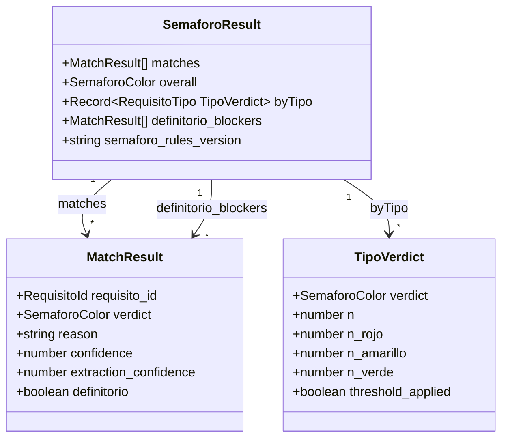
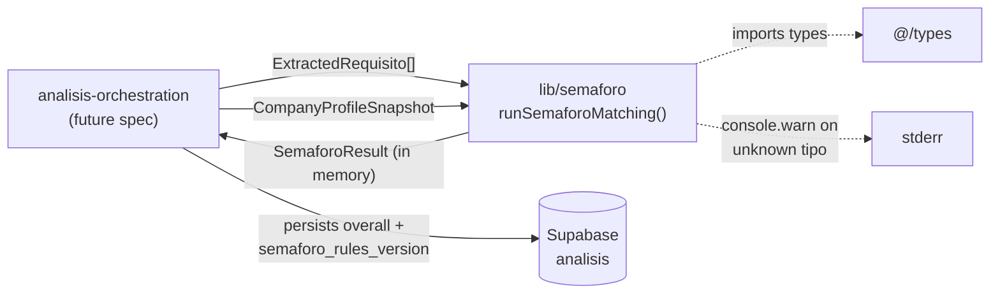

# semaforo-aggregation — Software Design Document

## Intention

`semaforo-aggregation` receives an `ExtractedRequisito[]` (structured requirements from
[requisitos-extraction](../../requisitos-extraction/spec/spec.md)) and a `CompanyProfileSnapshot`
(the profile pinned at analysis time from [company-profiling-onboarding](../../company-profiling-onboarding/spec/spec.md)),
and produces a deterministic, explainable verdict per requisito plus an overall bid verdict
(verde/amarillo/rojo). This is the headline output COLTRATOS pilots come for: **bid or skip,
with reasons they can defend**.

Three matching engines — Jurídico, Financiero, and Técnico/Experiencia — evaluate each
requisito against the profile under their own rules. A separate aggregator rolls per-requisito
verdicts into per-tipo and overall verdicts using versioned thresholds applied per-tipo.
Every verdict carries a `reason` (≤200 chars, Spanish) and a `confidence` score (0–1) derived
from evidence quality — not inherited from extraction. The LLM extracts; rules match.

### v2 Scope

**In scope:** `runSemaforoMatching(requisitos, profile): SemaforoResult` at `lib/semaforo/`.
Three matchers (Jurídico, Financiero, Técnico/Experiencia). Per-tipo N≥5 threshold aggregation
(30% rojo, 50% amarillo). Jurídico-definitorio knockout. Versioned `DEFINITORIO_DOCUMENT_TYPES`
pattern list. Confidence derivation formula per tipo with numeric examples. `SEMAFORO_RULES_VERSION = 'v2.0.0'`.
100% branch coverage + ≥5 golden fixtures per tipo + provider-isolation grep.

**Out of scope (v2):** Custom per-empresa thresholds (v3); weighted requisitos; probabilistic
output; cross-análisis comparison; manual override; threshold recalibration (v2.1 once N≥50
análisis); LLM-assisted matching (permanently out of scope per RN-014).

## Use Cases

Detailed scenarios in [use-cases.md](./use-cases.md).

| Use Case | Description | User Stories |
|----------|-------------|-------------|
| [UC-01](./use-cases.md#uc-01) | Full matching run: `ExtractedRequisito[]` + profile → `SemaforoResult` | US-01 |
| [UC-02](./use-cases.md#uc-02) | Jurídico-definitorio knockout forces overall=rojo regardless of other verdicts | US-02 |
| [UC-03](./use-cases.md#uc-03) | Financiero numeric threshold match with margin-based confidence | US-03 |
| [UC-04](./use-cases.md#uc-04) | Técnico/Experiencia capacity match via UNSPSC tiers and embedding cosine | US-04 |
| [UC-05](./use-cases.md#uc-05) | Per-tipo N≥5 threshold aggregation; small pliegos use knockout-only | US-05 |
| [UC-06](./use-cases.md#uc-06) | Re-run after profile edit creates new análisis row; original is unchanged | US-06 |

---

## Requirements

### Functional Requirements

| ID | Requirement | User Stories | Business Rules |
|----|-------------|-------------|----------------|
| REQ-001 | Export `runSemaforoMatching(requisitos: ExtractedRequisito[], profile: CompanyProfileSnapshot): SemaforoResult` from `lib/semaforo/index.ts`. Deterministic: equal inputs → equal output | US-01 | RN-001, RN-002 |
| REQ-002 | Pure function: no Supabase, network, filesystem, `Date.now()`, `Math.random()`, or `process.env` reads. Provider-isolation grep (REQ-014) enforces structurally. `console.warn` on unknown `requisito_tipo` is the sole permitted side effect | US-01 | RN-001 |
| REQ-003 | `SemaforoResult = { matches: MatchResult[]; overall: SemaforoColor; byTipo: Record<RequisitoTipo, TipoVerdict>; definitorio_blockers: MatchResult[]; semaforo_rules_version: string }`. `MatchResult = { requisito_id, verdict, reason: string, confidence: number, extraction_confidence: number, definitorio: boolean }`. `TipoVerdict = { verdict, n, n_rojo, n_amarillo, n_verde, threshold_applied: boolean }` | US-01 | RN-003 |
| REQ-004 | **Jurídico matcher**: check required document/legal condition from `ExtractedRequisito` against `CompanyProfileSnapshot.documentos` and `legal_data`. Verde: present + current. Amarillo: expired, missing-but-obtainable, or heuristic fallback (confidence 0.5). Rojo: definitorio mismatch confirmed (confidence 1.0) or definitorio confirmed absent (confidence 1.0) | US-02 | RN-004, RN-005, RN-016 |
| REQ-005 | **`is_definitorio` classification**: each jurídico match is classified as `definitorio: boolean` by checking `ExtractedRequisito.document_type` against `DEFINITORIO_DOCUMENT_TYPES` (static list, RN-016). Not set by extraction or LLM — set by the matcher | US-02 | RN-005, RN-016 |
| REQ-006 | **Financiero matcher**: compare extracted `{ indicador, threshold, operador }` against the corresponding indicator in `CompanyProfileSnapshot`. Verde: actual meets threshold with ≥10% margin. Amarillo: met with <10% margin OR only most-recent year qualifies. Rojo: threshold missed on any required year | US-03 | RN-006, RN-007, RN-010 |
| REQ-007 | **Técnico/Experiencia matcher**: match extracted requirements against `CompanyProfileSnapshot.contratos_previos` and `personal_clave`. Match hierarchy: (1) exact UNSPSC → verde 1.0; (2) parent UNSPSC → amarillo 0.7; (3) cosine ≥ 0.80 → amarillo with confidence=cosine; (4) no match → rojo 0.0. Best-matching contract used | US-04 | RN-008, RN-011 |
| REQ-008 | **Per-tipo aggregation**: for each `RequisitoTipo ∈ {juridico, financiero, tecnico, experiencia}`, compute `TipoVerdict` using the N<5 / N≥5 rule (RN-009). `threshold_applied = N >= 5` | US-05 | RN-009 |
| REQ-009 | **Overall verdict**: derived per RN-012 from per-tipo verdicts and `definitorio_blockers`. `definitorio_blockers = matches where definitorio === true AND verdict === 'rojo'` | US-01, US-02 | RN-012 |
| REQ-010 | **Reason field**: every `MatchResult.reason` is ≤200 chars, in Spanish, identifying the rule that fired. Unmatched requisito: `"Requisito sin correspondencia en el perfil"`. Empty or missing reason is a contract violation | US-01 | RN-003 |
| REQ-011 | **Confidence scoring**: per-tipo formulas (RN-010, RN-011, RN-013). `extraction_confidence` (from input `ExtractedRequisito`) is a separate field on `MatchResult` — not mixed into matching confidence | US-01 | RN-010, RN-011, RN-013 |
| REQ-012 | **`SEMAFORO_RULES_VERSION = 'v2.0.0'`** exported from `lib/semaforo/thresholds.ts`. Every rule change bumps this. Orchestrator persists on `Analisis.semaforo_rules_version` | US-06 | RN-015 |
| REQ-013 | **Snapshot-based**: matching uses the passed `CompanyProfileSnapshot` — never re-fetches live profile | US-06 | RN-014 |
| REQ-014 | CI grep: `lib/semaforo/**` (excluding tests) → zero matches for `@supabase/*`, `@anthropic-ai/sdk`, `node:fs/net/http`, common loggers, `process.env.*` | US-01 | RN-001 |
| REQ-015 | ≥5 golden fixtures per tipo (≥15 total) at `tests/fixtures/golden/semaforo/`. Must include all small-N transition scenarios from RN-009 | US-05 | RN-017 |

### Non-Functional Requirements

| ID | Category | Requirement |
|----|----------|-------------|
| NFR-01 | Code economy | Each matcher ≤300 lines; aggregator ≤100 lines; total `lib/semaforo/` ≤800 lines (excl. tests). PR-review heuristic — no CI gate |
| NFR-02 | Test coverage | 100% branch coverage on all files under `lib/semaforo/` (excl. tests) via `vitest --coverage` |
| NFR-03 | Provider isolation | CI grep (REQ-014) passes with zero violations |
| NFR-04 | Determinism | Property test: `JSON.stringify(run(r,p)) === JSON.stringify(run(r,p))` for any inputs |
| NFR-05 | Type safety | `npm run typecheck` passes strict mode; no `any` in public API surface |
| NFR-06 | Latency | `runSemaforoMatching` ≤5ms on 50 requisitos (vitest benchmark, 10k iterations) |

---

## Business Rules

| Rule | Description |
|------|-------------|
| RN-001 | `runSemaforoMatching` is a pure function. No I/O. `console.warn` on unknown `requisito_tipo` is the sole permitted side effect. Provider-isolation grep (REQ-014) is structural enforcement. |
| RN-002 | Deterministic — no `Date.now()`, `Math.random()`, or environment dependence. Same input → byte-equal output. |
| RN-003 | Every `MatchResult` MUST carry `reason` (≤200 chars, Spanish) and `confidence` (0–1). Unmatched requisito: `reason = "Requisito sin correspondencia en el perfil"`, `confidence = 0.0`, `verdict = 'rojo'`. Empty or missing reason is a contract violation caught in tests. |
| RN-004 | **Jurídico green path**: document present in profile AND current (not expired, status=`vigente`) → verde, confidence = 1.0. |
| RN-005 | **Jurídico definitorio rojo**: `ExtractedRequisito.document_type` matches `DEFINITORIO_DOCUMENT_TYPES` AND profile confirms failure (tipo_societario mismatch, RUP suspended, inhabilidad detected) → `rojo`, `definitorio = true`, `confidence = 1.0`. |
| RN-006 | **Financiero verde margin**: verde only when `actual / threshold ≥ 1.10` (≥10% margin). Exactly at threshold (ratio = 1.00) → amarillo. |
| RN-007 | **Financiero multi-year**: if pliego requires ≥2 years, ALL required years must meet threshold for verde. Only most-recent year qualifies → amarillo. Any required year misses → rojo. |
| RN-008 | **Técnico/Experiencia no-match → rojo**: if no contract in `contratos_previos` meets any match tier (exact UNSPSC, parent UNSPSC, cosine ≥ 0.80) → rojo, confidence = 0.0. MUST NOT default to verde. |
| RN-009 | **Per-tipo aggregation — N<5 (knockout-only)**: when a tipo has < 5 requisitos, the 30%/50% percentage thresholds are NOT applied. Non-definitorio rojo matches → tipo-verdict = amarillo (not rojo). Only definitorio rojo triggers tipo-rojo in the small-N case.<br><br>**Per-tipo aggregation — N≥5 (threshold)**: tipo-verdict = rojo if `count(rojo) / N > 0.30`; amarillo if `count(amarillo) / N > 0.50`; verde otherwise. Non-definitorio rojos that don't breach 30% produce tipo-verde or tipo-amarillo (not tipo-rojo).<br><br>**Worked examples** (all non-definitorio unless stated):<br>• N=3, 1 rojo: N<5 → tipo-amarillo (knockout-only; non-definitorio rojo treated as amarillo)<br>• N=4, 2 rojos: N<5 → tipo-amarillo (same rule)<br>• N=5, 1 rojo (20%): N≥5, 20%<30% threshold doesn't fire; 0 amarillo → tipo-verde<br>• N=10, 2 rojos (20%): N≥5, 20%<30% → tipo-verde (if no amarillos)<br>• N=10, 4 rojos (40%): N≥5, 40%>30% → tipo-rojo<br>• N=10, 6 amarillo, 0 rojo: N≥5, 60%>50% → tipo-amarillo<br><br>The N=4→N=5 non-monotone transition (1 rojo: amarillo→verde) is intentional: large pliegos tolerate small percentages of non-definitorio misses without penalizing the verdict. |
| RN-010 | **Financiero confidence formula**: `confidence = clamp(|actual/threshold − 1| / 0.10, 0.0, 1.0)`. The 10% divisor aligns with the verde-margin boundary (RN-006): reaching exactly 10% margin yields confidence = 1.0.<br>Examples: `actual = 2×threshold` → confidence = 1.0; `actual = 1.05×threshold` → confidence = 0.5; `actual = threshold` → confidence = 0.0; `actual = 0.95×threshold` → confidence = 0.5 (rojo). |
| RN-011 | **Técnico confidence tiers**: exact UNSPSC match → 1.0; parent UNSPSC (one segment level up) → 0.7; embedding cosine → use cosine value directly (cosine = 0.88 → confidence = 0.88). If multiple contracts qualify, use the best-matching one. |
| RN-012 | **Overall verdict derivation**: (1) if `definitorio_blockers.length > 0` → overall = rojo. (2) Else if any tipo-verdict = rojo → overall = rojo. (3) Else if any tipo-verdict = amarillo → overall = amarillo. (4) All tipo-verdicts verde → overall = verde. |
| RN-013 | **Jurídico confidence levels**: (a) fully resolved (document status confirmed in profile, present+current OR definitorio mismatch confirmed) → 1.0. (b) heuristic applied (document type in known-obtainable list; absence ≠ confirmed failure) → 0.5. (c) unresolved (document type not in profile at all) → 0.3, verdict = amarillo (absent evidence ≠ confirmed failure).<br>**Heuristics list** (obtainable within process timeline): `paz_y_salvo_tributario`, `paz_y_salvo_parafiscal`, `poliza_responsabilidad`, `certificado_rut`, `certificado_rup_copia`, `registro_camara_comercio_renovado`, `certificado_existencia_representacion`. |
| RN-014 | MUST NOT use LLM in matching. LLM extracts structured requirements; all verdict computation is deterministic rule application. |
| RN-015 | Every change to thresholds, `DEFINITORIO_DOCUMENT_TYPES`, matcher logic, or confidence formulas requires: (a) edit `thresholds.ts` or matcher file, (b) bump `SEMAFORO_RULES_VERSION`, (c) update affected golden fixtures, (d) write/update ADR. Orchestrator persists the version on every `Analisis` row so historical analyses remain explainable. Changes to `DEFINITORIO_DOCUMENT_TYPES` alone are version-bumping events. |
| RN-016 | **`DEFINITORIO_DOCUMENT_TYPES`** — static `readonly string[]` exported from `lib/semaforo/thresholds.ts`. Jurídico requisito is definitorio iff `document_type` matches an entry. Changes require `SEMAFORO_RULES_VERSION` bump.<br><br>**Initial v2 list** (exact string matches against normalized `document_type` from extraction):<br>• `tipo_societario` — required company type conflicts with registered type. Ex: pliego requires `SAS o SA`; company is `Persona Natural`.<br>• `rup_vigente` — RUP must be active and not suspended/cancelled. Ex: RUP suspended → definitorio rojo.<br>• `inhabilidades_incompatibilidades` — legal bars under Law 80 Art. 8. Any confirmed inhabilidad → definitorio rojo.<br>• `objeto_social_requerido` — pliego restricts to companies with specific objeto social company doesn't cover. Ex: requires `diseño de software`; company's objeto is `actividades agropecuarias`.<br>• `capital_social_minimo` — pliego sets minimum paid-in capital; company's escritura shows lower. Ex: requires `$500M mínimo`; company has `$200M`.<br><br>**Non-definitorio (absence → amarillo, not rojo)**: `paz_y_salvo_tributario`, `paz_y_salvo_parafiscal`, `poliza_responsabilidad`, `certificado_rut`, `certificado_rup_copia`, `registro_camara_comercio_renovado`, `certificado_existencia_representacion`. |
| RN-017 | Golden fixtures must cover all small-N transition examples from RN-009 plus at least one clear-match verde fixture per tipo. Each fixture has a `_comment` field documenting the scenario. |

---

## Test Cases

### TC-001 — Determinism + purity (REQ-001, REQ-002, RN-001, RN-002)
**Given** any `ExtractedRequisito[]` + `CompanyProfileSnapshot`
**When** `runSemaforoMatching` called twice with deep-equal inputs
**Then** outputs are byte-identical; no I/O stubs invoked

### TC-002 — Jurídico definitorio rojo → overall rojo (REQ-004, REQ-005, RN-005, RN-012)
**Given** 10 financiero requisitos all verde + 1 jurídico `{ document_type: 'rup_vigente' }` with `profile.rup_vigente = false`
**When** matched
**Then** `overall === 'rojo'`; `definitorio_blockers.length === 1`; `byTipo.financiero.verdict === 'verde'`

### TC-003 — Financiero verde: ≥10% margin (REQ-006, RN-006, RN-010)
**Given** extracted `{ indicador: 'liquidez_corriente', threshold: 1.5, operador: '>=' }` AND `profile.liquidez_corriente = 1.65` (10% margin)
**When** matched
**Then** `verdict === 'verde'`; `confidence === 1.0`

### TC-004 — Financiero amarillo: 5% margin (REQ-006, RN-010)
**Given** threshold 1.5 AND `profile.liquidez_corriente = 1.575` (5% margin)
**When** matched
**Then** `verdict === 'amarillo'`; `confidence === 0.5`

### TC-005 — Financiero rojo: threshold missed (REQ-006, RN-010)
**Given** threshold 1.5 AND `profile.liquidez_corriente = 1.425` (5% below)
**When** matched
**Then** `verdict === 'rojo'`; `confidence === 0.5`; `reason` contains threshold and actual values

### TC-006 — Técnico exact UNSPSC match (REQ-007, RN-011)
**Given** extracted `{ unspsc_required: '81111500' }` AND profile contract `unspsc_codes = ['81111500']`
**When** matched
**Then** `verdict === 'verde'`; `confidence === 1.0`

### TC-007 — Técnico parent UNSPSC match (REQ-007, RN-011)
**Given** extracted `{ unspsc_required: '81111500' }` AND profile contract has `['81110000']` (parent segment)
**When** matched
**Then** `verdict === 'amarillo'`; `confidence === 0.7`

### TC-008 — Técnico cosine match (REQ-007, RN-011)
**Given** extracted requirement AND profile contract with cosine = 0.88
**When** matched
**Then** `verdict === 'amarillo'`; `confidence === 0.88`

### TC-009 — Técnico no match → rojo (REQ-007, RN-008)
**Given** extracted requirement AND profile with no contract matching any tier
**When** matched
**Then** `verdict === 'rojo'`; `confidence === 0.0`; `reason === "Requisito sin correspondencia en el perfil"`

### TC-010 — Per-tipo N<5: non-definitorio rojo → tipo-amarillo (REQ-008, RN-009)
**Given** 3 jurídico requisitos `{ document_type: 'paz_y_salvo_tributario' }` all absent in profile
**When** aggregated
**Then** `byTipo.juridico.verdict === 'amarillo'`; `byTipo.juridico.threshold_applied === false`

### TC-011 — Per-tipo N=5: 1 rojo at 20% → tipo-verde (REQ-008, RN-009)
**Given** 5 técnico: 1 rojo (non-definitorio), 4 verde
**When** aggregated
**Then** `byTipo.tecnico.verdict === 'verde'`; `byTipo.tecnico.threshold_applied === true`

### TC-012 — Per-tipo N=10: 4 rojos at 40% → tipo-rojo (REQ-008, RN-009)
**Given** 10 técnico: 4 rojo (non-definitorio), 6 verde
**When** aggregated
**Then** `byTipo.tecnico.verdict === 'rojo'`; `byTipo.tecnico.threshold_applied === true`

### TC-013 — Overall worst-tipo wins (REQ-009, RN-012)
**Given** `byTipo.juridico = verde`; `byTipo.financiero = amarillo`; `byTipo.tecnico = verde`
**When** overall computed
**Then** `overall === 'amarillo'`

### TC-014 — Reason length constraint (REQ-010, RN-003)
**Given** any match result
**When** `reason.length` inspected
**Then** ≤200 characters; test fails on violation

### TC-015 — Provider isolation grep (REQ-014, NFR-03)
**Given** `lib/semaforo/**` excluding tests
**When** grep runs
**Then** zero matches for provider imports

### TC-016 — Golden fixture corpus (REQ-015)
**Given** all fixtures at `tests/fixtures/golden/semaforo/`
**When** `runSemaforoMatching(f.input.requisitos, f.input.profile)` per fixture
**Then** output deeply equals `f.expected`

### TC-017 — SEMAFORO_RULES_VERSION + DEFINITORIO_DOCUMENT_TYPES export (REQ-012)
**Given** `lib/semaforo/thresholds.ts`
**When** inspected
**Then** `SEMAFORO_RULES_VERSION === 'v2.0.0'`; `DEFINITORIO_DOCUMENT_TYPES` is `readonly string[]` with all 5 initial entries

---

## UX/UI

No UI. `SemaforoResult` is the rendered contract consumed by future `analisis-orchestration`
and `semaforo-result` FE specs. Per the original design principle, the FE MUST NOT request
additions to this contract; derived display fields are computed in the FE.

---

## Architecture

### Architecture Decision Records

| ADR | Title | Status |
|-----|-------|--------|
| ADR-011 | Matching engine design: per-tipo matchers + N≥5 threshold aggregation (supersedes v1 ADR-011 on simple thresholds) | Accepted |
| ADR-012 | N≥5 per-tipo cutoff for threshold application — non-monotone transition is intentional | Accepted |
| ADR-013 | Confidence score derived from evidence quality, not inherited from extraction | Accepted |
| ADR-014 | `is_definitorio` classification: static pattern list in matching layer, not extraction or LLM | Accepted |

### Tradeoffs

| Tradeoff | We chose | Over | Rationale |
|----------|----------|------|-----------|
| Matching boundary | Pure function — no LLM | LLM-assisted matching | Deterministic, auditable, zero latency/cost. Same input → same verdict every time. |
| `is_definitorio` location | Matching layer static list | Extraction layer / LLM | Definitorio is a legal classification that changes only with procurement law or knowledge — not per-pliego. Static list is auditable, zero-cost at match time. |
| N≥5 per-tipo cutoff | Per-tipo | Global N across all tipos | A pliego often has 2–3 jurídico + 10+ técnico. Global N would mask small-N behavior in the tipo where it matters. |
| Confidence origin | Evidence quality formula | Inherited extraction confidence | Extraction confidence = "LLM certainty reading the document." Matching confidence = "how clearly the rule applies." Independent questions; mixing them produces a number that answers neither. |
| Unmatched requisito default | rojo | verde or amarillo | MUST NOT silently pass a requirement we can't evaluate. rojo surfaces the miss. |
| Non-definitorio rojo in N<5 | treated as amarillo for tipo-verdict | counted as tipo-rojo | Small pliegos (N<5) should not be penalized to rojo for a single non-definitorio miss; the threshold logic is calibrated for larger sets. |

### Performance Goals & Metrics

| Metric | Target | Measurement |
|--------|--------|-------------|
| Latency on 50 requisitos | ≤5ms | vitest benchmark, 10k iterations |
| Memory per call | ≤100KB heap delta | `process.memoryUsage` probe |
| Branch coverage | 100% | `vitest --coverage` |

### Data Model

No new database tables. Schema additions in T0 (via domain-model-mvp):



### Dependencies — T0 (HARD PREREQUISITE)

Domain-model additions required before T1 begins:

1. `CompanyProfileSnapshot` type in `@/types` — includes `documentos: Record<string, DocumentoStatus>`, `legal_data: LegalData`, `ejercicios_fiscales` with computed indicators, `contratos_previos: ContratoPrevio[]`, `personal_clave: PersonalClaveEntry[]`, `unspsc_codes: string[]`
2. `ExtractedRequisito` discriminated union in `@/types` — `JuridicoExtracted { document_type: string; ... }`, `FinancieroExtracted { indicador, threshold, operador, years_required }`, `TecnicoExtracted { experiencia_requerida, unspsc_required, valor_cop_min, personal_key }`; all carry `extraction_confidence: number`
3. `analisis.semaforo_rules_version TEXT NULL` Postgres column + Kysely extension
4. `MatchResult`, `SemaforoResult`, `TipoVerdict` types in `@/types`
5. `RequisitoTipo = 'juridico' | 'financiero' | 'tecnico' | 'experiencia'` in `@/types`

### API / Data Contracts

```typescript
// lib/semaforo/index.ts
import type { ExtractedRequisito, CompanyProfileSnapshot, SemaforoResult } from '@/types'

export function runSemaforoMatching(
  requisitos: ExtractedRequisito[],
  profile: CompanyProfileSnapshot,
): SemaforoResult
// Pure. console.warn on unknown requisito_tipo is the sole permitted side effect.

export {
  SEMAFORO_RULES_VERSION,  // 'v2.0.0'
  DEFINITORIO_DOCUMENT_TYPES,
  FINANCIERO_VERDE_MARGIN,   // 0.10
  ROJO_THRESHOLD,            // 0.30
  AMARILLO_THRESHOLD,        // 0.50
  MIN_N_FOR_THRESHOLD,       // 5
} from './thresholds'
```

### Service Integrations



| System | Direction | Data |
|--------|-----------|------|
| `@/types` | Reading | All domain types |
| `console.warn` | Writing | Unknown `requisito_tipo` — sole permitted side effect |
| Supabase / Anthropic / `node:*` / loggers | **None** | Provider isolation grep enforces |

### Dependencies

- **`requisitos-extraction`** — produces `ExtractedRequisito[]` with structured match targets per tipo
- **`company-profiling-onboarding`** — produces `CompanyProfileSnapshot` (versioned, pinned at analysis time)
- **`domain-model-mvp` rev 1** — `analyses` table; `CompanyProfileSnapshot` and `ExtractedRequisito` types
- **MCPs**: none required

---

## Domains Touched

- **eligibility-matching** — primary domain
- **empresa-profile** — reads `CompanyProfileSnapshot`
- **requisito-extraction** — consumes `ExtractedRequisito[]`
- **analytics** — `SEMAFORO_RULES_VERSION` enables longitudinal verdict-quality analysis

---

## Revision Log

| Date | Change | Reason |
|------|--------|--------|
| 2026-04-27 | Initial draft: aggregation-only `aggregateSemaforo(requisitos): Semaforo` — knockout + 90%/70% thresholds + sin-info handling | Discovery interview with Carlos |
| 2026-05-05 | Rev 2 (breaking): full rewrite to matching + aggregation pipeline. `runSemaforoMatching(requisitos, profile): SemaforoResult`; three per-tipo matchers (Jurídico/Financiero/Técnico/Experiencia); N≥5 per-tipo thresholds (30% rojo, 50% amarillo); jurídico-definitorio knockout with versioned `DEFINITORIO_DOCUMENT_TYPES`; per-tipo confidence formulas with numeric examples; `SEMAFORO_RULES_VERSION` bumped to v2.0.0; 7 tasks (T1–T7) | MVP scope alignment: v1 aggregation-only spec was approved before profile-matching design was settled. Pilots need per-requisito reasons and confidence. LLM-vs-rules separation required explicit documentation of matching rules. |
